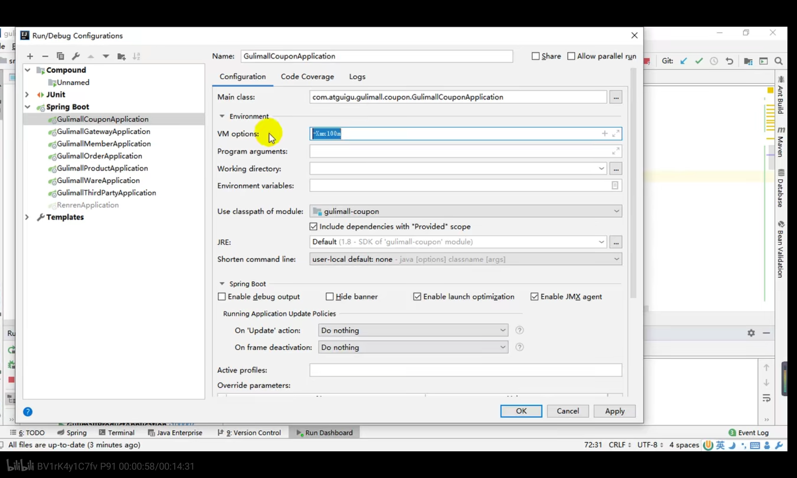
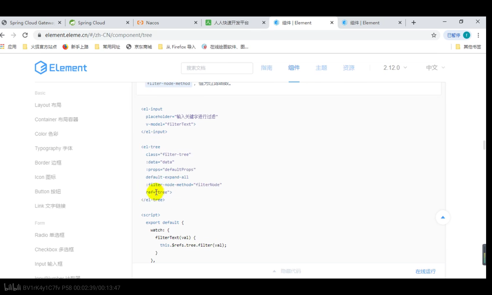
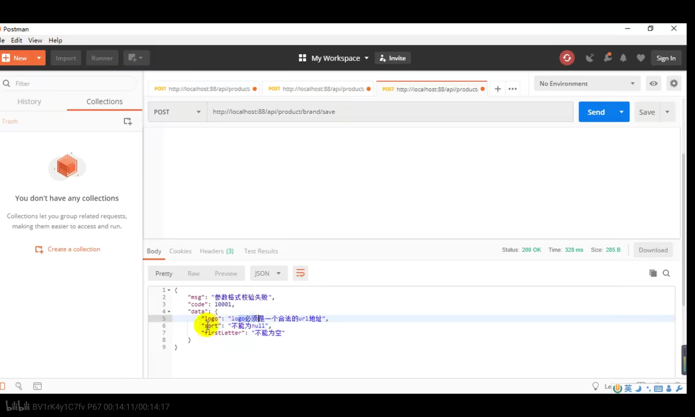
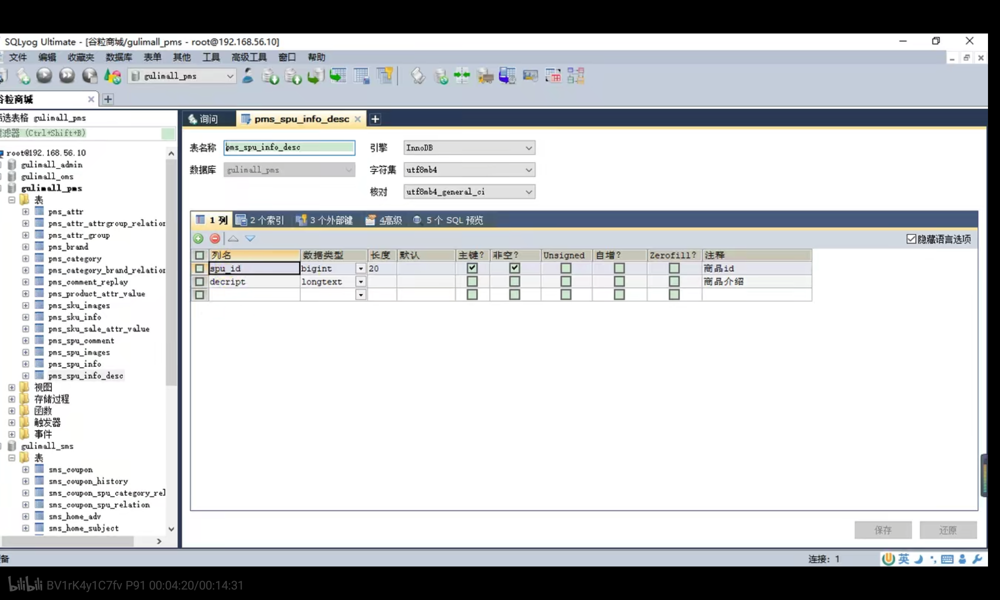

# 商城项目基础篇

## 常见问题

### (1)linux操作

#### vim/vi

首先vim是后面自己安装的,vi是自带的

```
yum install vim
```

我已经安装了

编辑文件（不以root身份编辑文件会显示文件是只读的）

```
sudo vim 文件名
```

按i出现INSERT后就可以编辑了

编辑好之后按esc保存

按:wq退出

### (2)常见快捷键

#### alt+enter：

1. 生成一个还不存在的方法
2. 接口实现类实现接口方法

#### 快速补全方法返回值

把鼠标放在方法上然后ctrl+alt+v

#### vscode全局搜索

ctrl+shift+f

#### idea改类名

shift+f6

#### 改变方法签名

Alt Enter

#### 全局替换

选中代码，ctrl+r，修改完之后点击replace all


#### 抽取方法

右键->Extract->Method

#### 搜索某个类

crtl+N

#### 快速编译页面

引入dev-tools后如果改变了templates文件夹下的模板引擎的话没必要把项目停掉，直接ctrl+f9重新编译一下项目，浏览器上展示的模板引擎页面就会自动发生变化

### (3)常见错误

#### 启动项目发现端口被占用

1-25启动product服务发现10000端口被百度云检测占用，于是终结了百度云进程，这里以8080端口被占用为例：

1.打开cmd命令窗口，输入命令：`netstat -ano | findstr 8080`，根据端口号查找对应的PID。结果如下：


发现8080端口被PID（进程号）为2188的进程占用。

2.根据PID找进程名称，输入命令：`tasklist | findstr 2181`，发现是占用8080端口的进程为：javaw.exe。


3.根据PID结束对应进程。输入命令`taskkill -PID 2188 -F`，强制关闭PID为2188的进程。 


 

#### vscode的vue报错extra semicolon

这是vscode中不许用分号结尾，解决方法


把useEslint改成false即可，Eslint是代码检查的，如果它开启那么vue项目中分号结尾会报错

或者修改代码模板，把后面带分号的都去了，

这个一定要改成false,不然会报各种各样的错误。

#### 配置跨域请求后浏览器报错contains multiple values

可能是因为项目中有多个CorsWebFilter，只保留网关中的CorsWebFilter即可，其他项目的CorsWebFilte配置类删掉

#### 前端：浏览器控制台报错Uncaught(in promise) xxxx

这种错误表示xxxx的情况没有处理，一般是前端方法缺少一个catch了。(p51 11:54),可以自己在then().catch()的catch中处理这种情况（如果不需要处理就给catch传一个空方法即可）

#### eslint语法检查太严格了导致报错


到webpack.base.conf.js把createLintingRule的方法内容注释掉即可。

#### ibatis.exceptions.TooManyResultsException

数据库中有很多匹配结果

#### feign.RetryableException

feign的重试异常


刚刚启动服务很容易报这种错误，过段时间再启动

### (4)编程技巧

#### TODO

写一个项目但是方法还没来得及实现时可以先写一个//TODO，然后在最底下一栏的TODO找到代办事项。

#### 批量重启


在Edit Configuration中建立一个Compound，把要启动的服务都加进去


给Compound下组件起一个名字gulimall，以后重启的话直接启动gulimall即可一次性启动刚刚添加的所有服务


#### 服务占用内存多怎么办？



每个微服务的VM options设置最大内存为100M，-Xmx 100m

#### idea直接跳到下一个断点


一个项目中可能打多个断点，如果不想一句一句debug而是直接一次执行到下一个断点，可以按图中画圈的键

### (5)CRUD常见方法

#### dao

selectById：传入Long类型id，返回实体类对象

selectList：传入QueryWrapper对象，返回一个实体类List

#### IService提供的方法

IService接口被每一个实现类实现，里面提供了一些可用直接被service层调用的操作数据库的方法

saveBatch():批量保存，传入实体类集合

list()：返回一个List<>

#### baseMapper中的方法

this.baseMapper.selectList(wrapper对象)，返回List<>数据

this.baseMapper.delect(wrapper对象),删除方法

## 分布式基础篇

### 1)简介

#### 一些基本概念

微服务：把单独应用程序开发为一套小服务，每个小服务在自己进程中运行，使用轻量级机制通信，每个服务独立部署运行。

**集群，分布式，分布式系统，节点**的定义。

**远程调用**：分布式系统不同服务需要互相调用，springcloud中远程调用方式：http请求+json数据

**负载均衡**：别让系统中每一个服务器太忙或者太闲

常见负载均衡算法：轮询、最小连接、散列

**服务注册/发现&注册中心**：用于让用户知道服务的状态（哪些服务器上有，哪些服务已下线）

服务一旦上线就注册到注册中心，想调用某个服务就到注册中心找

**配置中心**：集中管理微服务的配置信息，服务可以在配置中心获得自己的配置

**服务熔断&服务降级**：微服务之间通过网络通信，如果一个服务不可用会导致雪崩，需要容错机制来保护服务

服务熔断：设置服务的超时，调用某个服务经常失败达到某个阈值时开启断路保护机制。（防止请求积压）

服务降级：运维期间，系统处于高峰期时，让某些非核心服务不处理或者很简单的处理一下。（降级是整体性的）

**API网关**：API Gateway，重要组件，抽象了微服务中都需要的公共功能，还提供了客户端负载均衡等功能。

#### 微服务架构图

外网部署：面向公共访问的部署前端项目

内网部署：服务端集群

#### 使用vagrant创建虚拟机

vagrant是一个网站，里面做好了许多操作系统镜像，包括centos7（我安的就是centos7)

首先下载vagrant.msi文件,下载好之后在cmd里键入vagrant命令，有命令提示自然就安装成功了

然后是初始化：视频里的方法不行，如果不翻墙是会报错的，我用的是评论中提到的国内镜像进行初始化：

vagrant init centos7 https://mirrors.ustc.edu.cn/centos-cloud/centos/7/vagrant/x86_64/images/CentOS-7.box

初始化之后，会在C:\Users\hp下找到一个Vagrantfile，它就是从vagrant官网下载的一个centos镜像。

然后使用vagrant up启动虚拟环境

启动时可以看到，sshname是vagrant

然后就能连上虚拟机了。

虚拟机创建好之后无需vagrant init

那以后如何连接虚拟机？在virtualbox中直接右键启动（选择无界面启动）或者cmd中vagrant up(vagrant up能正常执行的前提是C:\Users\hp下存在一个Vagrantfile),出现Resyncing folder表示启动成功。

然后vagrant ssh就能连接虚拟机，接下来就可以在命令行进行操作了。

退出：命令行exit;

关机：virtualbox中直接右键退出->正常关机

#### 虚拟机的网络问题

虚拟机网络，默认使用网络地址转换和端口转发（开发不方便）

端口转发：例如mysql默认端口号3306，虚拟机中linux软件端口为3306，但是它得与物理机中的端口（如3333）进行映射，访问物理机3333就相当于访问虚拟机中的3306，这样很不方便（尤其是虚拟机装很多软件时）

这个时候希望给虚拟机一个ip地址，物理机和虚拟机可以互相ping通，虚拟机中安装的软件直接通过ip地址访问，

首先在物理机cmd 键入ipconfig

根据以太网适配器 VirtualBox Host-Only Network:中的 IPv4 地址（这是虚拟机的ip地址）比如是192.168.56.1注意第三位是56，那么我们就得在Vagrantfile中找到config.vm.network "private_network"，然后把ip地址设置为：192.168.56.xx（第三位也得是56，第四位随意），这里假设写成192.168.56.10，然后重启虚拟机:

vagrant reload，它会把新的配置导入到虚拟机中，这样虚拟机的ip地址就是192.168.56.10了

物理机的ip地址为无线局域网适配器 WLAN:下的IPv4 地址，这里假设是10.27.114.205

可以在虚拟机命令行键入ip addr查看当前虚拟机ip地址，然后看看能不能互相ping得通：

在cmd中输入：ping 192.168.56.10

在虚拟机命令行输入：ping 10.27.114.205这里跟windows的ping不同，它不是ping4个就自动停了，得手动停止ping：ctrl+c结束ping

都能ping通则虚拟机ip地址设置完成。

#### 安装docker

虚拟化容器技术，基于镜像，可以秒级启动各种容器，每一个容器都是一个完整的运行环境，容器间互相隔离。

可以在Linux系统里安装docker，以后在Linux系统安装软件时可以让docker去镜像市场上下载软件。

docker镜像市场网站：docker up 

比如找到redis镜像后下载到本机中，docker会基于镜像启动一个容器，这个容器就是redis的运行环境，某个容器出现问题不会影响到其他容器

安装docker步骤：

1.在docker官网上找到docs->get docker->docker engine

因为虚拟机是centos版本所以选择install on centos

2.安装网页上给的提示，首先卸载旧版本

```shell
sudo yum remove docker \
                  docker-client \
                  docker-client-latest \
                  docker-common \
                  docker-latest \
                  docker-latest-logrotate \
                  docker-logrotate \
                  docker-engine
```

这里加sudo表示是用超级管理员模式，否则没权限。

3.首先安装一些必要的工具包

```shell
sudo yum install -y yum-utils
```

4.然后确定固定的仓库

```shell
sudo yum-config-manager \
    --add-repo \
    https://download.docker.com/linux/centos/docker-ce.repo
```

5.optional是可选的，可以不用做

6.然后开始安装docker

```shell
sudo yum install docker-ce docker-ce-cli containerd.io
```

这是安装最新版的docker，也可以选择安装前一个版本的

7.安装成功之后启动docker

```shell
sudo systemctl start docker
```

这步执行完之后看上去好像没什么变化，但实际上docker已经启动了

检查docker是否已经启动，可以用下面两个命令：

```
docker -v
```

这个是检查docker版本，我的版本是20.10.2

```shell
sudo docker images
```

检查已经安装了哪些镜像了，如果没有安装镜像会显示空。

如果都执行成功docker就安装好了

接下来还要给docker设置开机自启动，虚拟机一开docker也自动启动，否则每次都得执行sudo systemctl start docker，比较麻烦。

```shell
sudo systemctl enable docker
```

第二步就是给docker配置镜像加速：

docker下载镜像是从dockerhub下载的，这是一个国外的网站，得配置一个镜像加速

登录阿里云官网，控制台->产品与服务->容器镜像服务->镜像加速器->找到操作系统版本（我这是centos)

依次执行下面命令

```shell
sudo mkdir -p /etc/docker
sudo tee /etc/docker/daemon.json <<-'EOF'
{
  "registry-mirrors": ["https://j8qr50qi.mirror.aliyuncs.com"]
}
EOF
sudo systemctl daemon-reload
sudo systemctl restart docker
```

那么阿里云镜像就开启了

#### 切换到root用户

一般遇到permission denied这种情况就说明权限不够，得用sudo

每次都使用sudo太麻烦了，可以切换到超级用户

做法：

```shell
su root
```

输入密码：vagrant

然后就进入超级用户，whoami显示为root，以后就不用加sudo了

#### docker安装mysql

从docker下载镜像就是用docker从镜像市场拉取镜像，命令是

```shell
sudo docker pull mysql:5.7
```

如果mysql后没加5.7，默认下载最新版mysql，这里选择5.7版本

这个时候镜像列表就不为空了

```
$ sudo docker images
REPOSITORY   TAG       IMAGE ID       CREATED        SIZE
mysql        5.7       cc8775c0fe94   41 hours ago   449MB
```

然后执行

```shell
docker run -p 3306:3306 --name mysql \
-v /mydata/mysql/log:/var/log/mysql \
-v /mydata/mysql/data:/var/lib/mysql \
-v /mydata/mysql/conf:/etc/mysql \
-e MYSQL_ROOT_PASSWORD=root \
-d mysql:5.7

```

这些命令代表什么意思？

**docker run**表示启动一个容器，装mysql的容器就相当于一个完整的linux系统

可以选择进入到容器内部：

docker exec -it (容器id/容器名字) /bin/bash（容器id可以只取前几位，跟其他容器id区别开即可）

```shell
docker exec -it mysql /bin/bash
```

执行这个命令表示进入到容器内部，发现命令行变成

root@c0ec96b80283:

这表明这个容器本身就是一个linux系统。执行ls /也会发现该容器内目录结构就是linux的目录结构，mysql就是被装到c0ec96b80283这个Linux系统中。

在容器内执行exit;可以退出容器回到外面的Linux.

mysql安装到了一个小型linux系统中（容器），那么mysql就会有一个端口3306，但是这只是mysql在容器内的端口，如果想要访问mysql就要把3306映射到虚拟机的linux系统中（大的linux系统）的端口3306，

**-p 3306:3306**中的-p表示端口映射，前一个3306代表linux中的3306端口，后一个3306代表容器中的3306端口。

**--name mysql**：表示给容器起一个名字，名字叫mysql

**-v**:目录挂载，因为容器是一个linux系统，容器内部的etc/mysql文件夹装的都是mysql的配置信息，容器内部的var/log/mysql文件夹有mysql的日志信息。

但是如果以后要修改配置，那么都要进入到容器内部的etc/mysql修改信息吗？太麻烦了。可以把我们经常要访问的一些文件夹映射到外面linux的文件夹中，这就要用到目录挂载，-v /mydata/mysql/log:/var/log/mysql表示在linux系统中创造一个文件夹mydata/mysql/log，并且该文件夹与容器内部的var/log/mysql挂载。以后容器内部产生了的日志信息，在外面的mydata/mysql/log就能访问到。var/lib/mysql里装的是mysql持久化时产生的一些数据，把它也挂载到linux的/mydata/mysql/data下。

在linux中cd /mydata/   进入mydata文件夹，ls 发现当前文件夹下目录（ls /会显示外面大系统的文件夹）

cd mysql/  会发现三个已经创建好的被挂载的文件夹conf data log

**-e MYSQL_ROOT_PASSWORD=root**：表示mysql的一些参数信息，这里设置密码为root

**-d mysql:5.7**:表示以后台方式运行，mysql:5.7表示是以哪个镜像启动的容器，因为下载的mysql镜像的IMAGE就是mysql5.7,mysql5.7是镜像的名字，mysql是容器的名字

这样mysql就装好了，这个命令执行完之后会显示容器id

执行docker ps查看正在运行的容器，

```
CONTAINER ID   IMAGE       COMMAND                  CREATED          STATUS          PORTS                               NAMES
c0ec96b80283   mysql:5.7   "docker-entrypoint.s…"   41 seconds ago   Up 39 seconds   0.0.0.0:3306->3306/tcp, 33060/tcp   mysql
```

CONTAINER ID是唯一的容器Id,IMAGE代表镜像，PORTS表示端口，端口号为3306

这个时候可以用sqlyog来连接虚拟机中的mysql

如图：


mysql主机地址那里之前写的是localhost（是物理机的ip地址），现在把它改为虚拟机的ip地址，用户名密码都是root，端口是3306，测试连接，发现可以连接成功。

接下来就是修改配置，mysql字符编码默认是拉丁的，现在修改为utf8

首先进入/mydata/mysql/conf/文件夹（cd conf/）

然后vi my.cnf，敲i进入Insert模式，把下面一大堆复制进去

```
[client]
default-character-set=utf8

[mysql]
default-character-set=utf8

[mysqld]
init_connect='SET collation_connection = utf8_unicode_ci'
init_connect='SET NAMES utf8'
character-set-server=utf8
collation-server=utf8_unicode_ci
skip-character-set-client-handshake
skip-name-resolve

```

然后按esc 输入:wq退出即可

然后重启mysql容器让配置生效

```shell
docker restart mysql
```

这里可以选择进入容器，进入/etc/mysql/

执行ls命令列举出所有文件，发现有一个my.inf

这个时候cat my.inf可以看到配置文件内容。

#### docker安装redis

```
docker pull redis
```

默认下载最新版本的redis

下载完成后启动redis容器

在启动redis命令中涉及到目录挂载，有一个配置文件需要预先创建

```
mkdir -p /mydata/redis/conf
touch /mydata/redis/conf/redis.conf
```

在虚拟机中创建文件夹redis/conf，(linux可以一次创建多级目录)，然后创建redis配置文件redis.conf（不是文件夹）

创建好文件夹之后开始启动容器

```
docker run -p 6379:6379 --name redis \
-v /mydata/redis/data:/data \
-v /mydata/redis/conf/redis.conf:/etc/redis/redis.conf \
-d redis redis-server /etc/redis/redis.conf
```

把容器内的redis.conf挂载到之前创建的redis.conf上

-d redis redis-server /etc/redis/redis.conf:前面是以redis这个镜像启动容器，后面多一个redis-server表示让redis服务器加载/etc/redis/redis.conf这个配置文件启动，以后每次启动redis容器，都会读取这个配置文件。

那为什么之前还要在Linux中自己创建一个配置文件？因为redis容器中只有/etc/redis这两层目录，实际上没有配置文件redis.conf，如果直接运行-v /mydata/redis/conf/redis.conf:/etc/redis/redis.conf，它会把linux中的redis.conf当作目录而不是一个文件，所以预先在外面把文件创建好再跟docker挂载。

这步之后redis就算安装完成了。

怎么使用容器中的redis?

使用docker容器中的客户端：

```
docker exec -it redis redis-cli
```

出了个这个：

127.0.0.1:6379>

就表示进入redis客户端中

使用exit退出redis客户端

目前redis还没有开启持久化功能，（redis默认配置没有开启持久化）所有数据存在内存中，往redis里放个数据，再重启redis(docker restart redis)就获取不到数据了

开启aof持久化功能：

```shell
vi /mydata/redis/conf/redis.conf
# 添加如下内容
appendonly yes
```

在linux的redis配置文件中加入一个appendonly yes表示开启持久化功能。

然后重启redis使配置生效。

最后下载了一个redis可视化客户端RedisDesktopManager用于看到存放于redis中的数据。

#### docker启动容器

如果某个容器已经安装了，但是没有设置开机自动启动，那么用下面方式可以一次性启动多个容器

```
sudo docker start 容器ID1 容器ID2
```

#### docker查看容器日志

```
docker logs 容器ID
```

即CONTAINID，可以取前三位数字/字母，与其他容器区分开即可

### 2)环境

#### 环境配置

vscode用于开发前端项目

#### 项目结构创建/提交到码云

**新建仓库**：

.gitignore模板选择maven，开源许可证选择apache2.0，使用readme初始化仓库，分支模型选择生产/开发模型，这样开发的时候在dev分支，开发完成之后合并到master分支。

仓库弄好后，在克隆下载里复制http路径

然后idea中 file-new -project from version control-git填好刚才的路径，这样就把码云中的项目下载到Idea中。

项目名字就是仓库名:gulimail（总项目）

在总项目里创建微服务模块

做法是，每一个微服务模块使用spring初始化向导实现，每个微服务模块导入web和openfeign（微服务互相调用）场景

之前maven导包时犯病了，是maven配置文件的<mirrors>写的有问题，我重新写了一下，现在镜像标签里只有

```xml
  <mirrors>
      <mirror>
        <id>nexus-aliyun</id>
        <mirrorOf>central</mirrorOf>
        <name>Nexus aliyun</name>
        <url>http://maven.aliyun.com/nexus/content/groups/public</url>
    </mirror>
  </mirrors>
```

这一个加速镜像

然后多个springboot模块需要使用run dashboard分别启动，我的默认没开启，需要在项目.idea->orkspace.xml中找到

```xml
<component name="RunDashboard">
  <option name="ruleStates">
      <list>
        <RuleState>
          <option name="name" value="ConfigurationTypeDashboardGroupingRule" />
        </RuleState>
        <RuleState>
          <option name="name" value="StatusDashboardGroupingRule" />
        </RuleState>
      </list>
   </option>
    <option name="contentProportion" value="0.22874807" />
  </component>

```

修改为

```xml
<component name="RunDashboard">
 <option name="ruleStates">
     <list>
       <RuleState>
           <option name="name" value="ConfigurationTypeDashboardGroupingRule" />
       </RuleState>
       <RuleState>
          <option name="name" value="StatusDashboardGroupingRule" />
       </RuleState>
     </list>
  </option>
  <option name="contentProportion" value="0.22874807" />
  <option name="configurationTypes">
     <set>
          <option value="SpringBootApplicationConfigurationType" />
     </set>
  </option>
 </component>

```

这样就可以启动run dashboard了

在view->Tool Windows->run dashboard中开启run dashboard

然后在项目的.gitignore中增加如下内容

```
**/mvnw
**/mvnw.cmd
**/.mvn
**/target/
.idea
**/.gitignore
```

这样把项目提交到gitee的时候会忽略掉上面的内容

在码云中只提交源码和pom文件

**/mvnw代表任意路径下的mvnw文件（包括各个子模块中的mvnw)

然后在version control中将剩余的文件加入版本控制(add to vcs),这样一旦有文件发生变化，就会在default changelist中有显示。

把代码提交到码云需要安装gitee插件


右击default changelist选择commit


commit message中写一些提交信息，右边的perform code analysis和check TODO可以取消勾选，

然后可以选择点击commit先提交到本地仓库，然后在vcs->git->push中推送到gitee

也可以直接选择commitand push同时4完成提交和推送。

#### 设置mysql,redis容器自动启动

连接虚拟机后，用sqlyog连接mysql发现连不上，这是因为，此时虚拟机开了但是容器没有自动启动，sudo docker ps发现没有容器在运行，这时可以设置

```shell
sudo docker update mysql --restart=always
sudo docker update redis --restart=always
```

然后重启虚拟机，发现此时两个容器都自动运行了，用sqlyog可以连接mysql

#### 创建数据库

一共5个数据库，每个数据库基字符集为utf8mb4（既可以兼容Utf8还可以解决乱码）

### 3)快速开发

#### 人人开源搭建后台管理系统

从码云上克隆renren-fast项目作为后台管理系统，克隆到本地后去掉.git文件夹，然后整体拖到gulimall中，但是发现renren-fast模块右下角没有蓝色块

#### 模块右下角蓝色块代表什么意思

对于项目中的模块，如果右下角有蓝色块，说明该模块被idea认为是模块，否则就是普通文件夹。

当一个模块中有.iml文件时，就会出现蓝色块（renren-fast里没有）

网上搜到的解决方案：在右边maven中点击+，导入该模块的pom.xml文件，然后刷新(reimport)(未果)

选中模块右键open in terminal:执行mvn idea:module（该命令是生成iml文件的）执行错误

后来重启一下莫名其妙就有了方块了

点击目录，看到了renren-fast.iml文件

#### renren-fast和renren-fast-vue

进入renren-fast之后，首先在application.yml中配置数据库连接池（使用的是Druid)

```
    datasource:
        type: com.alibaba.druid.pool.DruidDataSource
        druid:
            driver-class-name: com.mysql.cj.jdbc.Driver
            url: jdbc:mysql://192.168.56.10:3306/gulimall_admin?useUnicode=true&characterEncoding=UTF-8&serverTimezone=Asia/Shanghai
            username: root
            password: root
```

在这里，url写自己的数据库地址，因为mysql在虚拟机中，且后台管理系统对应的数据库名为gulimall_admin，所以url配置为jdbc:mysql://192.168.56.10:3306/gulimall_admin

用户名密码都是root

配置好数据库后进入到RenrenAplication中启动项目。

一开始启动类中main方法的String[] args报错，这是因为没有给renrenfast模块指定jdk所致。

renren-fast-vue使用vs code打开(把文件夹拖向vscode)

然后开始安装前端项目运行环境

安装nodejs（我装到d盘了）我的版本是10.15.3

然后用npm配置淘宝镜像，否则会很慢

```
npm config set registry http://registry.npm.taobao.org/
```

然后进入vscode，点击左下角进入终端，输入

```
npm install
```

前端项目第一次运行都需要执行这个命令，该命令是下载前端需要依赖的组件

它根据前端项目的package.json确定依赖版本，然后下载后的依赖信息都会在node_modules文件夹中

爆出错误，因为没有python27环境，于是安装python27

#### python27安装

​    到2019年初,Python3已经更新到了Python3.7.3,作为同一编程语言的两个大版本,Python2和Python3是有很多区别的,并且也有不少的兼容性问题,Python3现在已经成为了主流,官方也是推荐使用Python3,毕竟Python3都发布很多年了.但还是有一部分人在坚持使用Python2,也有一些人是因为之前用Python2写的代码,需要Python2来运行所以继续使用Python2,其中基本都是Python2.7。Python2.7.16是Python2的最终版,后面应该不会再更新了，所以这篇文章就是介绍安装Python2.7.16的步骤。

 

一、下载Python2.7.16

1.百度搜索Python,找到Python官网,点击进入https://www.python.org/


2.点击Python官网的Downloads,然后在下拉菜单中点Windows,进入版本选择页面


3.进入版本选择页面,可以在最上面看到有Python3的最新版和Python2的最新版,在这里点击Python2.7.16进入下载页面(如果需要下载其他版本可以向下滚动页面,选择自己需要的版本)


4.进入下载页面后,向下滚动鼠标,找到"Files",这里列出了Python2.7.16版本的不同操作系统的安装包或相关文件,我们是在Windows10里面安装,选择对应版本的安装包下载,点击下载,等待一会就可以下载完成了


 

二、安装Python2.7.16

1.将下载完成的Python2.7.16安装包剪切到电脑桌面(不放桌面也可以,只是这样更方便),双击打开


2.打开后选择Install for all users,然后点击Next进入下一步


3.现在选择Python2.7.16安装的位置,默认是C:\Python27,这里可以根据自己的需求选择安装目录,但是目录名中最好不要包含中文.

如果C盘有很多空间,可以不更改,或者有固态硬盘的,可以选择将Python2.7.16装在固态盘中.

确认好安装位置后,点击Next进入下一步   


4.这步不用管,直接点Next进入下一步


5.现在Python2.7.16开始安装,可以看到安装的进度条在读条,什么也不用做,稍等一分钟就安装完成了


6.安装完成,会显示下面的菜单,表示已经安装成功了,现在点击Finish即可,说明Python2.7.16已经安装成功了


7.可以看到桌面上也多了一个python.exe的快捷方式


 

三、配置环境变量

   在安装完成Python2.7.16后,如果我们直接在命令行里面使用python命令,会提示:"python"不是内部或外部命令...这就需要我们给python配置环境变量,配了环境变量操作系统才能找到python的位置

1.进入"控制面板",找到并点击"系统和安全",然后找到并点击进入"系统",再点击"高级系统设置",就可以看到右下方的"环境变量"了,然后点击进入

(也可以用其他方法找到"环境变量",只要找到即可)


2.找到安装Python2.6.17时选择的安装路径,复制这个安装路径


3.回到环境变量窗口,环境变量窗口上半部分是用户变量,不用管,下半部分是系统变量,滚动右边的滚动条,然后找到Path,双击进入


4.在Path界面,可以看到之前已经配置了很多项,现在新增一项,将刚才复制的Python2.7.16的安装路径粘贴进去

如果Path只有一个输入框,里面已经配了很长的值,都是以分号分隔的,我们把Python2.7.16的安装路径加进去就行了


5.可以鼠标选中我们添加进来的环境变量,然后点击上移和下移调整位置


 

6.现在Python2.7.16的环境变量就配置好了,依次点击"确定"回到环境变量界面,然后关闭控制面板


7.现在到Python的安装路径,复制粘贴python.exe,并修改名字为python27.exe,这样做的目的是为了和后面安装的Python3进行区分,因为使用Python2的程序员都会用到Python3的(除了特例)


 

 

四、验证安装结果

1.按Win+R进入运行界面,在里面输入cmd回车,进入Windows的命令行,在命令行输入python27可以进入Python2.7.16的命令行模式,(输入print("hello python"),控制台输出hello python)测试成功,则说明Python2.7.16已经安装完成,且环境变量也配置完成了


2.也可以直接双击桌面的python.exe快捷方式进入验证Python2.7.16是否安装完成,但是不能验证环境变量是否配置完成


 

   现在,Python2.7.16已经安装到完成,并且配置好了环境变量,我们可以在命令行输入python27进入Python2.7.16的命令行模式.

#### npm install报错

npm install 会到环境中找python 看看系统变量，如果python3的系统变量在python2之前，那么它会找到python3然后依然报错，这个时候要把python2的环境变量(D:/python27)挪动到python3之前

我这报的错误是：

Failed at the node-sass@4.13.1 postinstall script

是因为sass安装源的问题 修改sass安装源就能解决问题，使用命令：

npm config set sass_binary_site=https://npm.taobao.org/mirrors/node-sass

然后再执行npm install就能安装成功。

最后执行npm run dev可以启动前端项目

#### 逆向生成代码

下载renrengennerator，配置好数据库和个人信息，然后启动renrengennerator项目，（端口80）然后在一个数据库表pms中下载代码，最后把下载好的代码再放回项目中(gulimall-product)

##### 创建模块两种方式

使用maven非骨架模式生成的Pom文件很干净，使用spring初始化向导可以选择引入依赖（使用sping初始化向导创建sb项目）。上面引入的就是web依赖和Openfeign。

而且初始化向导除了src之外还有target文件夹以及mvnw等文件，而maven非骨架只有src文件夹，pom.xml和iml文件。

下载的代码需要很多公共的工具包，因此在项目中创建一个gulimall-common模块（通过maven)放置公共类

##### 模块重命名

点击模块 shift+f6可以重命名

##### 代码生成原理

在renren-generator中有resources/template文件夹，里面是各种代码生成模板，根据模板生成controller，dao等，模板中的${}用于动态取值，可以修改模板生成代码

#### 整合Mybatisplus

在商品服务模块中使用了mybatisplus依赖，它在gulimall-common中被导入

1. gulimall-common中导入mybatisplus依赖，然后gulimall-product中导入gulimall-common的依赖（依赖传递）我们自己写模块时的group和artifactId就是被写在依赖里的<group>和<artifactId>

2. 配置mybatisplus分为以下几点

   1. 配置数据源（数据库相关）：

      1.mysql数据库驱动（直接放到common里，因为其他微服务可能也会用，驱动信息一定要和版本信息对应。我虚拟机里数据库是mysql5.7.32(sqlyog中选中数据库->资料)但是在mvn仓库网站上没找到mysql5.7的依赖信息，但官网上说8.0版本和5.1版本都可适配5.7版本，推荐8.0

      2.在product模块中的application.yml配置数据源（product模块对应的数据库是gulimall-product）

   2. 配置mybatisplus相关信息：
      1. 首先在product的启动类中加注解@MapperScan("com.atguigu.gulimall.product.dao")，告诉mybaitsplus模块的Mapper接口在哪个位置
      2. 每一个Mapper接口都对应一个映射文件：AttrDao对应AttrDao.xml，还要告诉mybaitsplus映射文件在那个位置，这通过在application.yml的mybatIsplus中config-location: classpath:/mapper/**/*.xml实现，其实在mybatisplusproperties中默认就是这个位置，在resources下的mapper文件夹放映射xml文件。这里要注意，如果是classpath，表示只扫描自己模块的类路径，而classpath*表示不仅仅是自己的类路径，本模块所引用的其他jar包的类路径也要一起扫，所以这里写classpath更加精确
      3. 配置主键自增，在application.yml中mybatisplus的global-config中配置

   

#### gulimall-common中的其他依赖信息

还要导入servlet api（javax）但是因为tomcat中都有servlet api，所以把scope设为provided（编译测试有效，运行时无效）一般servlet api的scope都要这样写

#### 其他微服务逆向工程

这里给不同的微服务设置不同的端口号，coupon7000,member8000,..,ware11000这样便于区分，比如以后coupon用到的端口可以依次设成7001，7002等member的设成8001，8002，便于记忆

### 4)分布式组件


使用springcloud实现

spring cloud alibaba微服务开发一站式解决方案，里面提供了注册中心，配置中心等组件

本项目使用组件：


spring cloud版本与springboot版本是要对应的，我一开始每个项目的子项目是spring-cloud2020.0.0，他是和sb2.4对应的（我每个微服务模块用的是sb2.4.2）

最终我把sb改成2.1.5，sc版本为2.1.0

#### (1)Nacos注册中心

可以查看文档：

1. 首先，修改 pom.xml 文件，引入 Nacos Discovery Starter。

   ```
    <dependency>
        <groupId>com.alibaba.cloud</groupId>
        <artifactId>spring-cloud-starter-alibaba-nacos-discovery</artifactId>
    </dependency>
   ```

2. 在应用的 /src/main/resources/application.properties 配置文件中配置 Nacos Server 地址（哪个微服务要使用注册中心就在哪个微服务的application.yml中配置）

   ```
    spring.cloud.nacos.discovery.server-addr=127.0.0.1:8848
   ```

3. 使用 @EnableDiscoveryClient 注解开启服务注册与发现功能

   ```
    @SpringBootApplication
    @EnableDiscoveryClient
    public class ProviderApplication {
   
    	public static void main(String[] args) {
    		SpringApplication.run(ProviderApplication.class, args);
    	}
   
    	@RestController
    	class EchoController {
    		@GetMapping(value = "/echo/{string}")
    		public String echo(@PathVariable String string) {
    				return string;
    		}
    	}
    }
   ```

##### 下载nacos服务器

我下的是1.1.3版本，安装到E盘，console为： http://192.168.56.1:8848/nacos/index.html

##### 开始注册

首先启动nacos服务器

在要注册的微服务的yml中配置nacos.discovery.server-addr和application.name（微服务的名字）

在微服务启动类上使用@EnableDiscoveryClient 注解开启服务注册与发现功能

然后启动该微服务

浏览器访问127.0.0.1：8848/nacos可以查看微服务的注册信息，用户名密码都是nacos


##### 远程调用测试

使用feign


微服务A想远程调用微服务B，微服务A需要引入openfeign

远程调用步骤：

1. 引入openfeign
2. 编写接口告诉springcloud这个接口需要调用远程服务。所有接口放在feign包下。接口上定义@FeignClient("gulimall-coupon")，表明该接口是个远程客户端，且要调用的服务名字是gulimall-coupon
3. 想调用该服务内哪个方法，就把哪个方法的签名（返回值+方法名+参数）复制到接口里，后面接分号（空实现），没有方法体。然后方法上的@RequestMapping("/coupon/coupon/member/list")括号中的值是该controller类的路径/coupon/coupon和具体方法的路径拼到一起/member/list，远程服务调用的都是controller中的方法。（这里A服务接口内方法名与B服务实际被调用的方法名字可以不一样，保证A接口上映射路径与B接口上映射路径一致即可，详情见新增商品-调用远程服务保存优惠信息）
4. 在调用者的启动类上加@EnableFeignClients(basePackages = "com.atguigu.gulimall.member.feign")开启远程调用功能，basePackages是远程调用接口所在包，这样只要服务一启动就会自动扫描远程调用接口
5. 然后可以在调用者的某个controller中从容器取出一个接口对象并调用接口方法即可


注册中心的作用就是告诉调用者他所调用的服务所在位置，假设被调用者没上线，那么调用者再调用时就会报错

#### (2)Nacos配置中心

##### 基础

1. 首先，修改 pom.xml 文件，引入 Nacos Config Starter。

   ```
    <dependency>
        <groupId>com.alibaba.cloud</groupId>
        <artifactId>spring-cloud-starter-alibaba-nacos-config</artifactId>
    </dependency>
   ```

2. 在应用的 /src/main/resources/bootstrap.properties 配置文件中配置 Nacos Config 元数据，bootstrap.properties会优先于application.properties加载，这里注册中心地址和配置中心地址是一样的。

   ```
    spring.application.name=微服务名
    spring.cloud.nacos.config.server-addr=127.0.0.1:8848（nacos地址）
   ```

   然后就可以获取该微服务模块application.properties中配置的值

3. 完成上述两步后，应用会从 Nacos Config 中获取相应的配置，并添加在 Spring Environment 的 PropertySources 中。这里我们使用 @Value 注解来将对应的配置注入到 SampleController 的 userName 和 age 字段，并添加 @RefreshScope 打开动态刷新功能（定义在controller上）

   ```
    @RefreshScope
    class SampleController {
   
    	@Value("${user.name}")
    	String userName;
   
    	@Value("${user.age}")
    	int age;
    }
   ```

@Value里面放的是配置路径，如果application.properties中写的是coupon.user.name=zhangsan2，那么@Value响应就得写@Value("${coupon.user.name}")

注意user.name是一个系统变量，是当前计算机的名字，最好别在application.properties中设置成user.name，换个名字，多加个前缀啥的。

还有一个问题就是如果配置文件的值修改了（改叫lisi了），那还得重新打包，特别麻烦，这个时候可以把配置交给配置中心，到时候在配置中心改一下就可以动态全改（线上就能改）

服务启动时可以看到，微服务会从nacos中从一个名为“微服务名.properties”的文件中获取属性，如果配置中心中有这个配置文件，那么该文件中的属性值也可以被微服务获取，所以在nacos->配置管理->新建配置,dataid中写“微服务名.properties”，然后在配置内容里写上配置。这个要注意Loading nacos data, dataId: 'gulimall-coupon.properties', group: 'DEFAULT_GROUP'在项目启动的日志中有没有这句话，如果有这句话就说明可以从nacos中获取gulimall-coupon.properties这个配置，如果显示create config service error! properties=NacosConfigProperties则表明无法从nacos中获取到配置。


最后在controller类上加一个@RefreshScope即可实现动态修改配置，它表示动态刷新配置

<u>使用SpringCloudConfig这种统一配置时Spring Boot 配置文件的**加载顺序**，依次为 `bootstrap.properties` -> `bootstrap.yml` ->`application.properties` -> `application.yml`，其中 `bootstrap.properties` 配置为最高优先级。</u>（帖子里看到，不保证准确性），

nacos和application.properties相同的配置项，优先使用nacos的配置：

nacos中coupon.user.name是zhangsan，application.properties中coupon.user.name是lisi，那么@Value("${coupon.user.name}")获取到的是lisi

以后想改配置，直接在配置中心改

总结：两个注解@Value("${配置项的名}")获取配置值， @RefreshScope动态刷新配置

##### 进阶

1. 命名空间：用于做配置隔离，nacos中默认命名空间public

   

所有新添加的配置都属于public

有什么用？

一个项目开发，测试，生产等场景可能各有各的配置，这个时候就可以创建许多命名空间，如dev,test等命名空间


可以在不同的命名空间中新建配置


这就是在prop中创建的配置

启动微服务默认使用public空间的配置

如果想使用其他命名空间的配置，需要在bootstrap.properties中加上spring.cloud.nacos.config.namespace=0ad60465-205a-43a8-ab65-ac06df40a8e1后面一串是命名空间配置管理后面的那串，见上图

除了不同的生产环境之外，每个微服务也可以各有各的命名空间，每个服务可以只加载自己命名空间下的配置

2. 配置集：一组相关或不相关的配置项的集合，一个配置文件就可以看做一个配置集。

3. 配置集ID：类似配置文件名，nacos中的Data Id就是配置集ID

4. 配置分组：Data Id后的Group就是配置分组，默认所有配置集都属于DEFAULT_GROUP这个分组，配置分组可以随意定制。一个命名空间里可以有多个配置分组。在bootstrap.properties中用spring.cloud.nacos.config.group=“组名”选择读取命名空间中具体哪一个配置分组的配置，不写的话默认读取DEFAULT_GROUP中的配置信息。

   本项目每个微服务都有自己的命名空间，然后把不同的使用环境设置为不同的配置分组(dev,test,prob)

   


类似这种格式,coupon代表是gulimall-coupon服务的命名空间，每个group是不同应用环境。

##### 同时加载多个配置集

一个微服务可能有多个配置，不一定都写在application.yml中，比如数据源的配置可能放一个datasource.yml中，框架部分的放另一个mybatis.yml中，想一次加载多个配置。

```properties
spring.cloud.nacos.config.namespace=1986f4f3-69e0-43bb-859c-abe427b19f3a

spring.cloud.nacos.config.ext-config[0].data-id=datasource.yml
spring.cloud.nacos.config.ext-config[0].group=dev
spring.cloud.nacos.config.ext-config[0].refresh=true

spring.cloud.nacos.config.ext-config[1].data-id=mybatis.yml
spring.cloud.nacos.config.ext-config[1].group=dev
spring.cloud.nacos.config.ext-config[1].refresh=true

spring.cloud.nacos.config.ext-config[2].data-id=other.yml
spring.cloud.nacos.config.ext-config[2].group=dev
spring.cloud.nacos.config.ext-config[2].refresh=true
```

首先就是命名空间得被加载进来，ext代表可扩展，ext-config是个List，所以不同的配置可以用[0],[1]表示。

data-id表示配置文件对应的配置Id,group对应分组，之前因为只加载一个配置文件所以在controller上定义@RefreshScope表示动态刷新配置，现在一次加载多个配置文件，有的文件需要动态刷新有的不需要，所以refresh表示该配置文件是否动态刷新，默认为false

注意

1. 上面的代码那种通过ext-config来加载指定配置集的方式，除了它所指定的配置集，还会默认加载当前命名空间下DEFAULT_GROUP中的"微服务名.properties"文件。因为没有用spring.cloud.nacos.config.group的方式指定分组都会加载命名空间中DEFAULT_GROUP中的"微服务名.properties"配置文件，其他分组的"微服务名.properties"不会被加载，想加载其他组的"微服务名.properties"需要指定（**"微服务名.properties"如果存在肯定会被加载无需具体指定，如果自己指定分组了则加载自己指定分组的，否则加载默认分组**）
2. nacos中有的用nacos中的，nacos中没有的使用项目中的。
3. 获取配置文件的值，除了@Value，sb所有可用于从配置文件中获取值的注解都可以使用，比如@ConfigurationProperties

**一般来说生产时可以把配置放在application.yml里，上线后可以把配置放在配置中心里**

#### (3)SpringCloudGateway（网关）

##### 原理

网关：1.将请求正确路由到各个位置，而且可以从注册中心中感知服务是否上线2.将各个服务的一些功能提取出来免得重复开发，如权限校验，限流等。

springcloudgateway包含id（用于区分路由）,目的地uri，断言(predicates)的集合和过滤器(filters)的集合。只要断言为真，则路由匹配。

断言是java8中提供的一个函数，它允许开发者从http请求中匹配任何信息（如请求头，请求参数）网关收到一个请求，它就可以根据请求的信息（如请求头，请求参数）判断路由到那个服务，这种判断就是断言。

过滤器用于过滤请求，跟以前的过滤器作用类似。


上图为网关的工作流程。

网关规则可以写在配置文件application.yml里

```yml
spring:
  cloud:
    gateway:
      routes:
      - id: after_route
        uri: https://example.org
        predicates:
        - After=2017-01-20T17:42:47.789-07:00[America/Denver]
```

routes代表路由规则，-代表一个实例（yml语法，一个routes下可以配置多个路由规则实例），uri为最终要去的地方，predicates下也可以写多个断言实例。只有所有断言为真请求才会被路由到最终的uri

也可以在application.yml里配置过滤器

```yml
spring:
  cloud:
    gateway:
      routes:
      - id: add_request_header_route
        uri: https://example.org
        filters:
        - AddRequestHeader=X-Request-Foo, Bar
```

这里没有断言，但是设置了过滤器

##### 实战

创建一个网关模块并且导入Spring Cloud Routing Gateway依赖。

首先要把网关微服务注册到注册中心（启动类加上@EnableDiscoveryClinent，然后在网关的application.properties中配置spring.cloud.nacos.discovery.server-addr和spring.application.name）

然后启动gateway项目，发现报错：If you want an embedded database (H2, HSQL or Derby), please put it on the classpath.

这是因为gateway引入了common依赖，而common引入了mybatisplus依赖，引入了这个依赖就有了数据源的自动配置，但是网关模块并没有配置数据源（创建它时只因入了gateway依赖），它的配置文件中没有数据源信息，所以应该让gateway引入common依赖时排除mybatisplus依赖，做法是：

@SpringBootApplication(exclude = {DataSourceAutoConfiguration.class})在启动类上加一个exlude，这种做法是让gateway模块排除掉数据库自动配置。

###### sb的@SpringBootApplication可以排除自动配置类吗？

给网关的端口设为88

测试一下网关作用，如果访问localhost:88/hello?url=baidu就要转到www.baidu.com，怎么配置网关服务？

建立application.yml，如下配置

```Yml
spring:
  cloud:
    gateway:
      routes:
        - id: test_route
          uri: https://www.baidu.com
          predicates:
            - Query=url,baidu

        - id: qq_route
          uri: https://www.qq.com
          predicates:
            - Query=url,qq
```

id就是路由名,uri是最终要去的网址，predicates是断言，Query来源于Query Route Predicate Factory，这个断言工厂负责根据请求参数进行断言，断言工厂很多，像Header Route Predicate Factory就是根据请求头进行断言。请求参数是url，值为baidu时就跳转到https://www.baidu.com


官网上说，请求参数=值这种形式，可以使用一个请求对，逗号前是请求参数，后面是一个可以与请求值相匹配的正则表达式，这里直接写成baidu。

上面就实现了启动gateway服务，在浏览器上通过url参数实现选择跳转到baidu和qq官网的功能


### 5)前端之ES6


前后台工具都是有一个对应关系

ES6:ECMAScript6.0，是一种语言标准,浏览器脚本语言的规范，js是它的一个实现。

在vscode中创建一个文件夹，然后开始创建前端页面。

快速生成html文档：shift+!

在一个script标签中写好js代码后，右键+open with live server会在浏览器查看js语句执行结果，然后f12可以查看到js代码详情。

#### let&const

```html
 <script>
        {
            let a = 1;
            var b = 2;
        }
        console.log(a);
        console.log(b);
    </script>
```


1.let和var都可以定义变量，但是用let定义的变量有作用域，在{}之外无法被识别

2.let只能声明一次变量,var可以声明多次。

```
         var m = 1
         var m = 2
         let n = 3
         let n = 4
         console.log(m)  // 2
         console.log(n)  // Identifier 'n' has already been declared
```

这里n是会报错的，因为被声明两次。

3.let不存在变量提升，var会变量提升

```
        // var 会变量提升
        // let 不存在变量提升
         console.log(x);  // undefined
         var x = 10;
         console.log(y);   //ReferenceError: y is not defined
         let y = 20;
```

所谓变量提升就是在定义变量之前使用变量，可以看到var x不会报错，打印到控制台上时只会显示undefined，而let y会报错

除了let ，const也可以声明变量（只读变量),一旦声明就不可改变。

```
        // 1. 声明之后不允许改变
        // 2. 一但声明必须初始化，否则会报错
        const a = 1;
        a = 3; //Uncaught TypeError: Assignment to constant variable.
```

所以,const变量一旦被声明就要立刻初始化。

const变量的属性是可以改变的，但是不能对它重新赋值。

#### 解构&字符串

```
        //数组解构
         let arr = [1,2,3];
         // let a = arr[0];
         // let b = arr[1];
         // let c = arr[2];

         let [a,b,c] = arr;

         console.log(a,b,c)
```

之前arr是[1,2,3]把它分别赋给变量abc，太麻烦，用[a,b,c]可以直接接收arr（有点像python中的拆包）

也可以进行对象解构

```
        const person = {
            name: "jack",
            age: 21,
            language: ['java', 'js', 'css']
        }


        //         const name = person.name;
        //         const age = person.age;
        //         const language = person.language;


        //对象解构
        const { name: abc, age, language } = person;

        console.log(abc, age, language)
```


const类型对象不能赋给非const类型对象，所以const name = person.name前面没有const会报错。

name: abc表示原本对象的属性为name，但是解构它时不想再叫name了，想把"jack"赋给名为abc的变量，就可以用:给属性改名，那么abc就接收"jack"

es6给字符串加了几个api

```
        let str = "hello.vue";
        console.log(str.startsWith("hello"));//true
        console.log(str.endsWith(".vue"));//true
        console.log(str.includes("e"));//true
        console.log(str.includes("hello"));//true
```

这几个字符串的api函数都返回boolean类型

字符串模板：相当于加强版字符串，使用反引号`定义字符串，里面可以是多行字符串，变量或表达式

```
        let ss = `<div>
                    <span>hello world<span>
                </div>`;
        console.log(ss);
//ss就是字符串模板，使用反引号包围字符串，里面可以是多行的

```

使用字符串模板之后，可以插入变量和表达式。变量名写在 ${} 中，${} 中可以放入 JavaScript 表达式。

```
        function fun() {
            return "这是一个函数"
        }

        let info = `我是${abc}，今年${age + 10}了, 我想说： ${fun()}`;
        console.log(info);
        //abc,age来源于上面对象解构，jack,21,
```

三个${}，第一个插入变量，第二个插入表达式，第三个插入js方法，浏览器会显示方法的执行结果。

#### 箭头函数

```
        //在ES6以前，我们无法给一个函数参数设置默认值，只能采用变通写法：
        function add(a, b) {
            // 判断b是否为空，为空就给默认值1
            b = b || 1;
            return a + b;
        }
            // 传一个参数
        console.log(add(10));//11
```

上面add传参时并没有给b赋值，所以想让b默认为1只能通过b = b || 1;如果不给b设一个值的话结果会显式为Nan，如果将b设置为b = b || 0;那么b的默认值是0

**js中一个null的数与哪个数或运算之后就是哪个数，若b为空，x为一个常数，那么b||x的结果就是x。**

现在可以直接使用默认值：

```
        //现在可以这么写：直接给参数写上默认值，没传就会自动使用默认值
        function add2(a, b = 1) {
            return a + b;
        }
        console.log(add2(20));//21
```

js的es6还支持不定参数

```
        //2）、不定参数
        function fun(...values) {
            console.log(values.length)
        }
        fun(1, 2)      //2
        fun(1, 2, 3, 4)  //4
```

js以前声明方法

```
         var print = function (obj) {
             console.log(obj);
         }
```

如果方法只有一个参数，可以这样写：

```
var print = obj => console.log(obj);
```

箭头后面跟函数体（只有一行时）

多个参数一行函数体：

```
        var sum = function (a, b) {
            return a + b;
        }

        var sum2 = (a, b) => a + b;
```

多行函数体：箭头函数后用括号包围函数体

```
        
        var sum3 = (a, b) => {
            c = a + b;
            return a + c;
        }
```

箭头函数与结构结合

```
        const person = {
            name: "jack",
            age: 21,
            language: ['java', 'js', 'css']
        }

        function hello(person) {
            console.log("hello," + person.name)
        }

        //箭头函数+解构
        var hello2 = ({name}) => console.log("hello," +name);
        hello2(person);
```

参数{name}代表解构出peron中的name属性，然后在函数体中使用。

#### 对象优化

ES6给Object扩展了许多方法，keys返回键的数组，values返回值的数组，entries返回一个键值对数组，每个Array(2)就是["name","jack"]这种长度为2且键在前面的数组，如果值是一个数组时将用Array封装值，第三个键值对就是["language",Array(3)]代表三个值

```
        const person = {
            name: "jack",
            age: 21,
            language: ['java', 'js', 'css']
        }

        console.log(Object.keys(person));//["name", "age", "language"]
        console.log(Object.values(person));//["jack", 21, Array(3)]
        console.log(Object.entries(person));//[Array(2), Array(2), Array(2)]
```

Object.assign用于复制对象，

```
        const target = { a: 1 };
        const source1 = { b: 2 };
        const source2 = { c: 3 };
```

最后想生成{a:1,b:2,c:3}，可以

```
Object.assign(target, source1, source2);
```

第一个参数是目标对象，后面是要被复制的对象。

声明对象还可以使用简写方式：

```
        const age = 23
        const name = "张三"
        const person1 = { age: age, name: name }

        const person2 = { age, name }//属性名为age,name（直接用上面变量名）
        console.log(person2);
```

与person1相比，person2是一种简写方式，这种方式声明的变量属性名就是原理的变量名。

对象的函数属性及其简写：

```
        let person3 = {
            name: "jack",
            // 以前：
            eat: function (food) {
                console.log(this.name + "在吃" + food);
            },
            //箭头函数内部this不能使用，不能写成this.name，而是得写成对象.属性(person3.name)
            eat2: food => console.log(person3.name + "在吃" + food),
            eat3(food) {
                console.log(this.name + "在吃" + food);
            }
        }

        person3.eat("香蕉");

```

eat是函数属性，eat2是使用了箭头函数的函数属性，eat3是函数属性简写，eat3(food){}这种格式就是一个函数属性，属性名后括号里是参数，{}放方法体，this可以在这种简写格式中使用

对对象运算符也进行了拓展：...运算符表示将一个对象所有属性都拆分开（把对象分解为一个个属性，如把p1分解成name和age)

```
        // 1、拷贝对象（深拷贝）
        let p1 = { name: "Amy", age: 15 }
        let someone = { ...p1 }
        console.log(someone)  //{name: "Amy", age: 15}

        // 2、合并对象
        let age1 = { age: 15 }
        let name1 = { name: "Amy" }
        let p2 = {name:"zhangsan"}
        p2 = { ...age1, ...name1 } 
        console.log(p2)//{name: "Amy", age: 15}
```

1是把p1内容复制给someone，而且是深拷贝，...p1定义在someone对象体中表示把p1拷贝进来

2是把age1，name1所有属性都拆分开然后复制到p2对象里,p2就是age1和name1所有属性值的合并，如果有同名属性那么...会覆盖之前的属性。

#### map&reduce

es6给数组新增了map和reduce方法

map:

```
        //map()：接收一个函数，将原数组中的所有元素用这个函数处理后放入新数组返回。
         let arr = ['1', '20', '-5', '3'];
         
        //  arr = arr.map((item)=>{
        //     return item*2
        //  });
         arr = arr.map(item=> item*2);
```

map可以接收箭头函数作为参数

reduce:

reduce() 为数组中的每一个元素依次执行回调函数，不包括数组中被删除或从未被赋值的元素

arr.reduce(callback,[initialValue])可以传入回调函数，初始值（可选）

```
    let arr = [2, 40, -10, 6]
    /**
    callback函数包含四个参数，分别按顺序定义
    1、previousValue （上一次调用回调返回的值，第一次调用的话就是提供的初始值（initialValue））
    2、currentValue （数组中当前被处理的元素）
    3、index （当前元素在数组中的索引）
    4、array （调用 reduce 的数组）*/
        let result = arr.reduce((a,b,c,d)=>{//这里a是previousValue，b是currentValue
            console.log("上一次处理后："+a);
            console.log("当前正在处理："+b);
            console.log("当前索引："+c);
            console.log("调用reduce的数组："+d);
            return a + b;
        },100);//初始值
        console.log(result)//138
```

这里从100加上数组元素依次加和


#### promise

用于优化异步操作

假设用ajax请求实现如下功能：访问mock里面的json文件依次拿到下面信息：

```javascript
        //1、查出当前用户信息
        //2、按照当前用户的id查出他的课程
        //3、按照当前课程id查出分数
        // $.ajax({
        //     url: "mock/user.json",
        //     success(data) {//用户信息
        //         console.log("查询用户：", data);
        //         $.ajax({
        //             url: `mock/user_corse_${data.id}.json`,//将user_corse_和用户id拼接为user_corse_1.json文件
        //             success(data) {//课程
        //                 console.log("查询到课程：", data);
        //                 $.ajax({
        //                     url: `mock/corse_score_${data.id}.json`,//课程id
        //                     success(data) {//分数
        //                         console.log("查询到分数：", data);
        //                     },
        //                     error(error) {
        //                         console.log("出现异常了：" + error);
        //                     }
        //                 });
        //             },
        //             error(error) {
        //                 console.log("出现异常了：" + error);
        //             }
        //         });
        //     },
        //     error(error) {
        //         console.log("出现异常了：" + error);
        //     }
        // });
```

user.json数据格式如下：

```json
{
    "id": 1,
    "name": "zhangsan",
    "password": "123456"
}
```

user_corse_1.json数据格式：

```
{
    "id": 10,
    "name": "chinese"
}
```

corse_score_10.json的数据格式：

```
{
    "id": 100,
    "score": 90
}
```

上面的嵌套调用很麻烦，使用promise可以简化这一操作，promise可以封装异步操作

```js
        let p = new Promise((resolve, reject) => {
            //1、异步操作
            $.ajax({
                url: "mock/user.json",
                success: function (data) {
                    console.log("查询用户成功:", data)
                    resolve(data);
                },
                error: function (err) {
                    reject(err);
                }
            });
        });
```

resolve代表操作成功后去解析数据，reject代表操作失败后去拒绝，它们两个都是方法，方法体中写异步操作，这样就封装好了一个Promise对象。如何使用该对象？

正常使用方法：

```js
 p.then((obj) => {
    //成功了后执行的代码,obj是resolve的data 
 }).catch((err)=>{
     //失败了执行的代码
 })//p.then().catch()结构
```

p.then()里面放一个回调函数，该函数的参数<u>就是接收的resolve的data</u>，后面还可以跟一个catch()，里面是一个回调函数，<u>参数为从reject中接收的err</u>，then和catch返回值可以自定义

按照上面案例可以改为：

```
 p.then((obj) => {
            return new Promise((resolve, reject) => {
                $.ajax({
                    url: `mock/user_corse_${obj.id}.json`,
                    success: function (data) {
                        console.log("查询用户课程成功:", data)
                        resolve(data);
                    },
                    error: function (err) {
                        reject(err)
                    }
                });
            })
        }).then((data) => {
            console.log("上一步的结果", data)
            $.ajax({
                url: `mock/corse_score_${data.id}.json`,
                success: function (data) {
                    console.log("查询课程得分成功:", data)
                },
                error: function (err) {
                }
            });
        })
```

可以看到，在最外层Promise的then方法中又**返回**了一个内层Promise，内层Promise的then方法执行最后一次访问：访问corse_score_10.json。最后一次访问已经不需要再做什么了所以没有把最后一次访问封装为Promise。这里因为没有对错误进行处理的情况所以没使用catch

这种看起来还是很复杂，不妨抽取一下设立一个get函数返回Promise对象，这样写：

```js
function get(url, data) {
            return new Promise((resolve, reject) => {
                $.ajax({
                    url: url,
                    data: data,//这里的data表示发送请求时使用的数据（请求参数等），跟function(data)不是一回事
                    success: function (data) {
                        resolve(data);
                    },
                    error: function (err) {
                        reject(err)
                    }
                })
            });
        }

        get("mock/user.json")
            .then((data) => {
                console.log("用户查询成功~~~:", data)
                return get(`mock/user_corse_${data.id}.json`);
            })
            .then((data) => {
                console.log("课程查询成功~~~:", data)
                return get(`mock/corse_score_${data.id}.json`);
            })
            .then((data)=>{
                console.log("课程成绩查询成功~~~:", data)
            })
            .catch((err)=>{
                console.log("出现异常",err)
            });
```

#### ES模块化

就是把代码进行拆分，方便重复利用，类似java中Import。js中模块就相当于java中包。

js模块操作两大命令：export:将指定模块导出去，规定模块对外接口。

import:导入其他模块。

a.js想用b.js的js变量（基本类型变量，函数，数组，对象）

首先在b.js中写

```js
export {util,abc}
```

{}代表可以一次导出多个变量,`export`不仅可以导出对象，一切JS变量都可以导出。比如：基本类型变量、函数、数组、对象。

a.js中可以写

```js
import abc from "./b.js"//当前目录下的b.js
```

### 6)前端之vue

MVVM思想：模型-视图之间双向操作（无需开发人员干涉）


页面变，数据也跟着变；数据变，页面也跟着变

#### vue的使用

在vscode建立项目->终端->用npm初始化项目（npm init -y)，初始化之后项目中就会产生一个package.json，这就代表该项目由npm管理->npm install vue给项目安装vue，然后项目出了个node_modules等文件之后就表示vue安装成功

使用：建立一个Vue对象，通过el属性与id为app的标签绑定，#app代表取出id为app的标签

```js
 <script src="./node_modules/vue/dist/vue.js"></script>
    <div id="app">
        <h1>小型系,{{name}}</h1>
    </div>
    <script>
        let vm = new Vue({
            el:"#app",
            data:{
                name:"zhangsam"
            }
        });
    </script>
```

{{}}是插值表达式，从vue实例中取值open with live server，浏览器上显示

```
小型系,zhangsam
```

浏览器上f12通过vm.name修改zhangsam为Lisi,


这就是vue的声明式渲染功能。

#### 双向绑定功能

```js
<div id="app">
        <input type="text" v-model="num">
        <h1> {{name}} ,非常帅，有{{num}}个人为他点赞</h1>
    </div>

    <script src="./node_modules/vue/dist/vue.js"></script>

    <script>
        //1、vue声明式渲染
        let vm = new Vue({
            el: "#app",//绑定元素
            data: {  //封装数据
                name: "张三",
                num: 1
            },
        });

```

在输入框标签中通过v-model="num"与vue对象中num属性进行绑定


输入框中因为v-model所以会实时显示vue对象的num属性

可以通过修改视图或者模型互相影响：

1.修改视图（浏览器页面）影响模型：


在视图中把num改成2，模型数据也跟着变，有{{num}}个人为他点赞中的num是从vue对象(模型)中获取的，可以看到，此时模型中的num已经是2了（但是vscode的代码上还是显示1）

2.修改模型影响视图


在浏览器f12修改视图数据后，页面本身也会发生变化变成10**.在console中修改视图。**

这就是双向绑定。

#### 事件处理

使用v-on进行事件绑定，click后面跟一个js片段"num++"下例绑定了一个单击事件，点击点赞按钮，num就会加1

```
<div id="app">
        <input type="text" v-model="num">
        <button v-on:click="num++">点赞</button>
        <h1> {{name}} ,非常帅，有{{num}}个人为他点赞</h1>
    </div>

    <script src="./node_modules/vue/dist/vue.js"></script>

    <script>
        //1、vue声明式渲染
        let vm = new Vue({
            el: "#app",//绑定元素
            data: {  //封装数据
                name: "张三",
                num: 1
            }
        });

```


#### vue使用步骤

1.创建vue实例并且通过vue的el属性关联一个页面模板，vue实例将自己的数据(data)渲染到模板上，数据变了模板也会变。

2.通过指令简化dom操作，比如通过v-xx绑定事件，v-model双向绑定

3.自己声明方法

```js
<div id="app">
        <input type="text" v-model="num">
        <button v-on:click="num++">点赞</button>
        <button v-on:click="cancle">取消</button>
        <h1> {{name}} ,非常帅，有{{num}}个人为他点赞{{hello()}}</h1>
    </div>

    <script src="./node_modules/vue/dist/vue.js"></script>

    <script>
        //1、vue声明式渲染
        let vm = new Vue({
            el: "#app",//绑定元素
            data: {  //封装数据
                name: "张三",
                num: 1
            },
            methods:{  //封装方法
                cancle(){
                    this.num -- ;
                },
                hello(){
                    return "1"
                }
            }
        });
```

可以在vue实例的methods中声明方法，this代表当前vue实例

#### vue指令

具体指令细节见F:\java配套资料\项目\尚硅谷谷粒商城电商项目（分布式基础）\docs\代码\前端\vue2\1、指令

```
<span v-html="msg"></span>
```

会把msg中的内容当作一个html内容：浏览器上显示Hello

```
<span v-text="msg"></span>
```

把msg内容当作一个字符串，浏览器上显示<h1>Hello</h1>

其中

```
new Vue({
            el:"#app",
            data:{
                msg:"<h1>Hello</h1>",
                link:"http://www.baidu.com"
            },
            methods:{
                hello(){
                    return "World"
                }
            }
        })
```

插值闪烁，如果网速慢的话，{{msg}}可能刚开始会在浏览器上直接显示为{{msg}}而不是msg所代表的vue实例中的值，当然过一会就会变成从vue中取得值

使用v-html和v-text就不会出现插值闪烁现象。

插值表达式与插值闪烁：


vue实例中的data和methods中的属性都可以写在插值表达式中。

**插值表达式只能写在标签体里**，不能写在标签的尖括号里，如果某个标签的属性后面也可能需要使用插值表达式该怎么办？

使用v-bind，它与插值表达式区别：<u>插值表达式给标签体绑定，v-bind给html标签的属性绑定。</u>

使用方法：v-bind:标签属性名=vue实例中属性

```js
    <!-- 给html标签的属性绑定 -->
    <div id="app"> 

        <a v-bind:href="link">gogogo</a>

        <!-- class,style  {class名：加上？}-->
        <span v-bind:class="{active:isActive,'text-danger':hasError}"
          :style="{color: color1,fontSize: size}">你好</span>


    </div>

    <script src="../node_modules/vue/dist/vue.js"></script>

    <script>
        let vm = new Vue({
            el:"#app",
            data:{
                link: "http://www.baidu.com",
                isActive:true,
                hasError:true,
                color1:'red',
                size:'36px'
            }
        })
    </script>
```

link属性被绑定到超链接标签a的 href属性上。

对于class和style标签，v-bind还做了增强。

对于class属性，假设class="active text-danger",class属性后面有active和text-danger这两个值，要实现class属性可以选择是否有这两个值，就可以利用v-bind与view中boolean类型的值绑定：

class="{active:isActive,'text-danger':hasError}"，class后面跟的是一个对象

如果isActive为true,那么class中就有active，否则就没有；hasError为true,那么class中就有 text-danger,可以通过vue实例中的boolean属性选择是否往class属性中添加某个值

style标签的color和fontSize也可以通过v-bind从Vue中动态获取。

v-bind：本身可以缩写为:，上面的:style就是v-bind：style

v:bind是动态绑定，某个标签的fit属性如果是:fit="fill"，那么fit属性是与fill变量动态绑定的

```vue
          <el-image
              style="width: 100px; height: 80px"
              :src="scope.row.logo"
          fit="fill"></el-image>
```

这是element中一个组件，这里两个属性src和fit，这里src是动态绑定，可以从vue实例中取值，而fit前没有:，说明是静态绑定，是写死的，无法动态获取值。

上面提到的三个指令都是单向绑定，数据变化，页面元素发生变化；页面元素变化，数据不会变


在浏览器Elements中修改style的color为blue,(<u>elements中是页面操作只改变视图不改变数据，在console中操作才是修改模型（数据）</u>)。然后在vue中查看vue实例，发现color1还是red。页面改了，模型没改。

v-model：双向绑定，一般用于表单项或者自定义组件

```js
    <div id="app">

        精通的语言：
            <input type="checkbox" v-model="language" value="Java"> java<br/>
            <input type="checkbox" v-model="language" value="PHP"> PHP<br/>
            <input type="checkbox" v-model="language" value="Python"> Python<br/>
        选中了
    </div>
    
    <script src="../node_modules/vue/dist/vue.js"></script>

    <script>
        let vm = new Vue({
            el:"#app",
            data:{
                language: []
            }
        })
    </script>
```

上面是一个多选框，实时获取选中内容，并且保存到vm的language数组中。


看到右边的vue里language中已经有两个元素了。

可以在console中修改数组，发现页面也会变化


v-on:可以简写为@

事件修饰符


```html
      <!-- 事件修饰符 -->
        <div style="border: 1px solid red;padding: 20px;" v-on:click.once="hello">
            大div
            <div style="border: 1px solid blue;padding: 20px;" @click.stop="hello">
                小div <br />
                <a href="http://www.baidu.com" @click.prevent.stop="hello">去百度</a>
            </div>
        </div>
    <script>
        new Vue({
            el:"#app",
            data:{
                num: 1
            },
            methods:{
                cancle(){
                    this.num--;
                },
                hello(){
                    alert("点击了")
                }
            }
        })
    </script>
```

看这段代码，如果小div上没有.stop，点击小div之后会弹出两次"点击了"，这是因为事件冒泡，点了一次小div相当于也点了一次大div，所以也触发了大div执行hello方法。


加上.stop之后就可以阻止事件冒泡，使点击行为不会触发上一级标签的行为，只弹出一次"点击了"

.prevent是阻止自身行为，因为点击去百度这个超链接默认会跳转到百度首页，想点击它之后不让他发生跳转就通过.prevent阻止标签默认行为。后面再加一个.stop是防止点击超链接事件冒泡到上一级的小div中。两个可以以起使用。

大div中的v-on:click.once表示大div只可以被点击一次，点第二次没反应。

按键修饰符：监听键盘事件


```html
<input type="text" v-model="num" v-on:keyup.up="num+=2" @keyup.down="num-=2" >
```

up，down,ctrl分别是键盘上键，下键，ctrl键的别名,keyup是监听键盘

也可以绑定组合键：


v-for看vue讲义。

#### 计算属性&侦听器

计算属性：vue实例中的computed属性，它的特点是该属性所依赖的值有一个发生变化就会引起属性的重新计算

侦听器：vue实例中的watch属性，可以监控data中每一个属性，watch里的方法参数顺序固定，前面是新值，后面是旧值，被监听的值发生变化时就执行侦听器方法，在侦听器中可以选择

```
watch: {
    xyjNum(newVal,oldVal){
            if(newVal>=3){
            this.msg = "库存超出限制";
            this.xyjNum = 3
        }else{
            this.msg = "";
        }
    }
}
```

xyjNum是data中的属性，可以像上面那么写，直接把属性名作为方法名，也可以

```js
watch:{
    xyjNum:fuction(newVal,oldVal){}
}
```

这两种写法都可以，像计算属性等也支持这两种写法

#### 过滤器

过滤器常用来处理文本格式化的操作。过滤器可以用在两个地方：双花括号插值和 v-bind 表达式

```js
    <div id="app">
        <ul>
            <li v-for="user in userList">
                {{user.id}} ==> {{user.name}} ==> {{user.gender == 1?"男":"女"}} ==>
                {{user.gender | genderFilter}} ==> {{user.gender | gFilter}}
            </li>
        </ul>
    </div>
    <script src="../node_modules/vue/dist/vue.js"></script>

    <script>

        Vue.filter("gFilter", function (val) {//全局过滤器
            if (val == 1) {
                return "男~~~";
            } else {
                return "女~~~";
            }
        })

        let vm = new Vue({
            el: "#app",
            data: {
                userList: [
                    { id: 1, name: 'jacky', gender: 1 },
                    { id: 2, name: 'peter', gender: 0 }
                ]
            },
            filters: {
                // filters 定义局部过滤器，只可以在当前vue实例中使用
                genderFilter(val) {
                    if (val == 1) {
                        return "男";
                    } else {
                        return "女";
                    }
                }
            }
        })
```

1.局部过滤器：在vue实例中定义filters属性，里面是函数，函数必须有返回值，val是传入的要被过滤的值。

如何使用局部过滤器？user.gender | genderFilter中的|代表管道服务，user.gender会通过管道直接传到过滤器中作为val，最后{{user.gender | genderFilter}}就是过滤器的返回值。

局部过滤器只能在vue实例内使用

2.全局过滤器：Vue.filter(过滤器名，function(过滤的值){函数体})就是全局过滤器的定义格式。使用方式与局部过滤器相同。

上面在浏览器的显示结果


#### 组件化基础

在vue里，所有vue实例都是组件

组件：使用template实现vue实例的属性(data，计算属性等)与模板的挂载。一个vue实例里写的东西组件里也能写。

vue实例：通过el属性把vue组件其他属性和页面元素进行挂载。

组件相当于把vue实例和页面元素组合到一起了，template里就是页面元素内容，组件里其他部分就是vue实例中除el属性的内容。

```
        Vue.component("counter", {
        //template直接把页面元素和vue中属性放到一个组件里了
            template: `<button v-on:click="count++">我被点击了 {{count}} 次</button>`,
            data() {
                return {
                    count: 1
                }
            }
        });
        //下面则是一个vue实例
        new Vue({
            el: "#app",//这部分要去匹配页面元素
            data: {
                count: 1
            },
            components: {
                'button-counter': buttonCounter
            }
        })
    </script>
```

使用counter组件

```
<counter></counter>
```

局部组件：vue实例中的components属性里面是当前实例所使用的局部组件

#### 生命周期钩子函数

钩子函数:在vue不同的声明周期会被触发调用的函数。

注意:在挂载(mount)阶段之前插值表达式是没有被渲染的，此时浏览器上显示的还是插值表达式而不是从vue实例中提取的值。挂载完成后，插值表达式会被渲染成vue实例中的值。

钩子函数：创建->挂载->更新（三个生命周期）

```js
        let app = new Vue({
            el: "#app",
            data: {
                name: "张三",
                num: 100
            },
            methods: {
                show() {
                    return this.name;
                },
                add() {
                    this.num++;
                }
            },
            beforeCreate() {//创建前
                console.log("=========beforeCreate=============");
                console.log("数据模型未加载：" + this.name, this.num);
                console.log("方法未加载：" + this.show());
                console.log("html模板未加载：" + document.getElementById("num"));
            },
            created: function () {
                console.log("=========created=============");
                console.log("数据模型已加载：" + this.name, this.num);
                console.log("方法已加载：" + this.show());
                console.log("html模板已加载：" + document.getElementById("num"));
                console.log("html模板未渲染：" + document.getElementById("num").innerText);
            },
            beforeMount() {//挂载前
                console.log("=========beforeMount=============");
                console.log("html模板未渲染：" + document.getElementById("num").innerText);
            },
            mounted() {
                console.log("=========mounted=============");
                console.log("html模板已渲染：" + document.getElementById("num").innerText);
            },
            beforeUpdate() {//更新前
                console.log("=========beforeUpdate=============");
                console.log("数据模型已更新：" + this.num);
                console.log("html模板未更新：" + document.getElementById("num").innerText);
            },
            updated() {
                console.log("=========updated=============");
                console.log("数据模型已更新：" + this.num);
                console.log("html模板已更新：" + document.getElementById("num").innerText);
            }
        });
```

更新updated就是对vue实例的属性值进行修改。每次修改时都会触发beforeUpdate()和updated()，分别在修改前和修改后调用。

#### 使用vue脚手架进行模块开发

步骤：


1和2不依赖于任何项目，所以可以进行全局安装：

就是打开cmd,分别输入上面俩个命令，-g代表全局安装

这里注意全局安装是在电脑cmd上npm安装，不是在某个项目的终端npm

1是一个打包工具，2是脚手架。

在视频p43查看模块化脚手架工具的开发流程

它的目的就是通过模块化脚手架工具搭建一个vue项目，这里搭建的vue项目是vue-demo

搭建好之后可以选择在vscode打开项目，然后npm run dev运行

ctrl+c停掉项目

项目中src是主要写功能的地方，src/main.js是主程序index.html是首页，下面是首页代码：

```
<!DOCTYPE html>
<html>
  <head>
    <meta charset="utf-8">
    <meta name="viewport" content="width=device-width,initial-scale=1.0">
    <title>vue-demo</title>
  </head>
  <body>
    <div id="app"></div>
    <!-- built files will be auto injected -->
  </body>
</html>
```

定义了一个id为"app"的div

下面是main.js代码

```js
import Vue from 'vue'
import App from './App'
import router from './router'

Vue.config.productionTip = false

/* eslint-disable no-new */
new Vue({
  el: '#app',
  router,//来自./router下index.js
  components: { App },//来自App.vue，是一个组件
  template: '<App/>'
})
```

它通过el关联到主页的div标签，并且template属性是从App.vue导入的App组件，用该组件渲染到首页的div上，也就是说，首页显示的其实是App.vue中template的内容

这里使用了vue的一个规则，属性名和属性值相同时可以简写为属性名，比如上面的router其实是router:router，是一个Router对象。App是App:App，只是因为属性名和属性值相同所以简写了，从上面代码可知，一进入项目展示的就是App.vue组件。

template中是App组件的标签。看看App.vue

```vue
<template>
  <div id="app">
    //引入图片
    <router-view/>//路由视图
  </div>
</template>

<script>
export default {
  name: 'App'
}
</script>

<style>
#app {
  font-family: 'Avenir', Helvetica, Arial, sans-serif;
  -webkit-font-smoothing: antialiased;
  -moz-osx-font-smoothing: grayscale;
  text-align: center;
  color: #2c3e50;
  margin-top: 60px;
}
</style>
```

这是一个典型的单文件组件，里面有三个元素，<template>是模板，<script>里写vue实例的代码，<style>是当前模板的样式，许多vue组件就由这三个元素组成。

路由视图是页面上面显示的是一个图片，下面显示什么样的图片要根据访问路径动态决定。


此图上面就是引入的图片，下面是访问路径为默认值:/的时候所显示的视图

下面是router文件夹下index.js代码

```
import Vue from 'vue'
import Router from 'vue-router'
import HelloWorld from '@/components/HelloWorld'

Vue.use(Router)

export default new Router({
  routes: [
    {
      path: '/',
      name: 'HelloWorld',
      component: HelloWorld
    }
  ]
})
```

在一个Router内的routes定义了许多路由规则，上面就是访问/的时候(path中的值)，显示HelloWorld组件。

@/components/HelloWorld中@代表src，这个可以自己指定@代表什么，默认是src

项目中还有常见的@用法：

```
import util from '@/assets/js/util'
```

这个@是在 webpack.base.conf.js 文件里配置的，找到下面这段话

```
  resolve: {
    extensions: ['.js', '.vue', '.json'],
    alias: {
      'vue$': 'vue/dist/胜利ue.esm.js',
      '@': resolve('src'),
    }
  },
1234567
```

这里的@就代表是 src，所以就在 src 路径下找文件，也可以自己配置，这也是常见的路径写法！

可以看到，路由视图那一堆东西就是HelloWorld组件里的内容。

自定义组件：我们也可以自己写一个单文件组件然后在浏览器上访问它，要自己写<template>,<script>,<style>

叫他Hello.vue吧，放在src/components/下：

```
<template>
  <div>
    <h1>你好，Hello，{{name}}</h1>
  </div>
</template>

<script>
export default {
  data() {
    return {
      name: "张三",
      radio: "2"
    };
  }
};
</script>

<style >
</style>
```

一般在script中定义vue组件的非template内容（data属性等），写法与组件写法相同，得把data写成函数形式，所有属性写在{}里，然后直接export出，default表示导出这个组件但是不指定这个组件叫啥名，哪个文件把这个组件import了后可以自己给这个组件起名。

然后就是定义路由，在router下的index.js中配置怎样找到组件：首先导入Hello组件

```
import Hello from '@/components/Hello'
```

然后配置路由信息

```
    {
      path: '/hello',
      name: "Hello",
      component: Hello
    }
```

浏览器需要访问/hello才能访问到我们自定义的组件。


这里访问url注意得是http://localhost:8080/#/hello，就是#后面跟path中设置的访问路径，直接写http://localhost:8080/hello等价于http://localhost:8080/hello#/


访问的是HelloWorld组件

此外还可以在App.vue中通过

```
<router-link to="/hello">go to Hello<router-link>
```

这个标签决定用超链接方式访问组件，但是前提条件是组件已经做了路由映射了


效果是这样


点一下去hello就可以跳转到hello组件对应的页面。router-link本身并不受路由视图影响，它和logo.png一样，不管跳到哪个路由视图都是页面的组成部分

#### vue整合ElementUI

ElementUI的Vue的一个组件库，这个可以选择在vue项目中用npm install element-ui ，可以简写为：

npm i element-ui

安装完成后可以在package.json中查看element-ui版本信息。

使用：在main.js中导入

```
import ElementUI  from 'element-ui'
import 'element-ui/lib/theme-chalk/index.css';//样式文件
```

然后让vue使用element-ui组件，在main.js中写：

```
Vue.use(ElementUI);
```

然后ElementUI组件就能使用了，在node_modules中可以看到element-ui

导入其他组件流程也类似

上面导入方法可以使用elementui的所有组件，也可以按需导入element组件，用的时候再导入，见下图


这里只导入了element中的Button和Select两个组件

配置了vue全局代码模板：见p44，新建一个vue文件，输入vue回车就自动出现一个vue模板。

但是有时用模板产生的vue可能会报错

见下图：


这就是用vue模板生成vue组件时出现报错的情况，这种时候根据报错信息修改代码即可。

### 7)商品服务API之三级分类

每一个商品都属于某一个类别，这种分类有三级。

#### (1)p45业务需求/categoryController

从pms_category表中查出所有分类以及子分类，以树形结构组装起来，该表是商品分类表。

#### (2)知识点

1.在CategoryServiceImpl中，传统做法是利用@Autowired注入一个CategoryDao从而对数据库进行操作，但是这里引入了mybatisplus，可以看到，实现类定义如下

```java
public class CategoryServiceImpl extends ServiceImpl<CategoryDao, CategoryEntity> implements CategoryService
```

每个实现类继承了由mybatisplus提供的ServiceImpl：

```
public class ServiceImpl<M extends BaseMapper<T>, T> implements IService<T>
```

T为实体类，可以看出此时CategoryDao是继承了BaseMapper<CategoryEntity>的（在CategoryDao声明上可以看到这一点），在ServiceImpl中，已经注入了一个CategoryDao类型（源码为泛型M)的baseMapper。

所以我们可以在CategoryServiceImpl的方法中直接使用baseMapper，它在父类ServiceImpl中已经被注入且类型为CategoryDao，这就不需要我们手动去注入了，下面代码是ServiceImpl源码：

```
public class ServiceImpl<M extends BaseMapper<T>, T> implements IService<T> {
    protected Log log = LogFactory.getLog(this.getClass());
    @Autowired
    protected M baseMapper;
    protected Class<?> entityClass = this.currentModelClass();
    //
    }
```

此时ServiceImpl中的关键字this可以使用baseMapper提供的方法（已经默认为ServiceImpl生成了baseMapper提供的方法，详情见属性分组/获取分类属性分组/

2.组装父子树形结构

找到所有一级分类，（id=0)的分类。这里用到了stream api

先找到一级分类，然后再找到一级分类的子分类，

在每个CategoryEntity中创建新属性List<CategoryEntity> children;该列表为每个分类的下一级分类。

service层的listWithTree()返回所有一级分类列表，每个一级分类entity的children属性为该一级分类下的的二级分类列表，二级分类的children为该二级分类下的三级分类列表

#### (3)关于maybatisplus、entity和@TableField

entity一般用于封装数据库的一个表，该类属性与表中字段一一对应。

一个entity类可以用@TableName（mybatisplus提供）关联表，用@Data(lombok提供)封装getter setter方法

类中某个属性用@TableId（mybatisplus提供）关联到主键，

假设要在实体类中加一个表中没有的属性，该属性应该用@TableField(exist=false)

@TableField是用在非主键属性的注解，exist是一个参数。

#### (4)配置网关路由和路径重写

在人人快速开发平台新建了个商品系统，它的路由是product/category，访问它时url写product-category，即/会替换为-。它最终会找到renren-fast/src/views/modules/product/category.vue这个文件。所以得在前端项目实现这个vue文件。

目的：访问category.vue就能展示从数据库category_pms传来的分类信息

##### 如何设计category.vue？

在category.vue的methods中，定义方法getMenus，它访问服务端某个路径"/product/category/list/tree"，访问这个路径实际上就是调用service层的listWithTree()，他返回三级目录列表。

代码如下

```
    getMenus() {
      this.$http({
        url: this.$http.adornUrl("/product/category/list/tree"),
        method: "get"//发送get请求
      }).then(({ data }) => {
        console.log("成功获取到菜单数据...", data.data);
        this.menus = data.data;
      });
    }
```

这部分代码是借鉴其他sys/role.vue的代码修改的。

然后在生命周期函数里调用这个方法，比如created()，这样当组件被创建时方法自动被调用。

##### 给后台程序发请求时如何确定基准路径？

上面代码只确定了后面的/product/category/list/tree，那它前面的基准路径如何确定，它会准确访问到后台微服务吗？


可以看到，它默认访问的是http://localhost:8080/renren-fast，但是/product/category/list/tree是gulimall-product中的方法，怎样修改默认路径？

renren-fast-vue基准路径在renren-fast-vue\static\config\index.js中定义，

**这里有个小Tips，不知道是哪个配置文件定义的默认基准路径，可以在vscode中全局搜索http://localhost:8080/renren-fast，找到含有这个路径的配置文件**

找到之后，把api接口请求地址修改为

```
  // api接口请求地址
  window.SITE_CONFIG['baseUrl'] = 'http://localhost:88/api';
```

88是我们项目中网关的端口，api是人为加的一个路径

这样可以让前台代码访问网关，再由网关决定映射路径。

这需要在网关gateway模块的application.yml中配置路径：

```
        - id: admin_route
          uri: lb://renren-fast
          predicates:
            - Path=/api/**
          filters:
            - RewritePath=/api/(?<segment>.*),/renren-fast/$\{segment}
```

这里需求：前端发出的任意请求先路由到renren-fast服务。lb是固定写法：表示负载均衡。

这里断言规则Path表示按照路径断言，即网关服务接收到的请求路径中包含api就允许其路由到renren-fast服务

底下的filters是干啥的？考虑下面问题：

前端给网关发了这个请求：http://localhost:88/api/captcha.jpg，该请求是请求验证码图片的。

然后它会先从注册中心找到renrenfast的地址，然后转到这个路径 http://localhost:8080/api/captcha.jpg，这样会出现一个问题：保存在renrenfast中的验证码图片实际访问路径为 http://localhost:8080/renren-fast/captcha.jpg，但是网关转的路径中间部分是api不是renrenfast，所以需要使用路径重写。

springcoudgateway中的RewritePath GatewayFilter Factory（见官方文档）提供了路径重写功能。RewritePath就是把api换成renren-fast。

##### 跨域请求是什么

跨域请求


跨域请求会被同源策略阻止，比如从localhost:8080给localhost:88发请求，因为端口不同所以出现跨域。

这里要求协议域名端口字面意义上的写法完全相同的，上图第五个www.a.com和70.32.92.74是一个ip地址，但是写法不同，所以也形成跨域。所以前面协议域名端口写法必须完全相同。

##### 简单请求和非简单请求

请求方式为GET,HEAD,POST且Content_type等满足一定条件就是简单请求，其他请求为非简单请求。

发送非简单请求之前会发送一个OPTIONS请求（CORS预检请求，**Cross-Origin Resource Sharing** ，请求方式为OPTIONS），相当于正式发请求之前的一个排头兵。


OPTIONS请求会问服务器允不允许跨域访问，如果允许的话浏览器后面会发出真实的请求，服务器不允许的话就不会再发真实请求。简单请求不会触发CORS预检请求。


让浏览器给nginx发请求，访问nginx地址，浏览器发静态请求，就把请求代理到前端项。动态请求（加上/api）就代理到网关，网关再转给其他服务。这样访问路径从头到尾都是http://nginx，不会存在跨域问题。

那么发OPTIONS请求时如何让服务器告诉浏览器可以跨域？可以在服务器给OPTIONS请求的响应里添加响应头：


给所有请求的响应都一一加上响应头太麻烦（有很多跨域请求），所以使用filter，给浏览器响应回去时统一加上响应头。把这个filter定义在网关里。在网关中定义一个config文件夹，放置跨域配置：

```java
@Configuration
public class GulimallCorsConfiguration {

    @Bean//把自定义的CorsWebFilter放到容器中，这样sb服务底层的CorsWebFilter就被换成我们自己的了
    public CorsWebFilter corsWebFilter(){
        UrlBasedCorsConfigurationSource source = new UrlBasedCorsConfigurationSource();

        CorsConfiguration corsConfiguration = new CorsConfiguration();

        //1、配置跨域
        corsConfiguration.addAllowedHeader("*");//允许所有请求头跨域
        corsConfiguration.addAllowedMethod("*");//允许所有请求方法跨域
        corsConfiguration.addAllowedOrigin("*");//允许所有请求来源跨域
        corsConfiguration.setAllowCredentials(true);//允许携带cookie跨域（默认跨域请求丢失cookie信息）
        source.registerCorsConfiguration("/**",corsConfiguration);//这表示任意路径都要进行跨域配置
        return new CorsWebFilter(source);
    }
}
```

CorsWebFilter是sb提供的一个Filter，这个Filter负责处理跨域。CorsConfigurationSource是一个跨域的配置信息接口，UrlBasedCorsConfigurationSource是实现类（基于url路径跨域）

**跨域配置只需在网关处统一配置即可（项目中其他服务不要再配了）**

#### (5)网关处配置多个路由规则

目前网关只有一个路由规则，就是把前端发的请求路径中的api换成renrenfast，把请求路由到renrenfast模块，只有这一个路由规则是不够的，前端发的http://localhost:88/api/product/category/list/tree应该被路由到http://localhost:10000/product/category/list/tree而不是http://localhost:8080/renren-fast/product/category/list/tree，所以还得设置发往product模块的路由规则

```yml
        - id: product_route
          uri: lb://gulimall-product//最终要去gulimall-product这个地址（服务在注册中心的名字）
          predicates:
            - Path=/api/product/**
          filters:
            - RewritePath=/api/(?<segment>.*),/$\{segment}
```

这个路由规则负责路径中含有/api/product/的请求，然后在路径重写过滤器中把原来路径的/api去掉

将product模块注册到注册中心并且上线，那么网关会在注册找到product服务并且把地址路由过去>

##### 调整路由顺序（精确的放在上面）

目前路由规则中有- Path=/api/** 和 - Path=/api/product/**后者更精确，如果在网关的application.yml中把第一个路由规则定义在第二个上面，那么即使请求url中带有 /api/product/也会优先被 前者处理，导致请求被路由到renren-fast，所以在定义路由规则时把Path更为精确的路由规则放在上面。

##### 小疑问(lb://gulimall-product)

网关将前端请求路由到项目这，gulimall-product是nacos注册中心product服务的名字，那么它是如何进一步访问CategoryController并且调用list()方法呢？

#### (6)展示三级菜单

此时，前端发的请求已经成功调用CategoryController并且返回了三级目录列表并且封装在R中，现在如何在前台category.vue中展示这些数据？

1.在getMenus()方法接收返回的数据并且把数据赋给组件中data属性下的menus。

```
this.menus = data.data;//第一个data是服务器响应回的数据，第二个是三级菜单数组
```

2.将data中的menus数据与模板绑定


上面:data="menus"中的menus就是与data中的menus:[]绑定，props是el-tree一个属性，和数据中的defaultProps绑定，具体细节见Element官网Tree树形控件那一部分。

这样三级目录就都可以被展示出来了。


#### (7)删除效果

##### 页面效果展示

参见element2.12文档和p49

自定义节点内容使用的是scoped slot，就是下面这种span标签

```
      <span class="custom-tree-node" slot-scope="{ node, data }">
        <span>{{ node.label }}</span>
        <span>
          <el-button
            v-if="node.level <=2"
            type="text"
            size="mini"
            @click="() => append(data)"
          >Append</el-button>
          <el-button type="text" size="mini" @click="edit(data)">edit</el-button>
          <el-button
            v-if="node.childNodes.length==0"
            type="text"
            size="mini"
            @click="() => remove(node, data)"
          >Delete</el-button>
        </span>
      </span>
```


{ node, data }是一个对象，这是一种解构写法。这里append和remove方法是需要自己实现添加和删除方法，它们的参数就是slot-scope的node和data，点击一下某个分类delete看看node和data都是什么？

Node数据如下图所示：


就是这个节点的一些信息

再看看data是什么？


可以看到catId,children这些都是和数据库中各字段一一对应的，点击某一个分类的delete按钮执行的delete方法传入的参数data就是该目录在数据库中存储的各种数据。

##### 删除逻辑

前台点击删除按钮delete，发送给后台请求，调用CategoryController.java的delete方法。

这里设计到一个注解@RequestBody，用在方法参数上封装请求体(一般是json类型），SpringMVC将请求体数据转为该注解所修饰的参数类型，下例的Long[]

```
    /**
     * 删除
     * @RequestBody:获取请求体，必须发送POST请求
     * SpringMVC自动将请求体的数据（json），转为对应的对象
     */
    @RequestMapping("/delete")
    public R delete(@RequestBody Long[] catIds){//catIds就是要删除目录的id

        categoryService.removeMenuByIds(Arrays.asList(catIds));

        return R.ok();
    }
```

这里的removeMenuByIds是删除目录的方法，但是在删除目录之前需要检查目录是否被引用，只有没被引用才能被删除。

批量删除可以调用baseMapper提供的deleteBatchIds(List<Long>)方法实现

这是直接删除，实际开发中很少使用，实际开发多使用**逻辑删除**，即数据库中还有这条记录，只是不显示，相当于逻辑意义上把它从表中删除了。

##### MybatisPlus和它提供逻辑删除

详情可见mbp官方文档，

1.首先在项目的application.yml中配置全局逻辑删除规则（可省略）

```yml
mybatis-plus:
  global-config:
    db-config:
      logic-delete-value: 1
      logic-not-delete-value: 0
```

1代表已删除，0代表未删除。

2.配置逻辑删除的组件Bean（省略）mbp3.1.1后不需要这一步（可省略）

3.给实体类显示删除状态的字段加上逻辑删除注解@TableLogic，比如数据库表中每一行的showStatus列为1或0表示该行是否逻辑上被删除或没被删除，那就再数据库表对应的实体类的showStatus属性加上@TableLogic，把该属性定义为逻辑删除字段。在@TableLogic中可以自己定义逻辑删除规则。如

```
	/**
	 * 是否显示[0-不显示，1显示]
	 */
	@TableLogic(value = "1",delval = "0")
	private Integer showStatus;
	/**
```

全局是1代表删除，0代表不删除，而在该表中是1代表不删除，0代表删除，与全局定义相反，以局部为准（这就是为啥全局可有可无）

这样底层的baseMapper的deleteBatchIds只是把某一行的showStatus从1变成0而不是删掉这个数据。

所以以后定义表时可多填加一个列，显示某一行是否被删除。

##### p50引入新工具postman，用于发送请求

这是一个请求测试工具，可以绕开前端直接给服务器发请求。

##### 删除效果细化

视频里这部分参考了项目自带的role.vue发送请求的代码，使用this.$http()发送请求

相关知识点，**用vue发送ajax请求。**

这里http是一个对象，定义在utils/httpRequest.js中

##### ajax发送get请求会缓存

所以每次发送get请求时可用在请求路径后面加一个变化的量，保证请求会实时传给服务器而不是使用之前的值。

##### 给vue代码模板加了发送http-get和http-post请求这两项

```
"http-get请求": {
        "prefix": "httpget",
        "body": [
            "this.\\$http({",
            "url: this.\\$http.adornUrl(''),",
            "method: 'get',",
            "params: this.\\$http.adornParams({})",
            "}).then(({ data }) => {",
            "})"
        ],
        "description": "httpGET请求"
        },
        "http-post请求": {
        "prefix": "httppost",
        "body": [
            "this.\\$http({",
            "url: this.\\$http.adornUrl(''),",
            "method: 'post',",
            "data: this.\\$http.adornData(data, false)",
            "}).then(({ data }) => { });" 
        ],
        "description": "httpPOST请求"
        }
```

get请求具体例子（选自attrgroup.vue）

```vue
      this.$http({
        url: this.$http.adornUrl(`/product/attrgroup/list/${this.catId}`),
        method: "get",
        params: this.$http.adornParams({
          page: this.pageIndex,
          limit: this.pageSize,
          key: this.dataForm.key
        })
      })
```

post请求具体例子（选自attrgroup-add-or-update.vue）

```
          this.$http({
            url: this.$http.adornUrl(
              `/product/attrgroup/${
                !this.dataForm.attrGroupId ? "save" : "update"
              }`
            ),
            method: "post",
            data: this.$http.adornData({
              attrGroupId: this.dataForm.attrGroupId || undefined,
              attrGroupName: this.dataForm.attrGroupName,
              sort: this.dataForm.sort,
              descript: this.dataForm.descript,
              icon: this.dataForm.icon,
              catelogId: this.catelogPath[this.catelogPath.length-1]
            })
          })
```

相同之处：

* this.$http.adornUrl中放请求路径，get请求和post请求都可以在请求url后加上路径变量，用${}获取，里面是vue实例中data中的数据，加上路径变量后要用反引号括上请求url（加强字符串） 

* method填写请求方法 

不同之处：

get请求使用params指定请求数据，adornParams后跟一个对象，里面是**请求参数**，每一个属性的值可以从vue实例中data()获取；

post请求使用data指定请求数据,adornData后跟一个对象，里面是各种**请求体**数据，每一个属性的值可以从vue实例中data()获取；

perfix表示直接在vscode中写httpget这个关键字就自动生成发送http请求模板

##### 执行删除操作后还要再向数据库请求一次菜单数据

所以在category.vue的删除菜单方法remove()中还要执行一次getMenus获取到删除之后的菜单数据，不然直接删除不请求新数据的话页面没反应。

#### (8)新增功能

##### 逻辑

点击Append按钮->弹出对话框->添加子分类(输入名字并添加进去)

##### 知识点

1.对话框功能：ElementUi的Dialog对话框。<el-dialog>就是一个对话框标签

2.点击Append按钮调用append()函数，

3.在x级(x=1,2,3)分类点级Append按钮，新建一个分类，那么该分类的parentId,showStatus等数据库的列都要先计算出来（比如在1级分类A新建一个子分类a，那么a就是二级分类，它的父分类就是A）新分类a的在数据库中各列的信息在前端被创建时就要计算出来。见下图


打断点222就是第3级分类，它的父分类id为22，点击某个目录（比如文艺）的Append按钮创建新目录打断点222，此时append(data)的data是文艺在数据库中的各种信息，需要我们在append方法中算出打断点222的parentid,catlevel等，最后封装到vue实例的data.category中

4.前台生成的新分类数据后如何传给数据库？见前端addCategory()方法，把data.category封装后的data.category发到服务端。


可以访问controller的save方法，它会直接把前台数据封装成一个CategoryEntity对象。

#### (9)修改功能

##### 逻辑

点击修改按钮(edit),弹出对话框，输入修改内容，点击确定后完成修改。

##### 在对话框中利用v-model修改数据

对话框代码如下，包括remove,edit和append功能

```
    <el-dialog
      :title="title"
      :visible.sync="dialogVisible"
      width="30%"
      :close-on-click-modal="false"
    >
      <el-form :model="category">
        <el-form-item label="分类名称">
          <el-input v-model="category.name" autocomplete="off"></el-input>
        </el-form-item>
        <el-form-item label="图标">
          <el-input v-model="category.icon" autocomplete="off"></el-input>
        </el-form-item>
        <el-form-item label="计量单位">
          <el-input v-model="category.productUnit" autocomplete="off"></el-input>
        </el-form-item>
      </el-form>
      <span slot="footer" class="dialog-footer">
        <el-button @click="dialogVisible = false">取 消</el-button>
        <el-button type="primary" @click="submitData">确 定</el-button>
      </span>
    </el-dialog>
  </div>
```

看到 v-model了吗？每个对话框的输入框中都与vue实例双向绑定，只要在对话框中修改了”分类名称“，category.name就会改变

##### 知识点

1.定义edit()方法，并且与上面el-tree中的edit按钮绑定。edit(data)中的data就是每个节点的数据

2.修改和添加都使用了对话框，整个category.vue中只有一个对话框标签(el-dialog)，定义在templates标签中，这个标签是不同方法共用的，append或edit都会使用这个对话框，包括这个对话框的确定和取消按钮）。如何区分点击对话框的确定按钮之后发送的是修改请求还是添加请求？

1.在vue实例中加入dialogType属性，修改后点击对话框确定按钮时把它的值改成"edit"，添加后点击对话框确定按钮时把它的值改成"add"。2.在append()和edit()中实现对this.dialogType的赋值。3.共用对话框确定按钮绑定一个submitData()方法4.在submitData()判断this.dialogType此时的值来确定点击确定按钮是向数据库提交添加操作还是修改操作。

```
    submitData() {
      if (this.dialogType == "add") {
        this.addCategory();
      }
      if (this.dialogType == "edit") {
        this.editCategory();
      }
    }
```

append()是修改vue实例的数据值，addCategory()是向服务器发送添加的后的vue实例数据

edit()是修改vue实例的数据值，editCategory()是向服务器发送修改的后的vue实例数据。

##### 设计思想：拆分修改前台数据(edit)和修改后台数据(editCategory)

edit()和editCategory()有什么区别？先看下面代码

```
    edit(data) {
      console.log("要修改的数据", data);
      this.dialogType = "edit";
      this.title = "修改分类";
      this.dialogVisible = true;

      //发送请求获取当前节点最新的数据，为什么这么做见下面分析
      this.$http({
        url: this.$http.adornUrl(`/product/category/info/${data.catId}`),
        method: "get"
      }).then(({ data }) => {
        //请求成功,这里data是从服务器获取的数据，把它赋给当前vue实例中的category属性。
        console.log("要回显的数据", data);
        this.category.name = data.data.name;
        this.category.catId = data.data.catId;
        this.category.icon = data.data.icon;
        this.category.productUnit = data.data.productUnit;
        this.category.parentCid = data.data.parentCid;
        this.category.catLevel = data.data.catLevel;
        this.category.sort = data.data.sort;
        this.category.showStatus = data.data.showStatus;
        /**
         *         parentCid: 0,
        catLevel: 0,
        showStatus: 1,
        sort: 0,
         */
      });
    }
```

edit()修改的是vue实例（前端）中category的数据。

```
    editCategory() {
    //这里使用解构写法，因为一个category并不是所有属性都发过去，在edit功能中只是修改catId, name, icon, productUnit这四个属性的值，其他的不修改，所以只发送修改的。
      var { catId, name, icon, productUnit } = this.category;
      this.$http({
        url: this.$http.adornUrl("/product/category/update"),
        method: "post",
        data: this.$http.adornData({ catId, name, icon, productUnit }, false)
      }).then(({ data }) => {
        this.$message({
          message: "菜单修改成功",
          type: "success"
        });
        //关闭对话框
        this.dialogVisible = false;
        //刷新出新的菜单
        this.getMenus();
        //设置需要默认展开的菜单
        this.expandedKey = [this.category.parentCid];
      });
    }
```

关于解构：这里使用的是解构的简写形式，原始写法应该是

var { catId, name, icon, productUnit }= this.category;

var data = {catId:catId,name:name,icon:icon,productUnit:productUnit}前面是键后面是值，data是一个对象。

adornData方法中参数应该传入一个对象

但是因为键和值相同所以简写了。如果传入的对象是this.category，不修改的数据也被发送到后台进行set了，这种情况就可能导致没有被修改的数据被category中的默认值覆盖。比如数据库中catLevel是0，vue实例中catLevel是1，不修改catLevel却把整个this.category发到后端，那么数据库中的catLevel此时也会被修改变成1了。

解决这种问题就是要通过**回写**：在edit()中每次请求到最新数据后把vue实例所有属性都赋值为数据库中的值，保证数据库和vue实例中同一属性的值一致。

该方法向服务器发送了http请求，修改数据库的数据。

区别：edit()在点击edit按钮时调用，editCategory()在修改完数据之后点击确定时调用；前者只是修改前台实例中的数据，后者会把vue实例的、数据发往后台。

**这种设计模式值得注意**

##### 修改数据之前要请求一次最新的数据（项目技巧）

比如多人操作时，甲获取了数据库数据->乙此时往数据库提交了修改后的数据->甲开始基于之前拿到的数据修改。这时甲拿到的数据是错的。所以每次开始之前一定要先获取当前时刻最新数据才可以修改。edit()代码就先发了个httpget请求，根据当前data.id找到该Id对应的所有数据。${data.catId}表示动态获取出当前节点的分类Id.

##### 只向服务器发送修改的数据（项目技巧）

在edit()方法中只会修改一个目录的catId, name, icon, productUnit，所以在editCategory时使用了解构，从this.category中只拿出这四个属性的值发给服务器，其他属性不发送，但是这种对象依然可以用CategoryEntity对象封装，因为catId, name, icon, productUnit这四个属性都是CategoryEntity中部分属性。


这个是前台请求调用后台update方法是所执行的sql语句，可以看到只set了catId, name, icon, productUnit这四个列的值，前台传来的js对象所带的字段会修改，没携带的字段不会修改。

注意两种方式：

1.发送整个category+回写：保证数据一致性防止vue实例的属性覆盖数据库的属性。

2.只发送被修改的数据（解构）

推荐第二种

##### edit之后对话框还保留之前edit的内容

对话框是edit和append共用的，刚执行完edit之后再开始执行append，发现弹出对话框还会显示之前edit时留下的内容。所以append之前要先清空对话框，因为对话框属性与vue实例的值是绑定的，所以append时要先把vue实例各种属性设为默认值。

```
append(data) {
      console.log("append", data);
      this.dialogType = "add";
      this.title = "添加分类";
      this.dialogVisible = true;
      this.category.parentCid = data.catId;
      this.category.catLevel = data.catLevel * 1 + 1;
      this.category.catId = null;
      this.category.name = "";//分类名称，改成空字符串，这样就不会在对话框上显示之前编辑过的name。
      this.category.icon = "";//图标，改成空字符串
      this.category.productUnit = "";//计量单位，改成空字符串
      this.category.sort = 0;
      this.category.showStatus = 1;
    }
```

分类图标等属性都是对话框中与vue实例绑定的属性

##### 逻辑总结

以修改为例：

点击edit按钮->执行edit(data)，data是所要被修改的节点的data->edit()方法内部会向服务器发一次请求获取到最新节点数据。->在弹出对话框上进行编辑（分类名称，图标，计量单位）这三个属性都是通过v-model与实例中对应属性双向绑定->修改之后点击确定->执行submitData方法->执行editCategory方法->服务器执行update方法修改数据库中数据。

#### (10)拖曳效果

##### 知识点

详情查看element文档可拖曳节点部分

:allow-drop="allowDrop"是el-tree中一个属性，它触发方法allowDrop：draggingNode是正在被拖曳的节点，dropNode表示被拖到哪个节点的相应位置，type代表节点被放到dropNode哪个位置。

```js
allowDrop(draggingNode, dropNode, type) {//该方法返回true（最终可被拖曳）或false（最终不可拖曳）
      //1、被拖动的当前节点以及所在的父节点总层数不能大于3

      //1）、被拖动的当前节点总层数
      console.log("allowDrop:", draggingNode, dropNode, type);
      //
      this.countNodeLevel(draggingNode);
      //当前正在拖动的节点+父节点所在的深度不大于3即可
      let deep = Math.abs(this.maxLevel - draggingNode.level) + 1;
      console.log("深度：", deep);

      //   this.maxLevel
      if (type == "inner") {
        // console.log(
        //   `this.maxLevel：${this.maxLevel}；draggingNode.data.catLevel：${draggingNode.data.catLevel}；dropNode.level：${dropNode.level}`
        // );
        return deep + dropNode.level <= 3;//如果>3就是false,不可被拖拽
      } else {
        return deep + dropNode.parent.level <= 3;
      }
    }
```

#### (11)拖拽数据搜集

如下图所示


把运营商从手机目录下拖到数码目录下，那么运营商目录在数据库的一些数据（父目录等）都会发生变化，拖拽之后如何搜集数据？

##### 知识点

element/event/node-drag（拖拽成功后触发的事件）p55

##### 逻辑

在el-tree标签用v-on绑定这个单击事件

@node-drop="handleDrop"，handleDrop是拖拽成功时会执行的方法，draggingNode是正在被拖拽的节点（此时它即使被拖到新位置但是draggingNode的父节点，level等还是之前位置的数据）

```
handleDrop(draggingNode, dropNode, dropType, ev){}
```

如果draggingNode放在dropNode之前(before)或者之后(after)，他俩就是兄弟关系，那么dropNode的父节点也是draggingNode父节点；如果draggingNode拖到了dropNode的里面(inner)，那dropNode就是draggingNode的父节点。

某目录B拖到一个新位置，它的父节点A下所有子节点都要进行重新排序，以确定B的最终位置。

这里level是指Node本身的层级，catLevel是数据库中保存某一目录层级，它们值是一样的，比如某个二级目录对应它们俩都是2。


这张图里level是节点的层级，而catLevel位于跟level同一层级的data下

##### vue通过for循环往数组里放元素

updateNodes: []  是一个值为数组的属性，它在项目里是一次拖拽后属性发生变化的节点集合（数组形式），通过for循环的方式每次向数组中添加一个节点，使用push方法

```
this.updateNodes.push({ catId: siblings[i].data.catId, sort: i });
```

这里的push就代表往数组中按顺序放一个对象，对象是用解构形式接收的节点对象。

#### (12)把拖拽后的数据发给服务器

上面最终形成一个数组updateNodes，这里面是所有发生变化需要被更新的节点，

##### 逻辑

1.在CategoryController.java中定义一个批量修改方法

```java
    @RequestMapping("/update/sort")
    //@RequiresPermissions("product:category:update")
    public R updateSort(@RequestBody CategoryEntity[] category){
        categoryService.updateBatchById(Arrays.asList(category));//把数组转成List
        return R.ok();
    }
```

2.在handleDrop方法最后向服务器发http请求，把updateNodes发过去，发完请求之后注意两件事：

发送完updateNodes之后把updateNodes设置成[]，不然下次发请求时还会把之前的updateNodes发到服务器中；发送完之后及时刷新菜单getMenus()，获取最新数据。

##### 知识点（前台数据与controller接口参数对应关系）

前台发送一个category对象(js对象)，后台方法使用一个CategoryEntity对象封装前台js对象

前台批量修改时发送一个category对象数组updateNodes（严格来说并不是一个完整的category对象，因为updateNodes中对象属性只是部分category所有属性），后台使用CategoryEntity[]封装前台数组

#### (13)拖拽优化

1.设置一个开关el-swicth，一旦要开启拖拽功能时打开开关，否则关闭开关，防止误拽。

2.批量保存按钮：点击一个保存按钮后统一将所有修改数据批量保存到服务器，而不是拖拽完一个节点就发一次请求，所以向服务器发送updateNodes这个环节不能放在handleDrop方法中。而是要和一个单击事件绑定，点击该事件执行batchSave方法：

```js
    batchSave() {
      this.$http({
        url: this.$http.adornUrl("/product/category/update/sort"),
        method: "post",
        data: this.$http.adornData(this.updateNodes, false)
      }).then(({ data }) => {
        this.$message({
          message: "菜单顺序等修改成功",
          type: "success"
        });
        //刷新出新的菜单
        this.getMenus();
        //设置需要默认展开的菜单
        this.expandedKey = this.pCid;
        this.updateNodes = [];
        this.maxLevel = 0;
        // this.pCid = 0;
      });
    }
```

向服务器发送数据。

#### (14)批量删除功能

定义按钮->绑定单击事件->执行批量删除方法batchDelete()

##### 知识点（如何调用引入组件提供的方法）

见下图：



el-tree代表一个组件，它内部定义了filter()方法提供节点过滤功能，引入该组件之后如何调用该组件提供的filter方法？

首先给组件加个ref属性，作为组件在项目中的标识，然后通过this.$refs.tree.filter()调用方法，this.$refs就是目前vue实例所引入的所有组件集合，tree代表ref为tree的组件，filter是组件提供的filter()方法。

##### 确认提示框

会弹出一个确认提示框

```js
this.$confirm(`是否批量删除【${catIds}】菜单?`, "提示", {
        confirmButtonText: "确定",
        cancelButtonText: "取消",
        type: "warning"
      }).then().catch()
```

这种方式后面可以跟then()（点击确定后执行的方法）和catch()（点击取消后执行的代码）


#### (15)三级分类总结

1.前台发送到后台的数据是json类型

2.记住这里使用的一些模板：

this.$http用于向服务器发送请求，后面可以跟then和catch

this.$message常放在this.$http的then()里，作用是请求发送成功后在浏览器上弹出一个成功信息

```js
this.$message({
          message: "在浏览器上要显示的信息",
          type: "success"
        })
```

this.$confirm：确认提升框，后面可以跟then和catch

3.一些项目细节，比如及时从服务器获取到最新的数据信息getMenus()，用完vue实例某个属性值之后（比如updateNodes）之后要及时把它恢复为默认值。

### 8)商品服务API之品牌管理

涉及前台文件brand.vue（品牌列表）和brand-add-or-update.vue（增删改查）

前台页面


涉及后台代码brandController

#### (1)效果优化与快速显示开关

使用scopedslot,

文件上传组件：el-upload

##### 自定义vue实例导入其他组件(如el组件)都放在templates标签中

##### 小疑问​v:bind后跟一个Number类型的话要不要加冒号？

#### (2)云存储开通与使用


将上传的文件进行存储。

左上角是单机应用的情况下，浏览器上传直接传到项目中即可。但是分布式服务中，项目会部署在不同机器上，所以先让浏览器把文件统一上传到一个文件存储系统里边，而不是某一台机器上。这个文件存储服务器可以选择自建服务器或者云存储。这里选择阿里云服务。

这就引入了对象存储。

##### OSS（对象存储服务）


P61已经开通了阿里云OSS

使用：建议一个项目创建一个Bucket

创建Bucket时读写权限：公共读表示公共都可以读但是不可以写；私有：对文件访问时需要身份验证；公共读写：公共不仅可以读还可以往里写（安全性最差）

项目中如何实现文件上传：

方式1：前端服务器上传文件->网关->后台服务器->(通过java文件流)->oss服务器（普通上传方式，性能不好，但是安全，账号密码会先上传到本地的应用服务器再传到阿里云）

方式2：服务端签名后直传


为啥不直接在前台把文件直接上传到oss呢？因为上传的文件中包含账号密码，在前台通过js代码直接把阿里云账号密码传给oss风险太高，所以使用服务端签名后直传。用户的上传策略中包含账号密码，应用服务器利用阿里云账号密码生成防伪签名，签名包括访问阿里云的授权令牌、上传位置等信息。前端把经过处理的防伪签名而不是账号密码上传到阿里云，oss会验证防伪签名是否正确，如果正确就接收这次上传请求。

##### 使用oss（见对象存储文档）

导入oss的maven依赖

```
<dependency>
    <groupId>com.aliyun.oss</groupId>
    <artifactId>aliyun-sdk-oss</artifactId>
    <version>3.10.2</version>
</dependency>
```

上传文件（以流式上传->上传字符串为例）

```java
// Endpoint以杭州为例，其它Region请按实际情况填写。
String endpoint = "http://oss-cn-hangzhou.aliyuncs.com";
// 阿里云主账号AccessKey拥有所有API的访问权限，风险很高。强烈建议您创建并使用RAM账号进行API访问或日常运维，请登录 https://ram.console.aliyun.com 创建RAM账号。
String accessKeyId = "<yourAccessKeyId>";
String accessKeySecret = "<yourAccessKeySecret>";

// 创建OSSClient实例。
OSS ossClient = new OSSClientBuilder().build(endpoint, accessKeyId, accessKeySecret);

// 创建PutObjectRequest对象。
String content = "Hello OSS";
// <yourObjectName>表示上传文件到OSS时需要指定包含文件后缀在内的完整路径，例如abc/efg/123.jpg。
PutObjectRequest putObjectRequest = new PutObjectRequest("<yourBucketName>", "<yourObjectName>", new ByteArrayInputStream(content.getBytes()));

// 如果需要上传时设置存储类型与访问权限，请参考以下示例代码。
// ObjectMetadata metadata = new ObjectMetadata();
// metadata.setHeader(OSSHeaders.OSS_STORAGE_CLASS, StorageClass.Standard.toString());
// metadata.setObjectAcl(CannedAccessControlList.Private);
// putObjectRequest.setMetadata(metadata);

// 上传字符串。
ossClient.putObject(putObjectRequest);

// 关闭OSSClient。
ossClient.shutdown();                   
```

阿里云希望我们操作对象存储时有一个子账户，更加安全

RAM：阿里云用来做权限控制的，使用RAM开通子账户，设置自己的accessKeyId, secretAccessKey

上面的方式是原始方法，实际上alibaba已经把OSS对象和sb整合，直接引入oss启动器即可（见Aliyun Spring Boot OSS Simple)

1.引入启动器

```
<dependency>
    <groupId>com.alibaba.cloud</groupId>
    <artifactId>aliyun-oss-spring-boot-starter</artifactId>
</dependency>
```

2.在application.properties中配置accessKeyId, secretAccessKey 和 endpoint

```
// application.properties
alibaba.cloud.access-key=your-ak
alibaba.cloud.secret-key=your-sk
alibaba.cloud.oss.endpoint=***
```

3.然后就可以向容器中注入一个OSSClient对象

```java
 @Service
 public class YourService {
 	@Autowired
 	private OSSClient ossClient;

 	public void saveFile() {
 		// download file to local
 		ossClient.getObject(new GetObjectRequest(bucketName, objectName), new File("pathOfYourLocalFile"));
 	}
 }

```

##### OSS获取服务端签名

可以给第三方服务单独设一个模块thirdparty，里面是项目中所有第三方服务。给它分配端口30000

定义OssController作为对象存储专用controller。

在controller中定义policy()方法：该方法向oss发送请求，获取oss返回的服务端签名。

从服务器返回的签名：


上面的请求地址是直接访问thirdparty服务，应该把thirdparty注册到注册中心，通过网关来访问它。在gateway中配置thirdparty在注册中心的路由，将api/thirdparty/这个路径下所有请求都路由到注册中心的thirdparty服务。

这样以后只给网关发请求（端口号88）也能要到签名。


看请求地址，这时浏览器给网关发的请求，网关路由到注册中心的thirdparty

##### 使用@Value(''${}'')从配置文件获取属性

在application.yml中设置oss相关配置信息为

```
    alicloud:
      access-key: LTAI4FwvfjSycd1APnuG9bjj
      secret-key: O6xaxyiWfSIitcOkSuK27ju4hXT5Hl
      oss:
        endpoint: oss-cn-beijing.aliyuncs.com
        bucket: gulimall-hellor
```

在controller中动态获取配置文件值然后注入到某一个属性中：

```
    @Value("${spring.cloud.alicloud.access-key}")
    private String accessId;
```

##### 项目技巧：上传文件指定当天日期为前缀

下图是oss所有已上传文件在云端的目录


比如2019-11-11上传的文件都上传到2019-11-11文件夹，所以在controller中把前缀指定为格式化当天日期

```
String format = new SimpleDateFormat("yyyy-MM-dd").format(new Date());
String dir = format + "/"; // 用户上传文件时指定的前缀。
```

##### 重点：调试技巧(bean容器找不到OSSClient)

首先查找所有Oss的自动配置类，在OssContextAutoConfiguration中发现该自动配置类往容器中放到是一个

OSS类型，这是一个接口。这里表明缺少bean的时候自动配置类会往容器中注入一个OSS类型的对象，即容器需要的对象类型是OSS类型。


而之前写的是，往容器里放的是一个OSSClient类型。

```
    @Autowired
    OSSClient ossClient;
```

OSSClient是OSS是一个实现类，容器需要一个接口类型，所以改成

```
    @Autowired
    OSS ossClient;
```

就行。

关键：查询自动配置类

##### 前后端联调（如何在vue中导入自定义组件）

前端的文件上传组件见F:\java配套资料\项目\尚硅谷谷粒商城电商项目（分布式基础）\docs\代码\前端\upload，

定义好组件后需要导入，我们之前只使用了element提供的组件，它在main.js中被全局性导入。现在使用uploads文件夹下的组件，需要“

1.把upload文件夹放到src/components下

2.在script中导入使用import组件，并且起名为SingleUpoad（import后就是名字）


3.在vue实例中提供components属性导入组件，光import进来是没有用的，得在components中组册一下才可以使用。

```
components: { SingleUpload}//components: { SingleUpload:SingleUpload}的简写
```

{}中是键值对的形式，键为组件名（在templates中使用的名字），值为真正的组件(import导入的组件名)，这里键值都设置为SingleUpload所以简写了。

4.然后就可以在templates中使用组件了，组件名可以是components中的值SingleUpload，也可以中间加横线

```
<single-upload v-model="dataForm.logo"></single-upload>
```

single-upload是组件名SingleUpoad去掉大写字母中间加个横线，用这种方式改造组件名并放在标签中，也可以直接在标签中写组件名SingleUpoad

##### 项目统一返回数据R

可以看到，R对象是许多controller方法给前端的返回数据，R对象定义在gulimall\gulimall-common\src\main \java\com\atguigu\common\utils\R.java中，

```java
public class R extends HashMap<String, Object> {
	public static R ok(Map<String, Object> map) {
		R r = new R();
		r.putAll(map);
		return r;
	}
}
```

R对象是hashMap的一个子类，里面定义许多静态方法。服务器给前端返回的数据就是一个HashMap


前端拿到的数据被转成json类型，上图的response就是前端接收的从服务器返回的签名数据，如下

```
{policy:xxxx,signature:xxxx,...,dir:xxxx}//它不应该直接被response接收。
```

在vue中的beforeUpload()方法是老师提供的，用于处理从服务器返回的签名数据，这里使用response.data来获取数据。

从上面可以看出服务器返回的签名数据就是多个键值对组成的对象，所以正常来说response.policy就代表policy属性对应的数据了，但是这个方法使用response.data.policy来指代policy属性对应的数据，中间多个data。这样的话直接给前端返回签名数据是会报错的，因为方法会通过response.data.policy获取对象中的policy值不是通过response.policy获取值，而签名数据中没有data属性，这样是获取不到的。所以不能让response直接作为签名对象使用，需要把返回的签名数据封装到更上一级的HashMap的data键中，使得前端可以通过.data获取数据。

所以这里把所有返回数据都放到R对象的data键中，服务器返回的是一个R对象，对应response。R对象有一个key是data，对应response.data，签名数据的policy就可以通过response.data.policy来获取了。

```
return R.ok().put("data",respMap);//这里respMap是HashMap类型，是服务器封装的签名数据
```

这里也可以修改beforeUpload()方法把response.data.policy改成response.policy，这不重要，这里重点在于服务器返回数据和前端数据怎样对应起来。

**总结：服务器给浏览器返回一个HashMap（R对象），里面有个键data，浏览器拿到对象后把它转为js对象response（键值对），通过response.data获取R对象键data中的值。指定请求数据为json格式，js对象和java哈希Map之间可以一一对应**

##### 知识盲点（json,hashmap和js对象）

##### OSS中允许跨域请求

在阿里云Oss平台上开启跨域访问

##### 前后端联调逻辑


点击上传->浏览器先向服务器要来签名数据policy等->拿到签名数据后给阿里云提交上传请求

#### (3)前端表单校验&自定义校验器

element中Table表格自定义列模板，可以使网页的表格某一列显示图片。

表单校验功能：新增数据时把所有信息填写完整，如果不写全会有提示，这就是表单校验


品牌名不能为空的提示就是表单校验。

除了不能为空之外还可以有其他校验，比如填写的数据对不对之类的，前端再给服务端提交数据前做一个表单校验。

使用element中form/表单验证实现此功能。

#### (4)后端校验（JSR303)

jsr303:java标准规则303版

使用方法：

1）、给Bean添加校验注解:javax.validation.constraints，并定义自己的message提示

javax.validation.constraints是一个包，里面提供校验注解，比如@Email标注的字段必须是邮箱，@NotNull标注的字段不能为空，这些可以用在实体类的属性上。

在封装前台品牌数据的BrandEntity类中使用校验注解，下面是部分片段

```java
public class BrandEntity implements Serializable {
	private static final long serialVersionUID = 1L;

	/**
	 * 品牌id
	 */
	@NotNull(message = "修改必须指定品牌id",groups = {UpdateGroup.class})
	@Null(message = "新增不能指定id",groups = {AddGroup.class})
	@TableId
	private Long brandId;
	/**
	 * 品牌名
	 */
	@NotBlank(message = "品牌名必须提交",groups = {AddGroup.class,UpdateGroup.class})
	private String name;
	/**
	 * 品牌logo地址
	 */
	@NotBlank(groups = {AddGroup.class})
	@URL(message = "logo必须是一个合法的url地址",groups={AddGroup.class,UpdateGroup.class})
	private String logo;
	}
```

其他主要注解：

* @NotBlank标准的字段至少包含一个非空格字符。

* 可以使用正则表达式和@Pattern自定义校验注解

```java
@NotEmpty(groups={AddGroup.class})
@Pattern(regexp="[a-zA-Z]",message = "检索首字母必须是一个字母")
private String firstLetter;
```

@Pattern中regexp可以传入正则表达式，firstLetters是一个字符串，要求它非空且以字母开头和结束，这就可以使用正则表达式，它会检查firstLetter是否满足正则表达式的要求。

* @NotNull和@NotEmpty都是非空注解，所标注字段不能为空，区别在于前者可以标注任意类型的字段，后者只能用于字符串，Collection类型,Map类型，数组类型的字段上。

2)、开启校验功能@Valid

效果：校验错误以后会有默认的响应；

给Entity标上校验注解后，以后从前台拿到BrandEntity时需要告诉springmvc这个实体类需要校验，得在参数前加上@Valid标签，提醒spring进行校验，不然那些校验注解白加了。

```
public R save(@Valid @RequestBody BrandEntity brand){}
```

只有在controller的实体类参数之前标上校验注解才会进行校验，只在实体类的字段上标不起作用，不会进行校验。

做好上面两步后，向controller发送实体类数据时就会进行校验，而且没通过校验的话会提示错误信息，可以自定义错误信息。

两种方式：

* 在注解的message上定义错误信息

```
@NotBlank(message = "品牌名必须提交")
private String name;
```

一旦name为空，会提示"品牌名必须提交"

* 修改属性文件ValidationMessages_zh_CN.properties，该文件提供了默认的出错之后的中文报错信息，可以直接在properties里修改

  

这里NotBlank默认提示信息为”不能为空“，NotBlank接口会动态的从properties文件取出报错信息


这里message()后的"{javax.validation....}"就是动态从配置文件读取报错信息。

3）、给校验的bean后紧跟一个BindingResult，就可以获取到校验的结果

目前我们只是开启校验但不知道校验结果

```
public R save(@Valid @RequestBody BrandEntity brand,BindingResult result)
```

参数result封装校验结果

4）、分组校验（多场景的复杂校验）

 * 1)、	@NotBlank(message = "品牌名必须提交",groups = {AddGroup.class,UpdateGroup.class})给校验注解标注什么情况需要进行校验

 * 2）、@Validated({AddGroup.class})

 * 3)、默认没有指定分组的校验注解@NotBlank，在分组校验情况@Validated({AddGroup.class})下不生效，只会在@Validated这种方法中没有指定分组的情况下生效；

   ```
   public R save(@Validated @RequestBody BrandEntity brand)
   ```

考虑以下场景：brandId是brand实体类中的主键id，往数据库新增一个brand时，由于主键id是自增的所以brandId 字段提交到controller时必须是空的，它得在数据库中才能确定最终值。修改一个brand时，因为之前数据库已经有brandId 了，所以提交到controller的brand实体类它的brandId必须不为空。

所以，在不同场景下，一个实体类的一个字段会有不同甚至截然相反的校验要求。由此引入分组校验。

```
	@NotNull(message = "修改必须指定品牌id",groups = {UpdateGroup.class})
	@Null(message = "新增不能指定id",groups = {AddGroup.class})
	@TableId
	private Long brandId;
```

groups后面可以写一个数组，数组里元素必须是接口类型，不同情况会触发不同的校验规则。

将接口统一定义到一个valid文件夹中。这个包和校验有关。AddGroup.class对应新增场景的接口，UpdateGroup.class对应修改场景的接口。接口可以是空实现。（仅作为标记使用）

然后使用@Validated在controller的新增方法上标记AddGroup.class，修改方法上标记UpdateGroup.class

```java
public R save(@Validated({AddGroup.class}) @RequestBody BrandEntity brand)//新增方法
public R update(@Validated(UpdateGroup.class) @RequestBody BrandEntity brand)//修改方法    
```

这样执行新增方法save时，@Null(message = "新增不能指定id",groups = {AddGroup.class})生效；

执行修改方法update时，@NotNull(message = "修改必须指定品牌id",groups = {UpdateGroup.class})生效。

一个实体类中有多个字段，此时执行save方法，只有指定了groups={AddGroup.class}的字段的校验会生效，如果有字段只是标上了校验注解但是没有指定分组那么不会对该字段进行校验。

```
	@NotNull(message = "修改必须指定品牌id",groups = {UpdateGroup.class})
	@Null(message = "新增不能指定id",groups = {AddGroup.class})
	@TableId
	private Long brandId;

	@NotBlank(message = "品牌名必须提交")
	private String name;
```

就是这种情况，如果name上没有使用groups,此时执行save方法，@NotBlank(message = "品牌名必须提交")是不会生效的，只有指定了groups = {AddGroup.class}的注解才会在执行参数标有@Validated({AddGroup.class}的方法时生效。

5）、自定义校验

1.编写一个自定义的校验注解

2.编写一个自定义的校验器 ConstraintValidator

3.关联自定义的校验器和自定义的校验注解

例：

```
  	@ListValue(vals={0,1},groups = {AddGroup.class, UpdateStatusGroup.class})
	private Integer showStatus;
```

这里ListValue是自定义的校验注解，它规定showStatus只能是0或1

一个校验注解的定义格式：

```java
@Documented
//指定注解的校验器，这里不指定校验器就要在初始化指定
@Constraint(validatedBy = { ListValueConstraintValidator.class })
//指定注解可以标注在哪些位置，方法，域，构造器上等
@Target({ METHOD, FIELD, ANNOTATION_TYPE, CONSTRUCTOR, PARAMETER, TYPE_USE })
//校验注解的时机，这里是运行时校验注解
@Retention(RUNTIME)
public @interface ListValue {
    //报错信息
    String message() default "{com.atguigu.common.valid.ListValue.message}";
    //分组校验
    Class<?>[] groups() default { };
    //自定义一些负载信息
    Class<? extends Payload>[] payload() default { };
    //注解中的属性，这里是vals属性，int[]类型其他注解属性也可以这样定义
    int[] vals() default { };
}
```

要素：三个属性（message,groups,payload）+四大注解

由于message()是从配置文件ValidationMessages.properties中动态获取默认信息，所以我们自定义一个配置文件ValidationMessages.properties，并且设置message()的默认错误信息

```
com.atguigu.common.valid.ListValue.message=必须提交指定的值
```

ListValue是注解名，com.atguigu.common.valid是注解在项目中路径（位置），位于commons包下，

ValidationMessages.properties中默认错误信息定义格式为：**注解全路径.message=默认错误信息**

在里面指定ListValue.message的值方便message()提取。

@Constraint要求我们自己编写校验器类实现ConstraintValidator接口

```java
public class ListValueConstraintValidator implements ConstraintValidator<ListValue,Integer> {

    private Set<Integer> set = new HashSet<>();
    //初始化方法，这一方法会拿到具体的注解
    @Override
    public void initialize(ListValue constraintAnnotation) {
        //这一步就是获取注解中的vals(0和1)
        int[] vals = constraintAnnotation.vals();
        for (int val : vals) {
            set.add(val);
        }
    }

    //判断是否校验成功，这一方法拿到前台传过来的值
    /**
     *
     * @param value 前端提交过来的需要校验的值
     * @param context 上下文环境信息
     * @return
     */
    @Override
    public boolean isValid(Integer value, ConstraintValidatorContext context) {
        //拿到校验值后判断它是否在注解提供的可选值范围内
        return set.contains(value);
    }
}
```

ConstraintValidator接口有两个泛型，第一个是校验注解，第二个是注解所标注的字段类型

这里校验的类型是Integer类型，实际可以为不同的类型定义不同的校验器


Byte,Long等类型都有自己的校验器。

一个校验注解可用适配多个校验器，validatedBy后可用指定多个校验器。

#### (5)全局统一异常处理

引入校验功能后，许多controller的方法逻辑为：校验成功，执行业务逻辑，否则给浏览器返回异常信息。

如果每个controller都是这样做会有重复代码，所以抽取一个统一异常处理的类，使用springmvc的controlleradvice功能。

 * @ControllerAdvice

 * 1）、编写异常处理类(一般放在exception文件夹下），使用@ControllerAdvice注解标注这个类。

   ```
   @ControllerAdvice(basePackages = "com.atguigu.gulimall.product.controller")
   ```

   basePackages里的所有controller抛出的异常会被@ControllerAdvice扫描到

   这样的话controller中就无需使用BindingResult来接收异常了,controller里可以只写校验正确的逻辑，一旦校验出错，会抛出异常，接下来异常处理类会处理controller抛出的异常

   ```java
       @RequestMapping("/save")
       //@RequiresPermissions("product:brand:save")
       public R save(@Validated({AddGroup.class}) @RequestBody BrandEntity brand/*,BindingResult result*/){
          //不用根据result处理异常了
           brandService.save(brand);
           return R.ok();
       }
   ```

   可以看到无需在save方法内部根据result处理异常，直接写业务逻辑即可，出错了异常会转到处理类统一处理。

 *  2）、使用@ExceptionHandler标注方法可以处理的异常。

在异常处理类的方法上使用@ExceptionHandler注解：

```java
    @ResponseBody 
    @ExceptionHandler(value= MethodArgumentNotValidException.class)
    public R handleVaildException(MethodArgumentNotValidException e){
    }
```

handleVaildException就可以处理MethodArgumentNotValidException异常，异常处理方法可以返回页面ModelAndView;也可以选择返回json数据R，那么此时方法上就要加@ResponseBody注解。

如果整个类都返回json数据，那么可以把@ResponseBody放到类上，@ResponseBody与@ControllerAdvice可以组合成@RestControllerAdvice

```java
//@ResponseBody
//@ControllerAdvice(basePackages = "com.atguigu.gulimall.product.controller")
@RestControllerAdvice(basePackages = "com.atguigu.gulimall.product.controller")
public class GulimallExceptionControllerAdvice {
```

在所有异常匹配方法中，最后定义一个方法匹配最大的异常Throwable，前面的方法匹配精准的异常，都没匹配到交给最后的方法处理。

```
    @ExceptionHandler(value = Throwable.class)
    public R handleException(Throwable throwable){

        log.error("错误：",throwable);
        return R.error(BizCodeEnume.UNKNOW_EXCEPTION.getCode(),BizCodeEnume.UNKNOW_EXCEPTION.getMsg());
    }

```

返回异常信息错误码很重要，一般公司会规定错误码格式便于前端判断异常信息，下面就是一个错误码的推荐格式：


所以可以在gulimall-common中定义一个枚举类，类中是各种异常的错误码和信息。

```
public enum BizCodeEnume {
    UNKNOW_EXCEPTION(10000,"系统未知异常"),
    VAILD_EXCEPTION(10001,"参数格式校验失败");

    private int code;
    private String msg;
    BizCodeEnume(int code,String msg){
        this.code = code;
        this.msg = msg;
    }

    public int getCode() {
        return code;
    }

    public String getMsg() {
        return msg;
    }
}
```

定义好枚举类后可以在异常处理方法中返回异常信息

```java
 return R.error(BizCodeEnume.VAILD_EXCEPTION.getCode(),BizCodeEnume.VAILD_EXCEPTION.getMsg()).put("data",errorMap);
```

这相当于与R.error(10001,"参数格式校验失败").put("data",errorMap);

最后由异常处理方法向前台返回json类型的异常数据，就是下面的格式



#### (6)本章总结和涉及知识点

##### 逻辑

将对象上传到云服务器，前端(form/)和后端(JSR303)对数据联合校验

##### 知识点

1.如何自定义注解

注解中定义int[]类型vals属性，使用时可在注解中传入vals

```
@ListValue(vals={0,1})//直接传入vals
```

2.枚举类的定义

3.对sb默认properties的拓展

在自定义校验器环节，sb会从自己的ValidationMessages.properties中动态获取每个注解的默认错误信息。如果自定义新注解，这就需要在ValidationMessages.properties中设置新注解的默认错误信息，那么就可以自定义一个同名的ValidationMessages.properties，然后加上新配置即可。

注解会从自定义的ValidationMessages.properties读取到新配置。

### 9)商品服务API之属性分组

#### (1)SPU&SKU（电商术语）

SPU:标准化产品单元，商品信息聚合最小单位，可复用易检索的标准化信息集合，该集合描述了一个产品的特性。比如iphone4就是一个SPU（相当于java中的类）

SKU：库存进出计量基本单位（件，托盘，盒等），库存量单位，具体买到手的一件iphone4（库存里的）的某一版本（比如6G+128G版本iphone4就是一个SKU)（相当于Java中的实例）

基本属性：商品的SPU相同就完全相同的属性

销售属性：即使SPU相同，但是购买时可选的属性


#### (2)前端组件抽取&父子组件交互

后端开发文档easydoc：

https://easydoc.xyz/s/78237135/ZUqEdvA4/OXTgKobR

##### element知识点

菜单树：因为菜单树在很多页面中都会用到，所以把它抽取出来放在views/modules/common/category.vue中，把el-tree放在category.vue中

栅格布局：element Layout布局，分栏间隔

##### 父子组件通信

attrgroup.vue引入了category.vue，希望点击category.vue中绑定的一个单击事件时，attrgroup.vue可以感知到。这里父组件是attrgroup.vue（引入者），子组件是category.vue（被引入）

子组件给父组件传递数据使用事件机制，子组件给父组件发送一个事件，携带上数据。

在category.vue的templates中有一个el-tree

```
    <el-tree
      :data="menus"
      :props="defaultProps"
      node-key="catId"
      ref="menuTree"
      @node-click="nodeclick"//这里绑定了一个单击事件函数nodeclick
      :filter-node-method="filterNode"
      :highlight-current = "true"
    ></el-tree>
```

在category.vue的methods中定义回调方法nodeclick，这个方法是element提供的，参数含义见下图

```
    nodeclick(data, node, component) {
      console.log("子组件category的节点被点击", data, node, component);
      //向父组件发送事件；
      this.$emit("tree-node-click", data, node, component);
    }
```


this.$emit("事件名"，携带的数据）是固定语法，向父组件发事件，第一个参数代表事件名，随便起，后面可以写任意多的参数，例子中把nodeclick函数的三个参数传过去了。

在attrgroup.vue中引入的子组件位置用@绑定子组件定义的事件，@后是事件名

```
<category @tree-node-click="treenodeclick"></category>
```

treenodeclick是attrgroup.vue的methods中自定义的方法。

```
    treenodeclick(data, node, component) {
      if (node.level == 3) {
        this.catId = data.catId;
        this.getDataList(); //重新查询
      }
    }
```

一旦子组件的事件被传过来，立刻触发父组件的treenodeclick方法。

这样就实现了：

点击子组件->触发子组件单击事件函数nodeclick->子组件函数执行this.$emit向父组件发送事件->触发父组件中引入的子组件@tree-node-click后绑定的、定义在父组件methods中的函数treenodeclick->treenodeclick可以对父组件进行操作。

#### (3)获取分类属性分组

前端发送GET请求：/product/attrgroup/list/{catelogId}，获取后台属性分组信息

##### 请求数据与响应数据

在请求Url中把请求数据传过去。{catelogId}就相当于一个路径变量。

前台在发get请求时还会携带请求参数：

```
{
   page: 1,//当前页码
   limit: 10,//每页记录数
   sidx: 'id',//排序字段
   order: 'asc/desc',//排序方式
   key: '华为'//检索关键字
}
```

这些参数到后台会封装为params

希望得到的响应数据格式为：

```
{
	"msg": "success",
	"code": 0,
	"page": {
		"totalCount": 0,
		"pageSize": 10,
		"totalPage": 0,
		"currPage": 1,
		"list": [{
			"attrGroupId": 0, //分组id
			"attrGroupName": "string", //分组名
			"catelogId": 0, //所属分类
			"descript": "string", //描述
			"icon": "string", //图标
			"sort": 0 //排序
			"catelogPath": [2,45,225] //分类完整路径
		}]
	}
}
```

可以在响应数据R中data键放一个PageUtils对象，它会被解析成"page"后的数据格式。

下图就是路径变量为1，只携带page和key两个请求参数的情况


前台发送请求代码getDataList这样写：


${thid.catId}就是从vue实例中动态获取要查询的id

##### GET请求和路径变量请求方式

对应controller中使用 @PathVariable获取路径变量， @PathVariable中的参数和@RequestMapping中路径变量名保持一致

```java
    @RequestMapping("/list/{catelogId}")
    public R list(@RequestParam Map<String, Object> params,
                  @PathVariable("catelogId") Long catelogId){
//        PageUtils page = attrGroupService.queryPage(params);

        PageUtils page = attrGroupService.queryPage(params,catelogId);

        return R.ok().put("page", page);
    }
```

##### 自定义的分页数据工具类PageUtils

位于common的utils下，作为分页查询的返回结果，包含以下四个属性：

/**
	 * 分页
	 * @param list        列表数据
	 * @param totalCount  总记录数
	 * @param pageSize    每页记录数
	 * @param currPage    当前页数
	 */

##### 自定义查询工具类Query

位于common的utils下，里面定义了两个getPage方法：

```java
public class Query<T> {

    public IPage<T> getPage(Map<String, Object> params) {
        return this.getPage(params, null, false);
    }

    public IPage<T> getPage(Map<String, Object> params, String defaultOrderField, boolean isAsc) {//省略函数体
    }
}
```

params是前端提交的Map，得到IPage对象。IPage对象由mybatisplus提供，封装各种分页信息项。

PageUtils中有一个构造方法传入Ipage对象，解析它的每一个属性并赋给PageUtils的属性。

```
	public PageUtils(IPage<?> page) {
		this.list = page.getRecords();
		this.totalCount = (int)page.getTotal();
		this.pageSize = (int)page.getSize();
		this.currPage = (int)page.getCurrent();
		this.totalPage = (int)page.getPages();
	}
```

PageUtils可以看做是我们自定义的分页工具类，它可以对mbp提供的分页工具类IPage进一步封装。

服务器返回一个PageUtils，那么浏览器就可以看到分页的数据

##### 根据sql语句构造查询条件（Querywrapper)

对于下面的一个sql语句

select * from pms_attr_group where catelog_id=? and (attr_group_id=key or attr_group_name like %key%)

可以使用QueryWrapper<T>来构造查询条件，它由mbp提供，T为所查询数据库表对应的实体类。这里T就是pms_attr_group表对应的实体类AttrGroupEntity，对上面那句sql的封装为：

```java
        QueryWrapper<AttrGroupEntity> wrapper = new QueryWrapper<AttrGroupEntity>().eq("catelog_id", catelogId));
        if(!StringUtils.isEmpty(key)){//判断key不为空
            wrapper.and((obj)->{
                obj.eq("attr_group_id",key).or().like("attr_group_name",key);
            });
        }
```

此时的wrapper已经封装了sql语句的查询条件

##### serviceImpl可以调用dao方法？(this.page方法传入Wrapper对象)

P72中在AttrGroupServiceImpl.java中使用this调用了没有直接定义的page方法

AttrGroupServiceImpl中this指AttrGroupServiceImpl这个类本身，它只定义了queryPage()方法，但是输入this.根据idea的提示却发现它可以调用很多没有定义的方法：


page方法从哪来的？

答案是从接口IService.class中来的


IService.class中定义page()返回Ipage对象。

```
public class AttrGroupServiceImpl extends ServiceImpl<AttrGroupDao, AttrGroupEntity> implements AttrGroupService
```

```
public interface AttrGroupService extends IService<AttrGroupEntity>
```

于是AttrGroupServiceImpl可以使用page()

注意：serviceimpl可以直接提供this.调用默认提供的操作数据库方法，后面有很多例子。也可以通过this.baseMapper执行dao操作

page方法传入继承IPage的对象E和Wrapper对象，返回E对象。


上图来自P96，我们自定义Query对象调用getPage方法会返回一个Ipage对象。

##### 分页请求流程(总结，以下内容来自P97)

首先在服务的Config文件夹自定义一个配置类，在配置类中配置分页插件，不然浏览器上看到的分页数据是错的

要求相应数据中有分页效果的请求，即相应数据有一个page属性，例如

```
{
	"msg": "success",
	"code": 0,
	"page": {//要求相应数据是分页的
		"totalCount": 0,
		"pageSize": 10,
		"totalPage": 0,
		"currPage": 1,
		"list": [{
			"id": 1,
			"assigneeId": 1,
			"assigneeName": "aa",
			"phone": "123",
			"priority": 1,
			"status": 1,
			"wareId": 1,
			"amount": 22.0000,
			"createTime": "2019-12-12",
			"updateTime": "2019-12-12"
		}]
	}
}
```

controller中调用service方法返回一个自定义的PageUtils对象作为R的page属性返回给前台。

```java
    @RequestMapping("/unreceive/list")
    public R unreceivelist(@RequestParam Map<String, Object> params){
        PageUtils page = purchaseService.queryPageUnreceivePurchase(params);
        return R.ok().put("page", page);
    }
```

再来看看queryPageUnreceivePurchase方法原理

```java
    @Override
    public PageUtils queryPageUnreceivePurchase(Map<String, Object> params) {
        IPage<PurchaseEntity> page = this.page(
                new Query<PurchaseEntity>().getPage(params),
                new QueryWrapper<PurchaseEntity>().eq("status",0).or().eq("status",1)
        );
        return new PageUtils(page);
    }
```

在service层把请求参数params传入Query对象getPage方法得到IPage对象作为参数1，Wrapper对象作为参数2，把两个参数传入page方法得到IPage对象，最后把IPage对象数据封装到PageUtils对象返回给controller

分页请求流程结束。

#### (4)分组新增&级联选择器

##### element知识点

cascader级联选择器el-cascader

##### @JsonInclude注解

由com.fasterxml.jackson提供，应用场景：如果某个字段为空集合时就干脆不把它返回给浏览器


如图，可以看到children属性由许多为[]，但是依然返回给前端了

```
	@JsonInclude(JsonInclude.Include.NON_EMPTY)
	@TableField(exist=false)
	private List<CategoryEntity> children;
```

JsonInclude.Include.NON_EMPTY表示children字段为空时不会返回给前端

然后看浏览器页面，就没有children属性了，不会显示在浏览器上


该注解可定义在实体类字段上，作用是处理服务端返回前端的json数据

#### (5)分组修改&级联选择器回显

主要逻辑：

一个三级商品目录（宠物(id=2)/狗类(id=25)/吉娃娃(id=225))

定义一个方法Long[] findCatelogPath(Long CatelogId)

传入第三级的商品id225，可以按顺序返回它父类id和它自己id组成的一个数组[2,25,225]

#### (6)品牌分类关联与级联更新

##### mybatisplus引入分页插件


就是给容器中放一个PaginationInterceptor

做法是自定义一个配置类，@Configuration注明它是配置类，@EnableTransactionManagement 开启事务，@MapperScan("com.atguigu.gulimall.product.dao")指定Mapper接口位置

引入分页插件后就可以在前台展示分页了。


##### 关联分类（接口文档）


关联分类：华为可以关联到手机分类，也可以关联到电脑分类，一个品牌可以关联多个分类

一个品牌关联多个分类，一个分类也可以关联多个品牌，这是一个多对多关系，数据库中pms_category_brand_relation就是维护多对多关系的一个中间表。


如图：给categorybrandrelation发送请求，可以选择save（新建品牌-分类关联并保存）或者list(展示关联关系)

list的接口文档


save的接口文档：


##### 多对多中间关系表的save操作

首先记住一句话：每次查询时都做关联查询对数据库性能有很大影响，电商系统设计时对于大型表从不做关联。

多对多中间关系表pms_category_brand_relation对应的实体类为CategoryBrandRelationEntity.java

```
@Data
@TableName("pms_category_brand_relation")
public class CategoryBrandRelationEntity implements Serializable {
	private static final long serialVersionUID = 1L;

	@TableId
	private Long id;
	/**
	 * 品牌id
	 */
	private Long brandId;
	/**
	 * 分类id
	 */
	private Long catelogId;
	/**
	 * 
	 */
	private String brandName;
	/**
	 * 
	 */
	private String catelogName;

}
```

通过接口文档可知请求时只会传入brandId和catelogId，其他属性不会传入。

如果在controller层使用renrenfast默认生成的service层(categoryBrandRelationService)的save方法，该save方法对应的sql语句只插入brandId和catelogId，没有插入brandName和catelogName，那么在数据库中不会保存brandName和catelogName：


所以save之后只有前三列有值，后面两列是空的。想填上后面两列的值就只能拿着brand_id到pms_brand中查，拿着catelogId到pms_category中查，这种关联查询影响数据库性能。

此时就不能使用renrenfast提供的save方法（导致brandName和catelogName在save后是空的，要想知道它们俩是什么值得做关联查询），而是给categoryBrandRelationService自定义一个saveDetail方法,在controller中save方法调用saveDetail方法，在save时顺便把brandName和catelogName也保存上：

```
    @RequestMapping("/save")
    public R save(@RequestBody CategoryBrandRelationEntity categoryBrandRelation){

		categoryBrandRelationService.saveDetail(categoryBrandRelation);
        return R.ok();
    }
```

然后在service层定义saveDetail方法

```
    @Override
    public void saveDetail(CategoryBrandRelationEntity categoryBrandRelation) {
        Long brandId = categoryBrandRelation.getBrandId();
        Long catelogId = categoryBrandRelation.getCatelogId();
        //1、查询详细名字
        BrandEntity brandEntity = brandDao.selectById(brandId);
        CategoryEntity categoryEntity = categoryDao.selectById(catelogId);

        categoryBrandRelation.setBrandName(brandEntity.getName());
        categoryBrandRelation.setCatelogName(categoryEntity.getName());

        this.save(categoryBrandRelation);

    }
```

在categoryBrandRelationService中注入brandDao和categoryDao，使得可以在pms_brand和pms_category中查询，在saveDetail中直接查出brandName和catelogName并且保存到数据库中，这样pms_category_brand_relation所有字段都会被插入值。

#### (7)级联更新(更新条件UpdateWrapper)

当pms_brand中某一个brandid对应的brandname发生变化时，中间表pms_category_brand_relation也要进行更新，

1.首先pms_brand在进行更新操作时要检查是否有冗余字段数据一致，也就是说对于其他关联表中数据也要进行更新，在BrandServiceImpl.java中定义更新方法

```java
    @Transactional
    @Override
    public void updateDetail(BrandEntity brand) {
        //保证冗余字段的数据一致
        this.updateById(brand);//更新的是pms_brand表中数据
        if(!StringUtils.isEmpty(brand.getName())){//brand中name不为空
            //同步更新其他关联表中的数据，这里是更新pms_category_brand_relation表
            categoryBrandRelationService.updateBrand(brand.getBrandId(),brand.getName());

            //TODO 更新其他关联表
        }
    }
```

更新操作加上事务注解@Transactional，先更新本表数据，再更新关联表数据

2.在CategoryBrandRelationServiceImpl.java实现updateBrand方法，该方法是pms_brand表发生更新操作后用于更新中间表数据的

```java
    @Override
    public void updateBrand(Long brandId, String name) {
        CategoryBrandRelationEntity relationEntity = new CategoryBrandRelationEntity();
        relationEntity.setBrandId(brandId);
        relationEntity.setBrandName(name);
        this.update(relationEntity,new UpdateWrapper<CategoryBrandRelationEntity>().eq("brand_id",brandId));
    }
```

UpdateWrapper是Wrapper类型，对update型的sql语句进行封装，把封装好的实体类relationEntity和更新条件放入到数据库中

3.然后在pms_category也进行同样操作，使得category信息发生改变后中间表也可以及时更新。

##### baseMapper和xml配置文件的关联关系

对pms_category的级联更新方法和pms_brand有所不同，它是在CategoryBrandRelationDao.java中定义一个updateCategory方法，

```java
@Mapper//dao层接口注解
public interface CategoryBrandRelationDao extends BaseMapper<CategoryBrandRelationEntity> {

    void updateCategory(@Param("catId") Long catId, @Param("name") String name);

}
```

该方法根据catId更新中间表的category_name修改为name

mybatis声明的方法有两个以上参数，建议用@Param为每个参数起一个自己的名字，这样做是方便xml中获取参数的值，#{}里面填参数前面@Param起的名字就能获取参数的值

在dao接口定义一个方法后，mybatis的做法是在对应xml中将该方法与一个sql语句关联起来，这样执行该方法就相当于往数据库中执行了被关联的sql语句

CategoryBrandRelationDao对应的配置文件是CategoryBrandRelationDao.xml

```xml
<mapper namespace="com.atguigu.gulimall.product.dao.CategoryBrandRelationDao">

	<!-- 可根据自己的需求，是否要使用 -->
    <resultMap type="com.atguigu.gulimall.product.entity.CategoryBrandRelationEntity" id="categoryBrandRelationMap">
        <result property="id" column="id"/>
        <result property="brandId" column="brand_id"/>
        <result property="catelogId" column="catelog_id"/>
        <result property="brandName" column="brand_name"/>
        <result property="catelogName" column="catelog_name"/>
    </resultMap>
    <update id="updateCategory">
        UPDATE `pms_category_brand_relation` SET catelog_name=#{name} WHERE catelog_id=#{catId}
    </update>


</mapper>
```


<mapper namespace后填写接口全包名，resultMap写实体类CategoryBrandRelationEntity和它的属性，下面的update里写sql语句,id为关联的方法名，想获取name参数的值，就写#{name参数对应的@Param中的值}，这里是#{name}

##### 级联更新总结(mysql语句怎么与后端方法绑定)

上面使用两种方式实现级联更新：

1.通过wrapper对象封装sql语句

2.在dao类自定义方法，把方法和dao对应的xml中mysql语句绑定

### 10)商品服务API之平台属性

#### (1)规格参数新增与VO

逻辑是，输入商品参数并且保存，涉及Attrcontroller，封装商品属性的实体类为AttrEntity

页面提交的商品属性数据会多一个attrGroupId字段，该字段表示属性所在的分组Id


该字段在数据库表pms_attr中没有对应的列，所以需要在AttrEntity中加一个属性封装attrGroupId字段并且标上@TableField(exist = false)注解表明该属性不存在于数据库中：

```
	@TableField(exist = false)
	private Long attrGroupId;
```

这样写不规范，可以定义一个vo包：

为了项目清晰分层，将每种不同对象按照功能进行划分，有下面这些划分方式：


VO也可以叫View Object（视图对象）

VO的作用就是1.接收页面传来的数据并封装成对象，Entity可以看做是对数据库记录的封装（每个字段对应一个属性），vo是对浏览器数据的封装（浏览器提交什么封装什么）2.将业务处理完的对象封装成页面要用的数据。


所以，这里建立AttrVo用于封装浏览器提交的商品属性数据，VO类每个属性不需要加上mbp提供的@Table等注解。

之后把VO类的每个属性赋值到Entity对象中，AttrServiceImpl.java中的saveAttr方法就是把封装浏览器提交数据的vo类的值取出并复制到entity中

```java
    @Transactional
    @Override
    public void saveAttr(AttrVo attr) {
        AttrEntity attrEntity = new AttrEntity();
//        attrEntity.setAttrName(attr.getAttrName());
        BeanUtils.copyProperties(attr,attrEntity);
        //1、保存基本数据
        this.save(attrEntity);
        //2、保存关联关系
        if(attr.getAttrType() == ProductConstant.AttrEnum.ATTR_TYPE_BASE.getCode() && attr.getAttrGroupId()!=null){
            AttrAttrgroupRelationEntity relationEntity = new AttrAttrgroupRelationEntity();
            relationEntity.setAttrGroupId(attr.getAttrGroupId());
            relationEntity.setAttrId(attrEntity.getAttrId());
            relationDao.insert(relationEntity);
        }
    }
```

一个属性一个属性的get/set太麻烦，这里使用Spring提供的工具类BeanUtils实现属性复制，这个方法前提条件是vo的属性名和entity的属性名是一一对应的。

保存基本数据后还要保存关联数据，每个属性的attrGroupId和它所对应的分组信息保存起来。

因为整个方法是一个事务所以加上@Transactional

#### (2)查询规格参数列表（GET请求根据接口文档编写项目流程）

接口文档：获取分类规格参数

GET请求：/product/attr/base/list/{catelogId}

请求参数：

```
{
   page: 1,//当前页码
   limit: 10,//每页记录数
   sidx: 'id',//排序字段
   order: 'asc/desc',//排序方式
   key: '华为'//检索关键字
}
```

响应数据：

```
{
	"msg": "success",
	"code": 0,
	"page": {
		"totalCount": 0,
		"pageSize": 10,
		"totalPage": 0,
		"currPage": 1,
		"list": [{
			"attrId": 0, //属性id
			"attrName": "string", //属性名
			"attrType": 0, //属性类型，0-销售属性，1-基本属性
			"catelogName": "手机/数码/手机", //所属分类名字
			"groupName": "主体", //所属分组名字
			"enable": 0, //是否启用
			"icon": "string", //图标
			"searchType": 0,//是否需要检索[0-不需要，1-需要]
			"showDesc": 0,//是否展示在介绍上；0-否 1-是
			"valueSelect": "string",//可选值列表[用逗号分隔]
			"valueType": 0//值类型[0-为单个值，1-可以选择多个值]
		}]
	}
}
```

1.根据请求路径找到后台对应的controller（AttrController)编写方法

```java
    //product/attr/base/list/{catelogId}
	@GetMapping("/{attrType}/list/{catelogId}")
    public R baseAttrList(@RequestParam Map<String, Object> params,
                          @PathVariable("catelogId") Long catelogId,
                          @PathVariable("attrType")String type){

        PageUtils page = attrService.queryBaseAttrPage(params,catelogId,type);
        return R.ok().put("page", page);
    }
```

GetMapping只接收get请求。

请求路径中base在实际项目中也是一个变量形式，所以这里使用路径变量{attrType}代替base，详情见销售属性维护.

往返回数据中放一个page属性。

2.在service中实现queryBaseAttrPage方法，attrService是controller类中注入的接口，使用接口而不是接口的实现类调用方法。

```java
    @Override
    public PageUtils queryBaseAttrPage(Map<String, Object> params, Long catelogId, String type) {
        QueryWrapper<AttrEntity> queryWrapper = new QueryWrapper<AttrEntity>().eq("attr_type","base".equalsIgnoreCase(type)?ProductConstant.AttrEnum.ATTR_TYPE_BASE.getCode():ProductConstant.AttrEnum.ATTR_TYPE_SALE.getCode());

        if(catelogId != 0){
            queryWrapper.eq("catelog_id",catelogId);
        }

        String key = (String) params.get("key");
        if(!StringUtils.isEmpty(key)){
            //attr_id  attr_name
            queryWrapper.and((wrapper)->{
                wrapper.eq("attr_id",key).or().like("attr_name",key);
            });
        }

        IPage<AttrEntity> page = this.page(
                new Query<AttrEntity>().getPage(params),
                queryWrapper
        );

        PageUtils pageUtils = new PageUtils(page);
        List<AttrEntity> records = page.getRecords();
        List<AttrRespVo> respVos = records.stream().map((attrEntity) -> {
            AttrRespVo attrRespVo = new AttrRespVo();
            BeanUtils.copyProperties(attrEntity, attrRespVo);

            //1、设置分类和分组的名字
            if("base".equalsIgnoreCase(type)){
                AttrAttrgroupRelationEntity attrId = relationDao.selectOne(new QueryWrapper<AttrAttrgroupRelationEntity>().eq("attr_id", attrEntity.getAttrId()));
                if (attrId != null && attrId.getAttrGroupId()!=null) {
                    AttrGroupEntity attrGroupEntity = attrGroupDao.selectById(attrId.getAttrGroupId());
                    attrRespVo.setGroupName(attrGroupEntity.getAttrGroupName());
                }

            }

            CategoryEntity categoryEntity = categoryDao.selectById(attrEntity.getCatelogId());
            if (categoryEntity != null) {
                attrRespVo.setCatelogName(categoryEntity.getName());
            }
            return attrRespVo;
        }).collect(Collectors.toList());

        pageUtils.setList(respVos);
        return pageUtils;
    }
```

service层要点：

定义QueryWrapper对象封装sql语句，调用page方法（service从IService接口继承来到返回分页数据的方法），传入Query对象和QueryWrapper对象返回IPage对象。

因为响应数据中多了一个"catelogName"，所以定义一个VO类attrRespVo与响应数据保持一致。

这里涉及到关联查询：这里响应数据的属性主要放在pms_attr表中，而"groupName"需要提供attrid查询pms_attr_attrgroup_relation表（对应 AttrAttrgroupRelationEntity）和pms_attr_group（对应attrGroupDao)才可获得到，所以直接在service层进行关联查询，将查询pms_attr得到的属性（"attrName"等）与关联查询得到的属性"groupName"一起封装到vo类中，再不vo类封到pageUtils中作为service的返回结果。

总结：这里没有在dao层编写代码，而是在service层定义查询条件再调用page()返回从数据库的查询结果，返回数据有一些属性需要关联查询才可获取到，关联查询等操作全部在service层完成。

#### (3)规格修改

主要逻辑也是按接口文档实现方法。

这里有个逻辑：更新一个属性信息attrEntity时，还要更新它的关联信息AttrAttrgroupRelationEntity，先拿到attrEntity的attrid，到pms_attr_attrgroup_relation中查询关联关系记录的attrid等于attrEntity的attrid的个数，如果个数大于0，说明关联关系表中已经有attrid了，就执行relationDao.update()执行更新操作；如果等于0，说明关联表中还没有attrid的记录，所以直接把记录插入到表中即可relationDao.insert(relationEntity);

详情见AttrServiceImpl.java的updateAttr方法

#### (4)销售属性维护（枚举常量文件夹）

pms_attr中attrtype为0代表销售属性，1代表规格参数，2代表即是销售属性又是规格参数。{attrType}可以在0和1之间取值

项目中像attrtype这种经常使用的且在一定范围内取值的可以定义为枚举常量，放在Constant文件夹下，项目中所有常量文件夹可以统一放在在common中


这样以后数据库修改一些规则时只需修改常量文件夹即可。

#### (5)查询分组关联属性&删除关联（POST请求根据接口文档）

查询部分可以查看P80，

删除关联的接口文档：

POST请求：/product/attrgroup/attr/relation/delete

请求参数：[{"attrId":1,"attrGroupId":2}]

响应数据：{ "msg": "success", "code": 0 }

这是POST请求，不是GET请求（GET请求可用Map<>接收请求param)

1.所以先定义一个VO:AttrGroupRelationVo接收请求数据attrId和attrGroupId，使用@RequestBody

2.controller层使用AttrGroupRelationVo[] vos来接收请求数据，使用List集合也行，最后返回R.ok()即可，这里响应数据很简单，不需要再往R中放其他属性。

3.定义service层的方法

##### Stream API可以批量操作一个集合（学会使用）

```java
    public void deleteRelation(@RequestBody AttrGroupRelationVo[] vos) {
        //relationDao.delete(new QueryWrapper<>(). eq("attr_id",1L). eq("attr_group_id",1L));
        //
        List<AttrAttrgroupRelationEntity> entities = Arrays.asList(vos).stream(). map((item) -> {
            AttrAttrgroupRelationEntity relationEntity = new AttrAttrgroupRelationEntity();
            BeanUtils.copyProperties(item, relationEntity);
            return relationEntity;
        }).collect(Collectors.toList());
        relationDao.deleteBatchRelation(entities);
    }
```

vos是一个AttrGroupRelationVo数组，本方法先把它转成List，然后把每一个元素封装到relationEntity中最后collect返回一个List集合，里面装着relationEntity类型。

4.这里没有使用Wrapper，而是直接在dao中定义方法了

```
@Mapper
public interface AttrAttrgroupRelationDao extends BaseMapper<AttrAttrgroupRelationEntity> {
    void deleteBatchRelation(@Param("entities") List<AttrAttrgroupRelationEntity> entities);
}
```

##### 在xml中拼接sql语句

关联xml文档的sql语句

```xml
<mapper namespace="com.atguigu.gulimall.product.dao.AttrAttrgroupRelationDao">

	<!-- 可根据自己的需求，是否要使用 -->
    <resultMap type="com.atguigu.gulimall.product.entity.AttrAttrgroupRelationEntity" id="attrAttrgroupRelationMap">
        <result property="id" column="id"/>
        <result property="attrId" column="attr_id"/>
        <result property="attrGroupId" column="attr_group_id"/>
        <result property="attrSort" column="attr_sort"/>
    </resultMap>
    <delete id="deleteBatchRelation">

        DELETE FROM `pms_attr_attrgroup_relation` WHERE
        <foreach collection="entities" item="item" separator=" OR ">
            (attr_id=#{item.attrId} AND attr_group_id=#{item.attrGroupId})
        </foreach>
    </delete>

</mapper>
```

底下的删除语句是批量删除，sql语句用foreach拼接，foreach是mybatis提供的标签。collection="entities"就是整个List，item就是List中每个AttrAttrgroupRelationEntity。

#### (6)查询分组未关联的属性

编写VO接收浏览器数据

一个分组只能关联自己组内的属性，这里的逻辑是查询分组未关联的属性

#### (7)新增分组与属性关联


“上市年份”是没有被关联的属性，要求点击确认新增后，把“上市年份”与当前分组关联并保存到数据库中。

#### (8)总结

本章以业务为主，根据接口文档开发后台代码，日后业务上有一些知识忘了可根据本章复习。

### 11)商品服务API之新增商品

新增商品需要下面步骤


按照1-5填写商品信息

最后将所有信息保存到数据库中。

首先发请求获取会员等级（gulimall-member）

#### (1)controller和service分工（套路）

1、Controller：处理请求，接受和校验数据

2、Service接受controller传来的数据，进行业务处理

3、Controller接受Service处理完的数据，封装页面指定的vo

controller最好只有三句话：

1.数据校验（可使用JSR303实现)

2.调用service处理业务逻辑

3.返回数据

看下面例子

```java
    @GetMapping("/brands/list")
    public R relationBrandsList(@RequestParam(value = "catId",required = true)Long catId){       //第一句话（这里省略了校验功能）
        //第二句话，调用service
        List<BrandEntity> vos = categoryBrandRelationService.getBrandsByCatId(catId);

        List<BrandVo> collect = vos.stream().map(item -> {
            BrandVo brandVo = new BrandVo();
            brandVo.setBrandId(item.getBrandId());
            brandVo.setBrandName(item.getName());

            return brandVo;
        }).collect(Collectors.toList());
        //第三句话，返回
        return R.ok().put("data",collect);

    }
```

#### (2)注入service还是注入dao?

在某个service中常需要其他service的功能，比如CategoryBrandRelationServiceImpl.java需要操作Brand方面的内容。那是注入BrandService还是注入BrandDao？最好注入BrandService，因为BrandService可以使用Brand更丰富的功能。

#### (3)新增商品数据

可以查看接口文档中请求参数

请求url:/product/spuinfo/save

要准备一个vo接收页面提交的数据

```java
@Data
public class SpuSaveVo {

    private String spuName;
    private String spuDescription;
    private Long catalogId;
    private Long brandId;
    private BigDecimal weight;
    private int publishStatus;
    private List<String> decript;
    private List<String> images;
    private Bounds bounds;
    private List<BaseAttrs> baseAttrs;
    private List<Skus> skus;

}
```

SKU是自定义的封装商品SKU属性的类，一个商品数据包含多个SKU

SKU可以定义在VO文件夹中：

```
@Data
public class Skus {
    private List<Attr> attr;
    private String skuName;
    private BigDecimal price;
    private String skuTitle;
    private String skuSubtitle;
    private List<Images> images;
    private List<String> descar;
    private int fullCount;
    private BigDecimal discount;
    private int countStatus;
    private BigDecimal fullPrice;
    private BigDecimal reducePrice;
    private int priceStatus;
    private List<MemberPrice> memberPrice;
}
```

这里把请求数据拿到网上，选择json数据在线生成javaBean对象，然后下载代码(P86)

##### 业务流程分析（vo属性数据类型）

价格、积分等有小数的字段使用BigDecimal类型，不使用Double类型。

数据库所有id字段使用Long类型不是int类型

在SpuInfoServiceImpl.java的saveSpuInfo方法中，定义了商品的保存逻辑

一个商品的保存操作会涉及到多个数据库表：


SpuSaveVo不同属性要保存到gulimall-pms数据库的不同表中，甚至有的属性如积分信息等还要跨库保存到gulimall-sms数据库中。

##### 多表保存：把vo中的属性分散到不同的Entity中

这里的vo中属性要保存到多张表中，上图列了五点，每一点对应一张表，所以逻辑是将vo中的属性赋值到每张表对应的实体类中，然后把实体类保存到数据库中。

举前三张表pms_spu_info,pms_spu_info_desc,pms_spu_images作为例子

```java
@Transactional
    @Override
    public void saveSpuInfo(SpuSaveVo vo) {

        //1、保存spu基本信息 pms_spu_info
        SpuInfoEntity infoEntity = new SpuInfoEntity();
        BeanUtils.copyProperties(vo,infoEntity);
        //下面两个属性在SpuSaveVo中并没有，所以自己手动设置
        infoEntity.setCreateTime(new Date());
        infoEntity.setUpdateTime(new Date());
        this.saveBaseSpuInfo(infoEntity);

        //2、保存Spu的描述图片 pms_spu_info_desc
        List<String> decript = vo.getDecript();
        SpuInfoDescEntity descEntity = new SpuInfoDescEntity();
        descEntity.setSpuId(infoEntity.getId());
        descEntity.setDecript(String.join(",",decript));
        spuInfoDescService.saveSpuInfoDesc(descEntity);


        //3、保存spu的图片集 pms_spu_images
        List<String> images = vo.getImages();
        imagesService.saveImages(infoEntity.getId(),images);
}
```

这只是部分代码，从这些代码可以看出，每一张表都做了对应实现，流程为：

**新建实体类->从vo中取出属性赋给实体类中对应属性->把实体类保存到数据库中**

保存spu图片集时没有定义实体类，而是直接调用saveImages保存从vo取出的数据。

**一句话：页面传来的数据要保存到多个表时，针对每个表进行一次保存操作即可（可能会针对每个表new一个实体类，然后把vo中数据封到对应entity中。**

#### (4)调用远程服务保存优惠等信息

在保存商品信息时涉及了跨数据库保存，要把部分数据保存到gulimall-sms中，所以需要使用远程访问该数据库对应的服务gulimall-coupon保存数据。

保证三点：

1.远程服务必须上线，加入到nacos注册中心中

2.远程服务要开启服务注册和发现功能@EnableDiscoveryClient

3.调用者的服务实现feign接口，接口使用@FeignClient("gulimall-coupon")指定要调用的服务名字，在启动类上加@EnableFeignClients(basePackages = "com.atguigu.gulimall.product.feign")告诉springcloud feign接口在哪个包下，开启远程调用功能。

即gulimall-product远程调用gulimall-coupon

接口为：

```java

@FeignClient("gulimall-coupon")
public interface CouponFeignService {

    /**
     * 1、CouponFeignService.saveSpuBounds(spuBoundTo);
     *      1）、@RequestBody将这个对象转为json。
     *      2）、找到gulimall-coupon服务，给/coupon/spubounds/save发送请求。
     *          将上一步转的json放在请求体位置，发送请求；
     *      3）、对方服务收到请求。请求体里有json数据。
     *          (@RequestBody SpuBoundsEntity spuBounds)；将请求体的json转为SpuBoundsEntity；
     * 只要json数据模型是兼容的。双方服务无需使用同一个to
     * @param spuBoundTo
     * @return
     */
    @PostMapping("/coupon/spubounds/save")
    R saveSpuBounds(@RequestBody SpuBoundTo spuBoundTo);


    @PostMapping("/coupon/skufullreduction/saveinfo")
    R saveSkuReduction(@RequestBody SkuReductionTo skuReductionTo);
}
```

gulimall-product内部定义的方法名是saveSpuBounds，gulimall-product内部注入一个CouponFeignService调用saveSpuBounds实现远程调用；

"/coupon/spubounds/save"在gulimall-coupon中对应的方法是

```
    @PostMapping("/save")
    public R save(@RequestBody SpuBoundsEntity spuBounds){
		spuBoundsService.save(spuBounds);
        return R.ok();
    }
```

该方法位于SpuBoundsController.java中，且controller的映射路径为@RequestMapping("coupon/spubounds")。两者映射路径一致但是方法名字可以不同。

gulimall-product发数据时发的是SpuBoundTo对象，但是gulimall-coupon接收对象是使用的是SpuBoundsEntity对象接收，这样做也可以，只要SpuBoundTo和SpuBoundsEntity的属性名一一对应就行，并不是传的是SpuBoundTo就必须用SpuBoundTo接收，因为底层原理是把json数据转为java对象，只要求发送对象和接收对象属性名能对上即可。

```
@Data
@TableName("sms_spu_bounds")
public class SpuBoundsEntity implements Serializable {
	private static final long serialVersionUID = 1L;

	/**
	 * id
	 */
	@TableId
	private Long id;
	/**
	 * 
	 */
	private Long spuId;
	/**
	 * 成长积分
	 */
	private BigDecimal growBounds;
	/**
	 * 购物积分
	 */
	private BigDecimal buyBounds;
	/**
	 * 优惠生效情况[1111（四个状态位，从右到左）;0 - 无优惠，成长积分是否赠送;1 - 无优惠，购物积分是否赠送;2 - 有优惠，成长积分是否赠送;3 - 有优惠，购物积分是否赠送【状态位0：不赠送，1：赠送】]
	 */
	private Integer work;

}
```

和下面的SpuBoundTo做对比，SpuBoundTo有的属性SpuBoundsEntity都有，而且SpuBoundsEntity还多出几个属性，这是可以的，SpuBoundTo没有传过来的属性都取默认值。一定要保证传过来的属性都能被接到。

在gulimall-product调用saveSpuBounds就是相当于调用gulimall-coupon中的save

总结：A服务方法a调用B服务方法b，要保证两个方法的

* 映射路径相同
* 返回值类型相同

可以不同的：

* 方法名可以不同
* 参数类型可以不同，但是一定要兼容，发出的对象所有属性都可以在接收对象中找到对应属性，接收对象可以有发出对象没有的属性。

##### To对象

A服务给B服务传数据（一个java对象），springcloud会把java对象转为json,B服务会把收到的json数据重新转为java对象。这个对象就可称为To对象，在A和B两个服务中都要定义这个对象，所以To对象定义在gulimall-common中。

微服务之间传递的java对象是To对象，定义在公共类中。

gulimall-product中的SpuBoundTo对象定义在common文件夹下to文件夹中

```
@Data
public class SpuBoundTo {

    private Long spuId;
    private BigDecimal buyBounds;
    private BigDecimal growBounds;
}
```

就是一个javabean对象。

#### (5)前端提交数据到后端debug技巧

用debug的发式执行提交商品数据到保存到数据库的过程：

在service层定义的方法涉及到操作数据库的都会加上@Transactional表示这是一个事务，在整个方法执行完之后会统一COMMIT到数据库

mysql默认隔离级别为：可重复读，无法读取没提交的数据。假设一个方法内要保存属性A和属性B，debug执行完保存属性A时发现数据库里没有A数据，这是因为只有整个方法执行完之后数据才会提交，这个时候才会在数据库中看到A和B。如果debug时想执行完保存A的方法就能在数据库中看到属性A，就要改变数据库隔离级别：


此时隔离级别最不安全，方法没有整个完所以没有提交，但是每执行一步就能看到对应数据。

#### (6)非自增主键用什么注解修饰

在项目中并不是所有主键Id都要设置为自增的，有些主键由放进去的主键字段的值决定。

mybatis默认主键id是自增的，@TableId这个注解修饰的id属性对应数据库中自增的主键列，而像下面这种情况spuid是主键但是并不自增，就不应该用@TableId来修饰主键属性



如果使用@TableId来修饰，即使要存入数据库的对象已经有自己的主键Id了，在执行sql语句时也不会把对象自己的主键Id保存到数据库中，而是会把当前数据库最大主键Id加1作为新纪录的主键Id.用@TableId修饰非自增主键很容易报错。

所以使用

@TableId(type = Idtype.INPUT)修饰非自增的主键属性。

#### (7)对提交的数据进行过滤与stream api中filter的使用

要提交到数据库中的数据有些是没意义的，这是就可以在提交之前把它过滤掉，只提交有意义的数据

项目有个场景为


这里img_url有的有值有的没值，只有在前台被选中的图片才有img_url这个属性，不存在img_url属性的数据没有意义。现在不把没有img_url属性的数据保存在数据库中，可以在service中的方法中定义一个filter()使得最终保存在pms_sku_images的对象都有img_url属性


### 12)商品服务API之商品管理

#### (1)SPU检索（返回时间格式化）

后台给前台返回格式化的时间，可以直接再application.yml中配置

spring.jackson.date-format:格式化字符串(yyyy-MM-dd HH:mm:ss)

这样后台给前台返回的Date类型都会按照这种格式返回给前台。

#### (2)wrapper使用小结


代码中多个If,如果查询字段不为空就给wrapper封装相应条件，

status=1是一个查询条件a，id=1 or spu_name like xxx是另一个查询条件b

wrapper.eq()的eq可以封装一个数据库中"="条件，or()相当于sql中的or，分割两个关系为或的条件，由于条件b是一个整体，所以用wrapper.and()中放一个函数包围这个函数，表示条件b整体与wrapper之前封装的条件是and关系，参数w也是wrapper类型。每次给wrapper封装一个条件就相当于把条件对应的sql语句拼接到之前封装的sql语句上。如果条件b不用and包起来，就相当于

*status=1 and id=1* or spu_name like  xxx

默认拼接方式是and，即

wrapper.eq(条件1);

wrapper.eq(条件2);

此时的wrapper对应的sql语句是**条件1 and 条件2**

或者

**条件2 and 条件1**

反正都是and顺序可以颠倒

这样的话如果spu_name like  xxx成立了整个条件都成立了，把斜线部分看做一个整体，而业务逻辑是status=1成立并且条件b也成立。

所以把整个条件b放到wrapper.and()里，这样wrapper.eq（条件a)之后，此时整个wrapper封装的查询语句就是

条件a and 条件b

**总结：某一个条件内带有or时（比如条件b），把这个条件封到wrapper中时放到and里。**

#### (3)**SKU检索**

wrapper拼装区间查询条件

wrapper.le()小于等于，wrapper.ge()大于等于

### 13)仓储服务API之仓库管理

#### (1)整合ware服务（启动一个服务的配置流程）

库存系统对应数据库gulimall_wms，微服务gulimall-ware

1.一个服务启动类上需要什么注解：

```java
@EnableFeignClients//开启远程调用功能
@EnableDiscoveryClient//开启nacos注册功能
@SpringBootApplication//启动类
@MapperScan("com.atguigu.gulimall.ware.dao")//dao接口扫描，如果有mabatis配置类则放在mabatis配置类上
@EnableTransactionManagement//事务相关，如果有mabatis配置类则放在mabatis配置类上
public class GulimallWareApplication {

    public static void main(String[] args) {
        SpringApplication.run(GulimallWareApplication.class, args);
    }

}
```

一个服务的启动类需要上面的注解

2.在application.yml上配置注册中心信息

3.把服务加入批量启动（可选）

4.配置网关gateway的路由规则

只有实现了上面几步之后初期配置工作才算告一段落

如果服务要求分页功能的话，就要自定义一个配置类XXXMyBatisConfig，在里面配置分页插件

```
@EnableTransactionManagement
@MapperScan("com.atguigu.gulimall.ware.dao")
@Configuration
public class WareMyBatisConfig {

    //引入分页插件
    @Bean
    public PaginationInterceptor paginationInterceptor() {
        PaginationInterceptor paginationInterceptor = new PaginationInterceptor();
        // 设置请求的页面大于最大页后操作， true调回到首页，false 继续请求  默认false
//        paginationInterceptor.setOverflow(true);
//        // 设置最大单页限制数量，默认 500 条，-1 不受限制
//        paginationInterceptor.setLimit(1000);
        return paginationInterceptor;
    }
}
```


#### (2)修改日志等级

在application.yml中配置logging.level.包名：debug


这样的话可以在控制台打印日志，比如sql语句

#### (3)使用枚举类的场景

下拉表单中经常会出现几个可选值


这种情况就可以自定义枚举类

```java
    public enum  PurchaseDetailStatusEnum{
        CREATED(0,"新建"),ASSIGNED(1,"已分配"),
        BUYING(2,"正在采购"),FINISH(3,"已完成"),
        HASERROR(4,"采购失败");
        private int code;
        private String msg;

        PurchaseDetailStatusEnum(int code,String msg){
            this.code = code;
            this.msg = msg;
        }

        public int getCode() {
            return code;
        }

        public String getMsg() {
            return msg;
        }
    }
```

在项目中就可以使用枚举类常量来代表这些信息


可以根据业务定义常量类XXXConstant，在里面定义多个枚举类，引入枚举类时：XXXConstant.XXXEnum

#### (4)使用try catch防止出异常时整体回滚

有些场合要往数据库中一次性保存多个数据，如果一个数据保存时出现异常会回滚，导致所有数据都无法保存到数据库中，为了可以出异常时把没出异常的数据成功保存到数据库中，可以用trycatch包围会出异常的保存操作，这样即使出异常了其他数据也能保存到数据库中，不会回滚。


即使保存SkuName出问题了，其他数据像SkuId等都能正常保存进去。

#### (5)在service层操作数据库三种方法（总结）

1.通过this.baseMapper调用增删改查方法

2.通过this直接调用增删改查方法，因为service实现类都继承了IService，而IService里面提供了一些操作数据库方法

3.注入dao对象，在dao实现类中定义方法并且与xml文件绑定，并在service层调用。

### 14)基础篇总结


微服务是独立的服务（一个个模块），服务之间需要互相调用所以引入注册中心，配置中心使得服务上线后修改配置时可以在配置中心修改而不用把服务下线后在源码修改，springcloud中使用feign进行远程调用，所有服务把请求发给网关，这样的好吃是可以在网关处统一做一些处理，比如跨域请求。

全局异常处理见品牌管理中全局统一异常处理，使用@ControllerAdvice

全局统一返回：R对象

全局跨域处理：网关处配置

@Data：生成getter和setter方法

@Slf4j：提供日志对象，使用log.error()打印错误日志


