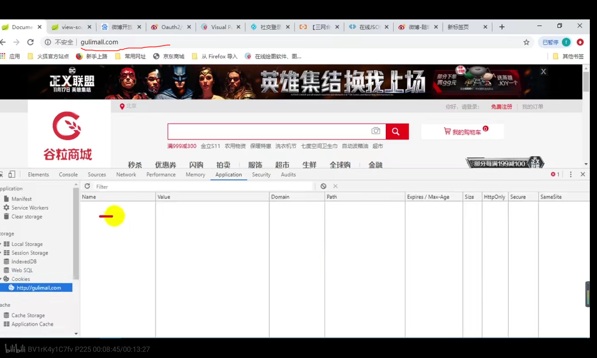
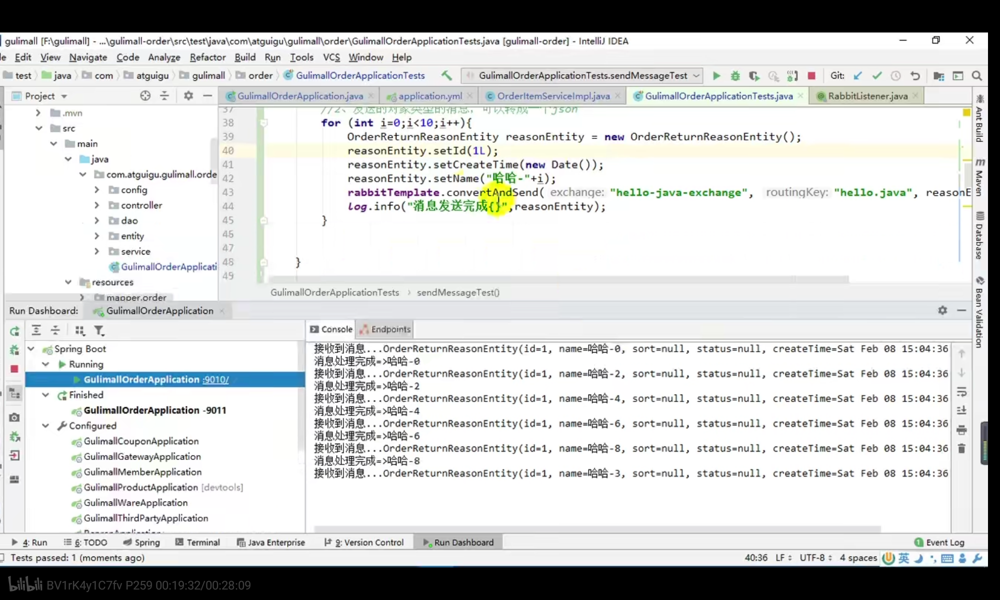
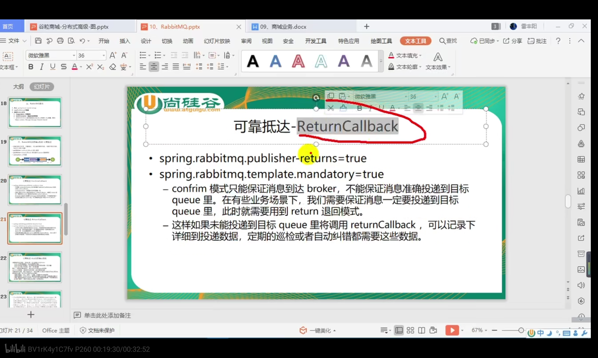
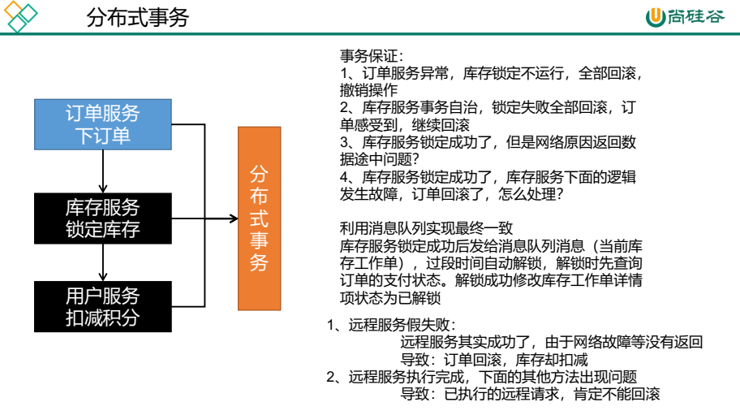
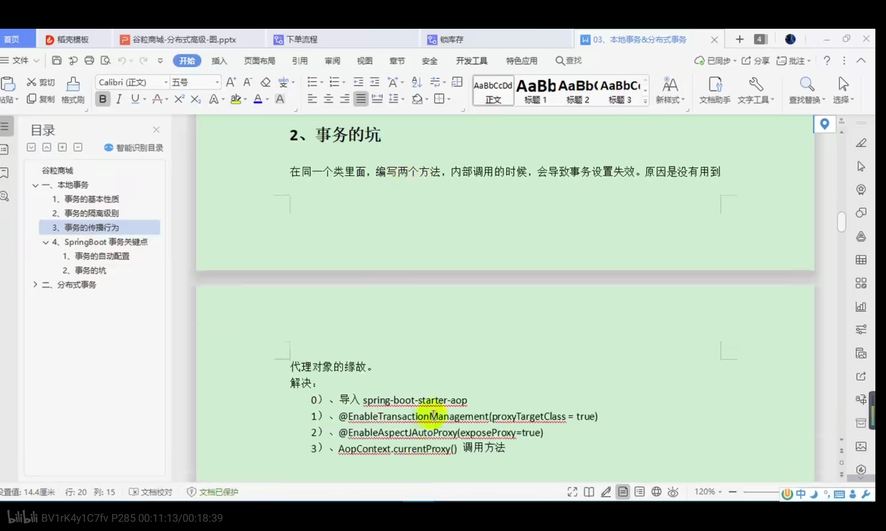
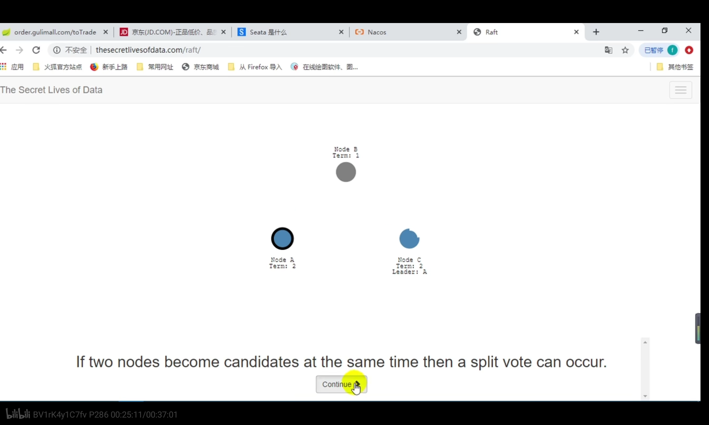
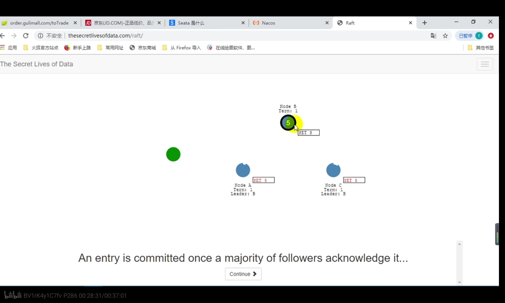
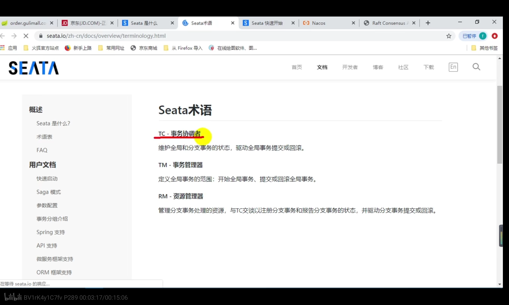
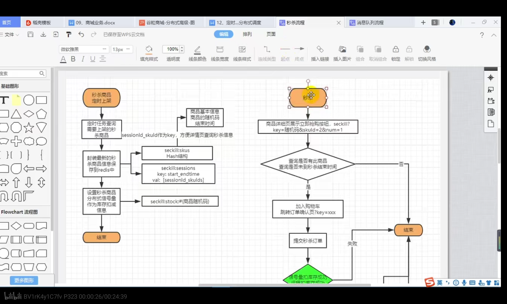
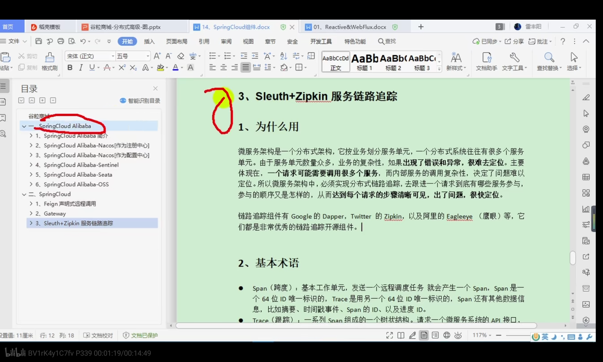

# 商城项目高级篇

## 常见

### 1）常见问题

#### （1）docker给一个已经存在容器扩大存储空间怎么做？


要指定es的xmx为512m，

首先docker stop es容器ID,停止ES容器运行

docker rm es容器ID，移除ES容器

最后执行启动es容器的语句，将xmx指定为512m

这样就建立好了新的容器

#### （2）整个项目字符编码


在做支付宝支付时要求全局编码Global Encoding为UTF-8，每个项目编码为UTF-8，否则总会收到支付宝的错误页

### 2）常见工具类

#### （1）JSON

JSON来自com.alibaba.fastjson

可以把一个javabean对象变成json格式字符串：

```
String jsonString = JSON.toJSONString(user);
```

把json字符串转化为javabean对象，parseObject方法

```
Account account = JSON.parseObject(jsonString, Account.class);
```

Account是一个javabbean对象，jsonString是json格式的字符串

#### （2）StringUtils

常见字符串操作类，位于org.apache.common.lang下，别到错了

#### （3）spring-boot-configuration-processor


导入这个依赖后在配置文件（application.properties中）按照prefix写配置时会有提示

#### （4）DigestUtils

apache.commons提供的加密工具类，可以进行md5加密


#### （5）EntityUtils

```
org.apache.http.util
```

提供的工具类

```java
String json = EntityUtils.toString(response.getEntity());
```

把HttpResponse中的Entity对象转为Json格式的字符串


## 提取的知识

### 1）基础

#### （1）lambda表达式

lambda表达式中使用的变量应该是final的或有效final的

#### （2）异常

service层定义的一个方法save()抛出异常:throws exception

那么controller层的调用该方法的语句xxxService.save()就要放在try catch里

```
try{
xxxService.save()
}catch{

}
```

用try catch包住方法签名中throws exception的方法

#### （3）静态导入

在xxxConstant类上定义常量(public static final修饰)USER_ORDER_TOKEN_PREFIX

在service类使用这个常量:

* 可以选择导入xxxConstant类，然后xxxConstant.USER_ORDER_TOKEN_PREFIX使用它
* 如果选择直接使用USER_ORDER_TOKEN_PREFIX，不导入xxxConstant类，也可以选择静态导入：

```
import static com.ljf.gmall.order.constant.OrderConstant.USER_ORDER_TOKEN_PREFIX;
```

这样可以直接使用USER_ORDER_TOKEN_PREFIX，不用加前缀

#### （4）驼峰命名法

包括下划线法和大写字母法

Linux下Mysql列名不区分大小写，所以数据库列名按照小驼峰命名法写成attrId，可能被当成attrid，此时可以使用带下划线的驼峰命名法：attr_id

"_i"等价于大写的i

#### （5）如果查看一个注解可以标在哪些位置上？

@RabbitListener可以标在类上(Type)，方法(Method)上，注解上(ANNOTATION_TYPE)

```java
@Target({ElementType.TYPE, ElementType.METHOD, ElementType.ANNOTATION_TYPE})
public @interface RabbitListener {}
```

通过@Target标签

#### （6）@PostConstruct注解

```java
@Target(METHOD)
public @interface PostConstruct {
}
```

定义在方法上，表示让被标记的方法在所属类对象创建完后立刻执行这个方法，见于P259

#### （7）@Transactional

* 异常回滚

  ```java
  @Transactional(rollbackFor = xxxException.class)
  ```

  定义在方法上，只要方法抛出xxxException异常就都回滚

  不指明rollbackFor也是可以的，默认抛出运行时异常@Transactional都会回滚

* 调整事务隔离级别

  ```java
  @Transactional(isolation = Isolation.READ_COMMITED)
  ```

  把事务调整到读已提交的级别(oracle和sqlserver的默认隔离级别)

  Mysql默认隔离级别：可重复读，整个事务期间，第一次读到的某个字段是多少，以后读到的这个字段就是多少，即使这个字段被修改或删除了，等到事务结束之后才会读取到字段被更新后的值。

* 事务传播行为

  ```java
  @Transactional(timeout=30)
  public void a(){
      b();
      c();
      int i = 10/0;//抛出异常，a回滚，b和a共用事务也回滚，c不回滚
  }
  
  //一旦指定propagation = Propagation.REQUIRED，那么a事务的设置就是b事务的设置，没必要在b上再做设置
  @Transactional(propagation = Propagation.REQUIRED,timeout=30)
  public void b(){
      //如果b出现异常a也会回滚
  }
  
  @Transactional(propagation = Propagation.REQUIRES_NEW)
  public void c(){
  }
  ```

  事务传播：a,b,c三个方法都是事务，a()中调用b,c，那么b,c要不要和a共用一个事务

  Propagation.REQUIRED：表示b需要一个事务，调用b的a已经有事务了，那么b和a就共用一个事务，在同一个连接里执行。a事务的配置会应用到b上。timeout代表事务的超时时间，只要超过timeout的时间没返回结果就会滚，a的事务设置会覆盖b的设置，所以b的timeout也是30s

  Propagation.REQUIRES_NEW:表示c需要一个新事物，不和a共有一个事务

* 本地事务失效问题(sb的一个坑)

  假设上面的a,b,c都定义在同一个对象aServiceImpl中，那么：

  定义在同一个对象内的事务方法互相调用，被调用的方法的事务是默认失效的，在b,c的@Transactional上做任何的事务设置都是没有用的，它们默认和a共用一个事务。

  ```java
  @Transactional(timeout=30)
  public void a(){
      bService.b();//b上事务注解的timeout不会被a的timeout覆盖
      cService.c();//c上事务注解的timeout不会被a的timeout覆盖
  }
  ```

  如果a,b,c是定义在三个类中的方法，b,c和a方法不在一个类中，这样对b,c事务的设置不会被a的设置覆盖

  这是因为一个方法的事务是由**调用该方法的接口形成的代理对象**控制的，这就意味着，如果bc和a定义在同一个类中，a直接调用b而不是通过xxx.b()这种用对象来调用b()的方式：

  ```java
  public class aServiceImpl{
      @Transactional()
      public void a(){
          b();
          c();
      }
  
      @Transactional()
      public void b(){
      }
  
      @Transactional()
      public void c(){
      }
  }
  ```

  **在a中直接调用b，而不是使用代理对象执行b，相当于绕开了代理对象，此时b的事务是没有代理对象来控制的，这就跟把b中代码直接粘贴到a中没区别；**

  这样一来在b上设置事务的意义已经不大了，

  那如何解决这个问题？那就得在a内使用对象来调用b,c，使用什么对象呢？

  **1.使用this肯定不行,this指的就是当前对象，它不会被代理，所以this.b()<==>b()**

  ```java
  public class aServiceImpl{
      @Transactional()
      public void a(){
          this.b();//等价于b()，this本身不会被代理
          this.c();
      }
  
      @Transactional()
      public void b(){
      }
  
      @Transactional()
      public void c(){
      }
  }
  ```

  **2.注入一个aService然后使用aService调用b,c，这样会导致循环依赖，aServiceImpl内部有一个aService属性，aService的实现类内部还有aService属性，重复下去**

  ```java
  public class aServiceImpl{
      
      @Autowired aService aservice;//自己依赖自己？肯定不行
      
      @Transactional()
      public void a(){
          aservice.b();
          aservice.c();
      }
  
      @Transactional()
      public void b(){
      }
  
      @Transactional()
      public void c(){
      }
  }
  ```

  3.引入aop场景，它引入了aspectj

  ```xml
          <dependency>
              <groupId>org.springframework.boot</groupId>
              <artifactId>spring-boot-starter-aop</artifactId>
          </dependency>
  ```

  开启aspectj动态代理

  ```java
  @EnableAspectJAutoProxy(exposeProxy = true)//对外暴露代理对象
  ```

  这样以后所有动态代理对象都是aspectj创建的而不是jdk默认创建的，jdk默认的动态代理必须有接口，而aspectj即使没有接口也能创建代理对象。

  以后内部互调时使用代理对象

  ```java
      @Transactional()
      public void a(){
          //利用AopContext生成当前类的一个代理对象
          aServiceImpl aservice = (aServiceImpl) AopContext.currentProxy();
          //使用代理对象aservice调用b和c
          aservice.b();
          aservice.c();
      }
  ```

  这样的话b和c的事务就有代理对象控制了


#### （8）处理日期的api

```java
LocalDate now = LocalDate.now();//返回本地当前日期2021-3-5
LocalDate plus = now.plusDays(2);//返回当前日期加上2天的日期2021-3-7
LocalTime min = LocalTime.MIN;//一天之内的最小时间00:00:00
LocalTime max = LocalTime.MAX;//一天之内的最大时间23:59:59
LocalDateTime end = LocalDateTime.of(plus, max);//组合时间 2021-3-7 23:59:59
String endFormat = end.format(DateTimeFormatter.ofPattern("yyyy-MM-dd HH:mm:ss"));//格式化时间，2021-3-7 23:59:59
```

#### （9）分布式信号量的使用

1.首先导入Redission依赖

```xml
<dependency>
    <groupId>org.redisson</groupId>
    <artifactId>redisson</artifactId>
    <version>3.13.4</version>
</dependency>
```

2.定义Redission配置类

```java
@Configuration
public class MyRedissonConfig {

    /**
     * 所有对Redisson的使用都是通过RedissonClient
     * @return
     * @throws IOException
     */
    @Bean(destroyMethod="shutdown")
    public RedissonClient redisson() throws IOException {
        //1、创建配置
        Config config = new Config();
        config.useSingleServer().setAddress("redis://192.168.77.130:6379");

        //2、根据Config创建出RedissonClient实例
        RedissonClient redissonClient = Redisson.create(config);
        return redissonClient;
    }

}
```

配置类中已经往容器里放进去一个RedissonClient，

3.从RedissonClient获取信号量

```java
//从容器中的RedissonClient获取信号量
RSemaphore semaphore = redissonClient.getSemaphore("自定义一个key");
//设置信号量大小为100
semaphore.trySetPermits(100);
```

4.扣除信号量

```java
boolean tryAcquire(int var1, long var2, TimeUnit var4) throws InterruptedException;
```

var1是要给信号量扣除的值， var2是时间单位，过了var2后还没执行成功直接返回false，var2的作用是保证扣除信号量的操作可以在一定时间内完成

### 2）mybatis相关

#### （1）xml的foreach标签


这里IN(?)是一个id集合，如IN(2,3,4)，用Mybatis提供的foreach标签，遍历List类型的attrIds并把值拼接


open表示以"("开始，close表示以")"结束，中间用,分隔

#### （2）使用包装类封装基本类型

从数据库中取出一个long类型的数据，那么应该用包装类型Long而不是基本类型long来封装数据，


要查某个记录个数，如果数据库没有记录的话会显示为null类型而不是0，long如果被赋给一个null类型会报错，所以用Long来封装记录个数

对数据库进行计数操作返回的结果使用包装类接收

#### （3）报错Checks autowiring problems in a bean class.

* 给service层注入一个dao，idea报这个错误，给dao接口上加注解@Repository即可

P99中WareSkuService里注入了WareSkuDao但是没给WareSkuDao加上这个注解导致报了这个错

* 使用@Resource而不是@Autowired注入dao可以解决这个错误


#### （4）xml中连表查询与resultMap

见product中AttrGroupDao.xml


#### （5）xml中定义resultMap

```xml
    <resultMap id="skuItemSaleAttrVo" type="com.ljf.gmall.product.vo.SkuItemSaleAttrVo">
        <result column="attr_id" property="attrId"></result>
        <result column="attr_name" property="attrName"></result>
        <collection property="attrValues" ofType="com.ljf.gmall.product.vo.AttrValueWithSkuIdVo">
            <result column="attr_value" property="attrValue"></result>
            <result column="sku_ids" property="skuIds"></result>
        </collection>
    </resultMap>
```

xml中resultMap中的type与java中某一个类绑定；

```java
public class SkuItemSaleAttrVo {

    private Long attrId;

    private String attrName;

    private List<AttrValueWithSkuIdVo> attrValues;

}
```

property写实体类属性名，column写数据库中该属性对应字段名，普通属性用result标签建立映射，集合类型标签用collection标签建立映射，ofType是集合元素类型

#### （6）xml中的resultMap不能与内部类绑定

xml中定义的resultMap会与某个实体类绑定，这个类一定不能是某个类的内部类，比如上面的AttrValueWithSkuIdVo，因为它主要用于SkuItemSaleAttrVo内部的一个属性，为图省事常有人选择把AttrValueWithSkuIdVo定义为SkuItemSaleAttrVo的内部类

```java
public class SkuItemSaleAttrVo {
    
    public static class AttrValueWithSkuIdVo{}
}
```

这样mybatis无法解析AttrValueWithSkuIdVo，不能把它定义为一个内部类，定义成正常类即可（见P205)

#### （7）Mysql组连接函数


group_concat函数：这里按照attrid,attrname分组，要把同属一个分组（attrid,attrname都相同）的attrvalue写进一行，可以使用group_concat函数

#### （8）resultType和resultMap标签

对于select的sql语句，最后会查询出结果，在select标签里resultType.resultMap是查询出的结果的类型。

* resultType可以直接写java提供的包名，如"java.lang.String","java.lang.Long"

  **dao方法：**

  ```java
  List<String> getSkuSaleAttrValuesAsStringList(@Param("skuId") Long skuId);
  ```

  **对应的标签**

  ```xml
  <select id="getSkuSaleAttrValuesAsStringList" resultType="java.lang.String">
      SELECT
          CONCAT( attr_name, "：", attr_value )
      FROM
          pms_sku_sale_attr_value
      WHERE
          sku_id = #{skuId}
  </select>
  ```

  方法返回String类型，就可以写String类型的全包名

* 当查询结果是一个自定义对象时，使用resultMap

  **dao方法**

  ```java
  List<SkuItemSaleAttrVo> getSaleAttrBySpuId(@Param("spuId") Long spuId);
  ```

  **对应的标签**

  ```xml
  <resultMap id="skuItemSaleAttrVo" type="com.ljf.gmall.product.vo.SkuItemSaleAttrVo">
      <result column="attr_id" property="attrId"></result>
      <result column="attr_name" property="attrName"></result>
      <collection property="attrValues" ofType="com.ljf.gmall.product.vo.AttrValueWithSkuIdVo">
          <result column="attr_value" property="attrValue"></result>
          <result column="sku_ids" property="skuIds"></result>
      </collection>
  </resultMap>
  
  <select id="getSaleAttrBySpuId" resultMap="skuItemSaleAttrVo">
      SELECT
          ssav.attr_id attr_id,
          ssav.attr_name attr_name,
          ssav.attr_value,
          group_concat( DISTINCT info.sku_id ) sku_ids
      FROM
          pms_sku_info info
              LEFT JOIN pms_sku_sale_attr_value ssav ON ssav.sku_id = info.sku_id
      WHERE
          info.spu_id = #{spuId}
      GROUP BY
          ssav.attr_id,
          ssav.attr_name,
          ssav.attr_value
  
  </select>
  ```

  这里resultMap是前面自定义resultMap的id

* 可能会有多个查询结果，最后查询结果可能是一个List，resultType和resultMap只写集合里面元素的类型即可

#### （9）update标签的返回值

将一个java方法与update标签绑定，这个方法返回Long类型，表示有几行收到了影响。因为是更新方法，所以返回值大于0表示更新成功；如果返回值等于0表示没有哪一行被更新


可以利用这个Long类型的返回值判断是否更新成功

#### （10）Iservice提供的Page方法

常在service层中以this.page()调用，

```java
default <E extends IPage<T>> E page(E page, Wrapper<T> queryWrapper) {
    return this.getBaseMapper().selectPage(page, queryWrapper);
}
```

E是该方法的返回对象，是IPage<T>接口的实现类，T是实体类,这个方法的例子

```java
IPage<OrderEntity> page = this.page(
        new Query<OrderEntity>().getPage(params),
        new QueryWrapper<OrderEntity>()
                .eq("member_id",memberResponseVo.getId()).orderByDesc("create_time")
);
```

Query中的getPage()，返回Page<T>对象

```java
public IPage<T> getPage(Map<String, Object> params, String defaultOrderField, boolean isAsc) {
    //分页参数
    long curPage = 1;
    long limit = 10;

    if(params.get(Constant.PAGE) != null){
        curPage = Long.parseLong(params.get(Constant.PAGE).toString());
    }
    if(params.get(Constant.LIMIT) != null){
        limit = Long.parseLong(params.get(Constant.LIMIT).toString());
    }

    //分页对象
    Page<T> page = new Page<>(curPage, limit);

    //分页参数
    params.put(Constant.PAGE, page);
    //后面主要是字段排序相关内容
    
    return page;
}
```

Constant.PAGE和Constant.LIMIT对应

```
/**
 * 当前页码
 */
public static final String PAGE = "page";
/**
 * 每页显示记录数
 */
public static final String LIMIT = "limit";
```

getPage方法传入的Map类型参数params里面要指定当前页码和每页个数

Page<T>对象是IPage<T>接口的一个实现类

```java
public class Page<T> implements IPage<T> {
    private static final long serialVersionUID = 8545996863226528798L;
    private List<T> records;//查询到的实体类列表
    private long total;//查到的实体类总数
    private long size;//每页尺寸
    private long current;//当前页码
    private List<OrderItem> orders;
    private boolean optimizeCountSql;
    private boolean isSearchCount;
    private boolean hitCount;
    
    //省略后面方法
}
```

page方法的第一个参数的作用是定义当前页，每页个数，排序字段这些参数的Page<T>对象（分页条件）；第二个参数是查询条件，分页条件与查询条件结合，最终返回的还是一个Page<T>对象，只不过返回的Page<T>对象的records属性已经记录了按照**当前分页条件和查询条件**查到的记录数。假设数据库有100个name=lisi的记录：

分页条件：每页10个，第1页

查询条件：name=lisi

最后查到的Page<T>对象的records属性就记录了前10个名叫lisi的记录。

### 3）集合

#### （1)集合之间互相转换

```
Set<Long> ids = new HashSet<>(searchIds);
```

searchIds是一个List类型，把它转为一个Set类型

#### （2）stream api中集合互相转换

```java
stockMap = skuHasStocks.stream().collect(Collectors.toMap( k->{},v->{}))
```

skuHasStocks是一个List类型，Collectors.toMap将它转为Map类型，键是k，值是v,k和v都是stockMap中的每一个元素，可以在函数体中对k和v进行处理确定最终Map的键和值。

### 4）feign

feign的使用步骤见基础篇

#### （1）微服务中feign接口

每一个服务的feign文件夹会定义许多feign接口。product服务会与其他服务进行交互，与ware服务的交互可以定义一个接口WareFeignService，与Coupon的交互可以定义接口CouponFeignService

#### （2）feign的调用流程

1.构造请求数据，将对象转为JSON

2.发送请求进行执行


3.重试机制执行请求


#### （3）微服务之间数据传递

auth-server服务调用member服务的register方法

auth-server服务方法定义：

```java
@PostMapping(value = "/member/member/register")
R register(@RequestBody UserRegisterVo vo);
```

member服务方法定义：

```java
@PostMapping(value = "/register")
R register(@RequestBody MemberUserRegisterVo vo){}
```

auth-server服务有数据UserRegisterVo要传递给member服务，因为微服务之间远程调用都是Http+json，而且这里还是Post请求，所以一定要加上@RequestBody注解，这会把请求体里的json数据转成java对象。

这里因为auth-server中方法需要接收json格式的数据所以方法签名中有@RequestBody，而member服务中方法为了跟远程方法的签名保持一致所以也加上了member服务

**接收post请求+以json格式传来的数据一定要加@RequestBody注解**


#### （4）远程调用方法抛出异常

详见auth-server服务调用member服务的register方法，如何处理被调用的member服务方法产生异常？

用try catch包住member服务的register方法中所有有可能产生异常的代码，并让方法返回R。这样register方法就不会继续抛出异常，而且如果没发生异常就执行R.ok()，出现异常就执行R.error()。auth-server服务中的方法根据R中状态码(r.getCode())就能判断是否发生异常并处理异常。

总结：让远程方法都返回R类型，R是HashMap类型，可以以json形式在微服务间传递返回数据，而且通过R中状态码可以判断是否出现异常。

#### （5）微服务的返回数据

项目中远程方法统一返回R，cart服务调用product服务根据skuId查询商品信息的方法，

* 被调用方：

  ```java
  @RequestMapping("/info/{skuId}")
  //@RequiresPermissions("product:skuinfo:info")
  public R info(@PathVariable("skuId") Long skuId){
      SkuInfoEntity skuInfo = skuInfoService.getById(skuId);
  
      return R.ok().put("skuInfo", skuInfo);
  }
  ```

把查到的SkuInfoEntity放到R中

* 调用方

  feign接口定义：

  ```java
  @RequestMapping("/product/skuinfo/info/{skuId}")
  R getInfo(@PathVariable("skuId") Long skuId);
  ```

  cart服务调用getInfo获得R对象，然后通过

  ```java
  SkuInfoVo skuInfo = productSkuInfo.getData("skuInfo", new TypeReference<SkuInfoVo>() {});
  ```

  取出对象，这里SkuInfoVo和SkuInfoEntity内容相同，cart服务内部要定义一个与product放入R中的对象相同的类，以便于通过new TypeReference还原出R中的对象

总结：远程调用方法中放入R中在两个服务间传递的对象SkuInfoEntity/SkuInfoVo，在两个服务中都要有定义，一个放，一个取。

实际上并非所有远程方法都返回R，个别远程方法不会通过浏览器被调用，只是被其他服务远程调用，不需要使用R作为返回数据。所以直接返回List<String>，比如cart服务中的getSkuSaleAttrValues()。

#### （6）feign远程调用丢失请求头


我们项目中定义的feign接口，在调用远程方法是一个代理对象


cartFeignService就是一个$Proxy对象

feign接口在远程调用之前要构造请求，调用很多的拦截器RequestInterceptor

它构造的请求是有一个发送请求的模板RequestTemplate的


这个请求模板中默认没有请求头，所以feign使用默认模板构造的请求不会有请求数据，这导致了order远程调用cart服务时因为缺少请求头导致判断用户没登录。

解决方案：


看源码，在发请求之前会经过很多拦截器对请求进行增强，默认拦截器啥也不干，所以我们得自己定义拦截器，给请求加上缺失的请求头。

增强请求的拦截器定义：

```java
public interface RequestInterceptor {
    void apply(RequestTemplate var1);
}
```

在feign接口所在服务（调用方）往容器中放一个RequestInterceptor即可

具体解决方法见订单服务:5)

#### （7）feign异步情况丢失上下文


上面那栏：一个请求访问order服务，然后调用orderservice，orderservice远程调用member服务获取address之后再远程调用cart服务获取购物车数，两次远程调用之间是同步的，始终是一个线程在操作，保存在ThreadLocal中的数据全程都能获取到，使用RequestContextHolder（底层基于ThreadLocal也能获取请求上下文数据）

下面那栏：orderservice使用异步方式再开启两个线程远程调用member服务和cart服务，执行两个服务的是两个线程101，102，orderservice所在的主线程是72。


我们在(6)中设置了RequestInterceptor拦截远程调用的请求，101，102两个线程内给远程接口发请求之前的请求都会经过拦截器，然而拦截器中使用RequestContextHolder获取老请求时显示老请求为null，这是因为RequestContextHolder底层基于ThreadLocal，老请求数据都保存在最开始处理请求的主线程72中。也就是说只有在72线程内才能获取到老请求，新开的101,102线程里面的RequestContextHolder没有保存老请求信息，获取到的request对象为Null.

解决方案：开新线程时给新线程的RequestContextHolder共享原线程的数据，

```java
//开启异步任务前先拿到上下文数据RequestAttributes 
RequestAttributes requestAttributes = RequestContextHolder.getRequestAttributes();

//开启第一个异步任务，查询地址列表
CompletableFuture<Void> addressFuture = CompletableFuture.runAsync(() -> {

    //给第一个线程的RequestContextHolder共享数据
    RequestContextHolder.setRequestAttributes(requestAttributes);
    //1、远程查询所有的收获地址列表
}, threadPoolExecutor);

//开启第二个异步任务，查询购物车数据
CompletableFuture<Void> cartInfoFuture = CompletableFuture.runAsync(() -> {

    //给第一个线程的RequestContextHolder共享数据
    RequestContextHolder.setRequestAttributes(requestAttributes);
}, threadPoolExecutor)

```


### 5）json

#### （1）如何在java方法中返回一个json对象

java中的Map集合就是一个json对象

如果controller中某个方法要直接返回json类型的数据，可以让它返回Map

```java
    @GetMapping("index/json/catalog.json")
    @ResponseBody
    public Map<String, List<Catalog2Vo>> getCategoryMap() {
        return categoryService.getCatalogJsonDbWithSpringCache();
    }
```

这个方法给前端返回一个json对象，那么在Java中直接让它返回Map

#### （2）json序列化 vs jdk默认序列化

在项目可以看到很多默认jdk序列化，自己指定为Json序列化的例子

* rabbitmq消息发送到服务器中默认消息的序列化方式为jdk，这需要对象自己实现序列化接口，通过自己配置MessageConverter将序列化方式改为json格式
* springsession中session保存到redis也是默认jdk序列化，最后在配置类中往容器返回一个GenericJackson2JsonRedisSerializer，这样session会以json格式保存在redis中

### 6）docker

#### (1)docker stats

查看docker容器的cpu占用率，内存使用情况等

### 7）Maven

#### (1)exclusions标签的使用

sb导入某个starter时会导入一系列配套的依赖，如果不想导入这些依赖中的某一个，就使用exclusions排除依赖

```xml
<dependency>
    <groupId>org.springframework.boot</groupId>
    <artifactId>spring-boot-starter-data-redis</artifactId>
    <exclusions>
        <exclusion>
            <groupId>io.lettuce</groupId>
            <artifactId>lettuce-core</artifactId>
        </exclusion>
    </exclusions>
</dependency>
```
导入redis启动器，但不导入它携带的lettuce依赖

#### (2)排除依赖:exclusion标签和exclude参数

什么时候需要排除依赖？

有些时候，引入某个依赖时常会导入一大批相关依赖

比如定义在gmall-common中的mybatis-plus-boot-starter和spring-cloud-starter-alibaba-seata，导入gmall-common就会导入它们。但是这两个依赖的最大特点就是导入它之后还需要配置信息，比如导入mbp就需要配置数据源信息，导入seata依赖需要配置seata服务器相关信息，如果某个服务导入依赖却没有配置相关信息，启动这个服务就会报错。

就是要有下面这段配置

```properties
datasource:
  username: root
  password: root
  url: jdbc:mysql://192.168.56.10:3306/gulimall_wms
  driver-class-name: com.mysql.jdbc.Driver
```

把这两个服务定义在common中是因为项目中大部分微服务都需要这些依赖，只有个别不需要，把它们定义在common中就不用每个服务再分别导入了。但是不需要这些依赖的服务怎么办呢？使用exclusion标签，导入common时不导入里面的mybatis-plus-boot-starter和spring-cloud-starter-alibaba-seata，这样就没问题了。

比如认证服务中因为不需要配置数据库所以排除了mbp的依赖

```xml
<dependency>
    <groupId>com.ljf.gmall</groupId>
    <artifactId>gmall-common</artifactId>
    <version>1.0-SNAPSHOT</version>
    <exclusions>
        <exclusion>
            <groupId>com.baomidou</groupId>
            <artifactId>mybatis-plus-boot-starter</artifactId>
        </exclusion>
    </exclusions>
</dependency>
```

除了这种方式外，还可以选择在启动类上使用exclude参数排除相关类

比如cart服务就没有导入common时使用exclusion标签排除相关类，而是直接在启动类上标注

```java
@SpringBootApplication(exclude = DataSourceAutoConfiguration.class)
@EnableDiscoveryClient
@EnableFeignClients
public class GmallCartApplication 
```

@SpringBootApplication的exclude会排除数据源的自动启动类，sb即使导入了mbp依赖也不会再读取数据源了(DataSourceAutoConfiguration的任务之一就是读取配置文件中的数据源)，只要没人读，那么也就不会产生读取不到这种异常，这样即使导入common时没排除mbp依赖也不会因为数据源问题导致启动失败。

两种方式均可。

#### (3)dependencyManagement标签的作用

在pom.xml中提供版本控制，在dependencyManagement中锁定导入某个group的依赖的版本，再导入该依赖时就不用写版本号了。

```xml
<dependencyManagement>
    <dependencies>
        <dependency>
            <groupId>com.alibaba.cloud</groupId>
            <artifactId>spring-cloud-alibaba-dependencies</artifactId>
            <version>2.1.0.RELEASE</version>
            <type>pom</type>
            <scope>import</scope>
        </dependency>
    </dependencies>
</dependencyManagement>
```

这样导入的所有spring-cloud-alibaba-XXX的依赖就不用写版本号了。

```xml
<dependency>
    <groupId>com.alibaba.cloud</groupId>
    <artifactId>spring-cloud-starter-alibaba-seata</artifactId>
</dependency>
```

导入的spring-cloud-starter-alibaba-seata就是2.1.0.RELEASE版本，如果没有在dependencyManagement统一设置版本号，那我们导入依赖时就要知道版本，否则报错。

而且dependencyManagement只能控制自己pom.xml的版本号，控制不了其他pom.xml的。假设gmall-common中设置了dependencyManagement，指定spring-cloud-alibaba-dependencies为2.1.0版本。其他服务gmall-product导入了gmall-common，但是它自己又导入了gmall-common中没导入的其他spring-cloud-alibaba-dependencies的依赖，那么就要么指明这个依赖的版本号，要么在gmall-product中也设置一个dependencyManagement，gmall-common中的dependencyManagement无法控制gmall-product额外导入的其他spring-cloud-alibaba-dependencies依赖。

### 8）IDEA

#### （1）单机模拟部署在分布式系统上的微服务

在本机上通过idea模拟多个服务器运行product微服务的情况，右键服务名选择copy configuration


然后同时启动多个product服务（它们的端口不同）


把这些product服务都启动，这样向product发并发请求，nginx会负载均衡，把请求分别路由到不同的product服务中，这样就好比不同机器上都运行了product服务

#### （2）搜索代码

ctrl+f

#### (3)快速跳转到代码底部

ctrl+end 

### 9）人人开源生成模板代码

#### （1）controller层

注入Service

以coupon中的SpuBoundsController为例，一共有列表、查询信息、保存、修改、删除五种基本操作

```java
@RestController
@RequestMapping("coupon/spubounds")
public class SpuBoundsController {
    @Autowired
    private SpuBoundsService spuBoundsService;

    /**
     * 列表
     */
    @RequestMapping("/list")
    //@RequiresPermissions("coupon:spubounds:list")
    public R list(@RequestParam Map<String, Object> params){
        PageUtils page = spuBoundsService.queryPage(params);

        return R.ok().put("page", page);
    }


    /**
     * 信息
     */
    @RequestMapping("/info/{id}")
    //@RequiresPermissions("coupon:spubounds:info")
    public R info(@PathVariable("id") Long id){
		SpuBoundsEntity spuBounds = spuBoundsService.getById(id);

        return R.ok().put("spuBounds", spuBounds);
    }

    /**
     * 保存
     */
    @PostMapping("/save")
    //@RequiresPermissions("coupon:spubounds:save")
    public R save(@RequestBody SpuBoundsEntity spuBounds){
		spuBoundsService.save(spuBounds);

        return R.ok();
    }

    /**
     * 修改
     */
    @RequestMapping("/update")
    //@RequiresPermissions("coupon:spubounds:update")
    public R update(@RequestBody SpuBoundsEntity spuBounds){
		spuBoundsService.updateById(spuBounds);

        return R.ok();
    }

    /**
     * 删除
     */
    @RequestMapping("/delete")
    //@RequiresPermissions("coupon:spubounds:delete")
    public R delete(@RequestBody Long[] ids){
		spuBoundsService.removeByIds(Arrays.asList(ids));

        return R.ok();
    }

}
```

#### （2）service层

可以看到，controller使用service很多方法，但在service接口中只声明了分页查询一种，其他方法都是由IService类提供。

```java
public interface SpuBoundsService extends IService<SpuBoundsEntity> {

    PageUtils queryPage(Map<String, Object> params);
}
```


实现类用service注解标注，里面实现queryPage

```java
@Service("spuBoundsService")
public class SpuBoundsServiceImpl extends ServiceImpl<SpuBoundsDao, SpuBoundsEntity> implements SpuBoundsService {

    @Override
    public PageUtils queryPage(Map<String, Object> params) {
        IPage<HomeAdvEntity> page = this.page(
                new Query<HomeAdvEntity>().getPage(params),
                new QueryWrapper<HomeAdvEntity>()
        );

        return new PageUtils(page);
    }
}
```

#### （3）dao层

```java

@Mapper
public interface SpuBoundsDao extends BaseMapper<SpuBoundsEntity> {
	
}

```

只是定义了一个接口

### 10）controller

#### (1)封装请求数据

**1.对于get请求数据：**

name=abc&age=12.....

* 使用@RequestParam封装get请求后的请求参数

```java
controller方法(@RequestParam Map<String, Object> params){}
```

name和age会作为params中的key，通过key取出值

* 直接定义vo类

```java
@Data
public class SearchParam {
    private String name;
    private Integer age;
}
```

在里面将所有请求参数的key变成vo类的属性

```
controller方法(SearchParam param){}
```

这样param对象封装了请求参数中对应key的值

**2.对于post请求数据**

* 使用@RequestBody注解

  @RequestBody注解常用来处理content-type不是默认的application/x-www-form-urlcoded编码的内容，比如说：application/json或者是application/xml等。

  @RequestBody可以将传来的json格式字符串封装到一个实体类中，或者一个字符串上

  比如提交表单

  ```html
  <form action = "/save" method="post">
  	<input name="username" />
  	<input name="email"/>
      <button class="tijiao" type="submit">提交表单</button>
  </form>
  ```
  提交username为zhangsan和email为aaaaa，可以使用@RequestBody封装表单数据

  可以将表单数据分别封装到不同字符串上，字符串名字要和input名字相同：

  ```java
  @PostMapping("/save")
  public void postMethod(@RequestBody String username,@RequestBody String email){
      System.out.println(userName+" ："+pwd);
  }
  //zhangsan:email
  ```

  可以将表单数据封装到一整个字符串上

  ```java
  @PostMapping("/save")
  public void postMethod(@RequestBody String content){
      System.out.println(content);
  }
  //username=zhangsan&email=aaaaa
  ```

  甚至可以定义javabean，将表单数据封装到javabean的属性中，Input的名字和javabean属性名一致

  ```java
  @PostMapping("/save")
  public Map postMethod(@RequestBody User user){
      System.out.println(user.getUsername());//zhangsan
      System.out.println(user.getEmail());//aaaaa
  }
  ```

* sb提供了数据绑定功能，假设post或get请求提交的数据可以被封装为一个javabean对象，那么就可以直接在方法中定义一个javabean对象封装数据；封装get请求参数的上面已经演示过了，封装Post每个input的数据到javabean对象中，input的name属性和javabean对象的属性名相同

  ```java
  @PostMapping("/save")
  public Map postMethod(User user){
      System.out.println(user.getUsername());//zhangsan
      System.out.println(user.getEmail());//aaaaa
  }
  ```

  

#### (2)controller方法参数

详见黑马springmvcday02

* 可以传入MAV对象
* 可以传入HttpServeltRequest，HttpServletResponse ,HttpSession  

#### (3)汉字编码

请求参数有汉字时，浏览器的地址栏上的汉字，通过request获取后是URL码格式（%E46...)；

java中中文字符都使用utf-8码

URL码变成utf-8码：使用java.net提供的URLEncoder.encode(url字符串，"utf-8");

#### (4)空格的URL码

浏览器中把空格编码成%20，java调用URLEncoder方法编码成'+'

#### (5)viewcontroller的使用

controller中有方法发送请求直接跳转到一个页面：

```java
@GetMapping(value = "/login.html")
public String loginPage(HttpSession session) {

	return "login";
}
```

方法什么操作都不做，就是拿到请求后直接跳转页面

这种方法可以被springmvc提供的viewcontroller直接映射一个请求到页面简化，不用在controller中再定义方法了

```java
@Configuration
public class GmallWebConfig implements WebMvcConfigurer {
    /**·
     * 视图映射:发送一个请求，直接跳转到一个页面
     * @param registry
     */
    @Override
    public void addViewControllers(ViewControllerRegistry registry) {

        registry.addViewController("/login.html").setViewName("login");
        registry.addViewController("/reg.html").setViewName("reg");
    }
}
```

自定义一个webmvc配置类，添加视图控制器，registry是ViewControlle的注册中心，这里setViewName中参数就是templates中的页面名去掉前缀后缀。

#### (6)controller方法的return

跳转页面的controller方法，有两种返回方式可以跳转到项目中templates中的reg.html

```java
@PostMapping("/regist")
public String regist(){
    
    //reg是视图的逻辑（视图在项目的地址），项目会自动给视图逻辑拼上前后缀，直接返回项目templates中的reg.html
    return "reg";
    //请求转发，再发一次请求被controller中的方法或者WebMvcConfigurer中的ViewController映射到项目templates中的reg.html
    return "forward:/reg.html";
}
```

两者功能相同，第一句直接在项目里找到reg.html，第二句是发了个请求，请求适配到controller中的方法或者ViewControllers，controller中的方法或者ViewControllers再把请求路由到项目内的reg.html，比第一句多绕一圈

注意**请求转发**：原请求原封不动的被转发，请求方式不会改变，看认证服务/注册功能路径映射报错那部分

#### (7)RedirectAttributes

它在页面重定向时依然可以携带数据，主要用于放在刷新页面后又发新请求。

```
* attributes.addFlashAttribute():将数据放在session中，可以在页面中取出，但是只能取一次
* attributes.addAttribute():将数据自动拼到放在url后面
```

attributes.addAttribute()的使用：


这样skuId就会拼在url之后


此时获取attributes的skuId数据只需要从url获取即可：

* 如果重定向到一个controller方法，就根据@RequestParam注解获取拼在url后的skuid
* 如果重定向到一个页面，那就通过当前页面url获取skuid

attributes.addFlashAttribute()中的数据怎么取？

```
attributes.addFlashAttribute("errors",errors);
```

往attributes放了一个key为errors的errors对象（选自认证服务/防止表单重提交)

如果重定向到页面，并在页面中获取这个数据，直接${errors}从域中拿即可

```html
<div class="tips" style="color: red" th:text="${errors != null ? (#maps.containsKey(errors, 'userName') ? errors.userName : '') : ''}">
```

它本质上把数据放在session中，所以可以通过${}的方式获取数据，不用${session.xxx}就行，因为往session中放的数据默认往请求域中也放了（全域查找？）

### 11）thymeleaf

#### (1)页面数据格式化


源自p207,#numbers方法

formatDecimal(num,3,2)：小数点前最少由3位，小数点后保留2位

#### (2)string api

${#strings.isEmpty()}等方法是thymeleaf提供的字符串操作方法

#### (3)${}

* 可以从request域(Model对象提取出值)

* 里面可以放三元表达式

  ```html
  <span th:text="${item.hasStock?'有货':'无货'}">无货</span>
  ```

  item.hasStock(boolean类型)为true，就显示有货，否则无货

* 来自p207的th:each，th:text的用法

  ```html
  <div class="guiGe" th:each="group : ${item.groupAttrs}">
      <h3 th:text="${group.groupName}">主体</h3>
      <dl>
          <div th:each="attr : ${group.attrs}">
              <dt th:text="${attr.attrName}">品牌</dt>
              <dd th:text="${attr.attrValue}">华为(HUAWEI)</dd>
          </div>
      </dl>
  </div>
  ```

  效果

  

th:text是文本框默认值，遍历从item中拿出的groupAttrs的每个元素（记为group），设置每个group（主体，基本信息，..）的attrName和attrValue

#### (4)lists api

封装了数组操作的方法


${#lists.contains(list,element)}判断数组list中是否包含element元素

#### (5)session

thymeleaf${}默认获取request，Model中的数据，要获取session中的数据


#### (6)th:attr

给当前标签添加属性，可以用于保存这个标签相关数据。

### 12) springboot

#### (1)配置类，配置文件类与配置文件的关系

* 配置类：XXXConfig，定义于服务的config文件夹

  格式：

  ```java
  @EnableConfigurationProperties(ThreadPoolConfigProperties.class)//绑定配置文件类，可选
  @Configuration//表明是配置类，必须写
  public class MyThreadConfig {
      //配置类中方法返回值需要放到容器中，所以方法上@Bean必写
      @Bean
      public ThreadPoolExecutor threadPoolExecutor(ThreadPoolConfigProperties pool) {
      }
  
  }
  ```

* 配置文件类：XXXConfigProperties，作为配置类方法的参数，从配置类中放给容器中的组件的一些值从配置文件类中获取。

  ```java
  @ConfigurationProperties(prefix = "gmall.thread")
  // @Component
  @Data
  public class ThreadPoolConfigProperties {
  
      private Integer coreSize;
  
  }
  ```

  配置文件类内部定义属性，@ConfigurationProperties和配置文件application.properties绑定，并且定义前缀该配置类属性在application.properties中的前缀，application.properties中配置什么值，配置文件类对应属性就是什么值。可以通过@Data加上Getter/Setter方便配置类获取配置文件类属性的值，可以加上@Component把配置文件类放到容器中。

  配置文件类主要功能是与配置文件绑定，不一定非得作为配置类的参数使用。有时仅仅作为容器中一个组件，见third-party中的smsConponent，它有配置文件类上面的三个注解，但并不是作为配置类方法的参数。

* 配置文件application.properties

  ```
  gmail.thread.core-size=20
  ```

  prefix.属性名的值就是配置文件类对应属性的值。

上面的只是一种关系，配置类中方法未必总会给容器中放组件，也有void方法。

#### (2)注解的定义位置

sb中有些注解可以定义在启动类上，也可以定义在该注解对应的配置类上，如整合redis保存session的@EnableRedisHttpSession，可以定义在启动类上

```
@EnableRedisHttpSession
@EnableFeignClients
@EnableDiscoveryClient
@SpringBootApplication
public class GmallAuthServerApplication
```

也可以定义在配置类上

```
@EnableRedisHttpSession
@Configuration
public class GmallSessionConfig 
```

#### (3)拦截器

我们在项目中使用的拦截器有两种:

* 拦截所有发给本项目的controller的请求

  这类拦截器拦截别人发给本项目的请求，主要通过继承WebMvcConfigurer配置类重写addInterceptors方法，把我们自定义的拦截器加入到registry中

  定义一个拦截器后要让它工作，得实现配置类并重写addInterceptors方法：

  ```java
  @Configuration
  public class GmallWebConfig implements WebMvcConfigurer {
  
      @Override
      public void addInterceptors(InterceptorRegistry registry) {
          registry.addInterceptor(new CartInterceptor())//注册拦截器，/**表示拦截所有请求
                  .addPathPatterns("/**");
      }
  }
  ```

  做完这一步后拦截器就已经加入到容器中了，没必要在自定义的拦截器上加@Component注解把它放到容器中。

  AntPathMatcher看以定义在拦截器中用于匹配路径

  ```java
  boolean match = antPathMatcher.match("/order/order/status/**", uri);
  ```

  具体使用细节见监听库存解锁

* 特殊拦截器，如RequestInterceptor

  它不是拦截别人发给本服务的请求，而是拦截本服务的feign接口远程调用其他服务时构造的请求并对其进行增强，它本身由sb提供，但我们常常需要对默认的RequestInterceptor进行改进并重新放回容器中。这类拦截器无需通过addInterceptors把它加到registry里，我们可以自定义配置类，在类中定义返回RequestInterceptor对象的方法把我们自定义的RequestInterceptor放到容器中即可，详见feign:6)

#### (4)页面渲染与getter/setter方法

有时候要给一个javabean类渲染到页面上，可以只在javabean中定义getCount()，不用定义定义count属性，那么这个类也就相当于有count这个属性了，渲染时可以直接通过：${xxxvo.count}来获取getCount()的返回结果，xxxvo是javabean类被渲染到页面上的对象。

#### (5)@primary

容器中有两个同一类型的组件，使用被@primary标注的组件

使用案例：容器中有普通数据源和被seta包装后的数据源，给seata包装后的数据源加上@primary，这样spring会使用seata包装后的数据源作为项目的数据源而不是我们之前定义的没被包装的数据源。

#### (6)seata使用部分

全节高能，里面设计了数据源配置类，datasourceproperties的关系。

#### (7)循环依赖


报错原因：来自order服务的MyRabbit配置类

```java
@Configuration
public class MyRabbitConfig {
    
    @Autowired
    private RabbitTemplate rabbitTemplate;

    @Bean
    public MessageConverter messageConverter() {
        return new Jackson2JsonMessageConverter();
    }

    @PostConstruct  
    public void initRabbitTemplate() {

        rabbitTemplate.setConfirmCallback((correlationData,ack,cause) -> {
            System.out.println("confirm...correlationData["+correlationData+"]==>ack:["+ack+"]==>cause:["+cause+"]");
        });

        rabbitTemplate.setReturnCallback((message,replyCode,replyText,exchange,routingKey) -> {
            System.out.println("Fail Message["+message+"]==>replyCode["+replyCode+"]" +
                    "==>replyText["+replyText+"]==>exchange["+exchange+"]==>routingKey["+routingKey+"]");
        });
    }
}
```

上面代码的目的是：

@PostConstruct会使initRabbitTemplate在MyRabbitConfig的构造方法执行后立刻执行，它给从容器中取出的RabbitTemplate设置了ConfirmCallback和ReturnCallback，但是在引入actuator启动器依赖后该方法爆出循环依赖的错误。

循环依赖：问题产生的原因是 **A类**中引入了**B**，而在**B类**中又引入了**A**，导致循环依赖注入，具体到上面问题，就是MyRabbitConfig使用@Autowired引入了RabbitTemplate，而RabbitTemplate又引用了MyRabbitConfig，形成一个引用cycle。

```java
public class ClassA {

    @Autowired
    ClassB classB; 
}
 
public class ClassB {

    @Autowired
    ClassA classA;
} 
```

当Spring正在加载所有Bean时，Spring尝试以能正常创建Bean的顺序去创建Bean。
例如，有如下依赖:
Bean A → Bean B → Bean C
Spring先创建beanC，接着创建bean B（将C注入B中)，最后创建bean A(将B注入A中)。

但当存在循环依赖时，Spring将无法决定先创建哪个bean。这种情况下，Spring将产生异常BeanCurrentlyInCreationException。
原文链接：https://blog.csdn.net/qq_18298439/article/details/88818418

在Rabbitmq的自动配置类里有方法往容器中放了一个RabbitTemplate

```java
@Configuration
@Import({RabbitAutoConfiguration.RabbitConnectionFactoryCreator.class})
protected static class RabbitTemplateConfiguration {
    private final RabbitProperties properties;
    private final ObjectProvider<MessageConverter> messageConverter;
    private final ObjectProvider<RabbitRetryTemplateCustomizer> retryTemplateCustomizers;

    public RabbitTemplateConfiguration(RabbitProperties properties, ObjectProvider<MessageConverter> messageConverter, ObjectProvider<RabbitRetryTemplateCustomizer> retryTemplateCustomizers) {
        this.properties = properties;
        this.messageConverter = messageConverter;
        this.retryTemplateCustomizers = retryTemplateCustomizers;
    }

    @Bean
    @ConditionalOnSingleCandidate(ConnectionFactory.class)
    @ConditionalOnMissingBean
    public RabbitTemplate rabbitTemplate(ConnectionFactory connectionFactory) {
        PropertyMapper map = PropertyMapper.get();
        RabbitTemplate template = new RabbitTemplate(connectionFactory);
        MessageConverter messageConverter = (MessageConverter)this.messageConverter.getIfUnique();
        if (messageConverter != null) {
            template.setMessageConverter(messageConverter);
        }

        template.setMandatory(this.determineMandatoryFlag());
        Template properties = this.properties.getTemplate();
        if (properties.getRetry().isEnabled()) {
            template.setRetryTemplate((new RetryTemplateFactory((List)this.retryTemplateCustomizers.orderedStream().collect(Collectors.toList()))).createRetryTemplate(properties.getRetry(), Target.SENDER));
        }

        properties.getClass();
        map.from(properties::getReceiveTimeout).whenNonNull().as(Duration::toMillis).to(template::setReceiveTimeout);
        properties.getClass();
        map.from(properties::getReplyTimeout).whenNonNull().as(Duration::toMillis).to(template::setReplyTimeout);
        properties.getClass();
        map.from(properties::getExchange).to(template::setExchange);
        properties.getClass();
        map.from(properties::getRoutingKey).to(template::setRoutingKey);
        properties.getClass();
        map.from(properties::getDefaultReceiveQueue).whenNonNull().to(template::setDefaultReceiveQueue);
        return template;
    }
    //省略后面部分代码
}
```

当容器中不存在RabbitTemplate时，自动配置类就会往容器中放入一个RabbitTemplate对象，因为我们没有自己往容器中放RabbitTemplate对象，所以@ConditionalOnMissingBean条件成立。

所以有可能是RabbitTemplate哪个地方引入了MyRabbitConfig依赖

所以为了解决循环依赖问题，不能在MyRabbitConfig注入RabbitTemplate对象。

**解决方案1：**

**如果一个类只有一个有参构造器，那它的参数会从容器中得到。**

从容器中拿到的对象，可以直接对它做一些设置（setConfirmCallback）然后不用把这个对象再通过@Bean放回到容器中。做完设置后，容器中的对象就已经有这些设置了。

```java
@Configuration
public class MyRabbitConfig {
    
   
    RabbitTemplate rabbitTemplate;
    public MyRabbitConfig(RabbitTemplate rabbitTemplate){
        this.rabbitTemplate = rabbitTemplate;
        initRabbitTemplate();
    }

    @Bean
    public MessageConverter messageConverter() {
        return new Jackson2JsonMessageConverter();
    }
  
    public void initRabbitTemplate() {

        rabbitTemplate.setConfirmCallback((correlationData,ack,cause) -> {
            System.out.println("confirm...correlationData["+correlationData+"]==>ack:["+ack+"]==>cause:["+cause+"]");
        });

        rabbitTemplate.setReturnCallback((message,replyCode,replyText,exchange,routingKey) -> {
            System.out.println("Fail Message["+message+"]==>replyCode["+replyCode+"]" +
                    "==>replyText["+replyText+"]==>exchange["+exchange+"]==>routingKey["+routingKey+"]");
        });
    }
}
```

这里MyRabbitConfig的构造方法里传入的是容器中的RabbitTemplate，并且给容器中的RabbitTemplate设置了Callback,但是依然报出循环引用错误。这个方法虽然没有用@Autowired直接引用容器中的RabbitTemplate，但是它却把容器中的RabbitTemplate赋给了它自己的rabbitTemplate，相当于它的rabbitTemplate还是引用了容器中的RabbitTemplate，与第一个方法并没有区别。

**解决方法2**

既然MyRabbitConfig不能引用容器中的RabbitTemplate，我们不妨按照容器制造RabbitTemplate的方式自己造一个RabbitTemplate，还可以给这个RabbitTemplate做一些设置，而且我们自己造了RabbitTemplate之后，RabbitTemplateConfiguration由于 @ConditionalOnMissingBean就不会往容器中放RabbitTemplate了。RabbitTemplateConfiguration中制造RabbitTemplate时借助了ConnectionFactory connectionFactory，参考这部分代码，自己给容器中放一个RabbitTemplate

```java
@Configuration
public class MyRabbitConfig {

    private RabbitTemplate rabbitTemplate;

    @Primary
    @Bean
    public RabbitTemplate rabbitTemplate(ConnectionFactory connectionFactory) {
        RabbitTemplate rabbitTemplate = new RabbitTemplate(connectionFactory);
        this.rabbitTemplate = rabbitTemplate;
        rabbitTemplate.setMessageConverter(messageConverter());
        initRabbitTemplate();
        return rabbitTemplate;
    }

    @Bean
    public MessageConverter messageConverter() {
        return new Jackson2JsonMessageConverter();
    }

    public void initRabbitTemplate() {

        rabbitTemplate.setConfirmCallback((correlationData,ack,cause) -> {
            System.out.println("confirm...correlationData["+correlationData+"]==>ack:["+ack+"]==>cause:["+cause+"]");
        });
            
          rabbitTemplate.setReturnCallback((message,replyCode,replyText,exchange,routingKey) -> {
            System.out.println("Fail Message["+message+"]==>replyCode["+replyCode+"]" +
                    "==>replyText["+replyText+"]==>exchange["+exchange+"]==>routingKey["+routingKey+"]");
        });
    }
}
```

这样给容器中放的RabbitTemplate与自动配置类的版本相比少了一些功能，@Primary表示以我们自己放的RabbitTemplate为主，这样的话就不报错了。

### 3）前端

#### (1)表单数据与vo

自定义vo封装提交的表单数据，vo属性名与对应的表单input输入框的name要一致

#### (2)a标签

```html
<a class="addToCart" href="http://cart.gulimall.com/cart.html">
    加入购物车
</a>
```

点击a标签，跳转到href所在的位置（实际上就是给浏览器发请求，url地址栏为href的值）

用途：点击主页(product服务)的某个链接，给其他服务（购物车服务）发送请求，让购物车服务处理这个请求。

#### (3)路径替换

把静态资源放在nginx中，项目templates中页面请求静态资源的src,href路径都要改成静态资源页面在Nginx中的路径


划红线处是静态资源文件夹confirm,detail等在nginx中的保存路径，所以前端页面请求这些静态资源的路径应与这个路径相匹配

```html
<script src="/static/order/confirm/js/jquery-3.1.1.min.js"></script>
<link rel="stylesheet" type="text/css" href="/static/order/confirm/css/JD2.css"/>
```

nginx会将请求路由到html文件夹下，src和href后面的部分和html/后的部分保存一致

具体细节见动静分离

#### (4)jquery根据class查找子标签


一个标签可以有多个class属性，图中画圈的div标签class属性有两个：top3,addr-item

通过$(".top3")和$(".addr-item")都可以找到这个标签

想查找所有class为addr-item的标签里面def=1的p子标签


addr-item p中间的空格表示找addr-item的p子标签，p[def='1']是def属性为1的p标签

#### (5)js随着页面加载就自动执行的代码

```js
$(document).ready(function () {
    $('.header-right li:nth-of-type(6)').hover(function () {
        $('.header-r-11').css('display', 'block')
    }, function () {
        $('.header-r-11').css('display', 'none')
    })

    highlightAddress();
    var addrId = $(".addr-item p[def='1']").attr("addrId");
    getFare(addrId)
});
```

取自G:\ideaworkspace\gmall\gmall-order\src\main\resources\templates\confirm.html

$(document).ready(function () {});中的方法在页面加载完之后立刻执行

### 14)redis

redis命令文档

https://redis.io/commands

#### (1)redisTemplate的boundHashOps方法

redisTemplate.opsforHash().get(cartKey,"1");先返回一个DefaultHashOperations然后调用get()获取cartKey下1号购物车信息，DefaultHashOperations是对redis进行操作的工具类，如果某一个操作工具类始终只操作redis中某一个具体的key的增删改查，可以选择

```java
BoundHashOperations<String, Object, Object> operations = redisTemplate.boundHashOps(cartKey);
```

这时返回的操作redis的对象operations就只和redis中cartKey这个键绑定，可以直接操作cartKey下的数据，不用再每次都通过redisTemplate.opsforHash()获取操作对象再指定要操作的key了

取出cartKey内所有数据

```java
List<Object> values = operations.values();
```

保存在redis中的数据是json格式的String类型，但是返回项不能写成List<String>，可以遍历values把每个json字符串转为对应的javabean类型

#### (2)redis保存数据

在添加购物车操作中，往redis里保存一个数据，键为skuId，值为javabean对象。

redis默认保存javabean对象会把对象以jdk方式序列化并保存在redis中。

购物车选择的方式是把javabean对象先转成json格式的字符串，然后往redis中保存这个json格式的字符串。

```java
String cartItemJson = JSON.toJSONString(cartItemVo);//把javabean对象转成字符串
cartOps.put(skuId.toString(), cartItemJson);
```

这样redis中保存的就是json格式的字符串信息而不是用jdk序列化后的信息，增加可读性。

也可以从JSON中取出数据把它转成一个javabean对象

```java
SeckillSkuRedisTo redisTo = JSON.parseObject(items, SeckillSkuRedisTo.class);
```

items是一个JSON字符串，传入要把它转成的实体类SeckillSkuRedisTo.class最后得到一个javabean对象。

这里json字符串要与实体类的属性能对应上。

#### (3)排除lettuce-core

项目导入redis依赖时，会同时导入lettuce-core，它有内存泄漏问题，所以切换为jedis负责底层连接redis的操作

```xml
<dependency>
    <groupId>org.springframework.boot</groupId>
    <artifactId>spring-boot-starter-data-redis</artifactId>
    <exclusions>
        <exclusion>
            <groupId>io.lettuce</groupId>
            <artifactId>lettuce-core</artifactId>
        </exclusion>
    </exclusions>
</dependency>

<dependency>
    <groupId>redis.clients</groupId>
    <artifactId>jedis</artifactId>
</dependency>
```

#### (4)redis操作lua脚本

以下代码选自订单服务中9)令牌验证环节

```java
    //1、验证令牌是否合法【令牌的对比和删除必须保证原子性】，0代表校验失败，1代表删除成功
    String script = "if redis.call('get', KEYS[1]) == ARGV[1] then return redis.call('del', KEYS[1]) else return 0 end";
    String orderToken = vo.getOrderToken();

    //通过lua脚本原子验证令牌和删除令牌
    Long result = redisTemplate.execute(new DefaultRedisScript<Long>(script, Long.class),
            Arrays.asList(USER_ORDER_TOKEN_PREFIX + memberResponseVo.getId()),
            orderToken);
```

向redis发送一个lua脚本，让redis执行这个Lua脚本


execute方法三个参数，DefaultRedisScript中的泛型写返回值类型，第二个参数是键的List集合，赋给lua脚本中的KEYS（redis中的键)，KEYS[1]表示数组的第一个元素，所以第二个参数把要我们要操作的redis中的键以List形式赋给KEYS，后面的参数赋给script脚本中的ARGV。

#### (5)redis中保存数据的key

假设往redis中保存一个数据x，key为"A:B:C"，那么打开redis desktop manager，可以发现每个冒号会把它前后的值变成一个多级目录，数据会保存在A目录下的B目录下的C目录中，如果再保存一个数据y，key为"A:B:D"，那么x,y同在A/B这个目录下，只不过x在B下的子目录C中，y在B下的子目录D中。

#### (6)redisTemplate的操作

* 获取所有redis中所有以"AAA"开头的key，比如（AAA:bb，AAA:cc）

  ```java
  Set<String> keys = redisTemplate.keys("AAA" + "*");
  ```

* redisTemplate.opsForList().range(key,x,y)

  这里的range就是redis中的lrange命令：查询key对应的List中左数第x个到左数第y个商品

  rpush代表从右边推进redis，那么此时mylist中数据从左到右分别为"one""two""three"

  lrange mylist x y:展示出mylist列表左数第x位到第y位的数据

  redis> **RPUSH mylist "one"**

  ```
  (integer) 1
  ```

  redis> **RPUSH mylist "two"**

  ```
  (integer) 2
  ```

  redis> **RPUSH mylist "three"**

  ```
  (integer) 3
  ```

  redis> **LRANGE mylist 0 0**

  ```
  1) "one"
  ```

  redis> **LRANGE mylist -3 2**

  ```
  1) "one"
  2) "two"
  3) "three"
  ```

  redis> **LRANGE mylist -100 100**

  ```
  1) "one"
  2) "two"
  3) "three"
  ```

  redis> **LRANGE mylist 5 10**

  ```
  (empty list or set)
  ```

### 15)项目里的网关路由配置

一共有2种

```yml
- id: product_route
  uri: lb://gulimall-product
  predicates:
    - Path=/api/product/**
  filters:
    - RewritePath=/api/(?<segment>.*),/$\{segment}
```

把请求路径为/api/product/xxx改成/product/xxx后路由到商品服务

路径名带/api的是后台管理系统renren-fast-vue发给后台项目的请求；

```
http://localhost:88/api/captcha.jpg -> http://localhost:8080/renren-fast/captcha.jpg

http://localhost:88/api/product/category/list/tree ->http://localhost:10000/product/category/list/tree
```

还有一种是

```yml
- id: gulimall_host_route
  uri: lb://gulimall-product
  predicates:
    - Host=gulimall.com,item.gulimall.com
```

浏览器直接输入域名gulimall.com,item.gulimall.com后被路由到商品服务

## 全文检索ElasticSearch

### ES介绍

开源的数据搜索与分析引擎，以秒级速度检索到感兴趣的数据。

ES底层是开源库Lucene，但是没法直接使用Lucene，必须自己写代码调用它的接口。

ES封装了Lucene，提供了REST API 操作接口，可以直接使用。REST API：天然的跨平台

### ES基本概念


把数据保存在Index的Type下


ES保存的数据叫做文档

三者关系：


为什么ES检索特别快？因为倒排索引机制


记录1-红海行动，可分为“红海”，“行动”两个词，所以左图这两个词都有记录1

相关性得分，检索“红海特工行动”，这三个分词在索引表中共对应一条记录4，两条记录1，2，3，5

3号记录一共3个单词，被命中2次，命中率2/3；5号记录4个单词，被命中2次，命中率1/2，3号记录命中率更高，

ES会基于命中率计算相关性得分，把得分高的记录排在检索结果前面。

### ES安装

具体看视频，最后访问http://192.168.56.10:9200/能看到，中间部分是自己的虚拟机地址

```json
{
name: "4965767e6ffb",
cluster_name: "elasticsearch",
cluster_uuid: "-9zyLDGjQruC2WUgbKmJQg",
version: {
number: "7.4.2",
build_flavor: "default",
build_type: "docker",
build_hash: "2f90bbf7b93631e52bafb59b3b049cb44ec25e96",
build_date: "2019-10-28T20:40:44.881551Z",
build_snapshot: false,
lucene_version: "8.2.0",
minimum_wire_compatibility_version: "6.8.0",
minimum_index_compatibility_version: "6.0.0-beta1"
},
tagline: "You Know, for Search"
}
```

就算成功

如果拉取镜像时报错超时了，那就把阿里云加速那几行代码重新执行一遍即可。

```shell
sudo tee /etc/docker/daemon.json <<-'EOF'
{
  "registry-mirrors": ["https://j8qr50qi.mirror.aliyuncs.com"]
}
EOF
sudo systemctl daemon-reload
sudo systemctl restart docker
```

第一行创建目录的不用执行

### Kibana安装

实际上postman可以代替它的功能

```shell
docker run --name kibana -e ELASTICSEARCH_HOSTS=http://192.168.56.10:9200 -p 5601:5601 -d kibana:7.4.2
```

ELASTICSEARCH_HOSTS后跟自己的虚拟机地址

访问http://192.168.56.10:5601

出现kibana即安装成功

### 初步检索

#### _cat命令


使用GET请求给ES发信息（ES端口9200)，可以在postman上发请求，并查看请求结果，以master为例


查看所有索引就相当于数据库中的show databases;操作

#### 索引一个文档

就是保存一个数据，发送POST和PUT请求

#### 查询数据

发送GET请求

#### 更新文档

1.用POST,PUT请求在索引一个文档时更新文档

2.POST请求后加一个_update表示这是更新，同时请求体中使用doc:{}包住请求数据

两者区别：带_update更新的数据会与之前数据做对比，如果相同的话就什么也不做(noop)；version,seq-no不变

不带_update的话即使两次数据完全相同也会进行更新操作，version,seq-no都会加1，result显示update

#### 删除文档

发送DELETE请求

ES中可以删除文档和索引，无法删除类型

#### bulk批量API

post请求，后面带上_bulk

   

index代表保存操作(action)，两行为一个整体。

### 进阶检索

ES文档-7.5或者7.x都可以查看ES7.4版本

GET请求后面加_search

#### match_phrase和keyword的区别

两者都可以进行全文检索：


.keyword方式只能搜索到address为“789 Madison"的记录

而match_phrase查出的结果address只要包含“789 Madison"就行，

“789 Madison STreet"不会出现在.keyword的查询结果里，会出现在match_phrase的查询结果里。

### Mapping

ES6.0版本之后，移除了type（类型），文档直接保存到索引(index)里

#### 查看某个索引的映射

GET 索引名/_mapping

#### 给某个索引创建映射

PUT /索引名

这里是创建索引并指定映射，创建和指定映射PUT一次都执行

可以在请求体中编写映射规则mappings

#### 文本类型keyword和text区别

* keyword类型的文本不会进行全文检索，而是精确匹配

* text类型保存的时候会分词，检索时按照分词进行匹配

  它们都可以作为建立映射时文本属性的类型

#### 添加新的字段映射

当索引已经被创建出来后，想再添加一个新的字段映射，用PUT /索引名这种方式会报错，后面要加上_mapping

#### 修改映射


已经创建好的映射是不能被修改的，比如上面的映射，想把age的类型指定为long类型该怎么办？

唯一方法就是数据迁移

1.首先创建新索引并指定新的映射规则

2.有type和无type时的两种写法，有type时在source中指定原本数据所在的type

因为使用的是ES7，所以目的地索引没有type,不管原来type是什么，迁移到新索引后统一为"_doc"

### 分词

#### 安装ik分词器（p122)

这一步很重要，里面涉及到Linux操作，建议看视频

#### 虚拟机Ping不通外网怎么办


eth0和eth1都是网卡

然后输入ip addr

查看eth0和eth1的inet


可以看到eth1对应的ip地址就是虚拟机的ip地址

所以修改eth1的网卡

修改eth1的配置信息，输入

```shell
sudo vim ifcfg-eth1
```


这里面都是vagrant自动配的，默认只配了ip地址和掩码NETMASK，还要加上网关地址（一般后面是56.1）和公共DNS1用于解析域名，和备用DNS2


保存后退出

最后重启网络服务

```
service network restart
```

#### 修改yum源

有时候Yum源不可用，修改yum源


#### 用xshell连接虚拟机

可以选择用xshell连接虚拟机不用vagrant ssh，有的版本用vagrant ssh连接会读取vagrant默认的网关导致出现网络问题。

xshell是用于连接虚拟机

xftp用于往虚拟机上传数据

为了可以让xshell等ssh工具连上虚拟机，首先给虚拟机开启密码登录功能（默认没开启）

```
sudo vim /etc/ssh/sshd_config
```


把画线处修改为yes

最后重启服务

```
restart sshd.service
```

以后就能用xshell直接连接

用户名root，密码vagrant

给虚拟机起名为电商

以后打开xshell直接连接电商即可

#### 自定义词库

有些单词需要自定义分词规则，此时需要修改ik分词器的分词规则


可以指定一个远程词库remote_ext_dict，让Ik分词器自己向远程发送请求，获取最新的单词

所以有两种处理方式：

1.自己写一个项目处理ik发来的请求，让ik给项目发请求

2.安装nginx，把词库装在Nginx里面，让ik分词器给nginx发请求

#### 安装nginx


下面这句话.和/之间有空格

```
docker container cp nginx:/etc/nginx/ .
```

具体查看p124

### sb整合ES

gulimall-search处理所有跟ES有关的请求

#### 1）elasticsearch-Rest-Client

java操作ES有两种方式

1.9300：TCP端口

要与ES建立长连接，不建议使用这种

2.9200：HTTP

给ES发送HTTP请求，选择工具为Elasticsearch-Rest-Client

为什么不从前端通过js给ES发请求？

1.因为ES属于后端，如果从前端给ES发请求意味着ES的端口会暴露给前端（安全原因），所以给ES的请求应该由后台的java发出。

2.js对ES客户端支持度没有java高


ES文档中，Java API是基于9300端口，Java REST Client基于9200端口

最后选择Java High Level REST Client，它是对Java Low Level REST Client的封装


#### 2）sb管理的版本与实际版本出现冲突

在gulimall-search中导入es-rest-high-level的依赖，版本选择7.4.2

但是发现es依赖为6.8.5版本


这是因为sb2.2.2对elasticsearch版本做了版本控制，它对应elasticsearch6.8.5版本


在gulimall-search的pom.xml中指定gulimall-search服务中使用的es版本为7.4.2，不使用sb2.2.2提供的6.8.5


在properties中指定es为7.4.2版本


重新导入依赖，此时es版本也是7.4.2了

#### 3）整合ES步骤

sb导入外部工具三步：

1.导入依赖   2.编写配置（给容器注入一个RestHighLevelClient）

3.参照官方文档操作如何使用client

```java
@Configuration
public class GulimallElasticSearchConfig {
    @Bean
    public RestHighLevelClient restHighLevelClient() {
        RestHighLevelClient client = new RestHighLevelClient(
                RestClient.builder(
                        new HttpHost("192.168.56.102", 9200, "http"),
        return client;
    }
```

往容器中放一个client，以后操作ES都通过这个client

除了上面这种方式还可以通过以下写法往容器中放client


#### 4）测试保存

给ES发的请求可以统一使用RequestOptions类型给请求加一些配置信息（比如安全信息）


把上面的代码统一加到ES配置类中

```java
    public static final RequestOptions COMMON_OPTIONS;
    static {
        RequestOptions.Builder builder = RequestOptions.DEFAULT.toBuilder();
//        builder.addHeader("Authorization", "Bearer " + TOKEN);
//        builder.setHttpAsyncResponseConsumerFactory(
//                new HttpAsyncResponseConsumerFactory
//                        .HeapBufferedResponseConsumerFactory(30 * 1024 * 1024 * 1024));
        COMMON_OPTIONS = builder.build();
    }
```

中间部分被注释掉是因为暂时还用不到中间那部分功能，这样GulimallElasticSearchConfig.COMMON_OPTIONS就代表RequestOptions对象。

然后开始测试保存数据功能

ES文档中Index API写了保存数据的一些方法，保存数据通过IndexRequest对象，创建IndexRequest对象是需要指定索引（在哪个索引下存储）和数据的id。id是String类型，如果没有指定的话默认会自动生成一个。

保存方式可分为同步和异步两种


#### 5）测试检索

ES文档中Search API写了保存数据的一些方法，构造searchRequest对象。

返回的检索结果是SearchResponse对象，对应在ES中的查询结果；SearchResponse对象调用getHits方法就能得到ES中的hits数据（命中记录）

## 商品上架

### 1)ES中数据保存格式

只有上架的商品才可以在网站上展示


点击上架按钮之后商品数据会保存在ES中，以后前端项目检索商品时到ES中检索。

ES中的数据保存在内存中。

一个商品在ES中以JSON形式保存，保存格式为：


这两种保存方式各有优劣

* 方式1便于检索：通过查询skuid,price或者attrs中的尺寸、CPU等都可以检索到商品，便于检索，知道商品的skuid之后可以立刻查出attrs等信息，但是有冗余字段，比如不同的skuid的商品，他们的spuid相同，则attrs也相同，那么一个商品就没必要同时保存spuid和attrs了

* 方式2把一件商品sku相关信息保存在ES的sku索引中，把商品属性信息保存在ES的attr索引中，检索某个skuid有哪些属性规格后先到sku索引查出spuid，再拿查到的spuid到attr索引中查出属性attrs信息，这样不冗余，但是查询时麻烦，一次查询可能会造成传输大量数据（阻塞，浪费时间）

综上ES选择方式1，牺牲空间保证时间，这样会导致存储在ES中的对象有冗余字段，把冗余字段的index和doc_value设为false

### 2)nested

嵌套类型


user是一个数组，里面是对象

ES会对对象数组做扁平化处理，把所有first合起来放在一个数组里，把所有last合起来放在一个数组里


我们只保存了"alice john"和 "smith white"两个名字，但是却可以查出"alice smith"这个名字


检索条件只是判断扁平化处理后的数组里包不包括有没有检索的值，出现错误结果。

所以当数组里都是对象的时候，定义映射把数组的属性指定为nested，防止对数组扁平化处理（数组里是基本元素时不会进行扁平化处理）


### 3)构造基本数据

在guli-common中建立to对象SkuEsModel，用于不同服务之间数据传输

SkuEsModel最终是发送给ES进行保存

### 4）远程调用服务的返回数据类型设计

product服务远程调用ware服务的方法，传入skuid的List查询库存系统中是否有库存，ware服务返回的数据product还要继续使用，如何设计返回数据类型？

三种设计思路：

1.给项目controller方法的统一返回数据类型R加上泛型，使之更加通用


data属性是一个泛型属性，


spingmvc会自动解析R泛型中的数据

**注意：给返回数据加上泛型是一种思想，但是这里的R是HashMap类型，里面只能保存key-value的数据，所以private T data这种私有属性对HashMap没意义，所以这里的R无法使用data属性。**

2.直接返回想要的数据

比如product需要一个List类型数据，那么被调用的ware的controller中的方法就不能再返回R类型，而是直接返回List类型。

3.自己封装解析结果

还是让被调用方法返回R类型，自己把R类型转化为想要的类型

### 5）远程上架接口

在gulimall-search的service层定义方法，给ES发送数据

```java
    @Autowired
    private RestHighLevelClient restHighLevelClient;

    @Override
    public boolean saveProductAsIndices(List<SkuEsModel> skuEsModels) throws IOException {
        BulkRequest bulkRequest = new BulkRequest();
        for (SkuEsModel skuEsModel : skuEsModels) {
            IndexRequest indexRequest = new IndexRequest("product");
            String s = JSON.toJSONString(skuEsModel);
            indexRequest.source(s, XContentType.JSON);
            bulkRequest.add(indexRequest);
        }
        BulkResponse bulkResponse = restHighLevelClient.bulk(bulkRequest, GulimallElasticSearchConfig.COMMON_OPTIONS);
        boolean hasFailures = bulkResponse.hasFailures();
        List<String> collect = Arrays.asList(bulkResponse.getItems()).stream().map(item -> {
            return item.getId();
        }).collect(Collectors.toList());

        log.info("商品上架完成：{}",collect);

        return !hasFailures;
    }
```

一次性保存多个数据，所以使用批量操作bulk发送多个index请求

在gulimall-search中定义好了给ES发请求的方法后，在gulimall-product编写接口SearchFeignService调用gulimall-search的方法。

### 6）抽取响应结果

项目controller方法统一返回HashMap类型R，在R中data键放一些数据，现在要在R中定义方法可以直接获取data键的数据：


setData()方法传入数据，返回已经把传入数据放入data键的R对象(return this)

getData是一个泛型方法，TypeReference是alibaba.fastjson提供的一个复杂类型，T是希望json字符串转化成的目标数据类型。

getData为什么要先把数据转成json字符串再逆转为类型T?因为get("data")返回结果默认是一个map类型的数据

如果希望把data转成List<SkuHasStockVo>类型，就在TypeReference中指定T为List<SkuHasStockVo>类型传入到getData方法中：


这里有个疑问，data键里可以放任意类型的数据(Object)，它都可以被解析成json字符串？传入的T可以是任意类型，那么data就一定可以转化为T类型？

在项目中往data键放的数据恰好是一个List<SkuHasStockVo>类型


最后getData也是要把它转成List<SkuHasStockVo>类型，那为什么还要用JSON转一下，直接拿出来返回不行吗？

假设getData你直接取出data，那么在方法定义时你打算给getData()的返回类型设置成啥？data键里可以放任意类型的数据，所以返回类型有两种设置方式Object或者泛型T

```java
public <T> T getData(){

}
```

或者

```java
public Object getData(){
    return get("data");
}
```

如果把返回值设为Object，那么接收方在拿到数据时就得对数据进行强转：

```java
stockMap=(List<SkuHasStockVo>)r.getData()
```

这是一种思路，如果不使用强制的类型向下转化该怎么办？

如果使用泛型呢，让getData的返回类型声明为T该怎么做？我们预先知道data键里放的什么数据类型List<SkuHasStockVo>，我们也希望getData()直接返回List<SkuHasStockVo>的数据。如何让getData方法知道T具体是List<SkuHasStockVo>？不妨每一次调用getData()时把希望它转成的类型List<SkuHasStockVo>作为参数传到方法中，在方法声明中就要传入有泛型类型的参数，方法拿到参数之后对data做一些处理然后返回List<SkuHasStockVo>类型。

利用json，把TypeReference<T>作为参数。因为整个R都可以被转成json对象，那么说明R中的data键中的内容也可以被转成json对象，所以先把data对象转为json字符串（这步会成功），然后通过TypeReference传入把json字符串要转为的对象类型T，最后返回T类型的数据即可。

## 商城首页

### 1）项目微服务架构（动静分离）


浏览器发请求给nginx，nginx作为反向代理，将请求路由到网关，每个服务使用的前端页面定义在服务内部，页面引用一些静态资源等通通部署在nginx中，实现动静分离。

静指静态资源，放在nginx中；动指动态资源，是由程序发出的请求，由服务器处理。

动静分离好处：减小服务器压力，请求静态资源的请求无需让微服务处理。

### 2）模板引擎thymeleaf

1.引入spring-boot-starter-thymeleaf，并关闭缓存（配置文件中实现），关闭缓存是为了可以实时看到数据

2.静态资源放在static文件夹下，可以直接在浏览器上访问静态资源

3.页面放在templates下，也可以直接访问，sb在访问项目的时候默认找index.html

### 3）如何渲染页面

从服务器取到值之后发给thymeleaf模板页面，该页面有一些值可以动态从服务器获取。

使用步骤：

1.在controller中编写方法，给方法配置映射路径

2.调用service方法从服务器拿到值

3.把值放到Model对象，最后return前端页面，这样前端页面会展示服务器拿到的值（被渲染了）

假设访问index.html，里面要展示从服务器获取的一级分类名单，

```java
    @GetMapping({"/", "index.html"})//访问index.html的方法都会映射到getIndex
    public String getIndex(Model model) {
        //获取所有的一级分类
        List<CategoryEntity> catagories = categoryService.getLevel1Catagories();
        //从服务器取到值后放到model里
        model.addAttribute("catagories", catagories);
        //返回页面，.html是后缀所以可以省略
        return "index";
    }
```


### 4）修改页面后不重启服务器

如果在后台把静态页面修改了，把下面页面的家用电器修改为家用电器111，怎么样能在不重启服务器的情况下如何实时更新页面？


1.引入sb提供的dev-tools，引入dev-tools的服务会显示[dev-tools]

2.修改完页面，按ctrl+f9或Build快速编译项目


只样不重启服务，前台页面也会自动修改

也可以选择ctrl shift f9不重新编译整个项目，只编译当前页面index.html

但是做到这一点的前提是thymeleaf的缓存已经关了


### 5）渲染二三级分类数据

一个二级分类的json对象个数为


图中展示的是id为1的一级分类下的一个id为1二级分类对象，二级分类内部的catalog3List属性是三级分类对象。

这是二级分类对象的json表示形式。

首先需要根据json格式的二级对象构建二级对象的Vo，封装json数据。

```java
public class Catalog2Vo {
    //父分类id
    private String catalog1Id;

    private String id;

    private String name;

    private List<Catalog3Vo> catalog3List;

    @Data
    @AllArgsConstructo//来自lombok，生成全参构造方法
    @NoArgsConstructor//来自lombok，生成无参构造方法
    public static class Catalog3Vo{
        private String catalog2Id;
        private String id;
        private String name;
    }
}
```

这里把三级分类的Vo对象直接定义为内部类

service层实现见：渲染三级分类菜单

## nginx搭建域名访问环境

### 1）基础

项目上线之后买一台服务器，有一个公网Ip地址，这样外网可以访问这个服务器，给公网Ip地址绑上域名，做一些备案操作，这样访问服务器就能直接访问到项目。

这样太麻烦，可以使用nginx


原理：浏览器访问gulimall.com，请求先会被网络的DNS域名解析，解析到gulimall的ip地址在哪，然后浏览器会访问到ip地址对应的内容。

这样即使我们没有购买gulimall.com这个域名，只要在windows的host文件里把域名和ip地址绑定。

浏览器输入域名gulimall.com时：

* 1.windows系统会先查看系统内部域名映射规则，如果域名已经有映射的ip地址了，浏览器就可以直接访问这个地址。
* 2.如果系统内没有这个域名对应的Ip地址，那就先去网络上的DNS解析出这个域名对应哪个Ip地址，然后再转到那个ip地址

hosts文件位于C:\Windows\System32\drivers\etc，

因为项目位于虚拟机中，所以直接把虚拟机ip地址和gulimall.com绑定在一起


这样输入com.gulimall:9200

也能访问到ElasticSearch


### 2）实操

现在希望通过访问gulimall.com可以直接看到product微服务的首页（localhost：10000)


首先我们在浏览器输入gulimall.com时，因为已经在Hosts文件中把gulimall.com和虚拟机ip地址绑定了，所以请求会来到虚拟机：192.168.56.10

可以看到请求中存在一个Host字段就是gulimall.com，主机地址字段Host就是域名的值，所以这里是gulimall.com，它被nginx用来和server中的server_name进行匹配


在nginx配置文件中建立一个gulimall.conf


nginx会监听所有来自80端口，域名是gulimall.com的请求。（nginx从请求中Host字段得到域名，如果域名和server_name相同，说明请求就可以被配置文件处理）

nginx将请求代理到本机的location:

http://192.168.56.1:10000

proxy_pass 固定写法，表示把监听到的请求代理给谁

虚拟机ip地址是56.10，56.1是虚拟机网关地址，locations中写56.1也能访问到服务，10000端口是product的端口号。这样域名为gulimall.com的请求会转到http://192.168.56.1:10000


### 3）加入网关

上面是在nginx中把gulimall.com直接路由给product服务，应该把gulimall.com负载均衡路由给网关，网关再从注册中心中路由到product服务

做法：

* 在nginx中

1.在nginx.conf中Http块内配置上游服务器

```
    upstream gulimall{
   	 	server 192.168.56.1:88;
    }
```

gulimall是上游服务器名字， server标签后可以跟服务器地址，upstream内可以有多个server，192.168.56.1:88是网关地址。

2.在gulimall.conf中把location指定为上游服务器名字


* 在网关服务中

定义路由规则：

按照域名的方式定义断言

```
    - id: gulimall_host
          uri: lb://gulimall-product
          predicates:
            - Host=**.gulimall.com
```

只要是gulimall.com下面的子域名都会被路由到product服务，把这段规则定义在所有规则最后面，因为它的拦截范围大(整个gulimall.com都可以被它处理)，把它放前面会兼容掉其他更细致的路由规则

有一个坑，浏览器转给nginx的请求是有Host字段的，而nginx代理给网关时，会丢失请求中的Host字段（其实还会丢掉很多信息），这回导致输入gulimall.com是会显示404

所以需要给nginx发给网关的请求加上Host请求头


proxy_set_header Host表示给路由到网关的请求加上请求头Host，$host代表从浏览器发来的请求中取出Host字段的值。

### 4）流程

浏览器访问gulimall.com——(查看Hosts文件来到找到域名绑定的ip)——>来到虚拟机——>来到虚拟机装的nginx——>没有带端口默认80端口，域名为gulimall.com，被nginx代理给网关——(代理给网关前加上Host头)——>网关根据路由配置(通过Host主机地址设置断言规则)——>转给product服务


最后效果：给服务器发请求时可以直接用gulimall.com代替之前的192.168.56.10

## 性能压测

### 1）压力测试


压力测试常见指标


### 2）压力测试工具JMeter

Jmeter使用见P142，

Jmeter错误解决


### 3）性能监控


CPU密集型：多加几个服务器，做并行计算

IO密集型：增加固态硬盘，内存条，缓存

jvm优化：大部分都在运行时数据区（堆）

jvm优化工具：jconsole和jvisualvm(jdk1.6后带上的工具)


同时还可以安装插件Visual GC查看gc

### 4）中间件对性能的影响

使用Jmeter给ngnix,gateway，简单业务，gateway+简单业务等发请求，测试服务的性能，结果见另一篇笔记

发现中间件越多，性能损失越大，大多损失在网络交互上。

#### （1）独立测试网关和nginx

* 独立测试网关时请求路径直接写本机网关地址：localhost:88，这样请求不会经过nginx转给网关，而是会直接发给网关，绕开nginx；
* 独立测试nginx，直接访问虚拟机就行了，请求到达虚拟机会nginx会进行处理，所以可以选择访问http://192.168.56.10即可，它访问的是nginx中的首页index.html
* 独立测试本地product服务的一个hello方法，localhost:10000/hello，会绕开网关和nginx
* 测试网关+简单服务，访问localhost:88/hello，这里要在网关把/hello路由到product服务，绕开nginx
* 测试nginx+网关+简单服务（全链路），访问gulimall.com/hello，这是因为带上域名都会经过nginx，nginx会把域名转交给网关，网关看见/hello再转交给product中hello方法


总结：

访问localhost:88是直接在硬件层面上访问本机的88端口，因为所有访问都是本机上允许，88端口正好是网关服务的端口，那么访问localhost:88会绕开nginx直接访问到网关服务；

而通过gulimall.com或访问虚拟机ip地址：192.168.56.10会经过nginx，两种方式都是访问虚拟机，而虚拟机收到访问之后都会由Nginx处理请求，所以这种方式可以测试nginx。

### 5）业务对性能的影响

* 数据库（MySql优化）
* 模板的渲染速度(thymeleaf)（上线以后一定要打开缓存！cache:true）
* 静态资源（nginx动静分离，不要把静态资源放在微服务中占用tomcat资源）

#### (1)数据库优化

数据库优化的一个方法就是调低日志级别：

把服务的日志级别调为error（只打印错误日志，正确日志就不打印了）


数据库优化：加索引，比如有一个方法是按照parentid查询数据库，parentid不是主键，没索引，查起来慢，所以给parentid加上索引。


右键表->管理索引，上图给parent加一个普通索引。

#### (2)nginx动静分离

nginx动静分离，静态请求是请求静态资源(html,css)的请求，不能把静态请求和动态请求都交给微服务，会占用微服务Tomcat的资源影响吞吐量。

现在把静态资源从微服务的静态资源文件夹放到nginx中，动态请求会交给nginx，nginx再交给网关，网关交给微服务由微服务处理；静态请求可以直接由nginx处理返回，不必再转交给微服务。

动静分离做法：

1.把前端静态文件夹内资源都放到nginx的static文件夹，视频做法是将微服务项目中存放静态资源的文件夹index通过xftp上传到static中


此时nginx static文件夹中已经有了一个存放静态资源的文件夹index

2.定义静态请求规则，规定所有/static/**的所有请求就是静态请求都由nginx返回，

在项目中把所有请求静态资源的语句都加上/static前缀：


前端index.html页面位于templates文件夹中，这一部分不是静态资源不放入nginx中，但是它会请求静态资源，在script标签请求静态资源的语句src，href前加上static/，那么index.html就能从nginx中获取静态资源。这样做的原理见

3.根据规则修改nginx配置,之前的gulimall.conf配置整个gulimall项目的信息，所以在gulimall.conf中加上


之前的location /的/代表**任意**路径，即通过域名gulimall.com或直接输入虚拟机ip地址的任意子路径都会被代理到proxy_pass中定义的upstream服务器（实际上是网关），现在在它前面加一个location /static/，这表示像gullmall.com/staic/*，这种请求路径不会被代理到网关，而是转到nginx下的html/static文件夹，就是我们放静态资源的文件夹。以后在浏览器写的请求地址包含static/，就会转到nginx内部的html/static文件夹，不会再通过网关发给微服务了。

### 6）（补充）模板页面请求静态资源页面原理

模板页面放在templates文件夹下，里面的script,img等标签会请求静态资源，以index.html为例，它里面的script标签请求许多静态资源数据，浏览器访问访问时，假设输入gulimall.com，那么nginx会把请求转到网关，网关转到product的首页index.html（第一次请求）

而index.html本身也会请求各种静态资源（通过src,href），请求index.html同时还会向静态资源发请求（第二批请求）


可以看到对于index.html会使用的png图片，浏览器把当前浏览器地址栏的gulimall.com和图片在首页的src拼接到一起形成一个URL，浏览器会向这个URL发送静态请求：

```html

```

nginx看到域名gulimall，又看到了static/**，根据gulimall.conf中的配置，把请求交到nginx/html/下，然后URL的static和静态文件夹static对应，最后从nginx中拿出图片section_second_list_right_img.png

**重点：浏览器拿到渲染页面之后，会给把渲染页面请求静态资源的地址和当前地址拼接成一个URL,向这个URL发送新请求。**

### 7）调大内存空间

通过VM Options调大内存


-Xmx1024m：把程序最大内存调整到1024m，

-Xms1024m:初始内存1024m

-Xmn512m：把新生代内存（Eden+幸存者区）调到512m

### 8）减小业务代码中操作数据库的次数

见三级分类优化业务

## 缓存使用

### 1）本地缓存


数据一致性：数据库里存的数据和实际读取的数据要保存一致


使用一个HashMap来模仿本地缓存的使用流程。

本地缓存不适用于分布式系统，所以应该使用分布式缓存redis

### 2）redis

导入依赖->配置主机地址->使用容器中的RedisTemplate


在redis自动配置类可以看到已经往容器中放了RedisTemplate


Redis里有五大数据类型，opsForXXX为这五大类型都提供了操作方法，opsForValue()就是操作简单类型，opsForHash()操作Hash类型

返回XXXOperations<K,V>对象ops，

ops.get(key);根据Key在redis查询数据

ops.set(key,value)；往redis中放某一类型的数据，数据类型与XXX一致

**以后给redis中保存复杂对象都保存对象对应的Json字符串形式（优点是跨平台兼容）**

### 3）spring cache


一个缓存管理器CacheManager管理多个缓存组件Cache，它们关系如下图：

按照业务需要对缓存管理器所管理的缓存空间分区（实际上就是按业务名设置不同的Cache），如EmpCache组件只操作员工的缓存数据，SalaryCache组件只操作工资的缓存数据，一个Cache组件负责一个分区，分区只是逻辑上的，实际并不存在，只是为了方便业务管理。


CacheManager有多种实现类，有ConcurrentMapCacheManager,它管理的缓存数据使用ConcurrentMap（一种HashMap）保存缓存数据；也有基于Redis实现的CacheManager：RedisCacheManager，它把缓存数据存放在redis中。

缓存管理器接口：

可以根据name获得一个缓存组件Cache


缓存接口负责对缓存的增删改查

**缓存管理器就是定义规则的（过期时间，数据转化规则），利用缓存管理器的规则造出缓存组件Cache，Cache往缓存里CRUD数据，可以根据业务逻辑设立不同的Cache组件**

整合SpringCache见另一篇笔记

## 检索服务

### 1）页面环境搭建

想给域名search.gulimall.com配置到nginx，之前已经给gulimall.com配置到Nginx了，可以这么写：


兼容所有***.gulimall.com，以及gulimall.com

### 2）检索条件和返回结果

本节目的是：在浏览器输入一些查询条件，返回查询结果

**1.构造查询条件对象**

查询时发送Get请求到浏览器，查询条件通过请求参数传给服务器，自定义一个Vo对象封装所有请求参数（查询条件）

**2.构造查询返回结果对象（静态内部类）**

包含分页信息，给页面所有的返回数据都定义在一个对象SearchResult里，在SearchResult中因为需要返回一些Vo对象的列表，可以在SearchResult类内部定义静态内部类Vo对象。


### 3）检索DSL（nested属性聚合）

**嵌入式属性的查询、聚合、分析都是嵌入式的**

一个商品和它的attrs属性关系如下：


图中是id为1的商品的attrs属性，它里面有两个对象，attrs是nested的

attrs是一个ES数组，数组中每个对象有attrId，attrName，attrValue三个属性。

查询和聚合时通过attrs.attrId这种方式使用attrs中的属性。


* 对nested属性的查询操作：查询attrs中含有attrid为15的所有商品


所有attrs中**含有**attrId为15的商品都会被查出，比如id为1的商品，它的attrs中有attrId为15和16，所以被查出

* 对于nested属性的聚合操作

官方文档给出nested属性聚合操作的语法：


resellers是给聚合起的名字，然后写一个nested表明这是对嵌入式属性的聚合，path是嵌入式属性名，

aggs中定义聚合规则

统计不同attrsId的商品个数

总共有26个商品，每个商品中可能含有多种attrId，只要attrsId中**含有**某一个值就可以被统计到该attrsId中


根据查询结果，所有商品的attrsId总共有15，16两种可能，包含15的有26种，包含16的也有26种。也就是说全部26个商品中的attrsId都包含15，16，一件商品可以被同时计入到attrsid=15和attrsid=16两个分类中

**按照nested属性(attrs)中某一个子属性(attrs.id)进行聚合，只要商品的nested属性包含该子属性的值，就可以计入到该子属性的分类中。**

### 4）SearchRequest

这部分目的是把DSL请求写成java代码,详见gmall- search\src\main\java\com\ljf\gmall\search\service\impl\ MallSearchServiceImpl.java

两步：

1.构造SearchSourceBuilder

2.把它放到RestHighLevelClient的search方法中，得到查询结果

**注意：SearchSourceBuilder对象的toString()方法返回原始DSL语句的字符串格式**

编写nested属性attrs的查询条件P179-28:00，

attrs=1_5寸:8寸&attrs=2_16G:8G表示传入两个属性对象，分别查询属性1选项为5寸和8寸的，以及属性2选项为16G和8G的

```java
        //1.2.5 attrs
        if(param.getAttrs() != null && param.getAttrs().size() > 0){

            //attrs=1_5寸:8寸&attrs=2_16G:8G
            //BoolQueryBuilder boolQuery = QueryBuilders.boolQuery();不能放在这
            param.getAttrs().forEach(item -> {
                //分别构造查询条件
                BoolQueryBuilder boolQuery = QueryBuilders.boolQuery();


                //attrs=1_5寸:8寸
                String[] s = item.split("_");
                String attrId=s[0];
                String[] attrValues = s[1].split(":");//这个属性检索用的值
                boolQuery.must(QueryBuilders.termQuery("attrs.attrId",attrId));
                boolQuery.must(QueryBuilders.termsQuery("attrs.attrValue",attrValues));

                //每一个嵌入式条件都生成一个NestedQueryBuilder并放到总的 boolQueryBuilder中
                NestedQueryBuilder nestedQueryBuilder = QueryBuilders.nestedQuery("attrs",boolQuery, ScoreMode.None);
                boolQueryBuilder.filter(nestedQueryBuilder);
            });

        }
```

为每一个属性对象构建自己的boolQuery，如果把boolQuery的创建放在循环外，多个attrs对象共用一个boolQuery，就会出现

boolQuery.must(QueryBuilders.termQuery("attrs.attrId",1));

boolQuery.must(QueryBuilders.termQuery("attrs.attrId",2));

两句话拼接到一起

表示查出attrs.attrId必须为1的和必须为2的，最后什么也查不出。

让boolQuery只封装一个查询条件（1_5寸:8寸）


DSL写成java代码，就按照json格式套

P180讲了排序，分页，高亮等操作。

高亮的作用：做模糊匹配的时候使用，最终效果是把模糊匹配的结果匹配的部分用高亮显示。

### 5）SearchResult

ES的查询结果：hits是命中记录信息，aggregations是聚合结果信息


ES给服务器返回的结果是SearchResponse对象

从SearchResponse中取出对象封装到自定义的SearchResult中

所有命中数据SearchHits hits可用searchresponse.getHits()获得，具体命中数据集合用hits.getHits()得到。每个命中数据都是json格式，可用先转换为String类型的json字符串再JSON.parseObject转为自定义的封装返回结果数据的模型。这里ES中保存的商品数据就可以用自定义的SkuEsModel封装。

```java
@Data
public class SkuEsModel {

    private Long skuId;

    private Long spuId;

    private String skuTitle;

    private BigDecimal skuPrice;

    private String skuImg;

    private Long saleCount;

    private Boolean hasStock;

    private Long hotScore;

    private Long brandId;

    private Long catalogId;

    private String brandName;

    private String brandImg;

    private String catalogName;

    private List<Attrs> attrs;

    @Data
    public static class Attrs {

        private Long attrId;

        private String attrName;

        private String attrValue;

    }

}
```

同样封装聚合结果。

给页面返回的信息共包含三部分：

* 查询结果
* 聚合信息
* 分页信息（根据查询结果个数除以每页结果数得到展示这些结果需要的总页码）

每页结果数是一个常量，定义在EsConstant中

高亮部分可以见P183-14:00

### 6) 页面效果

本节重点:thymeleaf语法

list.html中使用thymeleaf将页面渲染，result为服务器返回结果，通过${result.xxx}从返回结果中取值。

#### （1）前端页面跳转

业务要点：（详见P185)

* 在第一次检索得到的结果上点击某个属性/品牌/分类，可以再向服务器发一个请求。实际上是在第一次检索的请求参数后拼接新的请求参数（&属性=?&品牌=?&分类=?）向服务器发请求得到新的结果。


原来页面url只有catalog3Id这一个请求参数，点击品牌Apple后


请求参数多一个brandId

解决方法：

* 在每一个页面的属性，品牌，分类标签后面的超链接调用一个函数searchProducts。

之前html中调用js方法

```html
<a href="#" th:href="javascript:searchProducts()">
```

但是因为可能点击不同的超链接，加上不同的请求参数，把要拼接的请求参数传进方法中作为参数，需要动态取值

```html
<a href="#"                                       th:href="${'javascript:searchProducts(&quot;brandId&quot;,'+brand.brandId+')'}">
```

使用${}动态取值，把"javascript:searchProducts()"变成一个字符串类型的变量放在${}里，brandId是动态取出的值，最后把取出的值和字符串"javascript:searchProducts()"拼接成一个新字符串:

"javascript:searchProducts(brandId,动态取出的值)"放在${}中赋给th:href，单引号的作用是在${}中包裹字符串

总结：1.在html中，如果有动态获取的值，把它放在thymeleaf中的${}中即可使用2.th:href后面跟”javascript:方法名()“，点击超链接时会执行这个方法，th:href后面的部分也可以用字符串拼接成普通调用js方法的格式。

```js
    function searchProducts(name, value) {//条件名，条件值
        //原來的页面
        location.href = location.href + "&"+name+"="+value;
    }
```

**location.href是当前页面的url，一旦被重新赋值就发生页面跳转。**

之前的url：

xxx?category=3

调用searchProducts(brandId, 5)之后的url：

xxx?category=3&brandId=5

上面的searchProducts只是简单版，实际在拼接时还要判断当前url是否包含"?"，如果不包含的话拼接时还要把?拼上

#### （2）分页效果

js替换url模板代码

```js
    function replaceParamVal(url, paramName, replaceVal) {
        var oUrl = url.toString();
        var re = eval('/(' + paramName + '=)([^&]*)/gi');
        var nUrl = oUrl.replace(re, paramName + '=' + replaceVal);
        return nUrl;
    };
```

分页功能为：（见P186)

点击页码后跳转页面，地址栏url增加请求参数PageNum


点击页码"2"，拼接pageNum=2

逻辑为：

前台点击页码跳转—>给url拼接pageNum请求参数重新发送请求—>后台searchParam获得当前页码pageNum—>后台经过处理，给前台返回数据，数据中包含当前页码(result.pageNum），查询出的商品所需要的总页码(result.totalPages)—>前台获取result后显示当前页，上一页，下一页等信息

就是下面的功能


#### （3）回写

搜索某个字段后要将被搜索的字段写在搜索栏上


查询了华为就把华为写在搜索栏上。

如何实现？

检索华为，之前请求参数中会有keyword=华为，可以从请求参数中拿出值然后放到输入框里

thymeleaf中使用关键字param从请求参数中获取值，

param.keyword是华为，param.pageNum是18，把搜索栏的文本设置为param.keyword即可

```html
<input id="keyword_input" type="text" placeholder="手机" th:value="${param.keyword}"/>
```

placeholder表示没有设置th:value时显示”手机“

#### （4）页面排序功能

见P187

技术细节查看JQuery文档

效果


1.几个排序字段被选中之后标红

2.上面的url拼上sort=xxx

排序字段回写(P188)

#### （5）价格区间搜索

P189输入价格区间，显示位于这一区间的商品

点击价格区间”确定“按钮，给url拼接上价格区间参数skuPrice

skuPrice的值是以下格式，在SearchParam中用字符串封装：

"_500":500以内

"500_":500以上

"400_700":400到700

效果如下图


之前在两个栏输入价格后已经成功拼接上url，但是跳转到新页面之后发先之前填写的价格区间数据已经空了，需要回写价格区间数据

* 回写数据：

  * 在需要被回写的标签（比如上图填写价格区间的输入框）加上th:value属性

  * 拿到url中skuPrice的值，把值赋给输入框。thymeleaf可以使用param.skuPrice获取到Url中的值，但这样可能会报错，所以可以在最外面的标签使用th:with把param.skuPrice赋给一个变量，在标签内用这个变量代替param.skuPrice

    

​               在最外面标签把param.skuPrice赋给priceRange，蓝线处th:value使用priceRange

```html
<input id="skuPriceFrom" type="number"                                   th:value="${#strings.isEmpty(priceRange)?'':#strings.substringBefore(priceRange,'_')}"
                                   style="width: 100px; margin-left: 30px">
                            -
<input id="skuPriceTo" type="number"                                   th:value="${#strings.isEmpty(priceRange)?'':#strings.substringAfter(priceRange,'_')}"
                                   style="width: 100px">
<button id="skuPriceSearchBtn">确定</button>
```

两个输入框判断priceRange是否为空，为空的话就让他等于' '，不为空的话就根据skuPrice的格式截取字符串后赋值。#strings是thymeleaf提供的字符串操作的api

这样就能回写成功

#### （6）仅显示有货


点击仅显示有货，给url拼接上hasStock=1

然后回写数据（给仅显示有货打上对勾）

注意：这里hasStock属性在SearchParam中是Integer类型，但是通过param.hasStock从url中提取出的hasStock在list.html中是字符串类型不是数字类型，所以回写时

```html
<a th:with="check = ${param.hasStock}">
<input id="showHasStock" type="checkbox" th:checked="${#strings.equals(check,'1')?true:false}">
                                        仅显示有货
</a>
```

th:checked属性表示打上对勾，这里要用#strings.equals判断hasStock是否为1，不能使用check==1

#### （7）面包屑导航

之前点击各种属性时会给URL拼上attrs=xxx，现在还得要求点击哪个属性后在页面上显示面包屑导航栏，而且删除掉某个面包屑导航后会跳转到未选中这个属性时的页面。下图就是点击“分辨率”属性的页面：


删除分辨率属性时，页面的商品、地址栏的url退回到没有选择分辨率属性的情况：（url中没有attrs=分辨率这个请求参数）


怎么做？

**预先计算出当前url删除了分辨率属性之后的url，并把它保存到面包屑导航Vo中，作为删除该属性后的跳转位置**

在SearchResult中加上一个navs表示选择的面包屑导航Vo集合：

```java
    private List<NavVo> navs;

    @Data
    public static class NavVo {
        //属性名
        private String navName;
        //属性值
        private String navValue;
        //删除这个属性后所跳转的位置
        private String link;
    }
```

构建面包屑导航（给前端返回所有选中的属性）

```java
        if (param.getAttrs() != null && param.getAttrs().size() > 0) {
            List<SearchResult.NavVo> collect = param.getAttrs().stream().map(attr -> {
                //1、分析每一个attrs传过来的参数值,attrs=2_5寸：7寸，2是商品属性id
                SearchResult.NavVo navVo = new SearchResult.NavVo();
                String[] s = attr.split("_");
                navVo.setNavValue(s[1]);
                //远程调用product服务根据属性id查询属性名
                R r = productFeignService.attrInfo(Long.parseLong(s[0]));
                //getCode()==0表示返回结果正确
                if (r.getCode() == 0) {
                    AttrResponseVo data = r.getData("attr", new TypeReference<AttrResponseVo>() {
                    });
                    navVo.setNavName(data.getAttrName());
                } else {
                    navVo.setNavName(s[0]);
                }

                //2、取消了这个面包屑以后，我们要跳转到哪个地方，将请求的地址url里面的当前置空
                //拿到所有的查询条件，去掉当前
                String encode = null;
                try {
                    //把utf-8格式的中文字符变成URL编码
                    encode = URLEncoder.encode(attr,"UTF-8");
                    encode.replace("+","%20");  //浏览器对空格的编码和Java不一样，差异化处理
                } catch (UnsupportedEncodingException e) {
                    e.printStackTrace();
                }
                String replace = param.get_queryString().replace("&attrs=" + encode, "");
                //跳转到新地址
                navVo.setLink("http://search.gulimall.com/list.html?" + replace);

                return navVo;
            }).collect(Collectors.toList());

            result.setNavs(collect);
        }
```

在后端对面包屑数据增添或者删除后，list.html中会从服务端拿到当前的面包屑数据（搜索条件）展示在前台页面上。

```html
<div class="JD_ipone_one c">
    <!-- 遍历面包屑功能 -->
    <a th:href="${nav.link}" th:each="nav:${result.navs}"><span th:text="${nav.navName}"></span>：<span th:text="${nav.navValue}"></span> x</a>
</div>
```

result.navs是从后台拿到的所有面包屑列表，遍历列表将它们逐个展示到页面上。


效果图如上，点击叉号跳转到nav.link所在的url，每个面包屑数据内的link属性就是删除掉这个数据后所应该跳转到的url。link在属性被选中时就确定下来，比如选中CPU属性，服务端代码会将当CPU属性被删除时应该跳转的URL就报存到CPU属性对应的NavVo中。这样点击时直接跳转到没有选中CPU属性的页面。

服务端代码如何实现删除CPU属性后新url的确定？

* 在controller方法中传入request参数，通过request获得当前请求url，把它转成字符串形式,保存到SearchParam对象的_queryString属性中传给service层

```java
param.set_queryString(request.getQueryString());
```

* service层通过SearchParam对象拿到当前请求url，在封装面包屑导航数据时构造处去除掉attrs=15（15是CPU属性的id）这部分，然后赋给navVo的Link属性作为一旦删除CPU属性所该跳转的页面。

controller方法可以直接使用servlet api作为参数。

**编码问题**：

1.java中通过request的getQueryString()获得的请求参数中的汉字全都经过URL编码


汉字都被写成%E6这种URL码了，而attr字符串都是这种格式：15_海思。attr中汉字是utf8编码

要根据attr中的属性id确定需要被删除的属性15，然后在当前url中去掉&attrs=15_海思。如果使用String的replace，发现attr和queryString中海思编码是不同的，前者是utf-8,后者是URL码，所以先把utf-8格式的attr转成URL码的格式，这样就能在queryString中匹配到想要删除的属性，并把它替换为" "

```
encode = URLEncoder.encode(attr,"UTF-8");
```

把attr编码为URL码后再进行后续的替换操作。

2.空格问题同样要注意，选中一个带有空格的属性，发现url中空格用%20编码


也就是说，queryString中的空格表示为%20

而attr字符串的空格会如何处理？


浏览器把空格的URL码编码为%20，java中attr字符串的的空格被转成URL码之后是+

浏览器和java对空格的URL码的编码方式是不同的。

所以在把attr转成URL码之后，还得把里面的空格替换为浏览器的%20，如果不替换的话那么attr中的空格就是'+'，无法与queryString中的空格匹配。

#### （8）条件筛选联动


选中屏幕尺寸后


面包屑导航栏出现屏幕尺寸，同时左栏屏幕尺寸选项被移除

th:if（判断）优先级高于th:with（用于声明变量），两者放在一个标签中先执行th:if后执行th:with，所以如果希望先声明变量，后对变量进行If判断的话，把th:with定义在外面的标签上。

## 异步

### 1)创建线程4种方式


方式1：继承Thread类重写run()


方式2：实现runnable接口


启动方式


方式3：Callable


Callable接口允许返回值，定义在泛型中

启动线程时配合FutureTask：

```java
FutureTask<Integer> futureTask = new FutureTask<>(new Callable01());
new Thread(futureTask).start();
```

futureTask可以等待整个线程执行完成，获取返回结果

```java
Integer integer = futureTask.get();
```

该方法是阻塞等待，等整个线程执行完才可执行并获取结果


FutureTask中也可以放一个Runnable对象和result，result封装线程执行结果

方式4：线程池，给线程池提交任务

以后业务代码中使用线程池，不用前三种方式，前三种方式来一个任务就开一个线程，最终会导致资源耗尽，而线程池来任务时如果没有空闲线程了先阻塞任务，使得线程资源可以被控制。

**最好保证当前系统中只有一两个线程池，异步任务直接提交给线程池去执行。**

```java
public static ExecutorService service = Excutors.newFixedThreadPool(10);
public static void main(String[] args){
    service.execute(new Runnable01());
}
```

提交给线程池对象任务可以选择submit(可以获得返回值)或execute(无返回值)


### 2)线程池创建

* 方式1 通过new ThreadPoolExecutor()，构造方法共有7个参数（七大参数含义详见另一篇笔记中异步/内部实现）

  其中workQueue默认是Integer.MAX_VALUE，如果使用默认值会导致内存不够，所以这个参数需要我们根据业务传入具体的值。

  RejectedExecutionHandler是juc包下提供的拒绝策略接口，它有多个实现类

  

  new ThreadPoolExecutor()默认的拒绝策略是AbortPolicy，直接丢掉任务

  运行流程：

  

* 方式2 通过Executors提供的5种静态工厂方法，见异步/线程池创建，这5种方法内部实际上都是调用new ThreadPoolExecutor(),传入不同的参数组合

  newCachedThreadPool()：core是0，所有都可回收

  newFixedThreadPool():固定大小，core=max，都不可回收

  newScheduledThreadPool():定时任务线程池

  newSingleThreadExecutor()：单线程线程池，后台从任务队列获取任务挨个执行

### 3)异步编排

#### (1)CompletableFuture


这里4，5依赖1的查询结果，只有先查出sku基本信息才能根据基本信息获取spu销售属性等（有明显顺序关系），可以使用completaableFuture

```java
public class CompletableFuture<T> implements Future<T>, CompletionStage<T> 
```

Future接口可以获取异步结果

CompletableFuture的runAsync方法测试代码与运行结果


supplyAsync方法与测试结果,可以用get()获取异步结果


#### (2)回调方法

回调

whenComplete处理正常和异常的处理结果，exceptionally处理异常情况，可由CompletableFuture对象调用，返回CompletableFuture对象（这说明whenComplete方法可以链式调用）

whenComplete：执行当前任务的线程继续执行whenComplete的任务

whenCompleteAsync：把执行whenCompleteAsync这个任务继续提交给线程池来执行

前者：执行上一个任务的是哪个线程，执行whenComplete方法的就是哪个线程，任务和回调方法使用相同的线程执行；

后者：执行上一个任务的是一个线程，执行whenCompleteAsync方法的线程可能由线程池指定另一个线程执行，执行任务和回调方法的线程不必是同一个


res是执行结果，exception是捕获到的异常

whenComplete可以监听到异常，但是没法修改返回数据，可以再链式调用exceptionally方法处理异常，设立新的返回值：


#### (3)handle

相当于可以修改返回结果的whenComplete，


#### (4)线程串行化

这些方法都由completableFuture对象调用，调用者就是上一个任务


thenrun:只要上一个任务执行完成，无需得到action的执行结果就可以开始执行，无返回值

thenaccept:需要拿到上一个任务的执行结果，但它本身没有返回值

thenapply：既要上一个任务的执行结果T，又会产生返回值U

#### (5)两任务组合（都完成）


这里CompletionStage<T>是CompletableFuture<T>实现的接口

T是上一个任务的返回值，U是本任务的返回值

使用runAfterBoth组合任务


任务1任务2都执行完之后任务3才执行，runAfterBoth由CompletableFuture对象调用，传入一个CompletionStage(被组合的任务)，runnable对象（自己的任务）和线程池

**thenAcceptBoth/thenCombine不要求被组合的两个future的返回类型相同**

#### (6)两任务组合（一个完成）


与都完成不同，这里只要A和B有一个任务完成就可以执行C

**这里注意：使用acceptEither[Async]/applyToEither[Async]组合的两个future的返回值类型应该相同**

与Both不同，这个是只要拿到一个任务的执行结果就行，所以fn中方法只写一个参数作为两个任务其中之一的返回结果，如果两个任务返回结果不同，那就无法判断拿到的参数是什么类型

```java
        CompletableFuture<Object> future01 = CompletableFuture.supplyAsync(() -> {
            System.out.println("任务1线程：" + Thread.currentThread().getId());
            int i = 10 / 4;
            System.out.println("任务1结束：" + i);
            return i;
        }, executor);

        CompletableFuture<Object> future02 = CompletableFuture.supplyAsync(() -> {
            System.out.println("任务2线程：" + Thread.currentThread().getId());
            System.out.println("任务2结束：" );
            return "8";
        }, executor);

        future01.applyToEither(future02,(res)->res.toString());
```

任务1和任务2原本返回Integer和String类型，但是applyToEither中的fn只接收一个参数res，res是任务1和任务2其中之一的返回值，如果写Integer和String会报错，所以都写成Object统一返回值类型后就不报错了。

#### (7)多任务组合


这两个方法是静态方法


allOf.get()在所有线程执行完之后才可执行，因为泛型为void所以没有返回值

anyOf.get()有返回值，它返回最先执行完的线程的返回数据。

## 商品详情

### 1)环境搭建

本章业务：点击某个商品，跳转到商品详情页item.html

product下的web文件夹：里面装的也是controller

与controller文件夹下的controller区别：

* 不是由renren开源生成的，没有对应的service,dao等
* 使用@controller而不是@RestController标注，说明定义在web文件夹的controller中方法并不是给浏览器页面返回数据，而是跳转页面

### 2)封装Vo

商品详情页包含的所有信息全都封装进SkuItemVo里，查询某一个商品的详情页时，由controller调用service层方法获取该商品详情页对应的SkuItemVo,把vos放到model里，一起返回给item页面

```java
@GetMapping("/{skuId}.html")
public String skuItem(@PathVariable("skuId") Long skuId, Model model) throws ExecutionException, InterruptedException {

    System.out.println("准备查询" + skuId + "详情");

    SkuItemVo vos = skuInfoService.item(skuId);
    
    model.addAttribute("item",vos);

    return "item";
}
```

根据{skuId}.html中的skuId查出该id对应的SkuItemVo中，转发到item.html

页面根据Model中的数据进行渲染遍历

### 3)详情页渲染(Model的作用)

页面往Model里放了item属性：SkuItemVo对象，所以可以直接用${}从model中取值（model就相当于request的，详见sb笔记）

```
<div class="box-name" th:text="${item.info.skuTitle}">
    华为 HUAWEI Mate 10 6GB+128GB 亮黑色 移动联通电信4G手机 双卡双待
</div>
```

item.info.skuTitle就是model中item属性的info(SkuInfoEntity)中的skuTitle属性

### 4)销售属性渲染

商品有颜色，版本等销售属性，每个销售属性的每个值对应一堆sku_id，如果选中白色+64GB,那么它们俩对应的skuId就是白色对应的skuId和64GB对应的skuId之间的交集。


前端页面实现的效果为：


选择颜色为紫色（含有紫色的skuid为24，25，26），版本为256G（含有256G的skuid包括9，12，..,24)后，看到它们都包含skuid=24，所以选中紫色和256G后：

* 被选中的属性样式变为红框

  ```js
  function changeCheckedStyle() {
      $(".sku_attr_value").parent().css({"border": "solid 1px #ccc"});
      $("a[class='sku_attr_value checked']").parent().css({"border": "solid 1px red"});
  };
  ```

  $()中两种写法都是根据class属性查找标签，class属性为sku_attr_value的标签的父标签（下面的dd标签）没有任何样式；class属性为sku_attr_value checked的标签的父标签为红色

  下面的attr是${item.saleAttr}，是List<SkuItemSaleAttrVo>，这里val是AttrValueWithSkuIdVo，val.skuIds是一个字符串，代表当前属性的当前值（比如颜色属性中的白色）所关联的所有skuIds："3,4,6"，用逗号分割不同的skuId组成一个字符串。如果item.info中的skuid位于当前属性当前值的skuIds字符串集合中，表明当前属性的当前值被选中了，应该标红框（如果没被选中那么浏览器传来的item.info中的skuid是不会出现在当前属性的当前值的集合中的）标红框就是回写操作，选择哪个属性后回写给哪个属性（让哪个属性变红）

  ```html
  <dd th:each="val : ${attr.attrValues}">
      <a th:attr="  class=${#lists.contains(#strings.listSplit(val.skuIds,','),item.info.skuId.toString())
                  ? 'sku_attr_value checked': 'sku_attr_value'}, skus=${val.skuIds} "
       >
          [[${val.attrValue}]]
  
      </a>
  </dd>
  ```

  a标签的class是动态变化的，它会根据val.skuIds分割成的数组中是否包含item.info.skuId，如果包含（意味着这个属性值被选中了），那么该标签的class就是sku_attr_value checked，得变成红框，否则就是sku_attr_value，无任何样式。

* 切换功能

  

  目前选中黑色和256G,实现切换功能，点击绿色，此时要求：

  * 给绿色选项的标签加一个clicked属性，表明被选中了
  * 移除掉6个颜色选项中的sku_attr_value checked属性，让黑色选项的红框样式消失，绿色选项出现红框。  

  ```js
  //当绿色被点击后执行下面函数：
  $(".sku_attr_value").click(function () {
      // 点击的元素添加上自定义的属性,表明是刚才被点击的，$(this)是被点击的绿色元素
      let skus = new Array();
      $(this).addClass("clicked");
      //获取绿色对应的skuIds集合，放入到一个数组skus中
      let curr = $(this).attr("skus").split(",");
      skus.push(curr);
      //去掉同一行所有的checked，现在黑色的class都是sku_attr_value不带checked了
      $(this).parent().parent().find(".sku_attr_value").removeClass("checked");
      //上面这句只是移除颜色行的checked，下面这句是找到”版本“等其他行属性所有checked（256G）
      $("a[class='sku_attr_value checked']").each(function () {
          //$(this)代表其他行的checked元素，把每一行checked对应的skuIds都加入到skus中
          skus.push($(this).attr("skus").split(","));
      });
      //找交集，skus[0]代表颜色行绿色对应的skuIds，skus[1]代表版本256G对应的skuIds
      let filterEle = skus[0];
      for (let i = 1; i < skus.length; i++) {
          filterEle = $(filterEle).filter(skus[i])[0];
      }
      //获取到最终的skuid并且跳转页面
      location.href = "http://item.gulimall.com/" + filterEle + ".html";
  
      return false;
  });
  ```

这里skus是一个数组的数组：


紫色对应的skuIds是24,25,26，256G对应下一行的6个skuId，各自被封装为一个数组。整个skus包括两个元素（颜色和版本对应的skuId数组），skus是数组的数组

### 5)异步编排

#### (1)配置线程池

3，4，5需要依赖1的查询结果

可以在微服务中自己配置一个线程池（放在config文件夹下）

```java
@EnableConfigurationProperties(ThreadPoolConfigProperties.class)
@Configuration
public class MyThreadConfig {

    @Bean
    public ThreadPoolExecutor threadPoolExecutor(ThreadPoolConfigProperties pool) {
        return new ThreadPoolExecutor(
                pool.getCoreSize(),
                pool.getMaxSize(),
                pool.getKeepAliveTime(),
                TimeUnit.SECONDS,
                new LinkedBlockingDeque<>(100000),
                Executors.defaultThreadFactory(),
                new ThreadPoolExecutor.AbortPolicy()
        );
    }

}
```

把一个线程池放在容器中

要求线程池的参数是可配置的不是写死的，这里将线程池配置类和配置文件类ThreadPoolConfigProperties.class关联起来，pool是我们自定义的线程池配置文件类

```java
@ConfigurationProperties(prefix = "gmall.thread")
// @Component
@Data
public class ThreadPoolConfigProperties {

    private Integer coreSize;

    private Integer maxSize;

    private Integer keepAliveTime;


}
```

在application.properties中确定配置信息

```
gmail.thread.core-size=20
gmail.thread.max-size=200
gmail.thread.keep-alive-time=10
```

@ConfigurationProperties绑定与配置文件的前缀，@EnableConfigurationProperties(ThreadPoolConfigProperties.class)用于关联配置文件类，写了这个那么配置文件类上就不需要写@Component把配置文件类放入到文件中了；也可以选择加上Component，这样不写@EnableConfigurationProperties也可以。可以把配置文件类作为方法参数。

#### (2)等到任务全做完

最后执行CompletableFuture.allOf(saleAttrFuture,descFuture,baseAttrFuture,imageFuture,seckillFuture).get();该方法没有返回值，它会阻塞等待所有任务都执行完之后才开始执行，那么定义在它后面的return skuItemVo;会在get()执行完之后执行。

allOf中只有四个任务，infoFuture被省略掉了，因为这里面有任务只有infoFuture执行完后才会执行，所以可以省略。

## 认证服务

### 1)发送验证码

详见P212

发送验证码是a标签（超链接标签）

```
<a id="sendCode" class=""> 发送验证码 </a>
```

给该标签绑定单击事件，点击它之后会给手机发验证码

正在倒计时的过程中不能再继续点击标签，否则会开启多个倒计时同时运行，所以在倒计时期间把a标签的样式记为不可点击：给a标签class属性加一个disabled，这样a标签在倒计时期间不可点击，倒计时结束后把class=disabled去掉。

### 2)整合手机短信

前台点击发送验证码—>给后台发送请求—>后台调用程序发短信验证码

定义组件SmsComponent，

```java
@ConfigurationProperties(prefix = "spring.cloud.alicloud.sms")
@Data
@Component
public class SmsComponent {

    private String host;
    private String path;
    private String skin;
    private String sign;
    private String appcode;

    public void sendCode(String phone,String code) {
        String method = "GET";
        Map<String, String> headers = new HashMap<String, String>();
        //最后在header中的格式(中间是英文空格)为Authorization:APPCODE
        headers.put("Authorization", "APPCODE " + appcode);
        Map<String, String> querys = new HashMap<String, String>();
        querys.put("code", code);
        querys.put("phone", phone);
        querys.put("skin", skin);
        querys.put("sign", sign);
        try {
            HttpResponse response = HttpUtils.doGet(host, path, method, headers, querys);
            System.out.println(EntityUtils.toString(response.getEntity()));
        } catch (Exception e) {
            e.printStackTrace();
        }
    }

}
```

调用它的sendCode会给application.yml中的spring.cloud.alicloud.sms发送请求，阿里云会给传入的phone发送验证码code。

```java
@Controller
@RequestMapping(value = "/sms")
public class SmsSendController {

    @Resource
    private SmsComponent smsComponent;

    /**
     * 提供给别的服务进行调用
     * @param phone
     * @param code
     * @return
     */
    @GetMapping(value = "/sendCode")
    public R sendCode(@RequestParam("phone") String phone, @RequestParam("code") String code) {

        //发送验证码
        smsComponent.sendCode(phone,code);

        return R.ok();
    }

}
```

其他微服务（比如权限验证的auth-server）需要发送验证码时调用thirdparty服务的sendCode方法，并传来电话号码，验证码，由thirdparty给阿里云发请求，最后由阿里云发送验证码。

这样会出现三个问题：

* 服务器js代码暴露

  

​        在浏览器可以看到服务器内部路径sms/sendCode

* 接口防刷

  

现在要求52s后再次发送，但是此时刷新浏览器页面：


没到60S就又可以点击发送验证码了

要避免刷新页面后可以在不到60s的时间就能给浏览器发请求，给服务器造成压力，一定要使一个浏览器刚发完验证码后必须过60s才能再一次发验证码

* 验证码再次校验，点击立即注册时校验验证码对不对

解决方案：

* 对于再次校验，只需把验证码保存到redis中（通过redisTemplate操作)，

  key为：AuthServerConstant.SMS_CODE_CACHE_PREFIX+手机号

  value为：生成的验证码code+"_"+System.currentTimeMillis()

* 对于接口防刷，保存验证码时把当前时间和验证码一起保存到redis中，新发的验证码先到redis中查是否有这个验证码，如果有的话时间是否在60s以内，如果在60s以内就告诉用户让它60s后再发，同时不调用thirdparty给阿里云发请求。所以要先到redis中查验证码

* ```java
  //1、接口防刷
  String redisCode = stringRedisTemplate.opsForValue().get(AuthServerConstant.SMS_CODE_CACHE_PREFIX + phone);
  //如果不为空再进行下面操作，为空表示之前没发过
  if (!StringUtils.isEmpty(redisCode)) {
      //活动存入redis的时间，用当前时间减去存入redis的时间，判断用户手机号是否在60s内发送验证码
      long currentTime = Long.parseLong(redisCode.split("_")[1]);
      if (System.currentTimeMillis() - currentTime < 60000) {
          //60s内不能再发
          return R.error(BizCodeEnume.SMS_CODE_EXCEPTION.getCode(), BizCodeEnume.SMS_CODE_EXCEPTION.getMessage());
      }
  }
  
  //2、验证码的再次效验 redis.存key-phone,value-code
  int code = (int) ((Math.random() * 9 + 1) * 100000);
  String codeNum = String.valueOf(code);
  String redisStorage = codeNum + "_" + System.currentTimeMillis();
  
  //存入redis，防止同一个手机号在60秒内再次发送验证码
  stringRedisTemplate.opsForValue().set(AuthServerConstant.SMS_CODE_CACHE_PREFIX+phone,
          redisStorage,10, TimeUnit.MINUTES);
  
  thirdPartFeignService.sendCode(phone, codeNum);
  
  return R.ok();
  ```

### 3)注册功能

#### (1)封装Vo

点击注册，注册成功后回到登录页http://auth.gulimall.com/reg.html

建立UserRegisterVo封装前端注册数据

加上校验注解（注册校验）：

```java
@Data
public class UserRegisterVo {

    @NotEmpty(message = "用户名不能为空")
    @Length(min = 6, max = 19, message="用户名长度在6-18字符")
    private String userName;

    @NotEmpty(message = "密码必须填写")
    @Length(min = 6,max = 18,message = "密码必须是6—18位字符")
    private String password;

    @NotEmpty(message = "手机号不能为空")
    @Pattern(regexp = "^[1]([3-9])[0-9]{9}$", message = "手机号格式不正确")
    private String phone;

    @NotEmpty(message = "验证码不能为空")
    private String code;

}
```

**前台注册表单的每个input标签的name要javabean中封装的字段一一对应**

```html
<input name="userName" maxlength="20" type="text" placeholder="您的用户名和登录名">
```

UserRegisterVo中用户名字段是userName，表单项的name也要写"userName"

保证标签名和Vo属性相同后点击立即注册按钮，表单数据会封装到Vo中并进行数据校验。

```java
@PostMapping(value = "/register")
public String register(@Valid UserRegisterVo vos, BindingResult result,
                       RedirectAttributes attributes){}
```

点击立即注册->立即注册按钮将表单数据路由到"/register"（通过指定form标签的action="/register"）->"/register"被LoginController的register方法匹配到，该方法执行

#### (2)错误信息处理流程

利用数据校验的BindingResult获取到错误信息，把不同input框的名字作为Map的键，具体错误信息作为Map的值，把所有输入框的所有错误信息组合成一个Map，然后把这个Map做为R的errors属性返回注册页reg.html,reg.html直接通过${errors}就拿到了错误信息Map，显示在输入框上，注意判断errors某个键存在为null的情况（无错误发生）

```html
<div class="tips" style="color: red" th:text="${errors != null ? (#maps.containsKey(errors, 'userName') ? errors.userName : '') : ''}">

</div>
```

这段代码就是显示在每个输入框上的错误信息提示，map中包不包括'userName'属性，包括的话就取出来，不包含(username没有错误)的话显示" "

服务端错误信息（hashMap类型)


前端的显示


这期间出现错误：Request method 'POST' not supported

这是因为


之前在viewcontroller中配置了路径映射，把"reg.html"请求路径映射到项目中的"reg"，路径映射要求被映射的请求是GET，这样才会路径映射成功，然而表单数据通过POST请求提交，这里提过请求转发"forward:/reg.html"再发了一次请求，请求转发只是拿到请求后就转发了，并不会改变请求方式，所以相当于把一个POST请求通过路径映射的方式映射到项目中的"reg"，所以报错。

解决方法：改成return "reg";直接把请求给到项目中的reg.html绕过路径映射，这样就没问题了。

#### (3)防止表单重复提交

**还要注意防止表单重复提交：**

如果选择的是请求转发，那么刷新页面的时候由于地址栏url没有发生变化，导致又发了一次请求。

点击立即注册后提交表单，并且跳转到其他页面，如果使用转发方式进行跳转那么即使跳转到新页面地址栏上不会发生变化，刷新页面后又会提交一次表单数据。

解决方案：选择重定向而不是请求转发

```java
return "redirect:http://auth.gulimall.com/reg.html";
```

一旦出错后通过重定向跳转到http://auth.gulimall.com/reg.html，跳转之后浏览器地址栏显示的是http://auth.gulimall.com/reg.html而不是之前的http://auth.gulimall.com/regist

这里不要写成return "redirect:reg";直接重定向到模板引擎（不然浏览器地址栏上会直接显示模板引擎名字），而是重定向到域名，这样浏览器会再发一次请求（请求url为域名），请求url中含有"reg.html"，会被之前配置到的路径映射映射到模板引擎。（域名->路径映射->模板引擎），让浏览器显示域名而不是服务器内部模板引擎名。

一旦选择重定向那么之前请求域中数据不就没了吗？

我们可以不把数据放在Model里，而是放在springmvc提供的RedirectAttributes attributes里，它的作用就是重定向时携带数据

```java
attributes.addFlashAttribute("errors",errors);
```

这样就加入了数据，并且重定向时依然可以携带

重定向携带数据的原理就是利用session，把数据放在session中，只要跳到下一个页面取出数据后，session里面的数据就会删掉，也就是说，放在RedirectAttributes里的数据只能取出一次。

重定向后的地址栏已经发生变化


#### (4)校验验证码

验证码工作的核心原理就是令牌机制：用过就删，下次再拿就的令牌就不会通过。之前点击获取验证码后会把验证码存在redis中，用户提交的vo数据中包括验证码，把vo中的验证码和redis的验证码对比。验证码在校验正确时，立刻删除redis保存的验证码，防止旧验证码被再一次使用。

#### (5)调用会员服务进行注册

远程调用Member服务controller层的register方法

```java
@PostMapping(value = "/register")
public R register(@RequestBody MemberUserRegisterVo vo) {

    try {
        memberService.register(vo);
    } catch (PhoneException e) {
        return R.error(BizCodeEnume.PHONE_EXIST_EXCEPTION.getCode(),BizCodeEnume.PHONE_EXIST_EXCEPTION.getMessage());
    } catch (UsernameException e) {
        return R.error(BizCodeEnume.USER_EXIST_EXCEPTION.getCode(),BizCodeEnume.USER_EXIST_EXCEPTION.getMessage());
    }

    return R.ok();
}
```

然后调用service层的register()方法

```java
@Override
public void register(MemberUserRegisterVo vo) {

    MemberEntity memberEntity = new MemberEntity();

    //设置默认等级
    MemberLevelEntity levelEntity = memberLevelDao.getDefaultLevel();
    memberEntity.setLevelId(levelEntity.getId());

    //设置其它的默认信息
    //检查用户名和手机号是否唯一。感知异常，异常机制,抛出异常
    checkPhoneUnique(vo.getPhone());
    checkUserNameUnique(vo.getUserName());

    memberEntity.setNickname(vo.getUserName());
    memberEntity.setUsername(vo.getUserName());
    //密码进行MD5加密
    BCryptPasswordEncoder bCryptPasswordEncoder = new BCryptPasswordEncoder();
    String encode = bCryptPasswordEncoder.encode(vo.getPassword());
    memberEntity.setPassword(encode);
    memberEntity.setMobile(vo.getPhone());
    memberEntity.setGender(0);
    memberEntity.setCreateTime(new Date());

    //保存数据
    this.baseMapper.insert(memberEntity);
}
```

把会员信息插入到数据库中。


数据库中会员信息表

* 拿到用户名和手机号后检查在数据库中是否唯一，一旦两者有一个不唯一，就让远程的auth-server感知到异常

  ```java
  @Override
  public void checkUserNameUnique(String userName) throws UsernameException {
  
      //SELECT COUNT(*) WHERE username = userName
      Integer usernameCount = this.baseMapper.selectCount(new QueryWrapper<MemberEntity>().eq("username", userName));
  
      if (usernameCount > 0) {
          throw new UsernameException();
      }
  }
  ```

以checkUserNameUnique为例，一旦查出两个同名，就抛出我们自定义异常UsernameException

```java
public class UsernameException extends RuntimeException {

    public UsernameException() {
        super("存在相同的用户名");
    }
}
```

当远程方法抛出异常后，auth-server中调用远程方法的方法会感知到异常，让远程被调用的方法无论成功还是失败都返回R，调用者会根据R判断远程方法是否出现异常以及如何处理异常。

**密码加密：**

而且密码不能以明文存在数据库中，要加密（详情见P217)

可逆加密：已知加密算法可从密文推算出明文

不可逆加密：即使已知加密算法可无法从密文推算出明文

选择不可逆加密

推荐不可逆的MD5加密


但MD5不能直接进行密码加密存储（易于破解），使用盐值加密（加上一个随机值）

比如加上当前系统时间作为盐值，那就要在数据库中再开一列保存密码进来时的当前系统时间，校验密码时把密码的密文和保存的盐值拿出来组合到一起与经过加密后的用户密码做比对。

数据库中要维护一个盐值字段。

spring提供了BCryptPasswordEncoder自动融合了盐值，这样就不用额外在数据库存储盐值字段了。

LoginController中的注册方法是

```java
/**
 *
 * TODO: 重定向携带数据：利用session原理，将数据放在session中。
 * TODO:只要跳转到下一个页面取出这个数据以后，session里面的数据就会删掉
 * TODO：分布下session问题
 * RedirectAttributes：重定向也可以保留数据，不会丢失
 * 用户注册
 * @return
 */
@PostMapping(value = "/register")
public String register(@Valid UserRegisterVo vos, BindingResult result,
                       RedirectAttributes attributes) {

    //如果有错误回到注册页面
    if (result.hasErrors()) {
        Map<String, String> errors = result.getFieldErrors().stream().collect(Collectors.toMap(FieldError::getField, FieldError::getDefaultMessage));
        attributes.addFlashAttribute("errors",errors);

        //效验出错回到注册页面
        return "redirect:http://auth.gulimall.com/reg.html";
    }

    //1、效验验证码
    String code = vos.getCode();

    //获取存入Redis里的验证码
    String redisCode = stringRedisTemplate.opsForValue().get(AuthServerConstant.SMS_CODE_CACHE_PREFIX + vos.getPhone());
    if (!StringUtils.isEmpty(redisCode)) {
        //截取字符串
        if (code.equals(redisCode.split("_")[0])) {
            //删除验证码;令牌机制
            stringRedisTemplate.delete(AuthServerConstant.SMS_CODE_CACHE_PREFIX+vos.getPhone());
            //验证码通过，真正注册，调用远程服务进行注册
            R register = memberFeignService.register(vos);
            if (register.getCode() == 0) {
                //成功
                return "redirect:http://auth.gulimall.com/login.html";
            } else {
                //失败
                Map<String, String> errors = new HashMap<>();
                errors.put("msg", register.getData("msg",new TypeReference<String>(){}));
                attributes.addFlashAttribute("errors",errors);
                return "redirect:http://auth.gulimall.com/reg.html";
            }


        } else {
            //效验出错回到注册页面
            Map<String, String> errors = new HashMap<>();
            errors.put("code","验证码错误");
            attributes.addFlashAttribute("errors",errors);
            return "redirect:http://auth.gulimall.com/reg.html";
        }
    } else {
        //效验出错回到注册页面
        Map<String, String> errors = new HashMap<>();
        errors.put("code","验证码错误");
        attributes.addFlashAttribute("errors",errors);
        return "redirect:http://auth.gulimall.com/reg.html";
    }
}
```

### 4)账号密码登录

#### (1)封装vo

```java
@Data
public class UserLoginVo {

    private String loginacct;

    private String password;
}
```

保存浏览器传来的数据

#### (2)登录流程

表单的form action="/login"就是数据被提交到的地址（LoginController中的login方法）

```java
@PostMapping(value = "/login")
public String login(UserLoginVo vo, RedirectAttributes attributes, HttpSession session) {

    //远程登录
    R login = memberFeignService.login(vo);

    if (login.getCode() == 0) {
        //登录成功，把用户名和密码保存在session域中，在首页展示用户信息
        MemberResponseVo data = login.getData("data", new TypeReference<MemberResponseVo>() {});
        session.setAttribute(LOGIN_USER,data);
        return "redirect:http://gulimall.com";
    } else {
        //登录失败，重定向回登录页提示错误消息
        Map<String,String> errors = new HashMap<>();
        errors.put("msg",login.getData("msg",new TypeReference<String>(){}));
        attributes.addFlashAttribute("errors",errors);
        return "redirect:http://auth.gulimall.com/login.html";
    }
}
```

这里远程调用member服务中的login方法:

```java
@PostMapping(value = "/login")
public R login(@RequestBody MemberUserLoginVo vo) {

    MemberEntity memberEntity = memberService.login(vo);
    //如果拿着用户名和密码查出数据，就注册成功
    if (memberEntity != null) {
        return R.ok().setData(memberEntity);
    } else {
        return R.error(BizCodeEnume.LOGINACCT_PASSWORD_EXCEPTION.getCode(),BizCodeEnume.LOGINACCT_PASSWORD_EXCEPTION.getMessage());
    }
}
```

```java
@Override
public MemberEntity login(MemberUserLoginVo vo) {

    String loginacct = vo.getLoginacct();
    String password = vo.getPassword();

    //1、去数据库查询 SELECT * FROM ums_member WHERE username = ? OR mobile = ?
    MemberEntity memberEntity = this.baseMapper.selectOne(new QueryWrapper<MemberEntity>()
            .eq("username", loginacct).or().eq("mobile", loginacct));

    if (memberEntity == null) {
        //登录失败
        return null;
    } else {
        //获取到数据库里的password
        String password1 = memberEntity.getPassword();
        BCryptPasswordEncoder passwordEncoder = new BCryptPasswordEncoder();
        //进行密码匹配
        boolean matches = passwordEncoder.matches(password, password1);
        if (matches) {
            //登录成功
            return memberEntity;
        }
    }

    return null;
}
```

### 5)社交登录

#### (1)概念


上面那张图就是qq给csdn发令牌，code可以理解为令牌（实际上不是）

微博登录(P221)：

* 使用Code换取AccessToken，Code只能使用一次
* 同一个用户的accessToken一段时间不会发生变化，即便多次获取，但是有过期时间

#### (2)微博社交登录回调流程

定义OAuth2Controller处理

```java
@Slf4j
@Controller
public class OAuth2Controller {

    @Autowired
    private MemberFeignService memberFeignService;


    @GetMapping(value = "/oauth2.0/weibo/success")
    public String weibo(@RequestParam("code") String code, HttpSession session) throws Exception {

        Map<String, String> map = new HashMap<>();
        map.put("client_id","2077705774");
        map.put("client_secret","b456ad9fd40af02bd319c7e435ba6bf7");
        map.put("grant_type","authorization_code");
        map.put("redirect_uri","http://auth.gulimall.com/oauth2.0/weibo/success");
        map.put("code",code);

        //1、根据用户授权返回的code换取access_token
        HttpResponse response = HttpUtils.doPost("https://api.weibo.com", "/oauth2/access_token", "post", new HashMap<>(), map, new HashMap<>());

        //2、处理
        if (response.getStatusLine().getStatusCode() == 200) {
            //获取到了access_token,转为通用社交登录对象
            String json = EntityUtils.toString(response.getEntity());
            //String json = JSON.toJSONString(response.getEntity());
            SocialUser socialUser = JSON.parseObject(json, SocialUser.class);

            //知道了哪个社交用户
            //1）、当前用户如果是第一次进网站，自动注册进来（为当前社交用户生成一个会员信息，以后这个社交账号就对应指定的会员）
            //登录或者注册这个社交用户
            System.out.println(socialUser.getAccess_token());
            //调用远程服务
            R oauthLogin = memberFeignService.oauthLogin(socialUser);
            if (oauthLogin.getCode() == 0) {
                MemberResponseVo data = oauthLogin.getData("data", new TypeReference<MemberResponseVo>() {});
                log.info("登录成功：用户信息：{}",data.toString());

                //1、第一次使用session，命令浏览器保存卡号，JSESSIONID这个cookie
                //以后浏览器访问哪个网站就会带上这个网站的cookie
                //TODO 1、默认发的令牌。当前域（解决子域session共享问题）
                //TODO 2、使用JSON的序列化方式来序列化对象到Redis中
                session.setAttribute(LOGIN_USER,data);
                
                //2、登录成功跳回首页
                return "redirect:http://gulimall.com";
            } else {
                
                return "redirect:http://auth.gulimall.com/login.html";
            }

        } else {
            return "redirect:http://auth.gulimall.com/login.html";
        }

    }

}
```

 HttpUtils.doPost参数分别为主机地址，请求路径（给哪发请求），请求参数，请求头，请求参数，请求体


第6步：微博登录成功后会给项目发请求url，oauth2.0/weibo是请求主机，code用于更换token

OAuth2Controller会处理这个请求—>根据code换取token—>把token转为Javabean对象SocialUser—>远程调用member服务方法，传入SocialUser对象，根据微博传来的SocialUser生成或者更新用户信息（保存到数据库中）—>拿到返回的用户信息MemberResponseVo，保存到session中开始页面跳转

#### (3)分布式session不共享不同步


服务器为每一个用户创建一个session对象，保存在服务器内存中，session对象可以看做一个Map，保存用户数据

所有的session都会被服务器管理起来，全放在服务器的sessionManager中。服务器再次访问时会带上上次保存的cookie，服务器根据jsessionid查找到保存这个用户信息的session，从这个session中拿出用户数据信息。

以上是session的工作流程

session的特点：

* 不能跨不同域名共享。用户第一次访问服务器是访问的是auth-server服务（登录），服务器给浏览器返回一个cookie，这个cookie里的jessionid只能在auth-server服务对应的域名：auth.gulimall.com下生效，浏览器只能再次访问auth.gulimall.com这个域名时才会携带这个cookie

  

  登录成功之后发生页面跳转，跳转到gulimall.com（浏览器访问gulimall.com），这个域名下是没有服务器发来的cookie的，所以当浏览器访问gulimall.com时不会携带auth.gulimall.com给浏览器的cookie

  

  **域名A发给浏览器的cookie，访问域名B时浏览器不会带上这个cookie，而第一次访问（登录）和第二次访问（登录成功跳转到首页）的域名不同，所以登录时浏览器拿到的cookie在页面跳转到gulimall.com后不会存在，更没有jsessionId从服务器拿值**

* 即使域名相同也有可能有问题，比如都访问auth-server服务，这个服务会部署在不同的服务器上，服务器A保存用户数据到内存中并发给浏览器的jsessionId，但是服务器B并没有保存用户数据，下一次用户的请求被负载均衡到服务器B，是无法通过服务器A的jsessionId在服务器B的内存中找到保存用户数据的session的。

#### (4)分布式session解决方案

* session复制：服务器A保存了一个session，服务器B也保存一个同样的session

* 客户端存储：服务器不保存session，用户自己保存session信息（不安全），用户自己携带数据通过http传输时，很容易看到用户数据。
* hash一致性：浏览器第一次访问的是哪个服务器，以后就根据浏览器ip的hash一致性，只要是这个浏览器发到请求就都路由到这台服务器
* 统一存储：session不要存到服务器内存中，统一存到数据库或redis中。

实际开发中可以选择hash一致性或统一存储，本项目选择统一存储

#### (5)子域session共享解决方案

上面解决了分布式系统中session共享问题，对于session在不同域名不能共享的问题，可以选择域名放大：auth-server服务器给浏览器发jessionId时指定作用域为父域名gulimall.com，这样下次第二次访问gulimall.com时也会携带cookie。

浏览器访问哪个域名会携带什么cookie由cookie作用域决定，作用域是什么域名，那访问什么域名就会携带上这个cookie。cookie的默认作用域是当前浏览器的域名:auth.gulimall.com,服务器改变cookie的作用域(Domain)为.gulimall.com后，以后浏览器访问XXX.gulimall.com或gulimall.com都会携带此cookie。

#### (6)springsession整合

springsession可以解决session的子域共享问题和分布式问题。

1.导入依赖

```xml
<dependency>
    <groupId>org.springframework.session</groupId>
    <artifactId>spring-session-data-redis</artifactId>
</dependency>
```

2.配置session保存类型

```properties
spring.session.store-type=redis
```

指定session的保存类型为redis，当然，这里需要导入redis依赖

```xml
<dependency>
    <groupId>org.springframework.boot</groupId>
    <artifactId>spring-boot-starter-data-redis</artifactId>
</dependency>
```
3.配置session过期时间

```
server.servlet.session.timeout=30m
```

4.配置redis连接信息

```
spring.redis.host=192.168.56.10
spring.redis.port=6379
```

这步之前配过了

5.在启动类或者Session配置类上加@EnableRedisHttpSession注解，表示整合redis作为session存储。

做完以上五步后，在项目中使用的HttpSession对象就已经整合了redis，执行session.setAttribute(LOGIN_USER,data);data对象就会保存到redis中。

注意：要把一个服务器内存对象远程保存到redis中，所以这个对象要有能被序列化的能力，可以被序列化为二进制流，把流存到redis中。默认使用jdk序列化，所以这个对象要实现序列化接口

MemberResponseVo对象作为会员信息对象要保存到session中，所以它必须实现序列化接口

```
public class MemberResponseVo implements Serializable{}
```


redis中保存了一个session对象

#### (7)springsession解决子域共享和json序列化问题

如何解决子域共享问题？而且默认jdk序列化每次给session中对象加上序列化接口太麻烦，如何把序列化方式改成json方式？

gulimall.com对应product服务，给product服务引入springsession

注意：在auth-server中给session域中保存了一个属性LOGIN_USER，值为MemberResponseVo对象，这个对象只定义在auth-server的vo文件夹中。跳转到product服务的index.html中（gulimall.com），现在在Index.html中通过[[$session.loginUser]]中会取出来吗？


报错，因为redis中保存的是序列化之后的结果，从redis中取出对象时会根据对象的全包名反序列化为一个MemberResponseVo对象，但是在product服务中并没有定义MemberResponseVo对象，所以也就找不到com.atguigu.gulimall.**auth**.vo.MemberResponseVo这个包名，无法取出数据

所以在不同服务之间通过session传递的对象最好定义在common服务中，这样即使另一个服务从session中反序列化对象时也不会因为找不到包名而报错。

现在解决子域共享问题（P228)：

在auth-server中定义session配置类

```java
@Configuration
public class GmallSessionConfig {
    @Bean
    public CookieSerializer cookieSerializer() {

        DefaultCookieSerializer cookieSerializer = new DefaultCookieSerializer();

        //放大作用域
        cookieSerializer.setDomainName("gulimall.com");
        cookieSerializer.setCookieName("GULISESSION");

        return cookieSerializer;
    }

    @Bean
    //定义json序列化
    public RedisSerializer<Object> springSessionDefaultRedisSerializer() {
        return new GenericJackson2JsonRedisSerializer();
    }
}
```

往容器中放一个CookieSerializer，它是springsession提供的定义cookie序列化规则的一个组件，它可以设置cookie的作用域。

设置Session保存到Redis的序列化机制可以往容器中放一个RedisSerializer组件即可，而且组件的名字必须是springSessionDefaultRedisSerializer（方法名就是组件名），然后返回一个继承了RedisSerializer<Object> 的json序列化器。

```java
public class GenericJackson2JsonRedisSerializer implements RedisSerializer<Object>
```


这段代码来自springsession官方文档


**session配置只加在auth-server服务上可以吗？**

凡是会从session中取值的服务（后面的Member，order服务）都定义同样的SpringSession配置类，还要开启@EnableRedisHttpSession

按理说用户访问auth-server服务后就会得到一个Cookie(GULISESSION)，而且这个Cookie已经被auth-server服务的GmallSessionConfig 配置了域名放大功能，以后访问member.gulimall.com,order.gulimall.com应该都会携带啊，为什么从session中取值的服务也要配置GmallSessionConfig？

我认为哪个微服务配置了GmallSessionConfig并开启@EnableRedisHttpSession后该微服务中的Session就不是原生的session了，而是分布式session，auth-server是往分布式session中放的数据，其他的服务如果没有配置GmallSessionConfig想从session中取数据的话，那它的session就不是分布式的session而是原生session，而用户数据是放到分布式session里面了，造成存取问题。

**所以每一个操作session的微服务都要配置上GmallSessionConfig保证数据的存取一致性。**

#### (8)springsession原理

往容器里放了一个过滤器SessionRepositoryFilter，里面的doFilter方法把java原生的request和response包装了，放行的时候放行包装后的request和response，包装后的对象应用到后面所有执行。

原生的HttpSession是通过request获取的：

```java
HttpSession session1=request.getSession()
```

现在request对象已经被包装了，所以HttpSession对象是从包装后的wrappedRequest获取的，包装后的request对象重写了getSession()


SessionRepository相当于一个dao，是session增删改查封装类，而从wrappedRequest获取获取的Session就是从SessionRepository获取到的。

所以开启了@EnableRedisHttpSession后，在项目中直接写的HttpSession（此时已经是从wrappedRequest获取的了，直接在controller方法的参数中写HttpSession就相当于调用当前controller接收到的request），在里面保存数据时可以直接保存到redis中。

#### (9)页面完善

* 往session中存放的Key，因为不同服务都会根据key存放或取值，可以定义把Key为一个常量：

```java
public static final String LOGIN_USER = "loginUser";
```

* 登录成功之后在页面上显示用户信息，没登录就提供登录页链接

```html
<li>
    <a th:if="${session.loginUser == null}" href="http://auth.gulimall.com/login.html" class="li_2">你好，请登录</a>
    <a th:if="${session.loginUser != null}">欢迎, [[${session.loginUser.nickname}]]</a>
</li>
```

从session中能获取用户信息就表示登录成功


* 已经登录成功之后，这个时候再在浏览器地址栏输入auth.gulimall.com/login.html应该跳转到欢迎页而不是登录页：

  ```java
  @GetMapping(value = "/login.html")
  public String loginPage(HttpSession session) {
  
      //从session先取出来用户的信息，判断用户是否已经登录过了
      Object attribute = session.getAttribute(LOGIN_USER);
      //如果用户没登录那就跳转到登录页面
      if (attribute == null) {
          return "login";
      } else {
          return "redirect:http://gulimall.com";
      }
  
  }
  ```

这里的GetMapping就是匹配直接在浏览器输入/login.html，通过表单提交的/login.html是PostMapping匹配


### 6)单点登录


登录了gulimall.com后，其他系统gulixueyuan.co等也能登录。

gulimall-test-sso-client/server

跳过

## 购物车

### 1)环境搭建

创建好购物车服务后，配置购物车服务的域名


### 2)数据模型分析


要维护两个购物车，登录状态下的购物车，离线状态下的购物车

* 在线购物车数据保存在哪里？

  购物车是读写都是高并发的，使用mysql或者mongdb保存数据压力大，所以使用redis保存购物车数据。redis并非持久化数据库，一旦宕机之后所有数据都会清空，这时可以指定redis的持久化策略，即使redis宕机了重新开启后之前保存的数据依然存在，虽然这样会影响redis的性能，但依然比使用数据库保存购物车数据性能要好。

* 离线购物车数据保存在哪里？

  localstorage是浏览器提供的存储，只有卸载浏览器才会删除localstorage中的数据，如果购物车数据保存在浏览器中而不是服务器中，那么公司没法根据服务器中数据分析用户喜好了。所以还是存在redis中。

购物车应该实现的功能


购物车中每一个购物项都是一个对象


一个购物车中有多个购物项


独立的购物车内部不应该把不同的购物项保存为List格式，因为方便查询，用Map组织每个购物项，每件商品的id就是Map的key


1号购物车内cart1有两件商品，key为skuId


购物项vo

```java
//@Data
public class CartItemVo {

    private Long skuId;

    private Boolean check = true;

    private String title;

    private String image;

    /**
     * 商品套餐属性
     */
    private List<String> skuAttrValues;

    private BigDecimal price;

    private Integer count;

    private BigDecimal totalPrice;

    public Long getSkuId() {
        return skuId;
    }

    public void setSkuId(Long skuId) {
        this.skuId = skuId;
    }

    public Boolean getCheck() {
        return check;
    }

    public void setCheck(Boolean check) {
        this.check = check;
    }

    public String getTitle() {
        return title;
    }

    public void setTitle(String title) {
        this.title = title;
    }

    public String getImage() {
        return image;
    }

    public void setImage(String image) {
        this.image = image;
    }

    public List<String> getSkuAttrValues() {
        return skuAttrValues;
    }

    public void setSkuAttrValues(List<String> skuAttrValues) {
        this.skuAttrValues = skuAttrValues;
    }

    public BigDecimal getPrice() {
        return price;
    }

    public void setPrice(BigDecimal price) {
        this.price = price;
    }

    public Integer getCount() {
        return count;
    }

    public void setCount(Integer count) {
        this.count = count;
    }

    /**
     * 计算当前购物项总价
     * @return
     */
    public BigDecimal getTotalPrice() {

        return this.price.multiply(new BigDecimal("" + this.count));
    }

    public void setTotalPrice(BigDecimal totalPrice) {
        this.totalPrice = totalPrice;
    }


}
```

这里为什么不用@Data自动生成Getter/Setter方法？关于getTotalPrice()这个是我们自定义的方法，它返回数量乘以单价的计算结果，为了防止@Data生成的

return totalPrice;

覆盖掉我们自定义的Getter方法所以不使用@Data注解。

购物车Vo

```java
public class CartVo {

    /**
     * 购物车子项信息
     */
    List<CartItemVo> items;

    /**
     * 商品数量
     */
    private Integer countNum;

    /**
     * 商品类型数量
     */
    private Integer countType;

    /**
     * 商品总价
     */
    private BigDecimal totalAmount;

    /**
     * 减免价格
     */
    private BigDecimal reduce = new BigDecimal("0.00");;

    public List<CartItemVo> getItems() {
        return items;
    }

    public void setItems(List<CartItemVo> items) {
        this.items = items;
    }

    public Integer getCountNum() {
        int count = 0;
        if (items != null && items.size() > 0) {
            for (CartItemVo item : items) {
                count += item.getCount();
            }
        }
        return count;
    }

    public Integer getCountType() {
        int count = 0;
        if (items != null && items.size() > 0) {
            for (CartItemVo item : items) {
                count += 1;
            }
        }
        return count;
    }


    public BigDecimal getTotalAmount() {
        BigDecimal amount = new BigDecimal("0");
        // 计算购物项总价
        if (!CollectionUtils.isEmpty(items)) {
            for (CartItemVo cartItem : items) {
                if (cartItem.getCheck()) {
                    amount = amount.add(cartItem.getTotalPrice());
                }
            }
        }
        // 计算优惠后的价格
        return amount.subtract(getReduce());
    }

    public BigDecimal getReduce() {
        return reduce;
    }

    public void setReduce(BigDecimal reduce) {
        this.reduce = reduce;
    }
}
```

这两个vo的特点：需要计算的属性必须重写get方法，保证每次获取属性都会进行计算

注意：每个购物车有一个check属性表示自己是否被选中，默认都处于选中状态（所有购物项都是对勾）


页面会根据购物项的check属性判断是否给它显示为选中状态

```html
<li><input type="checkbox" th:attr="skuId=${item.skuId}" class="itemChecked" th:checked="${item.check}"></li>
```

购物项check属性的目的是计算购物车的totalPrice属性，它会计算所有check为true的购物项的总价。

页面拿到购物车和购物项数据后直接就可以在页面上显示这些数据，总价由服务器内部的java代码计算好后返回给前台。如果在前台把某个购物项的对勾点掉，触发单击事件：

```js
$(".itemChecked").click(function () {
    const skuId = $(this).attr("skuId");
    const checked = $(this).prop("checked");
    location.href = "http://cart.gulimall.com/checkItem?skuId=" + skuId + "&checked=" + (checked ? 1 : 0);
});
```

会向服务器发送被点掉的购物项的skuid和该购物项目前的checked状态。服务器内部会计算好新的总价返回给前端页面。

处理这个请求的controller

```java
@GetMapping(value = "/checkItem")
public String checkItem(@RequestParam(value = "skuId") Long skuId,
                        @RequestParam(value = "checked") Integer checked) {

    cartService.checkItem(skuId,checked);

    return "redirect:http://cart.gulimall.com/cart.html";

}
```

service层

```java
@Override
public void checkItem(Long skuId, Integer check) {

    //查询购物车里面的商品
    CartItemVo cartItem = getCartItem(skuId);
    //修改商品状态
    cartItem.setCheck(check == 1?true:false);

    //序列化存入redis中
    String redisValue = JSON.toJSONString(cartItem);

    BoundHashOperations<String, Object, Object> cartOps = getCartOps();
    cartOps.put(skuId.toString(),redisValue);

}
```

### 3)ThreadLocal用户身份鉴别

京东如何确定用户身份？

```
* 去购物车页面的请求
* 浏览器有一个cookie:user-key 标识用户的身份，一个月过期
* 如果第一次使用jd的购物车功能，都会给一个临时的用户身份:
* 浏览器以后保存，每次访问都会带上这个cookie；
*
* 登录：session有
* 没登录：按照cookie里面带来user-key来做
* 第一次，如果没有临时用户，自动创建一个临时用户
```


第一次访问京东页面，京东都会给用户一个cookie：user-key，以后一个月内每次访问京东页面都会带上这个user-key，一个月后user-key自动删除。user-key可视为用户身份的标识，如果已经登陆的话用户身份就是保存在session中的用户身份，没登陆的话user-key会充当用户身份。第一次访问京东时京东会创建一个临时用户。

我们也要实现user-key功能。在执行目标方法前，判断用户的登录状态，并封装传递给controller。

这需要自定义拦截器实现

```java
@Component
public class CartInterceptor implements HandlerInterceptor {


    public static ThreadLocal<UserInfoTo> toThreadLocal = new ThreadLocal<>();

    /***
     * 目标方法执行之前
     * @param request
     * @param response
     * @param handler
     * @return
     * @throws Exception
     */
    @Override
    public boolean preHandle(HttpServletRequest request, HttpServletResponse response, Object handler) throws Exception {

        UserInfoTo userInfoTo = new UserInfoTo();

        HttpSession session = request.getSession();
        //获得当前登录用户的信息
        MemberResponseVo memberResponseVo = (MemberResponseVo) session.getAttribute(LOGIN_USER);

        if (memberResponseVo != null) {
            //用户登录了
            userInfoTo.setUserId(memberResponseVo.getId());
        }

        Cookie[] cookies = request.getCookies();
        if (cookies != null && cookies.length > 0) {
            for (Cookie cookie : cookies) {
                //user-key
                String name = cookie.getName();
                //找到名字为"userkey"的cookie
                if (name.equals(TEMP_USER_COOKIE_NAME)) {
                    //把userkey的内容给userInfoTo的userkey属性
                    userInfoTo.setUserKey(cookie.getValue());
                    //标记为已是临时用户
                    userInfoTo.setTempUser(true);
                }
            }
        }

        //如果没有临时用户一定分配一个临时用户
        if (StringUtils.isEmpty(userInfoTo.getUserKey())) {
            String uuid = UUID.randomUUID().toString();
            userInfoTo.setUserKey(uuid);
        }

        //目标方法执行之前
        toThreadLocal.set(userInfoTo);
        //return true表示全部放行
        return true;
    }


    /**
     * 业务执行之后，分配临时用户来浏览器保存
     * @param request
     * @param response
     * @param handler
     * @param modelAndView
     * @throws Exception
     */
    @Override
    public void postHandle(HttpServletRequest request, HttpServletResponse response, Object handler, ModelAndView modelAndView) throws Exception {

        //获取当前用户的值
        UserInfoTo userInfoTo = toThreadLocal.get();

        //如果没有临时用户一定保存一个临时用户
        if (!userInfoTo.getTempUser()) {
            //创建一个cookie
            Cookie cookie = new Cookie(TEMP_USER_COOKIE_NAME, userInfoTo.getUserKey());
            //扩大作用域
            cookie.setDomain("gulimall.com");
            //设置过期时间
            cookie.setMaxAge(TEMP_USER_COOKIE_TIMEOUT);
            response.addCookie(cookie);
        }

    }

    @Override
    public void afterCompletion(HttpServletRequest request, HttpServletResponse response, Object handler, Exception ex) throws Exception {

    }
}
```

UserInfoTo是一个用户信息类

```java
@Data
public class UserInfoTo {

    private Long userId;

    private String userKey;

    /**
     * 是否临时用户
     */
    private Boolean tempUser = false;

}
```


最终发往CartController的所有请求会先被拦截器拦截，拦截器根据用户是否登录（能否从session中拿到用户信息）封装一个UserInfoTo对象

* 如果用户没有登录没有临时用户身份(没有名为"userkey"的cookie)，UserInfoTo对象的userkey属性由随机产生的uuid赋值，请求离开拦截器后只有userkey不为Null,其他属性为null和false
* 如果用户没有登录且携带了名为userkey的cookie，请求离开拦截器后UserInfoTo对象userkey不为Null,tempUser为true,userId为null

* 如果用户登录了且携带了名为userkey的cookie，请求离开拦截器后UserInfoTo对象userId和userkey不为Null，tempUser为true

tempUser的作用：要保证用户无论登录与否，进入到controller中时UserInfoTo对象的UserKey属性一定不是null,所以在后面的postHandle()中无法根据UserKey属性是否为null来判断用户是登录的还是临时用户（两种情况userkey属性都不是null），所以额外加一个字段tempUser指示用户是否是临时用户。

拦截器preHandle执行完后就会产生一个UserInfoTo对象，通过UserInfoTo对象的属性情况就能判断此时用户是否处于登录状态，以及是否已经有了临时身份userkey

如何在controller中拿到这个UserInfoTo对象，根据这个对象携带的用户登录情况编写业务逻辑？

想法1：可以把它放到request域中，request过了拦截器自然会被controller获取到，进而拿出UserInfoTo对象

想法2：通过ThreadLocal，它相当于一个Map，可以在同一个线程共享数据

最后选择了ThreadLocal，这是因为添加购物车操作中会进行重定向操作，保存到request域的数据容易丢失，保存到ThreadLocal中整个流程都能从ThreadLocal中获取到数据


每一个请求进来tomcat会调用一个线程处理这个请求，从拦截器一直到dao始终是同一个线程处理请求，所以把UserInfoTo对象放到ThreadLocal中，后面的controller可以通过ThreadLocal对象的get()方法拿到UserInfoTo对象，它的key就是线程，value为要共享的数据。

controller执行完业务后，如果用户登录时没有携带user-key的cookie，我们就得让服务器给浏览器返回一个名为user-key的cookie，以后浏览器再访问商城时，就把这个cookie带上了。所以在postHandle方法中，如果不是临时用户的话，就往response中加一个cookie

### 4)添加购物车

controller层

```java
@GetMapping(value = "/addCartItem")
public String addCartItem(@RequestParam("skuId") Long skuId,
                          @RequestParam("num") Integer num,
                          RedirectAttributes attributes) throws ExecutionException, InterruptedException {

    cartService.addToCart(skuId,num);

    attributes.addAttribute("skuId",skuId);
    //添加成功后重定向到addToCartSuccessPage.html页面，这个页面作用见后面：
    return "redirect:http://cart.gulimall.com/addToCartSuccessPage.html";
}
```

service方法

```java
@Override
public CartItemVo addToCart(Long skuId, Integer num) throws ExecutionException, InterruptedException {

    //拿到要操作的购物车信息
    BoundHashOperations<String, Object, Object> cartOps = getCartOps();

    //判断Redis是否有该商品的信息
    String productRedisValue = (String) cartOps.get(skuId.toString());
    //如果购物车没有此商品，就添加数据
    if (StringUtils.isEmpty(productRedisValue)) {

        //2、添加新的商品到购物车(redis)
        CartItemVo cartItemVo = new CartItemVo();
        //开启第一个异步任务
        CompletableFuture<Void> getSkuInfoFuture = CompletableFuture.runAsync(() -> {
            //1、远程查询当前要添加商品的信息
            R productSkuInfo = productFeignService.getInfo(skuId);
            SkuInfoVo skuInfo = productSkuInfo.getData("skuInfo", new TypeReference<SkuInfoVo>() {});
            //数据赋值操作
            cartItemVo.setSkuId(skuInfo.getSkuId());
            cartItemVo.setTitle(skuInfo.getSkuTitle());
            cartItemVo.setImage(skuInfo.getSkuDefaultImg());
            cartItemVo.setPrice(skuInfo.getPrice());
            cartItemVo.setCount(num);
        }, executor);

        //开启第二个异步任务
        CompletableFuture<Void> getSkuAttrValuesFuture = CompletableFuture.runAsync(() -> {
            //2、远程查询skuAttrValues组合信息
            List<String> skuSaleAttrValues = productFeignService.getSkuSaleAttrValues(skuId);
            cartItemVo.setSkuAttrValues(skuSaleAttrValues);
        }, executor);

        //等待所有的异步任务全部完成
        CompletableFuture.allOf(getSkuInfoFuture, getSkuAttrValuesFuture).get();

        String cartItemJson = JSON.toJSONString(cartItemVo);
        cartOps.put(skuId.toString(), cartItemJson);

        return cartItemVo;
    } else {
        //购物车有此商品，修改数量即可
        CartItemVo cartItemVo = JSON.parseObject(productRedisValue, CartItemVo.class);
        cartItemVo.setCount(cartItemVo.getCount() + num);
        //修改redis的数据
        String cartItemJson = JSON.toJSONString(cartItemVo);
        cartOps.put(skuId.toString(),cartItemJson);

        return cartItemVo;
    }
}
```

getCartOps()是我们自定义的一个private方法，它根据用户是否登录会生成不同的cartKey作为购物车的键，如果登录了它就是在线购物车的键（拼接用户Id），没登陆就是离线购物车的键（拼接临时的user-key），最后返回一个直接操作这个购物车的redis操作类

```java
private BoundHashOperations<String, Object, Object> getCartOps() {
    //先得到当前用户信息
    UserInfoTo userInfoTo = CartInterceptor.toThreadLocal.get();

    String cartKey = "";
    if (userInfoTo.getUserId() != null) {
        //gulimall:cart:1,如果登录了就把userid拼在CART_PREFIX后
        cartKey = CART_PREFIX + userInfoTo.getUserId();
    } else {//如果没登陆，就把用户的临时user-key拿来拼在CART_PREFIX后
        cartKey = CART_PREFIX + userInfoTo.getUserKey();
    }

    //绑定指定的key操作Redis
    BoundHashOperations<String, Object, Object> operations = redisTemplate.boundHashOps(cartKey);

    return operations;
}
```

添加一个商品到购物车中，既需要到product服务中SkuInfoController查询商品信息，又需要到product服务中SkuSaleAttrValueController中查询属性组合，这两个查询可以多线程做，使用CompletableFuture异步编排

最后封装一个购物车项cartItemVo，把它转成json格式字符串，以hash形式保存在当前cartkey下，键为字符串形式的skuId，值为json格式字符串

以临时userid执行添加购物车操作，redis数据如下


"gulimall:cart"是CART_PREFIX，7c9是用户的userkey，这就是一个临时购物车

里面保存了skuId为2的商品信息。

**问题**：添加购物车还要防止刷新之后购物车数量加1（又发一次请求）

**解决方案**：添加购物车成功之后给它重定向到另一个页面addToCartSuccessPage.html，那么刷新时只是刷新addToCartSuccessPage.html而不会再给执行添加购物车操作的controller发请求。

```java
@GetMapping(value = "/addToCartSuccessPage.html")
public String addToCartSuccessPage(@RequestParam("skuId") Long skuId,
                                   Model model) {
    //重定向到成功页面。再次查询购物车数据即可
    CartItemVo cartItemVo = cartService.getCartItem(skuId);
    model.addAttribute("cartItem",cartItemVo);
    //返回逻辑视图templates/success.html
    return "success";
}
```

addCartItem()主要任务是把购物项数据保存到redis中，为了防止addCartItem()被恶意刷新，所以重定向到addToCartSuccessPage.html执行addToCartSuccessPage方法。addToCartSuccessPage()的主要任务是渲染添加成功之后显示的页面success.html，它需要在/success.html展示购物项信息

addCartItem()需要给addToCartSuccessPage()传递一个skuid，告诉他刚才添加到redis中的是什么商品，addToCartSuccessPage()根据这个skuId到redis中查出数据，然后渲染。

传递skuId方式：通过attributes.addAttribute("skuId",skuId);，他把skuid拼接的重定向的url中，这样addToCartSuccessPage通过@RequestParam就能获取到传过来的skuid。

```java
private List<CartItemVo> getCartItems(String cartKey) {
    //获取购物车里面的所有商品,这里operations获取的就是存在ThreadLocal中的cartKey
    BoundHashOperations<String, Object, Object> operations = redisTemplate.boundHashOps(cartKey);
    List<Object> values = operations.values();
    if (values != null && values.size() > 0) {
        List<CartItemVo> cartItemVoStream = values.stream().map((obj) -> {
            String str = (String) obj;
            CartItemVo cartItem = JSON.parseObject(str, CartItemVo.class);
            return cartItem;
        }).collect(Collectors.toList());
        return cartItemVoStream;
    }
    return null;

}
```

### 5)获取，合并购物车

在页面上点击获取购物车，展示购物车数据


考虑登录/未登录两种情况：

```java
@GetMapping(value = "/cart.html")
public String cartListPage(Model model) throws ExecutionException, InterruptedException {
    //快速得到用户信息：id,user-key
    // UserInfoTo userInfoTo = CartInterceptor.toThreadLocal.get();

    CartVo cartVo = cartService.getCart();
    model.addAttribute("cart",cartVo);
    //返回templates/cartList.html
    return "cartList";
}
```

```java
@Override
public CartVo getCart() throws ExecutionException, InterruptedException {

    CartVo cartVo = new CartVo();
    //根据ThreadLocal的UserInfoTo对象属性情况判断此时是否已经登录
    UserInfoTo userInfoTo = CartInterceptor.toThreadLocal.get();
    if (userInfoTo.getUserId() != null) {
        //1、登录
        String cartKey = CART_PREFIX + userInfoTo.getUserId();
        //临时购物车的键
        String temptCartKey = CART_PREFIX + userInfoTo.getUserKey();

        //2、如果临时购物车的数据还未进行合并
        List<CartItemVo> tempCartItems = getCartItems(temptCartKey);
        if (tempCartItems != null) {
            //临时购物车有数据需要进行合并操作，此时调用addToCart方法操作的是在线购物车
            for (CartItemVo item : tempCartItems) {
                addToCart(item.getSkuId(),item.getCount());
            }
            //清除临时购物车的数据，在redis中直接把temptCartKey这个键删除
            clearCartInfo(temptCartKey);
        }

        //3、获取登录后的购物车数据【包含合并过来的临时购物车的数据和登录后购物车的数据】
        List<CartItemVo> cartItems = getCartItems(cartKey);
        cartVo.setItems(cartItems);

    } else {
        //没登录
        String cartKey = CART_PREFIX + userInfoTo.getUserKey();
        //获取临时购物车里面的所有购物项，getCartItems是抽取的方法
        List<CartItemVo> cartItems = getCartItems(cartKey);
        cartVo.setItems(cartItems);
    }

    return cartVo;
}
```

这一步目的，只要用户登录了，就把临时购物车中购物项合并到在线购物车中。

这是用户的离线购物车数据（有2，7两件商品）


这是用户的在线购物车数据


登录之后点击我的购物车，进行合并操作，此时在线购物车数据如下


此时离线购物车已经被清空了

最后在cartList.html页面展示购物车数据

```html
<li th:each="item:${cart.items}">
```

cart就是CartVo数据，cart.items就是cartVo中的List<CartItemVo>属性

### 6)改变购物项数量


点击加减号改变数量

首先给加减按钮绑定单击事件

```html
<p th:attr="skuId=${item.skuId}">
    <span class="countOpsBtn">-</span>
    <span class="countOpsNum" th:text="${item.count}">5</span>
    <span class="countOpsBtn">+</span>
</p>
```

```js
$(".countOpsBtn").click(function () {
    const skuId = $(this).parent().attr("skuId");
    //获取countOpsNum标签的text()，它会随着按加号或者减号改变
    const num = $(this).parent().find(".countOpsNum").text();
    location.href = "http://cart.gulimall.com/countItem?skuId=" + skuId + "&num=" + num;
});
```

**把商品skuid作为加减按钮父元素的一个属性，视频里只要点击加号那么页面上的购物项数量就会加1，点击减号数量就会减1（我不知道这个是怎么实现的，只是页面上的值发生变化，redis内保存的数量还没变）**，单击事件的目的就是点完加号或减号后拿到页面上显示的数值，把它保存到redis中作为商品数量

controller

```java
@GetMapping(value = "/countItem")
public String countItem(@RequestParam(value = "skuId") Long skuId,
                        @RequestParam(value = "num") Integer num) {

    cartService.changeItemCount(skuId,num);

    return "redirect:http://cart.gulimall.com/cart.html";
}
```

service

```java
@Override
public void changeItemCount(Long skuId, Integer num) {

    //查询购物车里面的商品
    CartItemVo cartItem = getCartItem(skuId);
    cartItem.setCount(num);

    BoundHashOperations<String, Object, Object> cartOps = getCartOps();
    //序列化存入redis中
    String redisValue = JSON.toJSONString(cartItem);
    cartOps.put(skuId.toString(),redisValue);
}
```


补充：我知道加减按钮改变页面数量是怎么实现得了，它在前面已经绑定了单击事件

```js
//+
$(".One_ShopCon ul li>div:nth-child(2) ol>li:nth-child(4) p:first-child span:last-child").click(function () {
    var add = $(this).prev("span").html();
    add++;
    $(this).prev("span").html(add);
    //总价
    var dj = $(this).parent().parent().prev().children(".dj").html().substring(1);
    var sl = $(this).prev("span").html();
    $(this).parent().parent().parent().children("li:nth-child(5)").children(".zj").html("￥" + dj * sl + ".00")
    sumSumPrice();

})
//-
$(".One_ShopCon ul li>div:nth-child(2) ol>li:nth-child(4) p:first-child span:first-child").click(function () {
    var jian = $(this).next("span").html();
    jian--;
    if (jian <= 0) {
        jian = 0;
    }
    $(this).next("span").html(jian);
    //总价
    var dj = $(this).parent().parent().prev().children(".dj").html().substring(1);
    var sl = $(this).next("span").html();
    $(this).parent().parent().parent().children("li:nth-child(5)").children(".zj").html("￥" + dj * sl + ".00")
    sumSumPrice();

})
```

### 7）删除购物项

流程如下

```html
<li>
    <p class="deleteItemBtn" th:attr="skuId=${item.skuId}">删除</p>
</li>
```

```js
function deleteItem() {
    location.href = "http://cart.gulimall.com/deleteItem?skuId=" + deleteId;
}
```

```java
@GetMapping(value = "/deleteItem")
public String deleteItem(@RequestParam("skuId") Integer skuId) {

    cartService.deleteIdCartInfo(skuId);

    return "redirect:http://cart.gulimall.com/cart.html";

}
```

```java
@Override
public void deleteIdCartInfo(Integer skuId) {

    BoundHashOperations<String, Object, Object> cartOps = getCartOps();
    cartOps.delete(skuId.toString());
}
```

直接把skuid这个键删除了

## 消息队列

### 1)RabbitMq简介

RabbitMq消息中间件


JMS的优点就是在java平台下兼容好，但是不能兼容PHP等其他平台；（类似JDBC，无论Mysql驱动怎么变，JDBC的代码都不变），因为是java api级别的标准所以可以支持多种消息类型；

AMQP类似http，是一种协议，哪个平台都能用，可以跨语言。因为跨平台所以消息类型只支持byte[]，用流来传递信息。


### 2)RabbitMq概念


Broker消息代理是安装了消息中间件的服务器

交换机和队列（队列用于存储消息）之间是绑定Binding关系，一台交换机可绑定多个队列。

每个消息中有一个路由键，匹配交换机和队列之间的绑定关系。如果交换机收到一个路由键为b的消息，那么该消息会被交换机转发到与它绑定关系为b的队列。

消费者要跟服务器建立连接(connection)，消费者客户端并不是跟服务器中每条队列都建立连接，1个客户端只会与服务器建立一条连接（长连接），1条连接中有许多信道，每个信道监听一个队列，传递消息。

生产者与服务器也会建立一条长连接向服务器发消息，里面有很多信道，发消息时指定发往哪个交换机。

虚拟主机：在一台服务器内可以划分相互隔离的若干区域，每个区域可视为一个虚拟主机，以路径为表示，虚拟主机之间互不影响，/java虚拟主机可以只接收java发的数据，/php虚拟主机只接收php发的数据


### 3)Exchange类型


direct和headers都是点对点模式，fanout和topic都是发布订阅模式


direct模式转发消息的路由键与队列名严格匹配；topic是部分广播，路由键和某一种模式匹配；fanout转发消息时完全不考虑路由键，广播模式。


topic模式usa.xxx的路由键都可以与usa.#匹配，使用"."分隔单词,使用"*"和"#"匹配单词

发消息是发给交换机，监听消息是监听队列

创建4个队列


创建exchange.direct交换机（上面画圈部分是rmq自带的交换机）


给交换机绑定队列，绑定队列时会指定路由键


发消息：点击交换机，选择publish message


这里发消息的路由键是atguigu.news，由于是direct交换机，所以只有绑定关系为atguigu.news的消息队列会收到消息：


ready表示还没有被消费的消息，total表示队列收到的消息总量

fanout类型交换机演示细节见视频


无论写什么路由键，所有消息队列都能收到消息

topic类型交换机绑定队列


给每一个交换机指定模糊匹配形式的路由键

发送路由key为abc.news的消息，只有最后一个队列能收到。

### 4)sb整合rabbitmq


在订单服务中

**1.引入依赖**

```xml
<dependency>
    <groupId>org.springframework.boot</groupId>
    <artifactId>spring-boot-starter-amqp</artifactId>
</dependency>
```

引入amqp场景，RabbitAutoConfiguration就会自动生效。

自动配置类往容器中放入了RabbitTemplate，AmqpAdmin，CachingConnectionFactory，RabbitMessagingTemplate

**2.配置**

RabbitAutoConfiguration对应的配置文件类是

```java
@EnableConfigurationProperties({RabbitProperties.class})
```

```java
@ConfigurationProperties(prefix = "spring.rabbitmq")
public class RabbitProperties {}
```

可以通过spring.rabbitmq这个前缀配置rabbitmq相关信息

```properties
# 主机地址
spring.rabbitmq.host=192.168.56.10
# 高级消息队列协议默认端口号
spring.rabbitmq.port=5672
# 虚拟主机
spring.rabbitmq.virtual-host=/
```

其他的暂时不用配置

**3.开启Rabbit功能**

```java
@EnableRabbit//想要监听消息就必须有这个注解，如果只是简单收发消息这个注解可写可不写
@SpringBootApplication
public class GmallOrderApplication {}
```

**4.AmqpAdmin和RabbitTemplate的使用**

AmqpAdmin是一个管理组件，可以创建交换机，创建队列，绑定关系，销毁队列等

RabbitTemplate用于收发消息

默认发送的消息以jdk序列化传递，这由MessageConverter决定，ObjectProvider<MessageConverter>的意思是如果容器中有MessageConverter类型的对象那么整个项目所使用的MessageConverter就是容器中那个。


我们可以通过往容器中放一个自定义的消息转换器，指定以json格式进行序列化

```java
@Configuration
public class MyRabbitConfig {

    @Bean
    public MessageConverter messageConverter() {
        return new Jackson2JsonMessageConverter();
    }

}
```

使用Jackson2JsonMessageConverter作为消息转换器，他最终把消息以json格式序列化

```java
@Slf4j
@RunWith(SpringRunner.class)
@SpringBootTest
public class GulimallOrderApplicationTests {

    @Autowired
    private AmqpAdmin amqpAdmin;

    @Autowired
    private RabbitTemplate rabbitTemplate;

    //测试收发消息
    @Test
    public void sendMessageTest() {
        OrderReturnReasonEntity reasonEntity = new OrderReturnReasonEntity();
        reasonEntity.setId(1L);
        reasonEntity.setCreateTime(new Date());
        reasonEntity.setName("reason");
        reasonEntity.setStatus(1);
        reasonEntity.setSort(2);
        String msg = "Hello World";
        //1、发送消息,如果发送的消息是个对象，会使用jdk序列化机制，将对象写出去，这个对象必须实现Serializable接口

        //2、发送的对象类型的消息，可以通过改变序列化机制为json，这需要自己配置MessageConverter
        //参数依次为：交换机，路由键，消息
        rabbitTemplate.convertAndSend("hello-java-exchange","hello2.java",
                reasonEntity,new CorrelationData(UUID.randomUUID().toString()));
        log.info("消息发送完成:{}",reasonEntity);
    }

    /**
     * 1、如何创建Exchange、Queue、Binding
     *      1）、使用AmqpAdmin进行创建
     * 2、如何收发消息
     */
    @Test
    public void createExchange() {
        /*
        public DirectExchange(String name, boolean durable, boolean autoDelete)
        声明direct交换机对象
        */
        Exchange directExchange = new DirectExchange("hello-java-exchange",true,false);
        //通过amqpAdmin给服务器中创建一个direct交换机
        amqpAdmin.declareExchange(directExchange);
        log.info("Exchange[{}]创建成功：","hello-java-exchange");
    }


    //创建队列
    @Test
    public void testCreateQueue() {
        //声明一个队列对象
        Queue queue = new Queue("hello-java-queue",true,false,false);
        //通过amqpAdmin在服务器中创建一个队列
        amqpAdmin.declareQueue(queue);
        log.info("Queue[{}]创建成功：","hello-java-queue");
    }

    //创建绑定关系
    @Test
    public void createBinding() {
        //在绑定关系中指定要绑定的交换机和队列，参数依次为：目的地，目的地类型，交换机，路由键，自定义参数
        Binding binding = new Binding("hello-java-queue",
                Binding.DestinationType.QUEUE,
                "hello-java-exchange",
                "hello.java",
                null);
        //在服务器中创建绑定关系
        amqpAdmin.declareBinding(binding);
        log.info("Binding[{}]创建成功：","hello-java-binding");

    }

}
```


**5.RabbitListener&RabbitHandler接收消息**

监听队列消息，使用@RabbitListener注解

在业务逻辑组件（标记@service的组件）的方法中，给方法加上@RabbitListener注解，这个方法就可以监听消息了。

```java
@RabbitListener(queues={"hello-java-queue"})
// org.springframework.amqp.core.Message;
// org.springframework.amqp.core.MessageProperties;
public void revieveMessage(Message message,OrderReturnReasonEntity content,Channel channel) {
    //拿到主体内容
    byte[] body = message.getBody();
    //拿到的消息头属性信息
    MessageProperties messageProperties = message.getMessageProperties();
    System.out.println("接受到的消息...内容" + message + "===内容：" + content);

}
```

queues中是要监听的队列，加上@RabbitListener的方法可以传入一个Message类型的参数，是监听到的消息对象。

Message是amqp提供的原生消息类型，包括消息头+消息内容。如果知道消息内容本身是什么类型（比如发送的消息内容是一个OrderReturnReasonEntity类型的对象），那么可以直接定义OrderReturnReasonEntity类型的参数，它封装消息内容。

它还可以传入Channel类型的参数，表示当前传输数据的通道。

Queue的特点：

* 消息队列可以有很多客户端监听，消息最终只能有一个客户端收到，收到后消息就删除了。

* 接收消息的方法一次只接收一个消息，在处理消息期间不能接收消息，直到方法执行完才可以接收下一个消息

  验证：一次性发10个消息

  
  
   处理消息的逻辑：		
  
  开两个客户端接收消息，其中一个客户端的结果如下：
  
  
  
  这说明：
  
  1.两个客户端存在竞争，同一个消息只能被一个客户端接收，所以两个客户端都只接收了部分消息；
  
  2.消息是一个一个处理的，处理消息期间不接受其他消息（类似看病）

@RabbitListener可以标在类上(Type)，方法(Method)上，注解上(ANNOTATION_TYPE)

```java
@Target({ElementType.TYPE, ElementType.METHOD, ElementType.ANNOTATION_TYPE})
public @interface RabbitListener {}
```

@RabbitHandler标签不能标在类上

```java
@Target({ElementType.METHOD, ElementType.ANNOTATION_TYPE})
public @interface RabbitHandler {}
```

@RabbitHandler和@RabbitListener配合使用，@RabbitListener定义在业务逻辑的类上，监听某个（某几个队列），因为一个队列可能传来多种类型的消息体，如果想直接使用消息体作为业务方法参数的话，就可以定义多种方法，每种方法用@RabbitHandler标注，方法参数是要接受的消息体类型，@RabbitListener收到消息体为OrderReturnReasonEntity的消息，就会由参数为OrderReturnReasonEntity的方法处理这个消息；@RabbitListener收到消息体为OrderEntity的消息，就会由参数为OrderEntity的方法处理这个消息。


一次性发送10个消息体为OrderReturnReasonEntity和OrderEntity的消息

```java
@Service("orderItemService")
@RabbitListener(queues={"hello-java-queue"})//标注在类上
public class OrderItemServiceImpl extends ServiceImpl<OrderItemDao, OrderItemEntity> implements OrderItemService {
        
    @RabbitHandler//标在方法上，接收并处理消息体为OrderReturnReasonEntity的消息
    public void revieveMessage1(OrderReturnReasonEntity content) {
        System.out.println(content);
    }
    
    @RabbitHandler//标在方法上，接收并处理消息体为OrderEntity的消息
    public void revieveMessage2(OrderEntity content) {
        System.out.println(content);
    }

}
```

@RabbitHandler所标注的方法只处理消息类型为参数的的消息

### 5)RabbitMq的消息确认机制


Broker收到消息后就会执行confirmCallback，确认broker收到消息

如果exchange投递消息到queue中失败，执行returnCallback

前两个针对发布者

ack机制针对消费者

#### (1)confirmCallback


**1.首先在配置文件中配置**

```
spring.rabbitmq.publisher-confirms=true
```

**2.设置确认回调：往rabbitTemplate组件中放一个RabbitTemplate.ConfirmCallback对象**

rabbitTemplate.setConfirmCallback(RabbitTemplate.ConfirmCallback)

RabbitTemplate.ConfirmCallback是一个函数式接口

```java
@FunctionalInterface
public interface ConfirmCallback {
    void confirm(@Nullable CorrelationData var1, boolean var2, @Nullable String var3);
}
```

```java
@Configuration
public class MyRabbitConfig {

    private RabbitTemplate rabbitTemplate;


    /**
     * 定制RabbitTemplate
     * 1、服务收到消息就会回调
     *      1、spring.rabbitmq.publisher-confirms: true
     *      2、设置确认回调
     * 2、消息正确抵达队列就会进行回调
     *      1、spring.rabbitmq.publisher-returns: true
     *         spring.rabbitmq.template.mandatory: true
     *      2、设置确认回调ReturnCallback
     *
     * 3、消费端确认(保证每个消息都被正确消费，此时才可以broker删除这个消息)
     *
     */
    @PostConstruct  //MyRabbitConfig对象创建完成以后，立刻执行这个方法，往rabbitTemplate设置回调
    //这个方法名任意起
    public void initRabbitTemplate() {

        /**
         * 1、只要消息抵达Broker就ack=true
         * correlationData：当前消息的唯一关联数据(这个是消息的唯一id)
         * ack：消息是否成功收到
         * cause：失败的原因
         */
        //设置确认回调
        rabbitTemplate.setConfirmCallback((correlationData,ack,cause) -> {
            System.out.println("confirm...correlationData["+correlationData+"]==>ack:["+ack+"]==>cause:["+cause+"]");
        });
        
        /**
         * 只要消息没有投递给指定的队列，就触发这个失败回调
         * message：投递失败的消息详细信息
         * replyCode：回复的状态码
         * replyText：回复的文本内容
         * exchange：当时这个消息发给哪个交换机
         * routingKey：当时这个消息用哪个路邮键
         */
        rabbitTemplate.setReturnCallback((message,replyCode,replyText,exchange,routingKey) -> {
            System.out.println("Fail Message["+message+"]==>replyCode["+replyCode+"]" +
                    "==>replyText["+replyText+"]==>exchange["+exchange+"]==>routingKey["+routingKey+"]");
        });
    }
}
```

消息发送成功之后控制台：


消息抵达服务器就立刻执行rabbitTemplate里面的的RabbitTemplate.ConfirmCallback中的confirm方法


#### (2)returnCallback



**1.在配置文件中配置**

```properties
# 开启发送端消息抵达Queue确认
spring.rabbitmq.publisher-returns=true
# 只要消息抵达Queue，就会异步发送优先回调returnfirm
spring.rabbitmq.template.mandatory=true
```

**2.设置返回回调：往rabbitTemplate组件中放一个RabbitTemplate.ReturnCallback对象**

正确抵达队列不会执行这个回调，只有投递到队列失败了才会触发这个回调。

如果出现消息投递失败的控制台：


控制台上有confirm...（broker收到消息)，也有fail message（说明queue没收到)

一个消息到达exchange后，如果它的路由键没有匹配上与exchange想绑定的队列，那么消息就是投递失败，会触发return callback

replyCode[312]:表示路由键没有匹配的队列

#### (3)消费端消息确认机制


消费端消息默认是自动确认模式，只要消息接收到，客户端会自动确认，服务端就会移除这些消息。

这种的问题是，假设收到消息正在处理时服务器宕机了，消息没有被成功处理，而队列里消息还已经被删除了。

所以改成手动确认模式，处理完一个消息后手动发确认：

```
spring.rabbitmq.listener.simple.acknowledge-mode=manual
```

改成手动确认模式后，已经发送但是还没有收到服务端ack消息的消息都在unacked中等待手动确认：


现在服务器突然宕机，无法再发送确认消息了：


之前unacked的消息又变成ready状态，不会被删除，服务器再启动时ready状态的消息会自动发给服务器

**手动确认模式，只要没明确给服务器ack，消息就一直是Unacked状态。**

手动模式给服务器发ack:

通过方法的Channel参数，调用basicAck()方法

```java
void basicAck(long deliveryTag, boolean var3) throws IOException;
```

deliveryTag是从信道传过来的消息的编号，是自增的数字，信道传过来的第一个消息的deliveryTag就是1，第二个消息是deliveryTag就是2，可以从一个消息对象(Message）获取到信道给它的编号。

var3表示是否批量确认，为false的话就是一个消息一个消息确认


basicAck方法内传入那个deliveryTag就是确认哪个消息。

除了签收还有退货方法：

```java
void basicNack(long deliveryTag, boolean multiple, boolean requeue) throws IOException;

void basicReject(long deliveryTag, boolean requeue) throws IOException;
```

multiple表示是否批量拒绝，requeue表示是否重新入队，为true则消息退回mq，为false则直接丢弃消息。

使用案例：


## 订单服务

### 1)环境搭建

配置订单服务域名:order.gulimall.com


网关配置路由：

```properties
- id: gulimall_order_route
    uri: lb://gulimall-order
    predicates:
      - Host=order.gulimall.com
```

### 2)整合springsession

具体步骤见P262

### 3)订单基本概念


### 4)登录拦截

点击购物车服务中cartlist.html的去结算，跳转到订单服务

```html
<div>
    <button onclick="toTrade()" type="button">去结算</button>
</div>
```

```js
function toTrade() {
    window.location.href = "http://order.gulimall.com/toTrade";
}
```

处理toTrade请求，

```java
@GetMapping(value = "/toTrade")
public String toTrade(Model model, HttpServletRequest request) throws ExecutionException, InterruptedException {

    OrderConfirmVo confirmVo = orderService.confirmOrder();

    model.addAttribute("confirmOrderData",confirmVo);
    //展示订单确认的数据

    return "confirm";
}
```

注意：点击去结算页面都是要求用户处于登录状态，所以在处理toTrade请求之前先判断用户是否登录（登录拦截），没登录先定位到登录页，定义拦截器LoginUserInterceptor实现这一功能

先配置拦截器：

```java
@Configuration
public class OrderWebConfig implements WebMvcConfigurer {

    @Autowired
    private LoginUserInterceptor loginUserInterceptor;

    @Override
    //当前项目所有请求都会用这一拦截器拦截
    public void addInterceptors(InterceptorRegistry registry) {
        registry.addInterceptor(loginUserInterceptor).addPathPatterns("/**");
    }
}
```

```java
@Component
public class LoginUserInterceptor implements HandlerInterceptor {

    public static ThreadLocal<MemberResponseVo> loginUser = new ThreadLocal<>();

    @Override
    public boolean preHandle(HttpServletRequest request, HttpServletResponse response, Object handler) throws Exception {

        //获取登录的用户信息
        MemberResponseVo attribute = (MemberResponseVo) request.getSession().getAttribute(LOGIN_USER);
        //能取出attribute说明登录了
        if (attribute != null) {
            //把登录后用户的信息放在ThreadLocal里面进行保存，放行
            loginUser.set(attribute);
            return true;
        } else {
            //未登录，返回登录页面
            session.setAttribute("msg", "请先进行登录");
            response.sendRedirect("http://auth.gulimall.com/login.html");
            return false;
        }
    }

    @Override
    public void postHandle(HttpServletRequest request, HttpServletResponse response, Object handler, ModelAndView modelAndView) throws Exception {

    }

    @Override
    public void afterCompletion(HttpServletRequest request, HttpServletResponse response, Object handler, Exception ex) throws Exception {

    }
}
```

订单确认页


### 5)订单确认页模型抽取与数据获取

订单确认页数据对应的vo:

```java
public class OrderConfirmVo {

    @Getter @Setter
    /** 会员收获地址列表 **/
    List<MemberAddressVo> memberAddressVos;

    @Getter @Setter
    /** 所有选中的购物项 **/
    List<OrderItemVo> items;

    /** 发票记录 **/
    @Getter @Setter
    /** 优惠券（会员积分） **/
    private Integer integration;

    /** 防止重复提交的令牌 **/
    @Getter @Setter
    private String orderToken;

    @Getter @Setter
    Map<Long,Boolean> stocks;

    public Integer getCount() {
        Integer count = 0;
        if (items != null && items.size() > 0) {
            for (OrderItemVo item : items) {
                count += item.getCount();
            }
        }
        return count;
    }


    /** 订单总额 **/
    //BigDecimal total;
    //计算订单总额
    public BigDecimal getTotal() {
        BigDecimal totalNum = BigDecimal.ZERO;
        if (items != null && items.size() > 0) {
            for (OrderItemVo item : items) {
                //计算当前商品的总价格
                BigDecimal itemPrice = item.getPrice().multiply(new BigDecimal(item.getCount().toString()));
                //再计算全部商品的总价格
                totalNum = totalNum.add(itemPrice);
            }
        }
        return totalNum;
    }


    /** 应付价格 **/
    //BigDecimal payPrice;
    public BigDecimal getPayPrice() {
        return getTotal();
    }
}
```

@Getter @Setter来自Lombok,定义在属性上，为每个属性生成getter/setter方法

toTrade()调用service层confirmOrder方法从数据库封装好一个OrderConfirmVo对象并渲染到confirm.html上。

```java
@Override
public OrderConfirmVo confirmOrder() throws ExecutionException, InterruptedException {

    //构建OrderConfirmVo
    OrderConfirmVo confirmVo = new OrderConfirmVo();

    //获取当前用户登录的信息
    MemberResponseVo memberResponseVo = LoginUserInterceptor.loginUser.get();

    //TODO :获取当前线程请求头信息(解决Feign异步调用丢失请求头问题)
    RequestAttributes requestAttributes = RequestContextHolder.getRequestAttributes();

    //开启第一个异步任务，查询地址列表
    CompletableFuture<Void> addressFuture = CompletableFuture.runAsync(() -> {

        //每一个线程都来共享之前的请求数据，解决feign接口异步请求丢失数据问题
        RequestContextHolder.setRequestAttributes(requestAttributes);

        //1、远程查询所有的收获地址列表
        List<MemberAddressVo> address = memberFeignService.getAddress(memberResponseVo.getId());
        confirmVo.setMemberAddressVos(address);
    }, threadPoolExecutor);

    //开启第二个异步任务，查询购物车数据
    CompletableFuture<Void> cartInfoFuture = CompletableFuture.runAsync(() -> {

        //每一个线程都来共享之前的请求数据，解决feign接口异步请求丢失数据问题
        RequestContextHolder.setRequestAttributes(requestAttributes);

        //2、远程查询购物车所有选中的购物项
        List<OrderItemVo> currentCartItems = cartFeignService.getCurrentCartItems();
        confirmVo.setItems(currentCartItems);
        //feign在远程调用之前要构造请求，调用很多的拦截器
    }, threadPoolExecutor).thenRunAsync(() -> {
        List<OrderItemVo> items = confirmVo.getItems();
        //获取全部商品的id
        List<Long> skuIds = items.stream()
                .map((itemVo -> itemVo.getSkuId()))
                .collect(Collectors.toList());

        //远程查询商品库存信息
        R skuHasStock = wmsFeignService.getSkuHasStock(skuIds);
        List<SkuStockVo> skuStockVos = skuHasStock.getData("data", new TypeReference<List<SkuStockVo>>() {});

        if (skuStockVos != null && skuStockVos.size() > 0) {
            //将skuStockVos集合转换为map
            Map<Long, Boolean> skuHasStockMap = skuStockVos.stream().collect(Collectors.toMap(SkuStockVo::getSkuId, SkuStockVo::getHasStock));
            confirmVo.setStocks(skuHasStockMap);
        }
    },threadPoolExecutor);

    //3、查询用户积分
    Integer integration = memberResponseVo.getIntegration();
    confirmVo.setIntegration(integration);

    //4、价格数据自动计算

    //TODO 5、防重令牌(防止表单重复提交)
    //为用户设置一个token，三十分钟过期时间（存在redis）
    String token = UUID.randomUUID().toString().replace("-", "");
    redisTemplate.opsForValue().set(USER_ORDER_TOKEN_PREFIX+memberResponseVo.getId(),token,30, TimeUnit.MINUTES);
    confirmVo.setOrderToken(token);


    CompletableFuture.allOf(addressFuture,cartInfoFuture).get();

    return confirmVo;
}
```

封装一个OrderConfirmVo需要调用其他服务：

**1.调用member服务查询会员地址列表memberAddressVos**

**2.调用cart服务查询用户选中的购物项items**

**3.查询用户积分，这个通过拦截器里ThreadLocal保存的用户信息memberResponseVo中获取**

**4.调用库存服务批量查询所有购物项是否有货**

这里出现一个问题，执行远程方法cartFeignService.getCurrentCartItems()获取购物项时，发现只能获取到离线购物车的数据，也就是说执行getCurrentCartItems方法时即使已经登录了，但依然认为用户目前处于离线状态。

```java
/**
 * 获取当前用户的购物车商品项,cartFeignService中调用的cart服务的controller方法
 * @return
 */
@GetMapping(value = "/currentUserCartItems")
@ResponseBody
public List<CartItemVo> getCurrentCartItems() {

    List<CartItemVo> cartItemVoList = cartService.getUserCartItems();

    return cartItemVoList;
}
```

```java
@Override
public List<CartItemVo> getUserCartItems() {

    List<CartItemVo> cartItemVoList = new ArrayList<>();
    //获取当前用户登录的信息
    UserInfoTo userInfoTo = CartInterceptor.toThreadLocal.get();
    //如果用户未登录直接返回null
    if (userInfoTo.getUserId() == null) {
        return null;
    } else {
        //获取购物车项
        String cartKey = CART_PREFIX + userInfoTo.getUserId();
        //获取所有的
        List<CartItemVo> cartItems = getCartItems(cartKey);
        if (cartItems == null) {
            throw new CartExceptionHandler();
        }
        //筛选出选中的
        cartItemVoList = cartItems.stream()
                .filter(items -> items.getCheck())
                .map(item -> {
                    //更新为最新的价格（查询数据库）
                    BigDecimal price = productFeignService.getPrice(item.getSkuId());
                    item.setPrice(price);
                    return item;
                })
                .collect(Collectors.toList());
    }

    return cartItemVoList;
}
```

getUserCartItems()是cart服务查询购物项的具体代码，它首先会从**CartInterceptor**中获取用户的信息并判断用户此时是否登录，如果用户登录了，那么从CartInterceptor中获取到的信息也应该是已登录才对。在debug时发现执行到这一步从CartInterceptor.toThreadLocal中取出的UserInfoTo的userid是Null,导致最后返回Null了。

直接访问购物车服务的cart服务页面，可以显示为登录状态


调用远程方法访问cart服务的controller，就显示未登录。

这是因为，feign接口在远程调用会丢失请求头，所以Cookie这个请求头也会丢失，Cookie请求头下对应的cookie们也会丢失。我们判断用户是否登录是根据请求中的GULISESSION，如果有这个cookie就说明用户已经登陆了：


然而通过feign发的请求里不会有GULISESSION这个cookie，也就是说CartController的getCurrentCartItems()收到的请求中没有GULISESSION

所以在order服务中自定义拦截器并放入容器中：

```java
@Configuration
public class GuliFeignConfig {

    @Bean("requestInterceptor")//拦截器名字默认是方法名
    public RequestInterceptor requestInterceptor() {

        RequestInterceptor requestInterceptor = new RequestInterceptor() {
            @Override
            public void apply(RequestTemplate template) {
                //1、使用RequestContextHolder拿到刚进来的请求数据
                ServletRequestAttributes requestAttributes = (ServletRequestAttributes) RequestContextHolder.getRequestAttributes();

                if (requestAttributes != null) {
                    //老请求request中是有Cookie的
                    HttpServletRequest request = requestAttributes.getRequest();

                    if (request != null) {
                        //2、同步请求头的数据（主要是cookie）
                        //把老请求的cookie值放到新请求上来，进行一个同步
                        String cookie = request.getHeader("Cookie");
                        //给新请求的模板加上请求头"Cookie"，这样新请求也有Cookie了
                        template.header("Cookie", cookie);
                    }
                }
            }
        };

        return requestInterceptor;
    }

}
```

RequestContextHolder：请求上下文保持器，它可以获取当前拦截器拦到的请求（底层原理是通过ThreadLocal获取到请求)


现在就有头了

查询不同服务的任务可以进行异步编排，但是使用异步编排发现新开的异步线程的拦截器拿到的request为Null，这部分见feign：7）

**调用wms远程服务查询商品库存信息：**

在第二个异步任务获取到所有购物项之后，thenRunAsync()先获取到所有购物项的id集合—>把id集合送到一个远程服务那查询出所有商品的存货vo集合List<SkuStockVo>—>遍历每个存货vo，得到每个商品是否有货—>封装到在OrderConfirmVo中定义Map属性Map<Long,Boolean> stocks，键为商品id，值为商品是否有货。

**查询库存服务不要求判断用户是否登录：**

库存系统不要求用户处于登录状态，所以这里使用thenRunAsync()执行远程调用时，尽管会由线程池指定一个新线程执行wmsFeignService.getSkuHasStock(skuIds)，但依然不需要在thenRunAsync()内执行业务方法前先执行RequestContextHolder.setRequestAttributes(requestAttributes)共享线程数据。

### 6)订单确认页渲染

把封装好的OrderConfirmVo渲染到confirm.html上

渲染地址

```html
<div class="top-3 addr-item" th:each="addr:${confirmOrderData.memberAddressVos}">
    <p th:attr="def=${addr.defaultStatus},addrId=${addr.id}">[[${addr.name}]]</p><span>[[${addr.name}]]  [[${addr.province}]]  [[${addr.city}]] [[${addr.region}]] [[${addr.detailAddress}]]  [[${addr.phone}]]</span>
</div>
```

渲染商品和他们的库存情况

```html
<div class="yun1" th:each="item:${confirmOrderData.items}">
    
    <div class="mi">
        <p>[[${item.title}]]<span style="color: red;" th:text="'￥' + ${#numbers.formatDecimal(item.price,3,2)}"> ￥ 499.00</span>
            <span> [[${item.count}]] </span> <span> [[${confirmOrderData.stocks[item.skuId]?"有货":"无货"}]]</span>
        </p>
        <p><span>[[${item.weight}]]kg</span></p>
        <p class="tui-1">支持7天无理由退货</p>
    </div>
</div>
```

### 7)运费效果

见P272

### 8)接口幂等性讨论


假设网速很慢，用户点击了多次提交订单，导致数据库中同一份订单插入了多份，要防止订单重复提交，即保证订单的幂等性（提交1次和提交1000次是一样的，数据库只会插入一份）

幂等：1的1次幂和1的100次幂都是1


在数据库层面上保证幂等：给订单加上唯一约束，这样重复的订单不会再提交到数据库中。


给订单order_sn加上unique约束

**幂等解决方案：**

**1.令牌机制**


这里设计成：redis中存有token表示是第一次请求，redis中没有token时代表重复请求；而不是redis中存有token表示是重复请求，redis中没有token时代表第一次请求，第一次请求后token就被删除了；这样设计是为什么？担心往redis中存在token来判断重复请求比redis中不存在token来判断重复请求更占redis内存？

```java
token=12345;//controller从前端拿到的令牌是12345
serverToken=redis.get();//serverToken是服务器redis中保存的令牌
if(serverToken!=null&&serverToken==token){//能拿到令牌且与前端令牌对比一致的话
    del(serverToken);//先删令牌
    service();//后执行业务逻辑
}
```

这样第二个请求进来时发现redis中已经没有serverToken了，就不会再执行业务逻辑

先删除令牌这种思想：两个人去偷吃蛋糕，第一个人先关门再吃，而不是先吃完蛋糕再关门，优先阻止第二个人进屋。

token的获取，比较与删除必须设计成原子性的。

Lua脚本的意思：KEYS[1]是redis中的令牌，ARGV[1]是前端传来的令牌，如果相等就删令牌，否则返回0

**2.锁机制**


select * from xxxx where id = 1 for update

for update表示查询时锁定这条记录


**3.唯一约束**


**4.防重表**


自己在数据库中维护一张防重表，每执行一次订单操作就往防重表中插入一条记录，防重表中每个订单操作都加上unique约束，第一次可以成功插入，第二次以后同样的订单就插不进去了，据此来判断是第一次操作还是重复操作。

**5.全局请求唯一id**

每个请求都有唯一的id，重复的订单提交请求id也相同，所以拒绝处理重复请求


这几种防重方案都与redis有关

### 9)在订单确认页加入令牌机制

订单确认页的完整逻辑：


在订单准备页数据confirmVo创建完成后要创建防重令牌，并且向服务器和页面保存这个令牌

首先注入一个RedisTemplate，用于向服务器保存令牌，

```java
//TODO 5、防重令牌(防止表单重复提交)
//为用户设置一个token，三十分钟过期时间（存在redis）
String token = UUID.randomUUID().toString().replace("-", "");
//把令牌保存到redis中，key为USER_ORDER_TOKEN_PREFIX+memberResponseVo.getId()
redisTemplate.opsForValue().set(USER_ORDER_TOKEN_PREFIX+memberResponseVo.getId(),token,30, TimeUnit.MINUTES);
//把令牌交给前端页面中
confirmVo.setOrderToken(token);
```
在前端页面的提交订单按钮上设计一个隐藏的输入框，用于保存服务器发来的令牌，提交订单时，订单会被提交到http://order.gulimall.com/submitOrder这个地址

```html
    <form action="http://order.gulimall.com/submitOrder" method="post">
		<input id="addrInput" type="hidden" name="addrId" />
		<input id="payPriceInput" type="hidden" name="payPrice">
        <input name="orderToken" th:value="${confirmOrderData.orderToken}" type="hidden"/>
        <button class="tijiao" type="submit">提交订单</button>
    </form>
```

这些输入框都是隐藏的，为了不把数据展示在页面上，点击表单提交按钮后所有input中数据都会提交，name和OrderSubmitVo中实体类的属性名相同，"addrInput"和"payPriceInput"的值由页面底部的页面加载就自动执行的js代码查到到$("#addrInput")后通过.val()赋值。

```js
  //查运费
  function getFare(addrId) {
   //给表单回填选择的地址
$("#addrInput").val(addrId);
      $.get("http://gulimall.com/api/ware/wareinfo/fare?addrId=" + addrId, function (resp) {
          console.log(resp);
          //查到的运费
          $("#fare").text(resp.data.fare);
          //拿出总价
          var total = [[${confirmOrderData.total}]];
          //计算出应付金额（总价+运费)
          var payPrice = total * 1 + resp.data.fare * 1;
          //表单上显示应付金额
          $("#payPrice").text(payPrice);
          //给表单填上应付金额payPrice
          $("#payPriceInput").val(payPrice);

          //设置收获地址人信息
          $("#receiveAddress").text(resp.data.address.province + " " + resp.data.address.city + " " + " " + resp.data.address.region + resp.data.address.detailAddress);
          $("#receiver").text(resp.data.address.name);
      })
  }
```

OrderSubmitVo是对页面数据的封装

```java
public class OrderSubmitVo {

    /** 收获地址的id **/
    private Long addrId;

    /** 防重令牌 **/
    private String orderToken;

    /** 应付价格 **/
    private BigDecimal payPrice;


}
```


上图显示的是没加type="hidden"的input框内容，加上之后输入框就不会显示了，这里输入框的作用不是要输入什么，就是要保存令牌数据（为啥不把令牌数据保存到button标签中？)

点击提交订单，OrderWebController中专门有一个方法处理下单请求

```java
@PostMapping(value = "/submitOrder")
public String submitOrder(OrderSubmitVo vo, Model model, RedirectAttributes attributes) {

    try {
        SubmitOrderResponseVo responseVo = orderService.submitOrder(vo);
        //下单成功来到支付选择页
        //下单失败回到订单确认页重新确定订单信息
        if (responseVo.getCode() == 0) {
            //成功
            model.addAttribute("submitOrderResp",responseVo);
            //下单成功到达pay.html支付页
            return "pay";
        } else {
            String msg = "下单失败";
            switch (responseVo.getCode()) {
                case 1: msg += "令牌订单信息过期，请刷新再次提交"; break;
                case 2: msg += "订单商品价格发生变化，请确认后再次提交"; break;
                case 3: msg += "库存锁定失败，商品库存不足"; break;
            }
            attributes.addFlashAttribute("msg",msg);
            return "redirect:http://order.gulimall.com/toTrade";
        }
    } catch (Exception e) {
        if (e instanceof NoStockException) {
            String message = ((NoStockException)e).getMessage();
            attributes.addFlashAttribute("msg",message);
        }
        //由OrderWebController中toTrade处理，返回confirm.html
        return "redirect:http://order.gulimall.com/toTrade";
    }
}
```

OrderSubmitVo是用于封装页面提交数据的vo，SubmitOrderResponseVo是封装点击下单操作后给页面返回结果的vo

```java
@Data
public class SubmitOrderResponseVo {

    private OrderEntity order;

    /** 错误状态码 **/
    private Integer code;


}
```

submitOrder方法的实现

```java
// @Transactional(isolation = Isolation.READ_COMMITTED) 设置事务的隔离级别
// @Transactional(propagation = Propagation.REQUIRED)   设置事务的传播级别
@Transactional(rollbackFor = Exception.class)
// @GlobalTransactional(rollbackFor = Exception.class)
@Override
public SubmitOrderResponseVo submitOrder(OrderSubmitVo vo) {
    
    //confirmVoThreadLocal是OrderServiceImpl中的私有变量，把页面提交的OrderSubmitVo放在ThreadLocal对象中以便于后续操作可以直接从ThreadLocal中获取OrderSubmitVo对象。
    confirmVoThreadLocal.set(vo);

    SubmitOrderResponseVo responseVo = new SubmitOrderResponseVo();
    //去创建、下订单、验令牌、验价格、锁定库存...

    //获取当前用户登录的信息
    MemberResponseVo memberResponseVo = LoginUserInterceptor.loginUser.get();
    responseVo.setCode(0);

    //1、验证令牌是否合法【令牌的对比和删除必须保证原子性】，0代表校验失败，1代表删除成功
    String script = "if redis.call('get', KEYS[1]) == ARGV[1] then return redis.call('del', KEYS[1]) else return 0 end";
    String orderToken = vo.getOrderToken();

    //通过lua脚本原子验证令牌和删除令牌
    Long result = redisTemplate.execute(new DefaultRedisScript<Long>(script, Long.class),
            Arrays.asList(USER_ORDER_TOKEN_PREFIX + memberResponseVo.getId()),
            orderToken);

    if (result == 0L) {
        //令牌验证失败
        responseVo.setCode(1);//失败的状态码是1
        return responseVo;
    } else {
        //令牌验证成功
        //1、创建订单、订单项等信息
        OrderCreateTo order = createOrder();

        //2、验证价格
        BigDecimal payAmount = order.getOrder().getPayAmount();
        BigDecimal payPrice = vo.getPayPrice();

        if (Math.abs(payAmount.subtract(payPrice).doubleValue()) < 0.01) {
            //金额对比
            //TODO 3、保存订单
            saveOrder(order);

            //4、库存锁定,只要有异常，回滚订单数据
            //订单号、所有订单项信息(skuId,skuNum,skuName)
            WareSkuLockVo lockVo = new WareSkuLockVo();
            lockVo.setOrderSn(order.getOrder().getOrderSn());

            //获取出要锁定的商品数据信息
            List<OrderItemVo> orderItemVos = order.getOrderItems().stream().map((item) -> {               //这里只需要传给远程服务每个订单项的SkuId，SkuQuantity，SkuName这三属性
                OrderItemVo orderItemVo = new OrderItemVo();
                orderItemVo.setSkuId(item.getSkuId());
                orderItemVo.setCount(item.getSkuQuantity());
                orderItemVo.setTitle(item.getSkuName());
                return orderItemVo;
            }).collect(Collectors.toList());
            lockVo.setLocks(orderItemVos);

            //TODO 调用远程锁定库存的方法
            //出现的问题：扣减库存成功了，但是由于网络原因超时，出现异常，导致订单事务回滚，库存事务不回滚(解决方案：seata)
            //为了保证高并发，不推荐使用seata，因为是加锁，并行化，提升不了效率,可以发消息给库存服务
            R r = wmsFeignService.orderLockStock(lockVo);
            if (r.getCode() == 0) {
                //锁定成功，把订单实体类赋给SubmitOrderResponseVo
                responseVo.setOrder(order.getOrder());
                // int i = 10/0;

                //TODO 订单创建成功，发送消息给MQ（这部分详见15-3)）
                rabbitTemplate.convertAndSend("order-event-exchange","order.create.order",order.getOrder());

                //删除购物车里的数据
                redisTemplate.delete(CART_PREFIX+memberResponseVo.getId());
                return responseVo;
            } else {
                //锁定失败
                String msg = (String) r.get("msg");
                throw new NoStockException(msg);
                // responseVo.setCode(3);
                // return responseVo;
            }

        } else {
            responseVo.setCode(2);
            return responseVo;
        }
    }
}
```

这里为了保证令牌对比和删除的原子性，选则用Lua脚本执行对比和删除操作。

下单流程


### 10)令牌验证成功之后的操作

#### (0)几个vo类梳理

* OrderSubmitVo：封装点击“提交订单”按钮后提交到submitOrder的页面数据
* SubmitOrderResponseVo：下单成功后被保存到Model中送到支付页pay.html的数据（渲染pay.html）
* OrderCreateTo：service层方法submitOrder创建的保存订单数据
* OrderEntity：订单实体类，保存一个订单的信息（保存收货人地址，应付总额等信息）也是OrderCreateTo和SubmitOrderResponseVo的属性
* OrderItemEntity：订单项实体类（就是一个商品实体类，加上很多优惠价格，积分等属性），List<OrderItemEntity>是OrderCreateTo的属性

#### (1)创建订单数据

```java
private OrderCreateTo createOrder() {

    OrderCreateTo createTo = new OrderCreateTo();

    //1、生成订单号
    String orderSn = IdWorker.getTimeId();
    //创建订单实体类
    OrderEntity orderEntity = builderOrder(orderSn);

    //2、获取到所有的订单项，创建订单项集合
    List<OrderItemEntity> orderItemEntities = builderOrderItems(orderSn);

    //3、验价(计算价格、积分等信息)
    computePrice(orderEntity,orderItemEntities);

    createTo.setOrder(orderEntity);
    createTo.setOrderItems(orderItemEntities);

    return createTo;
}
```

OrderCreateTo是在submitOrder方法中提交订单后要保存到数据库中的订单对象：

```java
@Data
public class OrderCreateTo {
    
    //订单实体
    private OrderEntity order;
    //订单项（订单中包含的商品）
    private List<OrderItemEntity> orderItems;

    /** 订单计算的应付价格 **/
    private BigDecimal payPrice;

    /** 运费 **/
    private BigDecimal fare;

}
```

**IdWorker.getTimeId()：**IdWorker是mybatis提供的工具类，getTimeId可以根据当前时间生成一个字符串，可做为订单号。

builderOrder是我们自己建立的返回订单实体类的方法

```java
private OrderEntity builderOrder(String orderSn) {

    //获取当前用户登录信息
    MemberResponseVo memberResponseVo = LoginUserInterceptor.loginUser.get();

    OrderEntity orderEntity = new OrderEntity();
    orderEntity.setMemberId(memberResponseVo.getId());
    orderEntity.setOrderSn(orderSn);
    orderEntity.setMemberUsername(memberResponseVo.getUsername());

    OrderSubmitVo orderSubmitVo = confirmVoThreadLocal.get();

    //远程获取收货地址和运费信息
    R fareAddressVo = wmsFeignService.getFare(orderSubmitVo.getAddrId());
    FareVo fareResp = fareAddressVo.getData("data", new TypeReference<FareVo>() {});

    //获取到运费信息
    BigDecimal fare = fareResp.getFare();
    orderEntity.setFreightAmount(fare);

    //获取到收货地址信息
    MemberAddressVo address = fareResp.getAddress();
    //设置收货人信息
    orderEntity.setReceiverName(address.getName());
    orderEntity.setReceiverPhone(address.getPhone());
    orderEntity.setReceiverPostCode(address.getPostCode());
    orderEntity.setReceiverProvince(address.getProvince());
    orderEntity.setReceiverCity(address.getCity());
    orderEntity.setReceiverRegion(address.getRegion());
    orderEntity.setReceiverDetailAddress(address.getDetailAddress());

    //设置订单相关的状态信息
    orderEntity.setStatus(OrderStatusEnum.CREATE_NEW.getCode());
    orderEntity.setAutoConfirmDay(7);
    orderEntity.setConfirmStatus(0);
    return orderEntity;
}
```

builderOrderItems是返回所有订单项（订单中的商品）的方法，远程调用购物车服务查出购物车中所有被选中的商品OrderItemVo，封装购物车商品得到订单项数据orderItemEntity，最后返回

```java
public List<OrderItemEntity> builderOrderItems(String orderSn) {

    List<OrderItemEntity> orderItemEntityList = new ArrayList<>();

    //最后确定每个购物项的价格，支付的时候就使用这个价格
    List<OrderItemVo> currentCartItems = cartFeignService.getCurrentCartItems();
    if (currentCartItems != null && currentCartItems.size() > 0) {
        orderItemEntityList = currentCartItems.stream().map((items) -> {
            //构建订单项数据,builderOrderItem是构建订单项的方法，这里不展示了
            OrderItemEntity orderItemEntity = builderOrderItem(items);
            orderItemEntity.setOrderSn(orderSn);

            return orderItemEntity;
        }).collect(Collectors.toList());
    }
    return orderItemEntityList;
}
```

#### (2)验价

应付总额=订单价格-优惠价+运费

点击”提交订单“时，前端页面会传过来一个封装提交数据都OrderSubmitVo，里面有应付价格属性payPrice，在创建订单数据OrderCreateTo时会再计算一次应付价格payAmount，两者差值小于0.01即验价通过。（实际中前端和后端页面可能会出现计算金额不一致的情况）

computePrice遍历所有订单项OrderItemEntity，计算出这些订单项的应付价格，把价格赋给OrderCreateTo 的订单实体类属OrderEntity中的payAmount属性，

```java
private void computePrice(OrderEntity orderEntity, List<OrderItemEntity> orderItemEntities) {

    //总价
    BigDecimal total = new BigDecimal("0.0");
    //优惠价
    BigDecimal coupon = new BigDecimal("0.0");
    BigDecimal intergration = new BigDecimal("0.0");
    BigDecimal promotion = new BigDecimal("0.0");

    //积分、成长值
    Integer integrationTotal = 0;
    Integer growthTotal = 0;

    //订单总额，叠加每一个订单项的总额信息
    for (OrderItemEntity orderItem : orderItemEntities) {
        //优惠价格信息
        coupon = coupon.add(orderItem.getCouponAmount());
        promotion = promotion.add(orderItem.getPromotionAmount());
        intergration = intergration.add(orderItem.getIntegrationAmount());

        //总价,RealAmount是订单项的实际金额
        total = total.add(orderItem.getRealAmount());

        //积分信息和成长值信息
        integrationTotal += orderItem.getGiftIntegration();
        growthTotal += orderItem.getGiftGrowth();

    }
    //1、订单价格相关的
    orderEntity.setTotalAmount(total);
    //设置应付总额(总额+运费)
    orderEntity.setPayAmount(total.add(orderEntity.getFreightAmount()));
    orderEntity.setCouponAmount(coupon);
    orderEntity.setPromotionAmount(promotion);
    orderEntity.setIntegrationAmount(intergration);

    //设置积分成长值信息
    orderEntity.setIntegration(integrationTotal);
    orderEntity.setGrowth(growthTotal);

    //设置删除状态(0-未删除，1-已删除)
    orderEntity.setDeleteStatus(0);

}
```

#### (3)保存订单数据

验价成功后把订单数据OrderCreateTo保存到数据库中，分别保存订单实体和订单项

```java
private void saveOrder(OrderCreateTo orderCreateTo) {

    //获取订单信息
    OrderEntity order = orderCreateTo.getOrder();
    order.setModifyTime(new Date());
    order.setCreateTime(new Date());
    //保存订单
    this.baseMapper.insert(order);

    //获取订单项信息
    List<OrderItemEntity> orderItems = orderCreateTo.getOrderItems();
    //批量保存订单项数据
    orderItemService.saveBatch(orderItems);
}
```

订单保存到数据库后要锁库存，为什么要锁库存？如果用户支付成功后发现库存不足了就麻烦了，而且库存锁定失败的话还要删除掉之前保存的订单。锁库存就是把用户要买的东西先在库存里占好位。

#### (4)锁库存

锁库存的逻辑，增强版逻辑详情见15.2监听库存解锁


整个锁库存方法是一个事务

库存信息存在wms_ware_sku中


表中stock字段表示库存还剩多少件，stock_locked表示已经锁定了多少件，stock-stock_locked就是还可以锁多少件。

* 先给整个submitOrder方法加上事务

* 锁库存方法：定义远程调用库存服务wmsFeignService的方法orderLockStock

  ```java
  @PostMapping(value = "/ware/waresku/lock/order")
  R orderLockStock(@RequestBody WareSkuLockVo vo);
  ```

  定义库存锁定vo作为远程方法的参数

  ```java
  public class WareSkuLockVo {
  
      private String orderSn;
  
      /** 需要锁住的所有库存信息 **/
      private List<OrderItemVo> locks;
  
  }
  ```

  WareSkuController中的方法

  ```java
  @PostMapping(value = "/lock/order")
  public R orderLockStock(@RequestBody WareSkuLockVo vo) {
  
      try {
          boolean lockStock = wareSkuService.orderLockStock(vo);
          return R.ok().setData(lockStock);
      } catch (NoStockException e) {
          return R.error(NO_STOCK_EXCEPTION.getCode(),NO_STOCK_EXCEPTION.getMessage());
      }
  }
  ```

  service层的orderLockStock方法

  ```java
  @Transactional(rollbackFor = Exception.class)
  @Override
  public boolean orderLockStock(WareSkuLockVo vo) {
  
      //1、增强版逻辑（见15-2)
  
      //2、找到每个商品都在哪个仓库有库存
      List<OrderItemVo> locks = vo.getLocks();
  
      List<SkuWareHasStock> collect = locks.stream().map((item) -> {
          //SkuWareHasStock是我们自定义的内部类，保存商品id，商品的件数以及包含这个商品的仓库列表
          SkuWareHasStock stock = new SkuWareHasStock();
          //获取商品id
          Long skuId = item.getSkuId();
          stock.setSkuId(skuId);
          stock.setNum(item.getCount());
          //查询包含这件商品的仓库列表
          List<Long> wareIdList = wareSkuDao.listWareIdHasSkuStock(skuId);
          stock.setWareId(wareIdList);
  
          return stock;
      }).collect(Collectors.toList());
  
      //2、锁定库存
      for (SkuWareHasStock hasStock : collect) {
          boolean skuStocked = false;
          Long skuId = hasStock.getSkuId();
          List<Long> wareIds = hasStock.getWareId();
          //仓库id为空，说明没有仓库保存有这件商品
          if (StringUtils.isEmpty(wareIds)) {
              //没有任何仓库有这个商品的库存
              throw new NoStockException(skuId);
          }
  
          //遍历有库存的所有仓库，看哪个含有比订购的商品数量多的库存（能成功锁定商品）
          for (Long wareId : wareIds) {
              //lockSkuStock是锁库存方法，锁定成功就返回1，失败就返回0
              Long count = wareSkuDao.lockSkuStock(skuId,wareId,hasStock.getNum());
              if (count == 1) {
                  skuStocked = true;
                  //TODO 告诉MQ库存锁定成功
                  break;
              } else {
                  //当前仓库锁失败，重试下一个仓库
              }
          }
  
          if (skuStocked == false) {
              //当前商品所有仓库都没有锁住
              throw new NoStockException(skuId);
          }
      }
  
      //3、肯定全部都是锁定成功的
      return true;
  }
  ```
  
  lockSkuStock是自定义的底层数据库中锁库存方法，传入需要锁定的商品(skuid)和具体仓库(wareid)而且stock-stocker_locked还要大于0，将已锁定的商品数(stock_locked)增加hasStock.getNum()个
  
  对应的方法和xml标签
  
  ```java
  Long lockSkuStock(@Param("skuId") Long skuId, @Param("wareId") Long wareId, @Param("num") Integer num);
  ```
  
  ```xml
  <update id="lockSkuStock">
      UPDATE wms_ware_sku
      SET stock_locked = stock_locked + #{num}
      WHERE
          sku_id = #{skuId}
        AND ware_id = #{wareId}
        AND stock - stock_locked > 0
  </update>
  ```
  
  如果update成功表示有一行收到影响，即更新成功；为0表示不受影响
  
  整个orderLockStock方法就是一个两层for循环，外层遍历所有待锁定的商品，里层遍历保存商品的仓库，如果遍历到一个仓库可以成功锁住商品（库存量大于待锁定商品的件数），那这个商品就锁定成功，继续遍历下一个商品。

#### (5)渲染pay.html

锁定库存成功之后，在Model中加入SubmitOrderResponseVo对象并渲染支付页pay.html

```
model.addAttribute("submitOrderResp",responseVo);
```

渲染应付金额和订单号

```html
<dd>
  <span>订单提交成功，请尽快付款！订单号：[[${submitOrderResp.order.orderSn}]]</span>
  <span>应付金额<font>[[${#numbers.formatDecimal(submitOrderResp.order.payAmount,1,2)}]]</font>元</span>
</dd>
```

#### (6)下单失败后的重定向

在controller层的submitOrder方法中，如果下单失败了(service层返回的responsevo的getCode()不是0)，就把错误信息放到redirectAttributes的msg属性中重定向到toTrade请求中，由OrderWebController中toTrade处理，返回confirm.html

confirm.html中通过${msg}拿出错误数据

```html
<p class="p1">填写并核对订单信息 <span style="color: red" th:if="${msg!=null}" th:text="${msg}"></span> </p>
```


### 11)分布式事务

#### (1)为什么需要分布式事务



看下面的代码逻辑：

```java
if (Math.abs(payAmount.subtract(payPrice).doubleValue()) < 0.01) {
    //金额对比
    //TODO 3、保存订单
    saveOrder(order);

    //4、库存锁定,只要有异常，回滚订单数据

    //TODO 调用远程锁定库存的方法
    //出现的问题：扣减库存成功了，但是由于网络原因超时，出现异常，导致订单事务回滚，库存事务不回滚
    R r = wmsFeignService.orderLockStock(lockVo);
    if (r.getCode() == 0) {
        //锁定成功        
        //TODO远程扣减积分
        return responseVo;
    }
```

整个方法都由@Transactional管理

首先保存订单saveOrder(order)，订单保存成功之后调用远程方法wmsFeignService.orderLockStock锁库存，一旦远程服务方法抛出异常，调用者会感知到异常，整个事务就会回滚，之前保存的订单order也会被回滚

* 问题1：如果orderLockStock只是假失败，比如网络传输很慢，这个时候由于远程接口的重试机制会抛出一个异常导致整体回滚，保存的order被删除，然而过了一会orderLockStock执行成功了，库存被锁住了，出现了没有保存订单而库存被锁的情况（正常只有订单被保存之后才能锁库存）
* 问题2：锁库存成功后要调用远程方法扣减积分，然而扣减积分的代码抛出异常了保存的order要回滚，然而wmsFeignService.orderLockStock自身就是一个事务，此时已经执行完了，没办法回滚，**一个代码的事务注解没办法让代码中调用的且已经执行完的远程方法回滚**，导致order回滚了而库存被锁住了

总结起来就是service方法中的远程服务方法没法用@Transactional控制事务，因为远程访问连接的是其他的数据库，与service方法操作的不是一个数据库。@Transactional只能控制本地事务，在分布式系统中只能控制自己的回滚没法控制其他服务的回滚。

所以在分布式系统下要使用**分布式事务**

#### (2)本地事务复习


本地事务注解@Transactional


1.sb中事务的自动配置TransactionAutoConfiguration



#### (3)分布式事务CAP&RAFT原理


分布式系统内由于宕机和网络异常等原因，如果a服务没在规定时间内把执行结果返回b服务，那么b服务很难知道a服务是否执行成功（可能执行失败了，也有可能由于网络原因执行成功了但是结果没传到b服务那里），也就没办法和b服务同步事务状态。


一致性：假设a，b，c三个系统，往a系统放置一个数据8，也得往b和c中也放一个8

假设系统保证了一致性，那么接下来只能在可用性和分区一致性二选一了。假设往a系统保存8时，a向b,c通信让b和c也保存9，此时ac通信出现网络故障，b保存8了c没保存8。如果选择可用性，也就是允许把请求负载均衡到c系统，那么此时从c是无法读出ab中的8的，一致性就无法保证了。

**所以，一致性和可用性两者只能二选一无法同时保证，而且分区容错性是必须要保证的因为通信故障随时存在。**

选择一致性：一旦各系统保存的数据出现不一致的情况，立刻把整个集群禁掉，发来的请求直接不响应。

选择可用性：即使出现系统数据不一致时，也不禁掉集群，允许从c系统中拿数据，可以容忍数据不一致性。

CA系统其实就是一个单机系统（不存在网络通信问题所以不用保证P），因为是单机系统所以当然有一致性，而且也不存在“部分节点出现故障依然整体可用”的情况，一旦出故障就是整个系统（单台机器本身）故障了。实际的分布式系统，要么是CP,要么是AP。

分布式系统中保证数据一致性的算法:raft

raft可分为领导选举过程和日志复制过程

* 领导选举过程

  假设分布式系统中的节点有三种状态，follower,candidate,leader。

  所有节点启动时是follower态

  

  没有监听到来自领导者信息的节点变成候选人状态（黑点）

  

  候选者会给其他节点要求选票

  

  其他节点会回复这个选票，如果得到大部分选票就会变成领导

  

  这个过程就是领导选举过程

* 日志复制过程

  

  现在所有系统的改变都会通过领导

  

  比如要保存5，领导节点内部会保存一个日志，假设叫SET 5，但是还没有提交所以不会改变领导节点保存的值

  

  提交日志时，领导节点会把它的日志复制到随从节点

  

  然后领导节点等待大多数节点把日志写好之后再响应给领导，

  

  然后领导节点提交数据，现在领导节点中已经保存了5这个数据

  

  领导节点提交成功后会通知随从节点让它们也提交数据

  

  最后等所有节点都提交了给客户端响应保存成功

  上面的过程叫做日志复制(Log Replication)

* 领导选举过程细节:

  raft中有两个超时时间的设置用于控制领导选举

  

  第一个超时时间是选举超时：

  

  

  选举超时在150ms-300ms之间随机设置。过了election timeout之后还没收到领导消息就变成候选人

  每个候选人节点先给自己投一票，Term代表选举周期，每个Term最终会选出一位领导。节点成为候选人之后就开启新一轮选举周期；Vote Count代表它收到的投票数，因为自己投了自己一票所以是1，给自己投过票后给其他节点发一个投票请求

  

  此时AC尚未成为候选人，它们收到请求就会把票投给请求者，并且重置自己的election timeout，重新从0开始计时，B收到大部分选票成为领导。（这么一看哪个节点的election timeout短哪个最有可能成为领导）

  B成为领导之后就可以向AC发送追加日志(Append Entries)

  消息发送也有超时时间(heartbeat timeout)，领导要每个heartbeat timeout（通常很短）内向follower发送一次消息

  

  follower获得消息后自动重置归零选举时间election timeout

  领导和随从会维护一个心跳连接(heartbeat timeout内有消息传递)，一旦有一个follower的election timeout到期了还没收到领导的消息，它就会成为候选者，开始新一轮选举期(Term=2)。

  

  假设节点A成为候选人并且得到最多的选票，A就成为term2的新领导

  如果两个节点同时成为候选人会出现投票分离现象

  

  A和C同时成为候选人，给自己投票后向其他3个节点发请求，每个节点只能投一张票，候选人会投给自己，所以它们主要抢随从的票，A的请求先到达B，C的请求先到达D，收到投票请求的节点会拒收后续发来的投票请求，此时A C各有2张票

  

  一旦出现这种局面，所有节点立刻重置election timeout,重新开始选举，直到最后选出新领导，此时的C已经成为Term6的领导了

  

* 日志复制过程细节：

  领导节点必须把系统所以改变复制给系统其他节点

  

  假设领导收到一个保存5的请求，它写好日志SET 5，然后在下一次心跳周期内发给其他所有节点

  

  其他节点也同步好日志，然后给领导回复，领导收到大多数节点的回复后就提交日志

  

  只要领导提交了，就会直接响应给客户端已提交，然后在下一个心跳周期内通知其他节点提交数据

* raft与分区容错

  假设5个节点出现通信故障分为两大分区，两个分区间没有通信

  

  那么两个分区各自选出自己的领导，

  假设B是故障前的领导，此时客户端1给B节点放一个数据3，B写好日志(SET 3)后却无法得到大多数节点的响应（和CDE通信断了），所以最后B会告诉客户端保存失败

  客户端又给上面分区选出的新领导E保存8，由于上面节点较多，E收到多数节点的响应，保存成功。

  现在恢复网络通信，出现两个领导，B是Term1选出的领导，E是Term4选出的领导，Term低的领导会退位，E成为整个系统新领导

  

  然后AB的全部未提交数据回滚，并且匹配新领导的日志SET 8,最后整个系统中节点日志都是SET 8

  


如果是6个节点分成两个区，每区3个节点，6的大多数是4，所以每个区都选不出领导，没有领导期间，此时客户端发来的访问数据的请求都会显示集群不可用。所以raft算法保证了一致性和分区容错性(CP)但是没有可用性。

但是实际中要保证A和P


#### (4)分布式事务BASE

CAP的一致性要求强一致性，可以适当弱化一致性条件，实现最终一致性。


#### (5)分布式事务的解决方案

分布式事务的解决方案就是针对各种一致性。

* 解决方案1：刚性事务-2PC模式

  

  

  本地资源管理器是每一个微服务(order,product)的事务管理器，左边的是总的事务管理器。

  在第一阶段，只要有一个服务没有准备好，那么总的事务管理器会要求全部服务回滚

  

* 解决方案2：柔性事务-TCC事务补偿性方案

  

  业务人员开发三个方法，try,confirm和cancel供回调用。

  try：准备数据；confirm：提交数据；cancel：回滚事务

  prepare行为调用try方法(prepare逻辑)，commit行为调用confirm，rollback行为调用cancel

  这里try由主业务服务调用，confirm和cancel由业务活动管理器调用。

  

* 解决方案3：柔性事务-最大努力通知型方案

  

  可以这样实现：假设订单服务往数据库保存订单实体类->调用库存服务锁库存->成功之后调用扣减积分服务

  假设扣减积分失败了，这时扣减积分服务给MQ发一个消息，让订单服务和库存服务都收到这个消息，库存收到消息后就解锁库存，订单服务收到消息就删除之前保存的订单实体类。尽最大努力通知：担心其他服务收不到消息，所以每过一段时间扣积分服务就重新发一次错误消息，直到其它服务删除订单实体类/解锁库存后发消息表示自己已经知道出现异常且回滚事务后，扣积分服务再停止发送消息。

* 解决方案4

  

  解决方案3，4的优点在于支持大并发：执行完任务后发消息，不用考虑其他服务处于什么状态，其他服务收到消息后会根据消息自己调整

#### (6)seata

seata由springcloudalibaba提供的开源的分布式事务解决方案


seata术语



三者的关系


TC协调全局，TM处理全局大事务（调用者服务的事务），RM处理每个被调用的微服务的事务（分支事务）

每个RM在TC内注册自己的分支事务，向TC汇报自己事务的状态。TC会知道每一个被调用的微服务的事务状态，有一个RM回滚了，TC会命令前面已经提交事务的RM也回滚。

详情见：http://seata.io/zh-cn/docs/user/quickstart.html

SEATA AT(AutoTransaction) 模式需要 `UNDO_LOG` 表（回滚日志表），每个微服务的数据库内都要有这样一张表，回滚日志记录之前都做了什么操作，失败了回滚到之前的状态。**AT模式下事务自动提交，但是只有没提交的事务才有回滚这个概念，已经提交的事务是没办法回滚的。**那AT模式下一旦需要某个已经提交的事务退回到提交之前的状态该怎么操作呢？使用反向补偿。反向补偿：比如让数据库某个记录加2了，反向补偿就是让它减2，这样就使他回到提交之前的状态。AT模式下不需要我们自己写反向补偿代码，我们只需在回滚日志表中记录加2这个操作，提交成功之后又得把它变为之前的状态，那就从回滚日志表中读取它之前的值，然后修改数据库该记录为之前的值。

**seata使用**

* 导入依赖

  项目中spring-cloud-alibaba-dependencies是2.1.0.RELEASE版本，所以导入的spring-cloud-alibaba-seata也是2.1.0版本,这个版本的seata启动器seata依赖会导入seata-all0.7.1版本

  ```xml
  <dependency>
      <groupId>com.alibaba.cloud</groupId>
      <artifactId>spring-cloud-alibaba-seata</artifactId>
  </dependency>
  ```

* 启动seate-server，seata-server的版本号必须和seata-all的版本相同，这里seata-all是0.7.1，那么也得启动0.7.1版本seata-server。修改registry.conf（注册中心配置）：指定registry type = nacos

* 开全局事务：给调用了feign接口中远程方法的service方法标上@GlobalTransactional(全局事务)

* 所有使用分布式事务的微服务都要使用seata DataSourceProxy代理自己的数据源，用seata包装自己的数据源,github上提供的配置方法：

  ```java
  @Configuration
  public class DataSourceConfig {
   
      @Bean
      @ConfigurationProperties(prefix = "spring.datasource")
      //这是容器中之前配置的数据源
      public DruidDataSource druidDataSource() {
          return new DruidDataSource();
      }
  
      /**
       * 需要将 DataSourceProxy 设置为主数据源，否则事务无法回滚
       *
       * @param druidDataSource The DruidDataSource
       * @return The default datasource
       */
      @Primary
      @Bean("dataSource")
      //方法参数为前面放进容器中的DruidDataSource，返回代理后的数据源，并将它作为主数据源
      public DataSource dataSource(DruidDataSource druidDataSource) {
          return new DataSourceProxy(druidDataSource);
      }
  }
  ```

  这种配置数据源的方式在sb2中没有用，这样会导致循环引用异常（我猜应该是DataSourceProxy这种方式生成的代理对象可能还会引用容器中的DruidDataSource，一直循环引用）

  从datasourceAutoConfiguration中可以看到，如果我们没往容器中放自己的DataSource.class的话，sb会导入Hikari.class的配置作为数据源，这说明sb默认使用的数据源是Hikari

  ```java
  @Configuration
  @Conditional({DataSourceAutoConfiguration.PooledDataSourceCondition.class})
  @ConditionalOnMissingBean({DataSource.class, XADataSource.class})
  @Import({Hikari.class, Tomcat.class, Dbcp2.class, Generic.class, DataSourceJmxConfiguration.class})
  protected static class PooledDataSourceConfiguration {
      protected PooledDataSourceConfiguration() {
      }
  }
  ```

  dataSourceConfiuration中Hikari的配置：

  ```java
  @Configuration
  @ConditionalOnClass({HikariDataSource.class})
  @ConditionalOnMissingBean({DataSource.class})
  @ConditionalOnProperty(
      name = {"spring.datasource.type"},
      havingValue = "com.zaxxer.hikari.HikariDataSource",
      matchIfMissing = true
  )
  static class Hikari {
      Hikari() {
      }
  
      @Bean
      @ConfigurationProperties(
          prefix = "spring.datasource.hikari"
      )
      public HikariDataSource dataSource(DataSourceProperties properties) {
          HikariDataSource dataSource = (HikariDataSource)DataSourceConfiguration.createDataSource(properties, HikariDataSource.class);
          if (StringUtils.hasText(properties.getName())) {
              dataSource.setPoolName(properties.getName());
          }
  
          return dataSource;
      }
  }
  ```

  可以看到，Hikari配置类只有在容器中没有{DataSource.class}时才会生效，我们如果自己往容器中放了一个DataSource.class，那么spring使用的数据源就不会使用Hikari而是我们自己配的数据源。

  我们自己的配置：

  这里不能使用@Bean往容器中放一个DataSource.class而是要注入一个 DataSourceProperties。

  一旦放进去一个DataSource.class后

  * 容器默认的Hikari就不生效了
  * 我们得向github实例那样用seata包装我们自己放进容器的数据源后再把它放进容器中，引发循环引用异常

  所以这里我们就不自己往容器中放数据源了，使用sb默认的Hikari，我们包装Hikari

  ```java
  @Configuration
  public class MySeataConfig {
  
      @Autowired
      //注入一个DataSourceProperties，数据源配置类
      DataSourceProperties dataSourceProperties;
  
  
      @Bean
      //参数为数据源配置类
      public DataSource dataSource(DataSourceProperties dataSourceProperties) {
          //利用数据源配置类构建数据源，而不是从容器中拿出我们之前放的数据源再
          HikariDataSource dataSource = dataSourceProperties.initializeDataSourceBuilder().type(HikariDataSource.class).build();
          if (StringUtils.hasText(dataSourceProperties.getName())) {
              dataSource.setPoolName(dataSourceProperties.getName());
          }
          //io.seata.rm.datasource.DataSourceProxy;
          return new DataSourceProxy(dataSource);
      }
  
  }
  ```

  这里DataSourceProxy由seata提供，最终返回包装后的数据源

  **这里要点：**

  **1.避免往容器中放入datasorce.class而是使用sb默认提供的数据源**

  **2.使用DataSourceProperties创建一个数据源对象并包装它（sb默认的数据源对象不是注入的而是依靠DataSourceProperties自己生成的）**

* 每个微服务都导入file.conf和registry.conf，file.conf的的 service.vgroup_mapping必须和spring.application.name一致

  在 `org.springframework.cloud:spring-cloud-starter-alibaba-seata`的`org.springframework.cloud.alibaba.seata.GlobalTransactionAutoConfiguration`类中，默认会使用 `${spring.application.name}-fescar-service-group`作为服务名注册到 Seata Server上，如果和`file.conf`中的配置不一致，会提示 `no available server to connect`错误

  也可以通过配置 `spring.cloud.alibaba.seata.tx-service-group`修改后缀，但是必须和`file.conf`中的配置保持一致

  ```
  vgroup_mapping.gulimall-order-fescar-service-group = "default"
  ```

* 分布式大事务入口submitorder()标上@GlobalTransactional，每个远程小事务标上@Transactional，

* 现在远程扣减积分出现异常，已经执行完的锁库存操作就会回滚了。

### 12)最终一致性库存解锁逻辑

seata提供的AT模式是2PC模式的演变，但是与2PC模式不同

两阶段提交协议的演变：

- 一阶段：业务数据和回滚日志记录在同一个本地事务中提交，释放本地锁和连接资源。
- 二阶段：
  - 提交异步化，非常快速地完成。
  - 回滚通过一阶段的回滚日志进行反向补偿。

2PC第一阶段只是准备数据，而AT模式第一阶段就已经提交数据了，只是第二阶段会进行反向补偿

但是AT模式不适合高并发场景，AT模式更适用于后台管理系统（往数据库里保存数据），保存数据的远程调用要么都成功，要么都失败。但是在下单场景（高并发）就不适合使用AT模式，因为AT模式会使用很多锁，所以并发场景下使用**可靠消息+最终一致性**这种模式。

1.发消息给库存服务，一旦后续操作失败让库存服务自己回滚

2.库存服务本身可以使用自动解锁模式


库存解锁服务发出消息，stcok.release是消息的路由键，转发给stock.release.stock.queue队列，库存服务监听stock.release.stock.queue队列，收到库存解锁消息后在后台慢慢解锁库存，不用为了强一致立刻解锁，可以花个二十多分钟慢慢弄，最终一致即可。

stock.delay.queue是延迟队列，提供定时功能，比如库存锁成功后担心后面操作失败导致库存服务要自己回滚解锁库存，那就先把库存解锁的消息发给消息队列，让消息队列先别发出消息，保存个30min，30min后后续操作执行完了，整个下单服务是成功还是失败已经见分晓了，消息队列30min后把消息发给库存服务，库存服务检查下单是否成功并作出相应操作。

### 13)Rabbitmq延时队列

定时任务如果使用spring schedule的话：


* 可以每隔30min扫描一下数据库，哪个订单还没有支付就关闭哪个订单；

* 下订单调用锁库存方法，扫描数据库，发现某个库存对应的订单已经取消了就解锁该库存。

定时扫描数据库增大数据库压力，而且存在时效性问题：


0分钟运行完定时任务后第1分钟下单，但是一直没支付，30分钟运行完定时任务因为订单没到30min期限所以不会被关掉，第31min订单超时，第60min的的定时任务才能扫到订单。

所以定时任务不能使用spring schedule，而是使用rabbit mq的延时队列

延时队列使用场景：


订单下成功的消息会进入延时队列，关闭订单服务监听延时队列消息，延时队列收到消息后30min才会发给关闭订单服务，关闭订单服务收到消息后查询数据库发现已经过了30min了订单还没支付就关闭订单。

延时队列可以解决定时任务的时效问题。


在规定时间内没被消费的消息被称为死信(Dead Letter)，服务器会把死信放入死信路由。


死信路由(Dead Letter Exchanges)是一种交换机（不是队列），给一个队列设置Dead Letter Exchange，队列中有消息成为死信了，就把死信放到死信路由。死信路由把消息再转到另一个队列，让其他客户端监听这个队列的消息，这个队列就相当于一个延迟队列，从这个队列拿到的消息都是在原队列中放了30min过期的队列(死信)。

通过rabbitmq的死信机制就可以模拟一个延迟队列


P是消息发送者，C是消费者，P发的消息没有指定过期时间，delay.5m.queue是延时队列，不被任何客户端监听，它的x-dead-letter-routing-key为消息指定死信路由键delay message，统一给队列中所有消息指定过期时间x-messgae-ttl，队列中有消息死了就发给delay exchange。


P发消息时单独给消息设置过期时间，消息在延迟队列中过期之后被转到死信路由。

推荐实现一：给队列设置过期时间，因为如果每个消息过期时间不同的话，因为rabbitmq的惰性检查机制（假设给队列发两个消息，第一个消息5分钟过期，第二个消息1分钟过期，服务器会先拿到5分钟的消息，发现它5分钟后才过期，于是5分钟后才把第一个消息转到死信队列，在这5分钟期间服务器不会检查第二个消息的状况，也就是说第二个消息得等到第一个消息过期（5分钟）后才会被转入死信队列，而不是1分钟），所以选择给队列设置过期时间，服务器会检查所有的消息。

### 14)延时队列模拟订单关闭

**一个延迟队列要设置如下三大参数：**

* x-dead-letter-exchage：死信路由（死信被转发到的交换机）
* x-dead-letter-routing-key：给转发出去的死信绑定的路由键
* x-messgae-ttl：队列中消息存活时间（过这个时间没被消费的消息就变成死信）

通常延迟队列不会被客户端监听（消息不会被消费，而是最终等待过期后转发到死信路由）

**简单设计方式：**

利用延时队列检查订单是否支付：


user.order.delay.queue设置x-dead-letter-exchage(死信路由)为user.order.exchange，指定死信路由键为order，以及队列内的消息存活时间。指定了这三个参数后，user.order.delay.queue就相当于一个延迟队列。这个队列不被任何客户端监听，队列中的消息不会被消费，过了60000ms后消息被转给死信路由user.order.exchange。由于路由键是order，交换机会把死信交给与交换机绑定关系为order的队列：user.order.queue，最后消费者监听user.order.queue的信息（都是1min中过期的死信）

**进阶设计方式：**

分布式事务中每个服务都有自己的交换机，命名格式为：服务名-event-exchange，监听微服务的各种事件


下单成功P把消息交给order服务的交换机，路由键为order.create.order,根据路由键把消息交给order.delay.queue（延迟队列），指定死信队列三大参数。过期后，把死信交给交换机，再根据此时新绑定的路由键order.release.order转发到order.release.order.queue，客户端C判断此时订单是否还在。

**设计方式的java实现：**

之前要调用各种方法创建Binding,Exchange等，spring提供了一种配置，只要把交换机，队列往容器中一放，spring会自动连接上rabbitmq，把这些组件在rabbitmq中创建出来，前题条件是rabbitmq中没有这些队列，交换机等。

所以上图队列，交换机的绑定关系可以全在一个配置类中实现：

```java
@Configuration
public class MyRabbitMQConfig {

    /* 容器中的Queue、Exchange、Binding 会自动创建（在RabbitMQ）不存在的情况下 */

    /**
     * 死信队列
     *
     * @return
     */@Bean
    public Queue orderDelayQueue() {
        /*
            Queue(String name,  队列名字
            boolean durable,  是否持久化
            boolean exclusive,  是否排他
            boolean autoDelete, 是否自动删除
            Map<String, Object> arguments) 自定义的属性
         */
        //设置死信队列三大参数
        HashMap<String, Object> arguments = new HashMap<>();
        arguments.put("x-dead-letter-exchange", "order-event-exchange");
        arguments.put("x-dead-letter-routing-key", "order.release.order");
        arguments.put("x-message-ttl", 60000); // 消息过期时间 1分钟
        Queue queue = new Queue("order.delay.queue", true, false, false, arguments);

        return queue;
    }

    /**
     * 普通队列
     *
     * @return
     */
    @Bean
    public Queue orderReleaseQueue() {

        Queue queue = new Queue("order.release.order.queue", true, false, false);

        return queue;
    }

    /**
     * TopicExchange//路由形式的交换机
     *
     * @return
     */
    @Bean
    public Exchange orderEventExchange() {
        /*
         *   String name,
         *   boolean durable,
         *   boolean autoDelete,
         *   Map<String, Object> arguments
         * */
        return new TopicExchange("order-event-exchange", true, false);

    }


    @Bean
    public Binding orderCreateBinding() {
        /*
         * String destination, 目的地（队列名或者交换机名字）
         * DestinationType destinationType, 目的地类型（Queue、Exhcange）
         * String exchange,如果目的地是队列，这里就填与队列绑定的交换机
         * String routingKey,
         * Map<String, Object> arguments
         * */
        return new Binding("order.delay.queue",
                Binding.DestinationType.QUEUE,
                "order-event-exchange",
                "order.create.order",
                null);
    }

    @Bean
    public Binding orderReleaseBinding() {

        return new Binding("order.release.order.queue",
                Binding.DestinationType.QUEUE,
                "order-event-exchange",
                "order.release.order",
                null);
    }

    /**
     * 订单释放直接和库存释放进行绑定
     * @return
     */
    @Bean
    public Binding orderReleaseOtherBinding() {

        return new Binding("stock.release.stock.queue",
                Binding.DestinationType.QUEUE,
                "order-event-exchange",
                "order.release.other.#",
                null);
    }

}
```

死信队列要额外指定三大参数，至此进阶设计方式中的交换机，队列以及绑定关系全部创建完毕。

启动order服务（上面配置类是order中的),可以发现rabbitmq中订单队列和交换机都创建完成


DLX:死信路由；DLK:死信路由键；TTL:存活时间

**这种方式只能在Rabbitmq没有要创建的Binding/Queue时才能往rabbitmq中创建；如果Rabbitmq已经有一个orderDelayQueue了，通过这种方式往容器中再放一个orderDelayQueue覆盖之前旧的orderDelayQueue是做不到的。把之前的orderDelayQueue删了，再通过@Bean方式创建一个即可**

测试环节见视频，给orderDelayQueue发消息，自定义一个方法监听orderReleaseQueue，过了1min后方法收到了之前给orderDelayQueue发的消息，时长为1min.

### 15)延时队列实现库存解锁

#### (1)环境配置

再看这张图：


锁定库存成功发路由键为stock.locked的消息给交换机stock-event-exchange，交换机根据路由键转给stock.delay.queue，延迟时间到了之后延迟队列把消息转给死信路由(stock-event-exchange)，并且给消息指定路由键stock.release，最后消息到达stock.release.stock.queue并被解锁库存服务监听到

在ware服务内加上我们的Rabbitmq配置：

1.配置往rabbitmq中保存的消息是json格式

2.创建图中需要的交换机，队列以及绑定关系

```java
@Configuration
public class MyRabbitConfig {

    @Bean
    public MessageConverter messageConverter() {
        return new Jackson2JsonMessageConverter();
    }

    /**
     * 库存服务默认的交换机
     * @return
     */
    @Bean
    public Exchange stockEventExchange() {
        //String name, boolean durable, boolean autoDelete, Map<String, Object> arguments
        TopicExchange topicExchange = new TopicExchange("stock-event-exchange", true, false);
        return topicExchange;
    }

    /**
     * 普通队列
     * @return
     */
    @Bean
    public Queue stockReleaseStockQueue() {
        //String name, boolean durable, boolean exclusive, boolean autoDelete, Map<String, Object> arguments
        Queue queue = new Queue("stock.release.stock.queue", true, false, false);
        return queue;
    }


    /**
     * 延迟队列
     * @return
     */
    @Bean
    public Queue stockDelay() {

        HashMap<String, Object> arguments = new HashMap<>();
        arguments.put("x-dead-letter-exchange", "stock-event-exchange");
        arguments.put("x-dead-letter-routing-key", "stock.release");
        // 消息过期时间 2分钟
        arguments.put("x-message-ttl", 120000);

        Queue queue = new Queue("stock.delay.queue", true, false, false,arguments);
        return queue;
    }


    /**
     * 交换机与普通队列绑定
     * @return
     */
    @Bean
    public Binding stockLocked() {
        //String destination, DestinationType destinationType, String exchange, String routingKey,
        //           Map<String, Object> arguments
        Binding binding = new Binding("stock.release.stock.queue",
                Binding.DestinationType.QUEUE,
                "stock-event-exchange",
                "stock.release.#",
                null);

        return binding;
    }


    /**
     * 交换机与延迟队列绑定
     * @return
     */
    @Bean
    public Binding stockLockedBinding() {
        return new Binding("stock.delay.queue",
                Binding.DestinationType.QUEUE,
                "stock-event-exchange",
                "stock.locked",
                null);
    }

}
```

启动时报错：我们在common中导入了seata依赖，相当于每个服务都导入了seata，但是有的服务并没有配置seata相关信息，所以我们要在不使用seata的服务中排除seata依赖。（当然也可以选择只给order和ware服务导入seata，就它们俩使用seata了）

```xml
<dependency>
    <groupId>com.ljf.gmall</groupId>
    <artifactId>gmall-common</artifactId>
    <version>1.0-SNAPSHOT</version>
    <exclusions>
        <exclusion>
            <groupId>com.alibaba.cloud</groupId>
            <artifactId>spring-cloud-starter-alibaba-seata</artifactId>
        </exclusion>
    </exclusions>
</dependency>
```

#### (2)监听库存解锁

库存解锁的场景：

* 下订单成功但是因为订单在期限内没有支付被取消了，或者用户自己取消。（这个问题将在下节解决）
* 锁定库存之后的操作出现问题，导致订单服务整体回滚，解锁库存（这个问题将在本节被解决）

代码可以见orderserviceimpl中的submitOrder方法( 9)节有这个代码)

库存解锁如果用seata来做效率太低，所以我们选择**可靠消息+最终一致性**这种模式，使用mq让库存服务解锁库存。

锁库存逻辑（增强版逻辑）：


锁库存成功后，要保持库存工作单(WareOrderTaskEntity)，库存工作单详情(WareOrderTaskDetailEntity)到数据库中。

库存工作单表示要为某一个订单锁库存了


库存工作单详情表示锁了什么库存，锁了几件


```java
@Transactional(rollbackFor = Exception.class)
@Override
public boolean orderLockStock(WareSkuLockVo vo) {

    /**
     * 保存库存工作单信息
     * 追溯
     */
    WareOrderTaskEntity wareOrderTaskEntity = new WareOrderTaskEntity();
    wareOrderTaskEntity.setOrderSn(vo.getOrderSn());
    wareOrderTaskEntity.setCreateTime(new Date());
    wareOrderTaskService.save(wareOrderTaskEntity);


    //1、找到每个商品在哪个仓库都有库存
    List<OrderItemVo> locks = vo.getLocks();

    List<SkuWareHasStock> collect = locks.stream().map((item) -> {
        //SkuWareHasStock是我们自定义的内部类，保存商品id，商品的件数以及包含这个商品的仓库列表
        SkuWareHasStock stock = new SkuWareHasStock();
        Long skuId = item.getSkuId();
        stock.setSkuId(skuId);
        stock.setNum(item.getCount());
        //查询包含这件商品的仓库列表
        List<Long> wareIdList = wareSkuDao.listWareIdHasSkuStock(skuId);
        stock.setWareId(wareIdList);

        return stock;
    }).collect(Collectors.toList());

    //2、锁定库存
    for (SkuWareHasStock hasStock : collect) {
        boolean skuStocked = false;
        Long skuId = hasStock.getSkuId();
        List<Long> wareIds = hasStock.getWareId();
        //仓库id为空，说明没有仓库保存有这件商品
        if (StringUtils.isEmpty(wareIds)) {
            //没有任何仓库有这个商品的库存
            throw new NoStockException(skuId);
        }

        //1、如果每一个商品都锁定成功,将当前商品锁定了几件的工作单记录发给MQ
        //2、锁定失败。前面保存的工作单信息都回滚了。发送出去的消息，即使要解锁库存，由于在数据库查不到指定的id，所有就不用解锁
        for (Long wareId : wareIds) {
            //lockSkuStock是锁库存方法，锁定成功就返回1，失败就返回0
            Long count = wareSkuDao.lockSkuStock(skuId,wareId,hasStock.getNum());
            if (count == 1) {
                skuStocked = true;
                //创建一个库存工作单详情并保存到数据库中
                WareOrderTaskDetailEntity taskDetailEntity = WareOrderTaskDetailEntity.builder()
                        .skuId(skuId)
                        .skuName("")
                        .skuNum(hasStock.getNum())
                        .taskId(wareOrderTaskEntity.getId())
                        .wareId(wareId)
                        .lockStatus(1)
                        .build();
                wareOrderTaskDetailService.save(taskDetailEntity);

                //TODO 告诉MQ库存锁定成功，StockLockedTo是我们发给mq的消息详情
                StockLockedTo lockedTo = new StockLockedTo();
                lockedTo.setId(wareOrderTaskEntity.getId());
                StockDetailTo detailTo = new StockDetailTo();
                BeanUtils.copyProperties(taskDetailEntity,detailTo);
                lockedTo.setDetailTo(detailTo);
                //把库存锁定成功的消息以stock.locked这个路由键发给stock-event-exchange
                rabbitTemplate.convertAndSend("stock-event-exchange","stock.locked",lockedTo);
                break;
            } else {
                //当前仓库锁失败，重试下一个仓库
            }
        }

        if (skuStocked == false) {
            //当前商品所有仓库都没有锁住
            throw new NoStockException(skuId);
        }
    }

    //3、肯定全部都是锁定成功的
    return true;
}
```

给mq发消息的消息体StockLockedTo：

```java
@Data
public class StockLockedTo {

    /** 库存工作单的id **/
    private Long id;

    /** 工作单详情的所有信息 **/
    private StockDetailTo detailTo;
}
```

```java
@Data
public class StockDetailTo {

    private Long id;
    /**
     * sku_id
     */
    private Long skuId;
    /**
     * sku_name
     */
    private String skuName;
    /**
     * 购买个数
     */
    private Integer skuNum;
    /**
     * 工作单id
     */
    private Long taskId;

    /**
     * 仓库id
     */
    private Long wareId;

    /**
     * 锁定状态
     */
    private Integer lockStatus;

}
```

一个库存工作单内的detailTo保存商品属性，每把一个商品锁定成功就把库存工作单详情（锁的什么商品，锁了几件）发给消息队列。

如果锁定库存失败。前面保存的工作单信息会回滚（有一件商品锁定失败就会抛出异常，而整个方法是一个事务@Transactional(rollbackFor = Exception.class)，捕获到异常就会回滚）。但是前面锁定成功的商品的消息已经发出去了，这会产生影响吗？不会。因为我们发的消息是库存工作单的id，收到消息的服务会拿发过来的id去数据库中查询这条库存工作单，但是因为查不到id，而且之前被锁定的库存因为锁定失败自动回滚了，所以就无需解锁。

现在看一下提交订单submitOrder的方法如果在库存锁定成功之后出现异常：


上面调用ware服务的orderLockStock()成功，那么

* 此时库存已经被扣了

  

  之前是3，现在是4，新下单的一件商品已经被锁了

* 库存工作单和库存工作单详情已经被保存到数据库中了

  

  图中是已经保存的库存工作单

* 锁定库存成功的消息已经发给mq了

  

  延时队列保存了两个库存锁定成功的消息

但是底下远程扣积分时出现异常，现在要回滚，所以：

要在ware服务中专门有一个方法监听stock.release.stock.queue，收到消息后就开始解锁库存。

**1.让整个服务监听消息队列/设置专门的Listener**

* 让整个服务监听消息队列：

```java
@RabbitListener(queues = "stock.release.stock.queue")
@Service("wareSkuService")
public class WareSkuServiceImpl extends ServiceImpl<WareSkuDao, WareSkuEntity> implements WareSkuService
```

这种写法并不好，实际开发中最好定义专门的Listener负责监听队列，然后调用service方法对消息进行处理

* 设置Listener去监听消息队列

  ```java
  @RabbitListener(queues = "stock.release.stock.queue")
  @Service
  public class StockReleaseListener 
  ```

@RabbitListener标在类上时，类上必须还有@Service注解。

专门用于监听队列的Listener本质上也是一种服务Service

**2.编写解锁库存方法,消息体为StockLockedTo类型的消息都由此方法处理**

传来一个StockLockedTo，解锁之前先判断此时是否需要解锁库存：

* 查询数据库中是否有**库存工作单详情**，收到消息的话就说明已经往数据库中放库存工作单详情了，如果没有库存工作单详情，说明在锁定库存时出现问题，前面几个商品锁定库存成功，但是后面有商品锁定失败了导致整体回滚，所以数据库中不会有库存工作单详情，收到的消息也是前几个成功锁定的商品发的消息，这种情况无需解锁库存。
* 远程查询**订单状态**(就是submitOrder方法中saveOrder方法保存的订单实体类OrderEntity)，查不到的话说明整个提交订单大逻辑submitOrder中出现错误，此时虽然库存锁定成功了（数据库中能查到库存工作单详情），但是后续远程积分操作出现问题，整个submitOrder方法回滚，之前保存在数据库中的订单也取消了，只有库存还在那锁着呢，那么这种情况就必须解锁库存（防的就是这种情况）
* 要是查到了**订单状态**，那么就得根据订单状态作进一步判断了。

```java
//在WareSkuServiceImpl中提供的解锁方法
@Override
public void unlockStock(StockLockedTo to) {
    //库存工作单的id
    StockDetailTo detail = to.getDetailTo();
    Long detailId = detail.getId();

    /**
     * 解锁
     * 查询库存工作单详情，没有查到则不用解锁库存（库存锁定时出现问题，已经自动回滚了）
     * 查询数据库关于这个订单锁定库存信息
     *   有：证明库存锁定成功了
     *      解锁：订单状况
     *          1、没有这个订单，必须解锁库存
     *          2、有这个订单，不一定解锁库存
     *              订单状态：已取消：解锁库存
     *                      已支付：不能解锁库存
     */
    //首先查询库存工作单详情
    WareOrderTaskDetailEntity taskDetailInfo = wareOrderTaskDetailService.getById(detailId);
    if (taskDetailInfo != null) {
        //查出wms_ware_order_task工作单的信息
        Long id = to.getId();
        WareOrderTaskEntity orderTaskInfo = wareOrderTaskService.getById(id);
        //获取订单号查询订单状态
        String orderSn = orderTaskInfo.getOrderSn();
        //远程查询订单信息
        R orderData = orderFeignService.getOrderStatus(orderSn);
        if (orderData.getCode() == 0) {
            //订单数据返回成功
            OrderVo orderInfo = orderData.getData("data", new TypeReference<OrderVo>() {});

            //判断订单是否不存在或者是否已取消（状态码为4）
            if (orderInfo == null || orderInfo.getStatus() == 4) {
                //订单已被取消，才能解锁库存
                if (taskDetailInfo.getLockStatus() == 1) {
                    //当前库存工作单详情状态1，已锁定，但是未解锁才可以解锁
                    unLockStock(detail.getSkuId(),detail.getWareId(),detail.getSkuNum(),detailId);
                }
            }
        } else {
            //消息拒绝以后重新放在队列里面，让别人继续消费解锁
            //远程调用服务失败
            throw new RuntimeException("远程调用服务失败");
        }
    } else {
        //无需解锁，库存工作单详情没查出来说明是库存锁定任务本身失败整体回滚了，所以数据库中差不多库存工作单
    }
}
```

查库存工作单详情的话ware服务就可以做到，但是查询订单状态时远程调用订单服务，我们可以通过StockLockedTo查出订单号，所以传入订单号查出订单对象

接口调用的controller方法

```java
/**
 * 根据订单编号查询订单状态
 * @param orderSn
 * @return
 */
@GetMapping(value = "/status/{orderSn}")
public R getOrderStatus(@PathVariable("orderSn") String orderSn) {
    OrderEntity orderEntity = orderService.getOrderByOrderSn(orderSn);
    return R.ok().setData(orderEntity);
}
```

service层方法：

```java
@Override
public OrderEntity getOrderByOrderSn(String orderSn) {

    OrderEntity orderEntity = this.baseMapper.selectOne(new QueryWrapper<OrderEntity>().eq("order_sn", orderSn));

    return orderEntity;
}
```

如果判断订单已取消，那么就得解锁库存：

```java
public void unLockStock(Long skuId,Long wareId,Integer num,Long taskDetailId) {

    //库存解锁
    wareSkuDao.unLockStock(skuId,wareId,num);

    //更新工作单的状态
    WareOrderTaskDetailEntity taskDetailEntity = new WareOrderTaskDetailEntity();
    taskDetailEntity.setId(taskDetailId);
    //变为已解锁，1代表已锁定，2代表已解锁，3代表扣减
    taskDetailEntity.setLockStatus(2);
    wareOrderTaskDetailService.updateById(taskDetailEntity);

}
```

根据传来的库存工作单详情里面的商品id，仓库id,解锁的件数，以及库存工作单详情id，就是把之前加上锁的商品再减回去。

wareSkuDao.unLockStock(skuId,wareId,num)对应的sql

```xml
<update id="unLockStock">
    UPDATE wms_ware_sku
    SET stock_locked = stock_locked - #{num}
    WHERE
        sku_id = ${skuId}
      AND ware_id = #{wareId}
</update>
```

**3.几个bug的处理**

**还要注意**：一旦库存解锁由于各种意外失败了，假设目前消息队列是自动ack机制，那么handleStockLockedRelease收到消息后消息就自动被删除了，此时还想从消息中拿到StockLockedTo to再尝试一次解锁就做不到了。所以我们要启动手动ack，只有解锁成功了才能删除消息。

我们的Listener代码调用WareSkuService中的unlockStock方法

```java
@Slf4j
@RabbitListener(queues = "stock.release.stock.queue")
@Service
public class StockReleaseListener {

    @Autowired
    private WareSkuService wareSkuService;

    /**
     * 1、库存自动解锁
     *  下订单成功，库存锁定成功，接下来的业务调用失败，导致订单回滚。之前锁定的库存就要自动解锁
     *
     *  2、订单失败
     *      库存锁定失败
     *
     *   只要解锁库存的消息失败，一定要告诉服务解锁失败
     */
    @RabbitHandler
    public void handleStockLockedRelease(StockLockedTo to, Message message, Channel channel) throws IOException {
        log.info("收到解锁库存的信息");
        try {

            //解锁库存
            wareSkuService.unlockStock(to);
            // 手动删除消息
            channel.basicAck(message.getMessageProperties().getDeliveryTag(),false);
        } catch (Exception e) {
            //这里可能会捕捉到远程调用异常RuntimeException("远程调用服务失败");
            // 解锁失败 将消息重新放回队列，让别人消费
            channel.basicReject(message.getMessageProperties().getDeliveryTag(),true);
        }
    }

}
```


注意这里的一个bug:这里锁定库存时远程调用orderFeignService.getOrderStatus(orderSn);访问订单服务，而我们之前给订单服务设置了一个拦截器LoginUserInterceptor，详见4-登录拦截，所有访问订单的服务首先会检查是否登录，如果没有登录的话会跳转到http://auth.gulimall.com/login.html进行登录操作，虽然提交订单时已经登录了，但是

**feign远程调用会丢失请求头**

orderFeignService发给order的请求是没有请求头的，order服务无法判断此时是否登录，所以order服务把这个请求送到http://auth.gulimall.com/login.html去了，怎么办？

* 给ware服务设置拦截器RequestInterceptor，给所有发出的请求设置请求头（见feign-6），这有点麻烦，只是个远程调用方法，没必要给每个发出去的请求都加上请求头，而且这个远程方法本身不要求判断是否登录

* 在order拦截各种访问请求的拦截器做设置，遇到远程调用方法getOrderStatus对应的请求路径直接放行。该方法对应的请求路径：

  ```java
  @GetMapping(value = "/order/order/status/{orderSn}")
  R getOrderStatus(@PathVariable("orderSn") String orderSn);
  ```

  /order/order/status/{orderSn}后面是动态的，所以这里可以使用spring提供的AntPathMatcher匹配这个动态路径,所以改进版的LoginUserInterceptor的preHandle方法如下：

  ```java
  @Override
  public boolean preHandle(HttpServletRequest request, HttpServletResponse response, Object handler) throws Exception {
  
      String uri = request.getRequestURI();
      AntPathMatcher antPathMatcher = new AntPathMatcher();
      //遇到这个路径直接放行
      boolean match = antPathMatcher.match("/order/order/status/**", uri);
      if (match) {
          return true;
      }
  
      //获取登录的用户信息
      MemberResponseVo attribute = (MemberResponseVo) request.getSession().getAttribute(LOGIN_USER);
  
      if (attribute != null) {
          //把登录后用户的信息放在ThreadLocal里面进行保存
          loginUser.set(attribute);
  
          return true;
      } else {
          //未登录，返回登录页面
          response.setContentType("text/html;charset=UTF-8");
          PrintWriter out = response.getWriter();
          out.println("<script>alert('请先进行登录，再进行后续操作！');location.href='http://auth.gulimall.com/login.html'</script>");
          // session.setAttribute("msg", "请先进行登录");
          // response.sendRedirect("http://auth.gulimall.com/login.html");
          return false;
      }
  }
  ```

#### (3)定时关单完成

订单创建成功30min内系统没有自动支付，就要取消订单

逻辑图如下：


订单创建成功，先给order-event-exchage发消息，路由键为order.create.order,order-event-exchage把消息发给延迟队列order.delay.queue放置30min，变成死信后会用order.release.order这个路由键再发回给交换机，交换机把死信发给order.release.order.queue这个队列，这个队列被释放订单服务监听。

订单创建成功后，在submitOrder中发消息给order-event-exchange，路由键为order.create.order

```java
//TODO 订单创建成功，发送消息给MQ
rabbitTemplate.convertAndSend("order-event-exchange", "order.create.order", order.getOrder());
```

所以现在设置一个listener监听order.release.order.queue队列中订单创建成功的消息，这个Listener就是订单释放服务

```java
@RabbitListener(queues = "order.release.order.queue")
@Service
public class OrderCloseListener {

    @Autowired
    private OrderService orderService;

    @RabbitHandler
    public void listener(OrderEntity orderEntity, Channel channel, Message message) throws IOException {
        System.out.println("收到过期的订单信息，准备关闭订单" + orderEntity.getOrderSn());
        try {
            orderService.closeOrder(orderEntity);
            channel.basicAck(message.getMessageProperties().getDeliveryTag(),false);
        } catch (Exception e) {
            channel.basicReject(message.getMessageProperties().getDeliveryTag(),true);
        }
    }
}
```

closeOrder方法：

关闭订单成功之后（实际上就是把数据库中保存的未支付(OrderStatusEnum.CREATE_NEW)的订单实体的status改成已关闭(OrderStatusEnum.CANCLED))，然后给消息队列发消息，路由键为order.release.other

```java
@Override
public void closeOrder(OrderEntity orderEntity) {

    //关闭订单之前先查询一下数据库，判断此订单状态是否已支付
    OrderEntity orderInfo = this.getOne(new QueryWrapper<OrderEntity>().
            eq("order_sn",orderEntity.getOrderSn()));
    
    //判断订单状态，如果是待付款状态CREATE_NEW就要关单，如果是其他状态已经付完款了就不用关单了
    if (orderInfo.getStatus().equals(OrderStatusEnum.CREATE_NEW.getCode())) {
        OrderEntity orderUpdate = new OrderEntity();
        orderUpdate.setId(orderInfo.getId());
        //把订单变成关闭状态
        orderUpdate.setStatus(OrderStatusEnum.CANCLED.getCode());
        this.updateById(orderUpdate);

        // 发送消息给MQ
        OrderTo orderTo = new OrderTo();
        BeanUtils.copyProperties(orderInfo, orderTo);

        try {
            //TODO 确保每个消息发送成功，给每个消息做好日志记录，(给数据库保存每一个详细信息)保存每个消息的详细信息
            rabbitTemplate.convertAndSend("order-event-exchange", "order.release.other", orderTo);
        } catch (Exception e) {
            //TODO 定期扫描数据库，重新发送失败的消息
        }
    }
}
```

**这里订单服务和解锁库存服务的关系：**

* 订单创建好把订单实体类通过消息队列发给释放订单服务OrderCloseListener后过一段时间，释放订单服务查询数据库判断订单状态，把CREATE_NEW的订单改成CANCLED；OrderStatusEnum.CANCLED对应的状态码为4，关闭订单成功后把订单数据发给order-event-exchange

* 库存服务解锁库存时会查询—>库存工作单WareOrderTaskEntity—>从库存工作单查出该工作单对应的订单号—>远程调用订单号根据订单号查出订单实体类OrderVo(与订单服务的OrderEntity是同一个bean对象)—>通过订单实体类判断订单状态，如果是CANCLED，说明这个订单已经取消了，解锁库存。

* 库存解锁对应的延迟队列stock.delay.queue时间要比释放订单服务对应的延迟队列order.delay.queue时间长，某个订单释放(改成Canceled)之后过段时间库存服务再去查询这个订单，发现状态已经变为Canceled了就将该订单锁定的库存解锁。

  

  但是这种联动方式有问题。因为如果订单创建成功后发到消息出现延迟，导致释放订单服务的执行晚于库存解锁执行，库存解锁时查询订单发现没有状态为Canceled的订单，所以没有解锁库存；过段时间后释放订单执行完了，把要释放的订单变成Canceled，但此时解锁库存已经调用完了，而库存就永远得不到释放了。

  所以释放订单成功之后给交换机发消息，路由键为order.release.other,这个消息会直接绑定到与交换机连接的，库存服务中的stock.release.stock.queue

  

  库存服务监听到这个消息后立刻开始解锁库存

鉴于以上原因，解锁库存的队列会受到两种消息：一种是库存锁定成功之后会受收到消息，一种是有订单被释放时收到消息，库存解锁成功已经订单释放成功后都会给stock.release.stock.queue发消息

现在在ware中实现接收订单释放消息以及处理的逻辑

**1.首先给订单交换机和stock.release.stock.queue绑定。**

在order服务的MyRabbitMQConfig中

```java
/**
 * 订单释放直接和库存释放进行绑定
 * @return
 */
@Bean
public Binding orderReleaseOtherBinding() {

    return new Binding("stock.release.stock.queue",
            Binding.DestinationType.QUEUE,
            "order-event-exchange",
            "order.release.other.#",
            null);
}
```

**2.订单释放成功后给RabbitMq发消息**

```java
            // 发送消息给MQ
            OrderTo orderTo = new OrderTo();
            BeanUtils.copyProperties(orderInfo, orderTo);

            try {
                //TODO 确保每个消息发送成功，给每个消息做好日志记录，(给数据库保存每一个详细信息)保存每个消息的详细信息
                rabbitTemplate.convertAndSend("order-event-exchange", "order.release.other", orderTo);
            } catch (Exception e) {
                //TODO 定期扫描数据库，重新发送失败的消息
            }
```

发送的是订单数据OrderTo

**3.库存服务监听到消息体为OrderTo类型的消息，在StockReleaseListener中再定义一个方法：**

```java
@RabbitHandler
public void handleOrderCloseRelease(OrderTo orderTo, Message message, Channel channel) throws IOException {

    log.info("******收到订单关闭，准备解锁库存的信息******");

    try {
        wareSkuService.unlockStock(orderTo);
        // 手动删除消息
        channel.basicAck(message.getMessageProperties().getDeliveryTag(),false);
    } catch (Exception e) {
        // 解锁失败 将消息重新放回队列，让别人消费
        channel.basicReject(message.getMessageProperties().getDeliveryTag(),true);
    }
}
```

**4.实现监听到OrderTo类型类型消息的解锁方法**

```java
@Transactional(rollbackFor = Exception.class)
@Override
public void unlockStock(OrderTo orderTo) {

    String orderSn = orderTo.getOrderSn();
    //查一下最新的库存解锁状态，防止重复解锁库存
    WareOrderTaskEntity orderTaskEntity = wareOrderTaskService.getOrderTaskByOrderSn(orderSn);

    //按照工作单的id找到所有 没有解锁的库存(lock_status为1)，进行解锁
    Long id = orderTaskEntity.getId();
    List<WareOrderTaskDetailEntity> list = wareOrderTaskDetailService.list(new QueryWrapper<WareOrderTaskDetailEntity>()
            .eq("task_id", id).eq("lock_status", 1));

    for (WareOrderTaskDetailEntity taskDetailEntity : list) {
        unLockStock(taskDetailEntity.getSkuId(),
                taskDetailEntity.getWareId(),
                taskDetailEntity.getSkuNum(),
                taskDetailEntity.getId());
    }

}
```

方法首先拿到被释放的订单对应的OrderTo—>根据里面的订单号拿到库存工作单详情—>判断库存工作单里的库存工作单详情此时是否已经解锁了—>找到没解锁的(lock_status为1)解锁。

#### (4)StockReleaseListener中的并发疑问？

StockReleaseListener监听stock.release.stock.queue，该队列会接收库存解锁成功后发来的消息体为StockLockedTo和OrderTo类型的消息，有两个方法分别处理消息类型为StockLockedTo和OrderTo的消息。

* OrderTo类型消息：
  * 订单释放时发往stock.release.stock.queue
  * 在订单取消这种情况下解锁库存

* StockLockedTo类型消息：
  * 库存锁定成功时发往stock.release.stock.queue
  * 在提交订单时执行完锁定库存逻辑后出现异常的情况下解锁库存

如果是提交订单时出现异常了，那么肯定只会有StockLockedTo类型消息发过来；

如果订单被释放了，两种类型的消息都会发来。OrderTo类型的消息先到，订单释放后就解锁库存；StockLockedTo类型消息后到，执行到unlockStock(StockLockedTo to)方法的if (taskDetailInfo.getLockStatus() == 1)时，之前OrderTo类型的消息已经把库存工作单的LockStatus改成2了，所以不会再执行解锁库存方法。

但是如果由于网络问题俩个消息同时到的，并发的执行库存解锁方法会怎么办？

1.两个方法同时到，StockReleaseListener的两个方法handleStockLockedRelease(StockLockedTo to, Message message, Channel channel)和handleOrderCloseRelease(OrderTo orderTo, Message message, Channel channel)同时开始执行

2.unlockStock(StockLockedTo to)和unlockStock(OrderTo orderTo)也同时执行，

3.unlockStock(StockLockedTo to)执行到if (taskDetailInfo.getLockStatus() == 1)后CPU控制权交给unlockStock(OrderTo orderTo)，由于还没来得及把要解锁的库存工作单详情的LockStatus改成2，所以unlockStock(OrderTo orderTo)的

```
List<WareOrderTaskDetailEntity> list = wareOrderTaskDetailService.list(new QueryWrapper<WareOrderTaskDetailEntity>()
        .eq("task_id", id).eq("lock_status", 1));
```

也会获取到unlockStock(StockLockedTo to)lock_status为1的WareOrderTaskDetailEntity对象。

4.开始解锁，此时两个方法先后执行unLockStock(Long skuId,Long wareId,Integer num,Long taskDetailId)，此时wareSkuDao.unLockStock(skuId,wareId,num);会被执行两次

stock_locked会减去两次商品数量，导致库存被解锁两次，比如原来stock_locked为10，要解锁2件商品，那么解锁后的商品个数应该是8，但是由于多解锁一次导致此时被解锁后的商品个数是6。

一种解决方案：

```java
public synchronized void unLockStock(Long skuId,Long wareId,Integer num,Long taskDetailId) {
    
    //进方法后再查询一次工作单详情
    WareOrderTaskDetailEntity taskDetailInfo = wareOrderTaskDetailService. getById(taskDetailId);
    //说明已经被上一个获得锁的方法解锁了
    if(taskDetailInfo.getLockStatus()==2){
        //直接返回
        return;
    }else{
        //没被解锁，那么就开始解锁
        wareSkuDao.unLockStock(skuId,wareId,num);
        //更新工作单的状态
        WareOrderTaskDetailEntity taskDetailEntity = new WareOrderTaskDetailEntity();
        taskDetailEntity.setId(taskDetailId);
        //变为已解锁，1代表已锁定，2代表已解锁，3代表扣减
        taskDetailEntity.setLockStatus(2);
        wareOrderTaskDetailService.updateById(taskDetailEntity);
        
    }
}
```

如果担心unLockStock被执行两次的话把它声明为同步方法，进入方法的线程先判断此时库存工作单被解锁了吗，解锁了就啥都不执行；否则开始解锁。

#### (5)消息丢失，积压，重复等解决方案

**消息丢失-由于网络问题没有抵达服务器**


可以给要给rabbitmq的代码加上try catch

```java
try {
    //TODO 确保每个消息发送成功，给每个消息做好日志记录，(给数据库保存每一个详细信息)保存每个消息的详细信息
    //TODO 定期扫描数据库，将失败的消息再发送一遍
    rabbitTemplate.convertAndSend("order-event-exchange", "order.release.other", orderTo);
} catch (Exception e) {
    //将没法发送成功的消息再发送一遍
    //while()
}
```

将没发送成功的消息重试发送，比如可以在catch中写一个while循环，里面是发送消息的代码；

但是如果是网络问题，可能在catch中尝试再多次也没有用，网络不是一时半会就能好的，所以使用消息日志：

将每一个发送出去的消息做好日志，告诉业务哪一个消息准备发送了。

比如可以给数据库中创建一张表mq_message，表里记录给mq发的消息。


**消息丢失-在BROKER尚未持久化时宕机**

没有被消费者处理的消息，如果此时还没有被持久化到rabbit服务器中，如果此时rabbit服务器宕机，那么再开机时消息都没了。

解决这种问题就要发送消息方publish的确认机制，只有消息被交换机收到，而且已经被持久化到队列里面，才算消息收到了，这个时候才能给发送方发确认回调。

通过给rabbitTemplate设置回调：

```java
/**
 * 1、只要消息抵达Broker就ack=true
 * correlationData：当前消息的唯一关联数据(这个是消息的唯一id)
 * ack：消息是否成功收到
 * cause：失败的原因
 */
//设置确认回调
rabbitTemplate.setConfirmCallback((correlationData,ack,cause) -> {
    System.out.println("confirm...correlationData["+correlationData+"]==>ack:["+ack+"]==>cause:["+cause+"]");
});


/**
 * 只要消息没有投递给指定的队列，就触发这个失败回调
 * message：投递失败的消息详细信息
 * replyCode：回复的状态码
 * replyText：回复的文本内容
 * exchange：当时这个消息发给哪个交换机
 * routingKey：当时这个消息用哪个路邮键
 */
rabbitTemplate.setReturnCallback((message,replyCode,replyText,exchange,routingKey) -> {
    System.out.println("Fail Message["+message+"]==>replyCode["+replyCode+"]" +
            "==>replyText["+replyText+"]==>exchange["+exchange+"]==>routingKey["+routingKey+"]");
});
```

只要服务器收到消息（此时消息可能没被持久化到队列中）就触发ConfirmCallback中的confirm()，只要消息没投给指定队列就执行ReturnCallback中的returnedMessage()，上面的写法是把方法写成Lambda表达式形式了。

可以在returnedMessage()中给没发送成功的消息保存到mq_message中，状态为错误抵达。等待定期扫描数据库把状态为错误抵达的数据重新发送一次。

**消息丢失-自动ACK模式下消费者收到消息没来得及消费后宕机**

这种情况就要开启手动ack模式，只有消费成功才可以移除消息。

**总结：**防止消息丢失

* 发送方publisher和消费方consumer（手动ack）做好确认机制
* 每一个发送的消息在数据库做好记录，定期将发送失败的消息重新发送。

**消息重复**


**消息重复-正要ack时宕机**

比如在一个listener中

```java
try {
    wareSkuService.unlockStock(orderTo);
    // 执行到这里时突然宕机了，业务方法执行完了但是没来得及发ack
    channel.basicAck(message.getMessageProperties().getDeliveryTag(),false);
} catch (Exception e) {
    channel.basicReject(message.getMessageProperties().getDeliveryTag(),true);
}
```

这样服务器认为没有处理成功，消息由unpack状态改成ready状态，重新发给其他消费者，让它们再执行一次wareSkuService.unlockStock(orderTo);

* 这种情况需要把业务设计成幂等的，比如unlockStock解锁库存，让它执行一次解锁库存方法和执行多次解锁库存方法所产生的结果没区别。

* 使用防重表，每个消息有唯一id，只要消息被处理过了，防重表里就会有这条消息的记录，等到同样的消息被发来时，这个消息在防重表中已经有记录了，所以不处理。

* 每个消息有redelivered字段，boolean类型，如果为true表示消息是第二次被投递过来的。

  ```
  Boolean redelivered = message.getMessageProperties.getRedelivered();
  ```

**消息重复-消息自身消费失败**

wareSkuService.unlockStock(orderTo)失败，进入catch子句，决绝消息后重新进入队列再次被发送：

这种消息重复是允许的，因为消息失败之后本来就要发两遍。

**消息积压**


**分布式事务的最终一致性方案就是要防止消息丢失**

## 支付

### 1)加密


对称加密不安全，发送方接收方有一方密钥泄露就能进行完整的通信


即使接收方密钥B泄露，可以解密发送方发来的任何消息，但却不能模拟接收方给发送方发消息，因为不知道密钥C，没办法把接收方要返回给发送方的数据加密成密文并传输。只有同时知道A,B,C,D四把密钥才能进行完整通信，既能模仿发送方给接收方发数据，解密接收方发来的消息，又能模拟接收方给发送方发数据，解密发送方发来的消息。

**公钥私钥：**

发送方把明文用密钥A加密发给接收方，还得告诉接收方用密钥B才能解密这些数据，在这个过程中，发送方必须把密钥A隐藏起来不能对外暴露，而密钥B会暴露在发送方给接收方传递的网络数据中，这里A就是私钥，B就是公钥。公钥私钥是个相对概念，暴露在外部的密钥就是公钥。


**支付宝的四把钥匙和数字签名使用流程**


商户保存商户私钥和支付宝公钥，支付宝方保存商户公钥和支付宝私钥。比如用户下单了1234号订单，支付100元，把订单数据通过商户私钥根据明文内容生成一个数字签名，数字签名和明文内容是对应的，明文内容只要发生变化，数字签名也会发生变化，生成数字签名的过程被称为加签。数据送到支付宝官方后，支付宝拿到明文和数字签名做对比，发现明文和数字签名能对上，说明数据在传输过程中没有被人篡改，验证数字签名的过程被成为验签。支付宝返回给用户success=true这个过程会进行加签和验签的操作。

### 2)内网穿透

在AliPayConfig中，有两个重要配置：notify_url（服务异步通知地址，即支付成功后每隔一段时间给用户发的消息所在地址）和return_url（页面跳转同步通知地址，即支付成功后的成功页），这两个地址必须能被公网访问。默认写的是localhost,代表本机。

正规流程是：买一台服务器，把项目部署在服务器中，再给服务器配置一个公网Ip（全球都能访问到)，再给Ip绑定一个域名(gmall.com)以后只要有人访问gmall.com，就能知道它对应的公网Ip，访问到我们的服务器。

太复杂了。

如果就是想让我们的电脑被世界各地都访问到，可以使用内网穿透技术。


我们自己电脑上下载一个内网穿透服务商提供的软件，这样就会与内网穿透服务商相连。内网穿透服务商自己有一个已经备过案的域名hello.com，然后会给我的电脑分配一个临时的子域名haha.hello.com，已经备案过的域名的下级域名无需备案。别人电脑访问haha.hello.com，会先访问到内网穿透服务器，服务器再转到我们电脑，这样就实现了外界访问我们电脑。

我们使用的内网穿透软件—续断

这个软件会给我们的电脑分配一个临时域名


把这个域名放到notify_url和return_url的位置即可。

### 3)整合支付

#### (1)支付页展示

提交订单之后来到支付页pay.html（此时url地址栏显示的还是submitOrder)，点击支付宝


```html
<li>
        
        <a th:href="'http://order.gulimall.com/aliPayOrder?orderSn='+${submitOrderResp.order.orderSn}">支付宝</a>
</li>
```

点击支付宝会跳转到order服务，请求路径为aliPayOrder，并且把订单号也转过去。

```java
@ResponseBody
@GetMapping(value = "/aliPayOrder",produces = "text/html")
public String aliPayOrder(@RequestParam("orderSn") String orderSn) throws AlipayApiException {
    //将支付信息封装成vo
    PayVo payVo = orderService.getOrderPay(orderSn);
    String pay = alipayTemplate.pay(payVo);
    System.out.println(pay);
    return pay;
}
```

这里alipayTemplate是支付宝提供的模板类，用于向支付宝发请求，收到支付宝响应的收银页台面pay（字符串形式，一段script脚本），将pay显示在pay.html上。

这就是支付宝显示过来的pay


#### (2)支付成功后的回调

向用户展示支付页，用户支付，支付成功跳转到订单列表页

把AlipayTemplate的returnUrl设置为：

```java
public String return_url = "http://member.gulimall.com/memberOrder.html";
```

支付成功后会跳到这个网址。

在member服务定义controller处理这个请求：

```java
@GetMapping(value = "/memberOrder.html")
//defaultValue = "0"，默认取第0页
public String memberOrderPage(@RequestParam(value = "pageNum",required = false,defaultValue = "0") Integer pageNum,Model model, HttpServletRequest request) {

    //获取到支付宝给我们转来的所有请求数据
    //request,验证签名


    //查出当前登录用户的所有订单列表数据，分页数据（见后面分页部分）
    Map<String,Object> page = new HashMap<>();
    //page是Map类型参数
    page.put("page",pageNum.toString());

    //远程查询订单服务订单数据
    R orderInfo = orderFeignService.listWithItem(page);
    System.out.println(JSON.toJSONString(orderInfo));
    model.addAttribute("orders",orderInfo);

    return "orderList";
}
```

整个P305讲了Member环境的配置（登录拦截器，分布式Session），要求登录之后，在首页点击“我的订单”可以跳转到member服务


```html
<li>
  <a href="http://member.gulimall.com/memberOrder.html">我的订单</a>
</li>
```

**分页部分：**

最后返回的orderList要求是分页形式的数据，orderFeignService.listWithItem(page)对应的远程方法：

```java
@PostMapping("/listWithItem")
//@RequiresPermissions("order:order:list")
public R listWithItem(@RequestBody Map<String, Object> params){
    PageUtils page = orderService.queryPageWithItem(params);

    return R.ok().put("page", page);
}
```

```java
@Override
public PageUtils queryPageWithItem(Map<String, Object> params) {
    //此时已经登录了，所以可以从ThreadLocal中获取用户信息
    MemberResponseVo memberResponseVo = LoginUserInterceptor.loginUser.get();
    
    //查询获得分页对象IPage<OrderEntity>
    IPage<OrderEntity> page = this.page(
            new Query<OrderEntity>().getPage(params),
            new QueryWrapper<OrderEntity>()
                    .eq("member_id",memberResponseVo.getId()).orderByDesc("create_time")
    );

    //遍历所有订单集合
    List<OrderEntity> orderEntityList = page.getRecords().stream().map(order -> {
        //根据订单号查询订单项里的数据
        List<OrderItemEntity> orderItemEntities = orderItemService.list(new QueryWrapper<OrderItemEntity>().eq("order_sn", order.getOrderSn()));
        order.setOrderItemEntityList(orderItemEntities);
        return order;
    }).collect(Collectors.toList());

    page.setRecords(orderEntityList);

    return new PageUtils(page);
}
```

最后在orderList.html中展示数据。

```html
<table class="table" th:each="order:${orders.page.list}">
中间的标签
</table>    
```

#### (3)内网穿透环境搭建

支付成功后，支付宝会给我们AlipayTemplate的notify_url所定义的路径发请求通知我们支付成功，这部分路径是供支付宝使用的，所以必须要能被外网访问到；而且再支付宝把支付成功的消息告诉我们之后，我们得给支付宝返回一个字符串"success"，不能返回其他内容，否则支付宝会以为我们没成功没完没了的发消息（支付宝使用的是尽最大努力通知方案）。

所以我们要

* 给notify_url配置上我们内网穿透对应的临时域名

  ```java
  public String notify_url = "你的内网穿透地址/payed/notify";
  ```

* order服务中自定义OrderPayedListener，里面设置方法给支付宝返回success

  ```java
  @PostMapping(value = "/payed/notify")
  public String handleAlipayed(PayAsyncVo asyncVo, HttpServletRequest request) throws AlipayApiException, UnsupportedEncodingException {
      // 只要收到支付宝的异步通知，返回 success 支付宝便不再通知
      // 获取支付宝POST过来反馈信息
      //TODO 需要验签
      Map<String, String> params = new HashMap<>();
      Map<String, String[]> requestParams = request.getParameterMap();
      for (String name : requestParams.keySet()) {
          String[] values = requestParams.get(name);
          String valueStr = "";
          for (int i = 0; i < values.length; i++) {
              valueStr = (i == values.length - 1) ? valueStr + values[i]
                      : valueStr + values[i] + ",";
          }
          //乱码解决，这段代码在出现乱码时使用
          // valueStr = new String(valueStr.getBytes("ISO-8859-1"), "utf-8");
          params.put(name, valueStr);
      }
  
      boolean signVerified = AlipaySignature.rsaCheckV1(params, alipayTemplate.getAlipay_public_key(),
              alipayTemplate.getCharset(), alipayTemplate.getSign_type()); //调用SDK验证签名
  
      if (signVerified) {
          System.out.println("签名验证成功...");
          //去修改订单状态
          String result = orderService.handlePayResult(asyncVo);
          return result;
      } else {
          System.out.println("签名验证失败...");
          return "error";
      }
  }
  ```

我们现在有一个内网穿透地址，想通过"你的内网穿透地址/payed/notify"直接路由到我们的order服务，所以把order服务域名和内网穿透地址绑定。


order.gulimall.com对应的就是我们的虚拟机192.168.56.10，nginx会将order.gulimall.com路由到order服务

但是这样会出现问题。


内网穿透软件不是浏览器，从它发出的请求不会携带host头，就算携带也是携带外网的host主机地址。而我们在网关中配置了根据host请求头确定转到哪一个服务的路由规则

```yml
- id: gulimall_order_route
    uri: lb://gulimall-order
    predicates:
      - Host=order.gulimall.com
```

网关看到发来的请求中的host字段是order.gulimall.com所以转到order服务，现在没有host请求头了，网关不知道该转到哪个服务。

解决办法：在nginx中给内网穿透软件加上order.gulimall.com这个Host字段，这样内网穿透软件发来的请求就会被路由到order服务，进而调用handleAlipayed方法

在gulimall.conf中：


监听到的请求路径中有payed/**，就加上host字段，转给上游服务器（网关集群http://gulimall）

而且server_name后面要写上临时外网地址的域名，表示监听从内网穿透软件发来的请求。

#### (4)支付完成

支付宝会传来很多的请求数据，可以直接封装成一个PayAsyncVo

在收到支付宝的支付成功消息后，我们要改变订单状态：

```java
@Transactional(rollbackFor = Exception.class)
@Override
public String handlePayResult(PayAsyncVo asyncVo) {

    //保存交易流水信息(交易流水的作用是日后对账)
    PaymentInfoEntity paymentInfo = new PaymentInfoEntity();
    paymentInfo.setOrderSn(asyncVo.getOut_trade_no());
    paymentInfo.setAlipayTradeNo(asyncVo.getTrade_no());
    paymentInfo.setTotalAmount(new BigDecimal(asyncVo.getBuyer_pay_amount()));
    paymentInfo.setSubject(asyncVo.getBody());
    paymentInfo.setPaymentStatus(asyncVo.getTrade_status());
    paymentInfo.setCreateTime(new Date());
    paymentInfo.setCallbackTime(asyncVo.getNotify_time());
    //添加到数据库中
    this.paymentInfoService.save(paymentInfo);

    //修改订单状态
    //获取当前状态
    String tradeStatus = asyncVo.getTrade_status();

    if (tradeStatus.equals("TRADE_SUCCESS") || tradeStatus.equals("TRADE_FINISHED")) {
        //支付成功状态
        String orderSn = asyncVo.getOut_trade_no(); //获取订单号
        this.updateOrderStatus(orderSn,OrderStatusEnum.PAYED.getCode(), PayConstant.ALIPAY);
    }

    return "success";
}
```

验签：验证收到的数据是不是支付宝发的数据，还是中途被人篡改的数据

#### (5)收单


## 秒杀


秒杀检验项目对峰值访问量的处理能力，应该单独写一个微服务而不是在product服务上加上秒杀功能，防止挤压正常的商品购买。

### 1)定时任务

秒杀流程


**利用缓存**：

* 将要被秒杀的商品在上架之前提前加入到缓存中，要上架时从缓存中拿即可，防止上架时从数据库拿商品给数据库造成压力。
* 将扣除的库存也放到缓存中，避免直接扣数据库，从缓存中扣库存

所以将秒杀商品上架做成定时任务，每天11点时将要上架的商品加入缓存，减轻数据库压力。


cron表达式后面的年可以省略


要做定时任务首先要会写cron表达式

```
0 0 12 * * ？
```

每天12点启动这个任务

#### (1)sb整合定时任务

1.写一个定时任务scheduled包，里面的类是定时任务类，类上加注解@EnableScheduling开启定时任务，并且把这个类放到容器中（加上@Component)

2.在方法上加上@Scheduled(cron = "定时表达式")，这个定时任务会按照cron的规则执行

spring中cron表达式的规则：

* 在Spring中表达式是6位组成，不允许写第七位（年份）
* 第6位（周的位置），1-7代表周一到周日

3.定时任务会阻塞吗？

让一个定时方法每1s打印一次"hello"，在方法体上加上Thread.sleep(3000)后，每隔4s打印一次hello。由此可见，默认上一次执行的定时方法会阻塞下一次定时方法的执行，上一次定时方法没执行完，下一次定时方法也不会执行。而在实际开发中定时方法不应该受到上一次执行结果的阻塞（加上Thread.sleep(3000)后还是每隔1s打印一次hello)

解决方法：让定时方法异步执行

* 1）、可以让定时方法以异步的方式，自己提交到线程池，这样每个定时方法是多线程异步执行的，不会自己阻塞自己
      CompletableFuture.runAsync(() -> {},execute)；

*   2）、支持定时任务线程池；设置 TaskSchedulingAutoConfiguration->TaskSchedulingProperties
     spring.task.scheduling.pool.size: 5，

  因为定时任务本身自己就有线程池，里面的线程被用来执行定时任务，默认线程个数是1，所以才会出现阻塞现象（1个线程必须执行完一个才能执行下一个）把定时任务线程池个数改成5，让定时任务可以异步执行。但这种方法不一定有用

* 让定时任务异步执行

  在类上开启异步任务功能：@EnableAsync

  在方法上标注@Async，这个方法就会异步执行

  ```java
  import org.springframework.scheduling.annotation.Async;
  import org.springframework.scheduling.annotation.EnableAsync;
  ```

  这两个注解虽然都是由scheduling提供的，但这并不意味着它们只能用在定时任务上，普通的service方法也可使用,@EnableAsync底层就是往容器中放一个线程池（默认大小是8）,可以自己调整：

  ```
  spring.task.execution.pool.core-size=20
  spring.task.execution.pool.max-size=50
  ```

  

所以为了防止定时任务阻塞，**以后我们把定时任务异步执行**

定时任务@EnableScheduling对应的自动配置类：TaskSchedulingAutoConfiguration

异步任务@EnableAsync对应的自动配置类：TaskExecutionAutoConfiguration

```java
@Slf4j
@Component
@EnableAsync
@EnableScheduling
public class HelloScheduled {
    
     //每周四，任意秒启动，每5s执行一次
     @Scheduled(cron = "*/5 * * ? * 4")
     @Async
     public void hello() {
         log.info("hello...");
         Thread.sleep(3000);
     }

}
```

#### (2)秒杀商品上架

统一定义一个配置类ScheduledConfig，在上面标注@EnableAsync和@EnableScheduling，这样service类上就不用标它们了。

**1.在service层实现商品上架的方法：**

```java
@Override
public void uploadSeckillSkuLatest3Days() {

    //查询最近三天需要参加秒杀的商品
    R lates3DaySession = couponFeignService.getLates3DaySession();
    if (lates3DaySession.getCode() == 0) {
        //上架商品
        List<SeckillSessionWithSkusVo> sessionData = lates3DaySession.getData("data", new TypeReference<List<SeckillSessionWithSkusVo>>() {
        });
        //缓存到Redis
        //1、缓存活动信息
        saveSessionInfos(sessionData);

        //2、缓存活动的关联商品信息
        saveSessionSkuInfo(sessionData);
    }

}
```

首先调用coupon服务的远程方法查询最近3天要上架的商品

```java
@GetMapping("/Lates3DaySession")
public R getLates3DaySession() {

    List<SeckillSessionEntity> seckillSessionEntities = seckillSessionService.getLates3DaySession();

    return R.ok().setData(seckillSessionEntities);
}
```

```java
@Override
public List<SeckillSessionEntity> getLates3DaySession() {

    //查出这三天参与秒杀活动的商品（开始时间位于最近3天这个时间段）
    //select * from sms_seckill_session where start_time between xxx and xxx
    List<SeckillSessionEntity> list = this.baseMapper.selectList(new QueryWrapper<SeckillSessionEntity>()
            .between("start_time", startTime(), endTime()));

    if (list != null && list.size() > 0) {
        List<SeckillSessionEntity> collect = list.stream().map(session -> {
            Long id = session.getId();
            //查出sms_seckill_sku_relation表中关联的skuId
            List<SeckillSkuRelationEntity> relationSkus = seckillSkuRelationService.list(new QueryWrapper<SeckillSkuRelationEntity>()
                    .eq("promotion_session_id", id));
            session.setRelationSkus(relationSkus);
            return session;
        }).collect(Collectors.toList());
        return collect;
    }

    return null;
}
```

startTime()和endTime()是我们根据当前时间计算出的最近3天的开始时间（当天00：00：00)和结束时间(后天23:59:59)

通过秒杀活动图可知：封装最新秒杀商品到redis中，需要保存两部分数据：

* 在redis中的"seckill:sessions:"缓存活动信息  key:start_endtime  val:在key对应的活动时间内的上架的所有商品id:skuids，活动信息以List形式在redis中存储（每个key对应的活动数据是一个List）

  ```java
  private final String SESSION__CACHE_PREFIX = "seckill:sessions:";
  private void saveSessionInfos(List<SeckillSessionWithSkusVo> sessions) {
  
      sessions.stream().forEach(session -> {
  
          //获取当前活动的开始和结束时间的时间戳
          long startTime = session.getStartTime().getTime();
          long endTime = session.getEndTime().getTime();
  
          //存入到Redis中的key
          String key = SESSION__CACHE_PREFIX + startTime + "_" + endTime;
  
          //判断Redis中是否有该信息，如果没有才进行添加（判断这个时间段的商品是否已经上架过了）
          Boolean hasKey = redisTemplate.hasKey(key);
          //缓存活动信息
          if (!hasKey) {
              //获取到活动中所有商品的skuId
              List<String> skuIds = session.getRelationSkus().stream()
                      .map(item -> item.getPromotionSessionId() + "-" + item.getSkuId().toString()).collect(Collectors.toList());
              redisTemplate.opsForList().leftPushAll(key,skuIds);
          }
      });
  
  }
  ```

* 在redis中的"seckill:skus"缓存活动关联的商品信息：每个商品的数据，在保存商品时还要给商品加一个随机码，防止恶意攻击。最终往redis中保存的是一个SeckillSkuRedisTo对象的JSON格式，(每个key对应的商品数据是一个Hash）

  ```java
  private void saveSessionSkuInfo(List<SeckillSessionWithSkusVo> sessions) {
  
      sessions.stream().forEach(session -> {
          //准备hash操作，绑定hash
          BoundHashOperations<String, Object, Object> operations = redisTemplate.boundHashOps(SECKILL_CHARE_PREFIX);
          session.getRelationSkus().stream().forEach(seckillSkuVo -> {
              //生成随机码
              String token = UUID.randomUUID().toString().replace("-", "");
              String redisKey = seckillSkuVo.getPromotionSessionId().toString() + "-" + seckillSkuVo.getSkuId().toString();
              //检查redis中是否有这个key
              if (!operations.hasKey(redisKey)) {
  
                  //缓存我们商品信息
                  SeckillSkuRedisTo redisTo = new SeckillSkuRedisTo();
                  Long skuId = seckillSkuVo.getSkuId();
                  //1、先查询sku的基本信息，调用远程服务
                  R info = productFeignService.getSkuInfo(skuId);
                  if (info.getCode() == 0) {
                      SkuInfoVo skuInfo = info.getData("skuInfo",new TypeReference<SkuInfoVo>(){});
                      redisTo.setSkuInfo(skuInfo);
                  }
  
                  //2、sku的秒杀信息
                  BeanUtils.copyProperties(seckillSkuVo,redisTo);
  
                  //3、设置当前商品的秒杀时间信息
                  redisTo.setStartTime(session.getStartTime().getTime());
                  redisTo.setEndTime(session.getEndTime().getTime());
  
                  //4、设置商品的随机码（防止恶意攻击）
                  redisTo.setRandomCode(token);
  
                  //将SeckillSkuRedisTo序列化json格式存入Redis中
                  String seckillValue = JSON.toJSONString(redisTo);
                  operations.put(seckillSkuVo.getPromotionSessionId().toString() + "-" + seckillSkuVo.getSkuId().toString(),seckillValue);
  
                  //如果当前这个场次的商品库存信息已经上架就不需要上架
                  //5、使用库存作为分布式Redisson信号量（限流）
                  // 使用库存作为分布式信号量
                  RSemaphore semaphore = redissonClient.getSemaphore(SKU_STOCK_SEMAPHORE + token);
                  // 商品可以秒杀的数量作为信号量
                  semaphore.trySetPermits(seckillSkuVo.getSeckillCount());
              }
          });
      });
  }
  ```

  **随机码的作用**：保存到redis中的每个商品都有一个唯一随机码，秒杀开始后，随机码会暴露给买家，买家会下单（拿着随机码和商品skuid发请求skuid=?&randomcode=?，表示要下单这件商品），如果这个商品只有skuid的话，商品库存会被不断发送skuid=?的恶意软件扣光

  **分布式信号量**：秒杀活动可能几万个请求抢几百个商品，实际上就几百个请求是有用的，别的请求没什么用。让这几万个请求都去操作数据库压力会很大。所以使用分布式信号量，每进来一个请求信号量减一，当信号量大于0时才可以进行接下来的访问数据库操作，信号量为0时到访的请求都不用去与数据库交互了，直接释放请求。信号量的值就是商品的库存。

  所以要把分布式信号量作为商品的库存信息也保存到redis中（通过redissonClient）

  ```java
  private final String SKU_STOCK_SEMAPHORE = "seckill:stock:"
  ```

  库存信息的key是"seckill:stock+商品的随机码token，值为库存量（信号量）

最终保存到redis的数据（活动，商品，库存是下面格式）


**2.商品上架的幂等性**：

商品上架方法uploadSeckillSkuLatest3Days()在定时任务中被调用

```java
@Slf4j
@Service
public class SeckillScheduled {

    @Autowired
    private SeckillService seckillService;

    @Autowired
    private RedissonClient redissonClient;

    //秒杀商品上架功能的锁
    private final String upload_lock = "seckill:upload:lock";

    //TODO 保证幂等性问题
    // @Scheduled(cron = "*/5 * * * * ? ")
    @Scheduled(cron = "0 0 1/1 * * ? ")
    public void uploadSeckillSkuLatest3Days() {
        //1、重复上架无需处理
        log.info("上架秒杀的商品...");

        //分布式锁
        RLock lock = redissonClient.getLock(upload_lock);
        try {
            //加锁
            lock.lock(10, TimeUnit.SECONDS);
            seckillService.uploadSeckillSkuLatest3Days();
        } catch (Exception e) {
            e.printStackTrace();
        } finally {
            lock.unlock();
        }
    }
}
```

给一件商品上架之后就不用再上架了，在下一次定时上架任务中不会再上架这件商品


假设三个服务都有一个定时任务，时间一到同时执行上架代码。但是一个商品只允许上架一次，所以使用分布式锁，获取到分布式锁的服务才可以执行上架操作。

加上分布式锁后， seckillService.uploadSeckillSkuLatest3Days();里的方法还要判断商品是否已经上架过了，判断方法就是redis中是否已经保存了商品对应的key：

* 保存在redis中的活动信息的key是SESSION__CACHE_PREFIX + startTime + "_" + endTime，保存活动信息时看redis中是否已经有这个键了。
* 保存在redis中的商品数据的key是每一件商品数据seckillSkuVo的（seckillSkuVo.getPromotionSessionId().toString() + "-" + seckillSkuVo.getSkuId().toString()，（活动id+商品id）保存商品数据前先看redis中是否已经有这个key了。之所以把商品数据的key设计成这种形式是因为不同活动中可能都有某件商品，如果只把商品skuid作为保存商品的key，那么下一次活动要上架某个商品时会发redis中已经有这个商品的key(skuid)了所以不会把它保存的redis中，导致上架失败。加上活动Id，使得不同活动场次的商品都可以保存在redis中
* 每一件商品对应唯一的信号量(库存)，所以把不用单独判断redis中是否有库存的key "seckill:stock:"+token，它与商品是一起的，只要判断商品在redis中那么该商品对应的信号量肯定也在redis中

### 2)查询秒杀商品

**1.查询所有可以参加秒杀的商品**

给上架的商品展示在首页，要求页面发一个ajax服务查询当前所有参与秒杀的商品。

controller

```java
@GetMapping(value = "/getCurrentSeckillSkus")
@ResponseBody
public R getCurrentSeckillSkus() {

    //获取到当前可以参加秒杀商品的信息
    List<SeckillSkuRedisTo> vos = seckillService.getCurrentSeckillSkus();

    return R.ok().setData(vos);
}
```

service层：

```java
@Override
public List<SeckillSkuRedisTo> getCurrentSeckillSkus() {

    try (Entry entry = SphU.entry("seckillSkus")) {
        //1、确定当前属于哪个秒杀场次
        long currentTime = System.currentTimeMillis();

        //从Redis中查询到所有key以seckill:sessions开头的所有数据
        Set<String> keys = redisTemplate.keys(SESSION__CACHE_PREFIX + "*");
        for (String key : keys) {
            //seckill:sessions:1594396764000_1594453242000
            String replace = key.replace(SESSION__CACHE_PREFIX, "");
            String[] s = replace.split("_");
            //获取存入Redis商品的开始时间
            long startTime = Long.parseLong(s[0]);
            //获取存入Redis商品的结束时间
            long endTime = Long.parseLong(s[1]);

            //判断是否是当前秒杀场次
            if (currentTime >= startTime && currentTime <= endTime) {
                //2、获取key对应的所有商品信息，-100是一个很大的数，为了使所有商品都可以被获取到
                List<String> range = redisTemplate.opsForList().range(key, -100, 100);
                BoundHashOperations<String, String, String> hasOps = redisTemplate.boundHashOps(SECKILL_CHARE_PREFIX);
                assert range != null;
                //multiGet指定获取多个key的数据
                List<String> listValue = hasOps.multiGet(range);
                if (listValue != null && listValue.size() >= 0) {

                    List<SeckillSkuRedisTo> collect = listValue.stream().map(item -> {
                        String items = (String) item;
                        SeckillSkuRedisTo redisTo = JSON.parseObject(items, SeckillSkuRedisTo.class);
                        // redisTo.setRandomCode(null);当前秒杀开始需要随机码
                        return redisTo;
                    }).collect(Collectors.toList());
                    return collect;
                }
                break;
            }
        }
    } catch (BlockException e) {
        log.error("资源被限流{}",e.getMessage());
    }

    return null;
}
```

这里注意给页面返回的数据不能包含随机码（随机码只有秒杀开始时才能暴露给用户）

所以秒杀开始时，把redisTo.setRandomCode(null)的注释打开；秒杀结束后，给redisTo.setRandomCode(null)加上注释；总之只有在秒杀开始时才能返回随机码给用户。

只要前端页面一加载，就给秒杀服务发送get请求，获取今日可参与秒杀的商品

```js
$.get("http://seckill.gulimall.com/getCurrentSeckillSkus", function (res) {
  if (res.data.length > 0) {
    res.data.forEach(function (item) {
      $("<li onclick='toDetail(" + item.skuId + ")'></li>").append($(""))
              .append($("<p>"+item.skuInfo.skuTitle+"</p>"))
              .append($("<span>" + item.seckillPrice + "</span>"))
              .append($("<s>" + item.skuInfo.price + "</s>"))
              .appendTo("#seckillSkuContent");
    })
  }
})
```

res为请求返回的数据，在<li onclick='toDetail(" + item.skuId + ")'></li>后追加标签


**2.查询一个商品是否可以参加秒杀**

对应一件商品，传入skuid，查出它是否可以参与秒杀

controller

```java
@GetMapping(value = "/sku/seckill/{skuId}")
@ResponseBody
public R getSkuSeckilInfo(@PathVariable("skuId") Long skuId) {

    SeckillSkuRedisTo to = seckillService.getSkuSeckilInfo(skuId);

    return R.ok().setData(to);
}
```

service实现

```java
@Override
public SeckillSkuRedisTo getSkuSeckilInfo(Long skuId) {

    //1、找到所有需要秒杀的商品的key信息---seckill:skus
    BoundHashOperations<String, String, String> hashOps = redisTemplate.boundHashOps(SECKILL_CHARE_PREFIX);

    //拿到所有的key
    Set<String> keys = hashOps.keys();
    if (keys != null && keys.size() > 0) {
        // 正则表达式进行匹配，d代表一个数字，"-"用于匹配"-"(4-2)
        String reg = "\\d-" + skuId;
        for (String key : keys) {
            //如果匹配上了
            if (Pattern.matches(reg,key)) {
                //从Redis中取出数据来
                String redisValue = hashOps.get(key);
                //进行序列化
                SeckillSkuRedisTo redisTo = JSON.parseObject(redisValue, SeckillSkuRedisTo.class);

                //判断当前是否该返回随机码
                Long currentTime = System.currentTimeMillis();
                Long startTime = redisTo.getStartTime();
                Long endTime = redisTo.getEndTime();
                //如果当前时间大于等于秒杀活动开始时间并且要小于活动结束时间
                if (currentTime >= startTime && currentTime <= endTime) {
                    return redisTo;
                }
                //否则随机码置空
                redisTo.setRandomCode(null);
                return redisTo;
            }
        }
    }
    return null;
}
```

每件商品的key是活动id+skuid(例如4-2，2就是skuid），我们传入一件商品的skuid，找到redis中key名中包含这个skuid的redis记录（最后返回的可能是一个列表，比如skuid=2的商品在活动id1,活动id2都会参加秒杀）。

遍历所有的记录，判断当前时间是否在该记录的开始与结束时间里：

* 如果在，说明这件商品当前正在参与秒杀，直接把这个记录 redisTo返回，不屏蔽随机码
* 如果不在，说明这件商品秒杀结束或者还没开始秒杀，直接把这个记录 redisTo返回，不屏蔽随机码

如果没有这个skuid对应的商品记录，直接返回Null

然后就在product服务中增加方法：给定skuid获取到该商品的秒杀数据

```java
@GetMapping(value = "/sku/seckill/{skuId}")
R getSkuSeckilInfo(@PathVariable("skuId") Long skuId);
```

最后给product服务的item.html渲染秒杀数据（秒杀时间等）

### 3)秒杀系统设计


熔断：保证快速失败，一旦失败立刻返回；降级：将一部分流量引入到一个降级页面（当前系统繁忙，请稍后重试），防止压力过大。

我们目前做到：01（单独写了个seckill服务），02（随机码机制，只有秒杀时间到才可以肯定随机码），03（将库存信息等保存到redis中）04（早就做到了）

#### (1)登录拦截

在商品服务的item.html上，如果当前商品处于秒杀时间段就展示”立即抢购“，否则显示"加入购物车"，item.seckillSkuVo对应当前商品的秒杀数据SeckillSkuRedisTo

```html
<div class="box-btns-two"
     th:if="${item.seckillSkuVo == null }">
    <a class="addToCart" href="#" th:attr="skuId=${item.info.skuId}">
        加入购物车
    </a>
</div>

<div class="box-btns-two"
     th:if="${item.seckillSkuVo != null && (#dates.createNow().getTime() >= item.seckillSkuVo.startTime && #dates.createNow().getTime() <= item.seckillSkuVo.endTime)}">
    <a class="seckill" href="#"
       th:attr="skuId=${item.info.skuId},sessionId=${item.seckillSkuVo.promotionSessionId},code=${item.seckillSkuVo.randomCode}">
        立即抢购
    </a>
</div>
```

可以看到，如果当前该商品处于秒杀时间，不仅会显示立即抢购，而且服务器还会把该商品的随机码作为一个页面元素的一个属性，提交数据时，会把这个随机码属性也提交到服务端用于校验。

当立即抢购按钮被点击之后就给服务器发送秒杀请求。

```js
$(".seckill").click(function () {
    var isLogin = [[${session.loginUser != null}]];     //true
    if (isLogin) {
        var killId = $(this).attr("sessionid") + "-" + $(this).attr("skuid");
        var code = $(this).attr("code");
        var num = $("#productNum").val();
        location.href = "http://seckill.gulimall.com/kill?killId=" + killId + "&key=" + code + "&num=" + num;
    } else {
        alert("秒杀请先登录");
    }
    return false;
});
```

killId:活动id+商品id，code：随机码，num：秒杀商品数量

用户在参与秒杀前先判断是否登录（登录拦截），这是一种前端限流操作


现在在秒杀服务中处理立即抢购请求：

```java
@GetMapping(value = "/kill")
public String seckill(@RequestParam("killId") String killId,
                      @RequestParam("key") String key,
                      @RequestParam("num") Integer num,
                      Model model) {

    String orderSn = null;
    try {
        //1、判断是否登录
        orderSn = seckillService.kill(killId,key,num);
        model.addAttribute("orderSn",orderSn);
    } catch (Exception e) {
        e.printStackTrace();
    }
    return "success";
}
```

在后台的秒杀服务再做一次登录拦截（后端限流）

加入LoginUserInterceptor，并且把/kill请求放行（让这个请求进来判断登没登录），这里的拦截器与order和member中的拦截器有些不同：

```java
public static ThreadLocal<MemberResponseVo> loginUser = new ThreadLocal<>();

@Override
public boolean preHandle(HttpServletRequest request, HttpServletResponse response, Object handler) throws Exception {

    String uri = request.getRequestURI();
    AntPathMatcher antPathMatcher = new AntPathMatcher();
    boolean match = antPathMatcher.match("/kill", uri);

    if (match) {
        HttpSession session = request.getSession();
        //获取登录的用户信息
        MemberResponseVo attribute = (MemberResponseVo) session.getAttribute(LOGIN_USER);
        if (attribute != null) {
            //把登录后用户的信息放在ThreadLocal里面进行保存
            loginUser.set(attribute);
            return true;
        } else {
            //未登录，返回登录页面
            response.setContentType("text/html;charset=UTF-8");
            PrintWriter out = response.getWriter();
            out.println("<script>alert('请先进行登录，再进行后续操作！');location.href='http://auth.gulimall.com/login.html'</script>");
            // session.setAttribute("msg", "请先进行登录");
            // response.sendRedirect("http://auth.gulimall.com/login.html");
            return false;
        }
    }
    return true;
}
```

只有Kill请求进来后会判断是否登录，没登录就劝返，其他请求一律放行。

其他拦截器对于任何浏览器发来的请求都会拦截，判断是否登录；只有一些远程接口调用请求会直接放行。

#### (2)秒杀流程

秒杀流程1：

见右边部分




秒杀流程2


合法性校验中的幂等性：是否之前已经秒杀过商品了。

流程1优点：流水线业务，业务之间的数据模型是兼容的

流程1缺点：涉及的服务太多，可能会有服务扛不住高并发的流量

流程2优点：截止到后台给前端返回页面，没有操作过数据库，没有执行过远程调用，流程很快。

流程2确定：订单服务一旦支撑不住压力炸了会导致支付支付不成功。

这里选择流程2,service层就要实现流程2的功能

```java
@Override
public String kill(String killId, String key, Integer num) throws InterruptedException {

    long s1 = System.currentTimeMillis();
    //获取当前用户的信息
    MemberResponseVo user = LoginUserInterceptor.loginUser.get();

    //1、获取当前秒杀商品的详细信息从Redis中获取
    BoundHashOperations<String, String, String> hashOps = redisTemplate.boundHashOps(SECKILL_CHARE_PREFIX);
    String skuInfoValue = hashOps.get(killId);
    if (StringUtils.isEmpty(skuInfoValue)) {
        return null;
    }
    //(合法性效验)
    SeckillSkuRedisTo redisTo = JSON.parseObject(skuInfoValue, SeckillSkuRedisTo.class);
    Long startTime = redisTo.getStartTime();
    Long endTime = redisTo.getEndTime();
    long currentTime = System.currentTimeMillis();
    //判断当前这个秒杀请求是否在活动时间区间内(效验时间的合法性)
    if (currentTime >= startTime && currentTime <= endTime) {

        //2、效验随机码和商品id
        String randomCode = redisTo.getRandomCode();
        String skuId = redisTo.getPromotionSessionId() + "-" +redisTo.getSkuId();
        if (randomCode.equals(key) && killId.equals(skuId)) {
            //3、验证购物数量是否合理和库存量是否充足
            Integer seckillLimit = redisTo.getSeckillLimit();

            //获取信号量
            String seckillCount = redisTemplate.opsForValue().get(SKU_STOCK_SEMAPHORE + randomCode);
            Integer count = Integer.valueOf(seckillCount);
            //判断信号量是否大于0,并且买的数量不能超过库存
            if (count > 0 && num <= seckillLimit && count > num ) {
                //4、验证这个人是否已经买过了（幂等性处理）,如果秒杀成功，就去占位。userId-sessionId-skuId
                //SETNX 原子性处理
                String redisKey = user.getId() + "-" + skuId;
                //设置自动过期(活动结束时间-当前时间)
                Long ttl = endTime - currentTime;
                Boolean aBoolean = redisTemplate.opsForValue().setIfAbsent(redisKey, num.toString(), ttl, TimeUnit.MILLISECONDS);
                if (aBoolean) {
                    //占位成功说明从来没有买过,分布式锁(获取信号量-1)
                    RSemaphore semaphore = redissonClient.getSemaphore(SKU_STOCK_SEMAPHORE + randomCode);
                    //TODO 秒杀成功，快速下单，tryAcquire代表从信号量取值。
                    boolean semaphoreCount = semaphore.tryAcquire(num, 100, TimeUnit.MILLISECONDS);
                    //保证Redis中还有商品库存
                    if (semaphoreCount) {
                        //创建订单号和订单信息发送给MQ
                        // 秒杀成功 快速下单 发送消息到 MQ 整个操作时间在 10ms 左右
                        String timeId = IdWorker.getTimeId();
                        SeckillOrderTo orderTo = new SeckillOrderTo();
                        orderTo.setOrderSn(timeId);
                        orderTo.setMemberId(user.getId());
                        orderTo.setNum(num);
                        orderTo.setPromotionSessionId(redisTo.getPromotionSessionId());
                        orderTo.setSkuId(redisTo.getSkuId());
                        orderTo.setSeckillPrice(redisTo.getSeckillPrice());
                        rabbitTemplate.convertAndSend("order-event-exchange","order.seckill.order",orderTo);
                        long s2 = System.currentTimeMillis();
                        log.info("耗时..." + (s2 - s1));
                        return timeId;
                    }
                }
            }
        }
    }
    long s3 = System.currentTimeMillis();
    log.info("耗时..." + (s3 - s1));
    return null;
}
```

合法性校验：校验秒杀时间—>效验随机码和商品id—>验证购物数量是否合理和库存量是否充足—>验证这个人是否已经买过了（幂等性处理）:秒杀成功

**幂等性处理**：redisTemplate.opsForValue().setIfAbsent(redisKey,...,)；利用用户id+skuid建立一个key，表示哪个用户要下单哪个商品，用户下单某个商品后就把这个key保存到redis中，值是要下单的商品数量num；setIfAbsent是个原子性方法，如果redis中有这个key，就返回false（表示占位失败），否则占位成功。而且这个位不是永久占的，过一段时间(ttl)这个位自动清除。

**快速释放**：semaphore.tryAcquire(num, 100, TimeUnit.MILLISECONDS);代表把当前信号量扣除num，100表示扣除信号量的操作在100ms内完成；100ms扣除成功就返回true，否则返回false。这保证了**快速释放**：不管方法成与不成，都会在100ms内返回一个结果。执行tryAcquire成功后，保存在redis中的信号量（库存）会减去num。

#### (3)秒杀成功，给mq发消息


在下单成功后不要直接远程调用order服务给用户返回订单数据，而是给rabbitmq发个消息，让rabbitmq通知订单服务取出消息慢慢执行下单操作，这样会减轻order服务的压力，体现了队列削峰思想。

按照上图给order服务的交换机发消息：

```java
rabbitTemplate.convertAndSend("order-event-exchange","order.seckill.order",orderTo);
```

给Order服务的交换机建立绑定队列关系

```java
@Bean
public Binding orderSecKillOrrderQueueBinding() {

    Binding binding = new Binding(
            "order.seckill.order.queue",
            Binding.DestinationType.QUEUE,
            "order-event-exchange",
            "order.seckill.order",
            null);

    return binding;
}
```

给order服务设置Listner监听"order.seckill.order.queue"

```java
@Slf4j
@Component
@RabbitListener(queues = "order.seckill.order.queue")
public class OrderSeckillListener {

    @Autowired
    private OrderService orderService;

    @RabbitHandler
    public void listener(SeckillOrderTo orderTo, Channel channel, Message message) throws IOException {

        log.info("准备创建秒杀单的详细信息...");

        try {
            orderService.createSeckillOrder(orderTo);
            channel.basicAck(message.getMessageProperties().getDeliveryTag(),false);
        } catch (Exception e) {
            channel.basicReject(message.getMessageProperties().getDeliveryTag(),true);
        }

    }

}
```

orderService.createSeckillOrder(orderTo);会在数据库中保存一个订单项数据

## 总结

* springcloudAlibaba的组件和springcloud提供的组件

  

* 接口幂等性（令牌机制，数据库乐观锁悲观锁，分布式锁）
* 分布式事务：seata（项目中没有实际使用就是提了一下，适合后台管理系统），RabbitMq（柔性事务+最终一致性）
* Jmeter压力测试
* 缓存(redis)，缓存三大问题，使用分布式锁解决缓存三大问题
* 商品检索(ES)
* 异步&线程池，所以异步任务全都提交给线程池，异步编排
* 登录，社交登录，springsession(解决分布式系统session不一致的问题)
* 六大业务：商品上架，商品检索，商品详情，购物车，订单，秒杀
* Rabbitmq的使用
* 秒杀上架使用定时任务
* 高并发核心：缓存，异步，队列削峰


